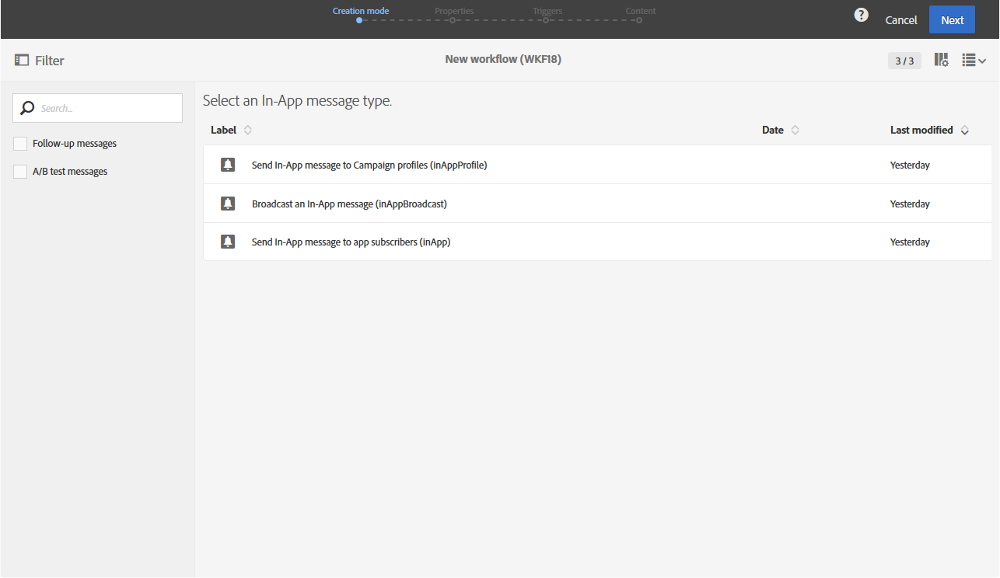

# In-App delivery{#in-app-delivery}

## Description {#description}

**앱 내 배달** 활동을 통해 워크플로우 내에서 인앱 메시지를 전송하도록 구성할 수 있습니다. 인앱 메시지를 사용하면 사용자가 애플리케이션 내에서 활성 상태일 때 메시지를 표시할 수 있습니다. For more information concerning the In-App delivery, refer to this [section](../../channels/using/about-in-app-messaging.md).

## Context of use {#context-of-use}

**[!UICONTROL In-App delivery]** 활동은 일반적으로 동일한 워크플로우에서 계산된 타겟 대상에 인앱 메시지를 보내는 데 사용됩니다.

받는 사람은 쿼리, 교차로 등의 타깃팅 활동을 통해 동일한 워크플로우에서 활동 업스트림 정의됩니다.

메시지 준비는 워크플로우 실행 매개 변수에 따라 트리거됩니다. 메시지 대시보드에서 수동 확인을 요청할지 여부를 선택할 수 있습니다 (기본적으로 필수). 워크플로우를 수동으로 시작하거나 워크플로우에서 스케줄러 활동을 배치하여 실행을 자동화할 수 있습니다.

## Configuration {#configuration}

1. **[!UICONTROL Query]** 워크플로우를 워크플로우로 드래그하여 놓습니다. Please note that the **[!UICONTROL Query]** activity targeting dimension in the **[!UICONTROL Properties]** tab needs to be updated according to the template chosen in Step 4:

   * Targeting dimension should be set to **[!UICONTROL mobileApp (mobileAppV5)]** for the **[!UICONTROL Target all users of a Mobile app (inAppBroadcast)]** template.
   * Targeting dimension should be set to **[!UICONTROL profile (profile)]** for the **[!UICONTROL Target users based on their Campaign profile (inAppProfile)]** template.
   * Targeting dimension should be set to **[!UICONTROL subscriptions to an application (nms:appSubscriptionRcp:appSubscriptionRcpDetail)]** for the **[!UICONTROL Target users based on their Mobile profile (inApp)]** template.

1. **[!UICONTROL In-App delivery]** 워크플로우를 워크플로우로 드래그하여 놓습니다.
1. Select the activity, then open it using the  button from the quick actions that appear.

   >[!NOTE]
   >
   >You can access the general properties and advanced options of the activity (and not of the delivery itself) via the  button from the activity's quick actions.

   

1. 인앱 메시지 유형을 선택합니다. This will depend on the data targeted in your **[!UICONTROL Query]** activity.

   * **[!UICONTROL Target users based on their Campaign profile (inAppProfile)]**: 이 메시지 유형을 사용하면 모바일 애플리케이션을 구독한 Adobe Campaign 프로필을 타깃팅하고 캠페인에서 사용할 수 있는 프로필 속성을 사용하여 인앱 메시지를 개인화할 수 있습니다.
   * **[!UICONTROL Target all users of a Mobile app (inAppBroadcast)]**: 이 메시지 유형을 사용하면 캠페인에 기존 프로필이 없는 경우에도 모바일 애플리케이션의 모든 사용자에게 메시지를 보낼 수 있습니다.
   * **[!UICONTROL Target users based on their Mobile profile (inApp)]**: 이 메시지 유형을 사용하면 알고 있거나 알 수 없는 캠페인의 모바일 프로필이 있는 모바일 앱의 모든 사용자를 타깃팅하고 모바일 장치에서 얻은 프로필 속성을 사용하여 인앱 메시지를 개인화할 수 있습니다.
   

1. Enter your In-App message properties and select your mobile app in the **[!UICONTROL Associate a Mobile App to a delivery]** field.
1. **[!UICONTROL Triggers]** 탭에서 메시지를 트리거할 이벤트를 드래그하여 놓습니다. 세 가지 이벤트 카테고리를 사용할 수 있습니다.
1. 앱 내 콘텐츠를 정의합니다. Refer to the section concerning [In-App customization](../../channels/using/customizing-an-in-app-message.md).
1. By default, the **[!UICONTROL In-App delivery]** activity does not include any outbound transitions. **[!UICONTROL In-App delivery]** 활동에 아웃바운드 전환을 추가하려면 고급 활동 옵션 **[!UICONTROL General]** 탭 (활동의 빠른 작업에 있는  단추) 로 이동한 후 다음 옵션 중 하나를 선택합니다.

   * **[!UICONTROL Add outbound transition without the population]**: 이를 통해 인바운드 전환과 동일한 모집단을 포함하는 아웃바운드 전환을 생성할 수 있습니다.
   * **[!UICONTROL Add outbound transition with the population]**: 이렇게 하면 메시지가 전송된 모집단을 포함하는 아웃바운드 전환을 생성할 수 있습니다. 게재 준비 중에 제외된 대상의 구성원은 이 전환 작업에서 제외됩니다.
   

1. 활동의 구성을 확인하고 워크플로우를 저장합니다.

활동을 다시 열면 앱 내 대시보드로 바로 이동됩니다. 해당 컨텐트만 편집할 수 있습니다.

기본적으로 배달 워크플로우를 시작하면 메시지 준비만 트리거됩니다. 워크플로우에서 만든 메시지 전송은 워크플로우가 시작된 후에도 여전히 확인해야 합니다. But from the message dashboard, and only if the message was created from a workflow, you can disable the **[!UICONTROL Request confirmation before sending messages]** option. 이 옵션을 선택 해제하면 준비가 완료되면 추가 통지 없이 메시지가 전송됩니다.

## Remarks {#remarks}

워크플로우 내에서 만들어진 게시는 애플리케이션의 마케팅 활동 목록에서 액세스할 수 있습니다. 대시보드를 사용하여 워크플로우의 실행 상태를 볼 수 있습니다. 푸시 알림 요약 창의 링크를 사용하여 연결된 요소 (워크플로우, 캠페인 등) 에 직접 액세스할 수 있습니다.

In the parent deliveries, which can be accessed from the marketing activity list, you can view the total number of sends that have been processed (according to the aggregation period specified when the **[!UICONTROL In-App delivery]** activity was configured). To do this, open the detail view of the parent delivery's **[!UICONTROL Deployment]** block by selecting .
