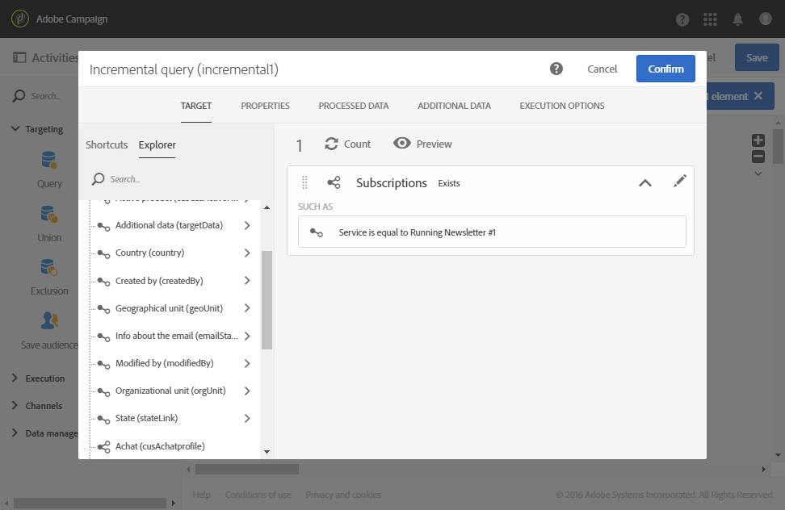

# 서비스 가입자에 대한 증분 쿼리 {#example--incremental-query-on-subscribers-to-a-service}

다음 예는 Newsletter **[!UICONTROL Incremental query]** 실행 **** 서비스에 가입한 Adobe Campaign 데이터베이스의 프로필을 필터링하여 프로모션 코드가 포함된 환영 이메일을 보내는 활동 구성을 보여줍니다.

워크플로우는 다음 요소로 구성됩니다.

* 매주 월요일 오전 6시에 워크플로우를 실행하는 [스케줄러](../../automating/using/scheduler.md) 활동.

   

* 첫 번째 실행 동안 현재 모든 가입자를 대상으로 한 [증분 쿼리](../../automating/using/incremental-query.md) 활동이며 다음 실행 중 해당 주의 새 구독자만 타깃팅합니다.

   

* 이메일 [배달](../../automating/using/email-delivery.md) 활동. 워크플로우는 일주일에 한 번 실행되지만, 한 달 동안의 기간 동안 보고서를 생성하는 등 전송된 이메일과 월별 결과를 집계할 수 있습니다. 예를 들어 한 주에 국한되지 않습니다.

   이렇게 하려면 이메일과 결과를 다시 그룹화하는 **[!UICONTROL Recurring email]** 여기를 만듭니다 **[!UICONTROL By month]**.

   이메일의 내용을 정의하고 환영 프로모션 코드를 삽입합니다. 자세한 내용은 [이메일 컨텐츠](../../designing/using/personalization.md) 정의 섹션을 참조하십시오.

그런 다음 워크플로우 실행을 시작합니다. 새 구독자는 매주 프로모션 코드로 환영 이메일을 받게 됩니다.
