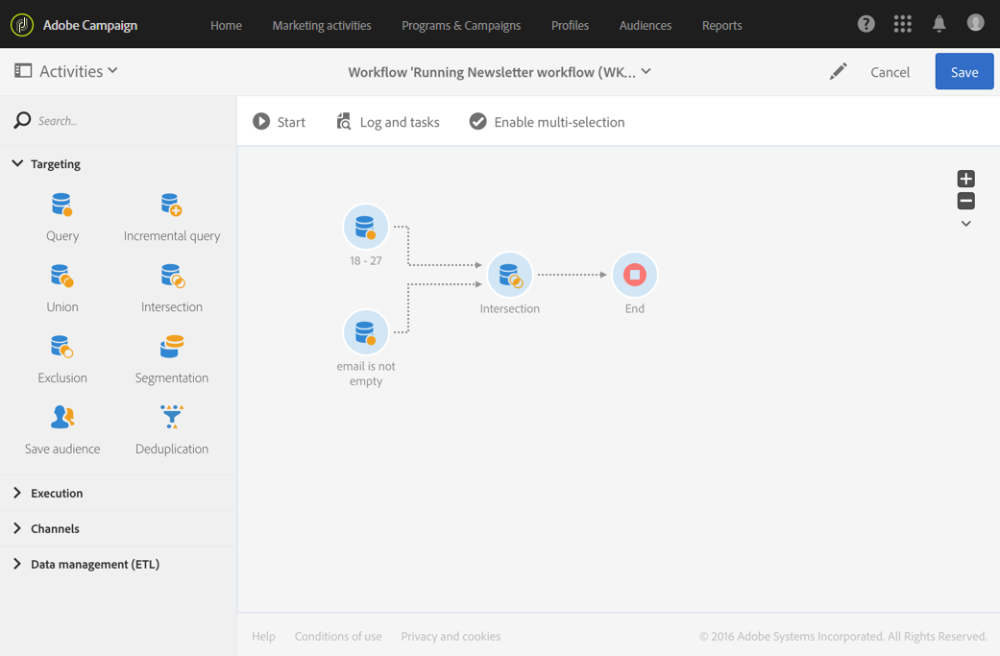

# Intersection{#intersection}

## Description {#description}

**[!UICONTROL Intersection]** 활동을 사용하면 활동에서 다른 인바운드 모집단에 공통되는 요소만 유지할 수 있습니다.

## Context of use {#context-of-use}

**[!UICONTROL Intersection]** 활동은 일반적으로 인바운드 전환에서 모집단에 대한 추가 필터링을 수행하는 데 사용됩니다.

## Configuration {#configuration}

1. **[!UICONTROL Intersection]** 워크플로우를 워크플로우로 드래그하여 놓습니다.
1. 쿼리 등의 다른 활동 (예: 쿼리) 에 연결합니다.
1. Select the activity, then open it using the  button from the quick actions that appear.
1. Select the **[!UICONTROL Reconciliation type]**:

   * **[!UICONTROL Keys only]**: 기본 모드입니다. 활동은 다른 인바운드 변환의 요소가 동일한 키를 가질 때 하나의 요소만 유지합니다.
   * **[!UICONTROL All shared columns]**: 데이터는 인바운드 전환 사항과 공통되는 열을 기반으로 조정됩니다. 따라서 비교 기준이 되는 기본 세트를 선택해야 합니다. 인바운드 모집단 타깃팅 차원이 다른 경우 이 옵션을 사용할 수 있습니다.
   * **[!UICONTROL A selection of columns]**: 이 옵션을 선택하여 데이터 조정이 적용될 열의 목록을 정의합니다. 먼저 기본 세트 (소스 데이터가 들어 있는 세트) 를 선택한 다음 가입에 사용할 필드를 지정해야 합니다.

1. Check the **[!UICONTROL Use common additional data only]** box if you would like to keep only the additional data that is in all inbound transitions.
1. If needed, manage the activity's [Transitions](../../automating/using/executing-a-workflow.md#managing-an-activity-s-outbound-transitions) to access the advanced options for the outbound population.
1. 활동의 구성을 확인하고 워크플로우를 저장합니다.

## Example {#example}

다음 예는 두 쿼리 활동 간의 연결을 보여줍니다. Adobe Campaign 데이터베이스를 보고 18 년 ~ 27 세 사이의 프로필과 이메일 주소가 각각 제공된 프로필을 검색하는 데 사용됩니다.

