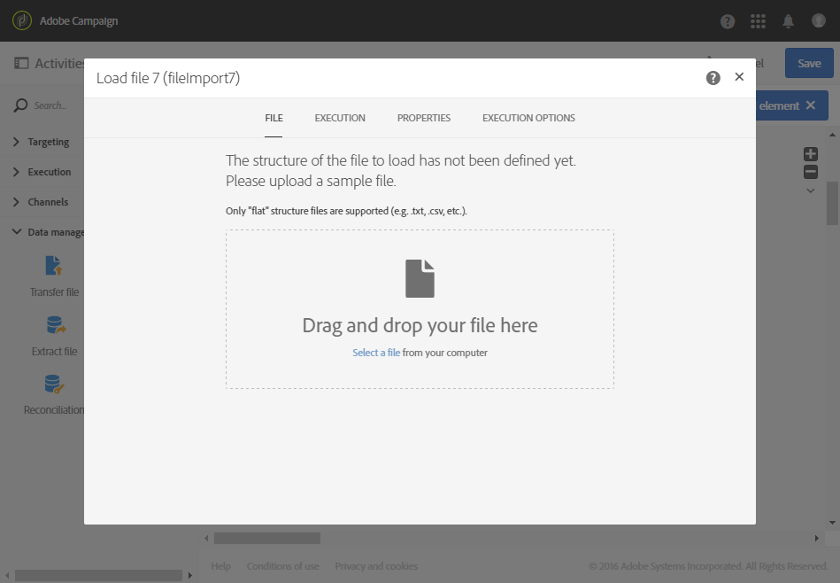

# 파일 로드 {#load-file}

## 설명 {#description}

>[!CAUTION]
>
>이 기능을 사용하는 동안 Adobe Campaign 계약에 따라 SFTP 저장소, DB 저장소 및 활성 프로필 제한에 주의하십시오.

**[!UICONTROL Load file]** 활동을 통해 데이터를 Adobe Campaign에서 사용할 수 있도록 하나의 구조화된 양식으로 가져올 수 있습니다. 파일 로드 활동을 통한 데이터 가져오기는 일시적이며, 가져온 데이터를 Adobe Campaign 데이터베이스에 완전히 통합하려면 다른 활동이 필요합니다.

## 사용 컨텍스트 {#context-of-use}

활동을 구성할 때 데이터 추출 방법을 정의합니다. 예를 들어 로드할 파일이 연락처 목록이라고 해 보겠습니다.

다음을 수행할 수 있습니다.

* 파일 구조를 사용하여 다른 파일의 데이터(**[!UICONTROL Transfer file]** 활동을 사용하여 복구)에 적용하거나, 
* 파일의 구조와 데이터를 사용하여 Adobe Campaign으로 가져옵니다.

>[!IMPORTANT]
>
>.txt, .csv 등의 &quot;단층” 구조 파일만 고려합니다.

**관련 항목:**

* [사용 사례:외부 데이터로 데이터베이스 업데이트](../../automating/using/update-database-file.md)
* [사용 사례:자동 파일 다운로드를 기반으로 데이터 업데이트](../../automating/using/update-data-automatic-download.md)
* [사용 사례:풍부한 필드가 포함된 이메일 보내기](../../automating/using/sending-email-enriched-fields.md)
* [사용 사례:데이터베이스와 파일 대상 조정](../../automating/using/reconcile-file-audience-with-database.md)

## 구성 {#configuration}

활동 구성에는 두 단계가 있습니다. 먼저 샘플 파일을 업로드하여 예상 파일 구조를 정의해야 합니다. 그러고 나면 데이터를 가져올 파일의 위치를 지정할 수 있습니다.

>[!NOTE]
>
>샘플 파일의 데이터는 활동 구성에 사용하지만 가져오지는 않습니다. 데이터가 적은 샘플 파일을 사용하는 것을 추천합니다.

1. **[!UICONTROL Load file]** 활동을 워크플로우에 끌어다 놓습니다.
1. 해당 활동을 선택하면 나타나는 빠른 작업 목록에서  버튼을 눌러 창을 엽니다.
1. 최종 파일을 가져올 때의 예상 구조를 정의하기 위한 샘플 파일을 업로드합니다.

   

   데이터 파일을 업로드하고 나면 활동에 **[!UICONTROL File structure]**&#x200B;와(과) **[!UICONTROL Column definition]** 두 개의 새로운 탭이 나타납니다.

1. **[!UICONTROL File structure]** 탭으로 이동하여 샘플 파일에서 자동으로 감지한 구조를 확인합니다.

   파일 구조가 잘못 감지된 경우 나타날 수 있는 오류를 수정하기 위한 여러 옵션이 있습니다.

   * **[!UICONTROL Detect structure from a new file]** 옵션을 선택하면 다른 파일의 구조를 사용할 수 있습니다.
   * 기본 감지 매개 변수를 수정하여 파일에 적용할 수 있습니다. **[!UICONTROL File type]** 필드에서는 가져오려는 파일이 길이가 고정된 열로 구성되어 있는지 여부를 지정할 수 있습니다. 이 경우 **[!UICONTROL Column definition]** 탭에서 각 열의 최대 글자 수를 지정해야 합니다.

      파일에서 데이터를 올바르게 복구하는 데 필요한 모든 감지 옵션이 **[!UICONTROL File format]**&#x200B;에 정리되어 있습니다. 이를 수정한 다음 해당 활동에서 마지막으로 로드한 파일의 구조를 새로운 설정을 고려하여 다시 감지할 수 있습니다. 이렇게 하려면 **[!UICONTROL Apply configuration]** 버튼을 사용합니다. 예를 들어 다른 열 구분자를 지정할 수 있습니다.

      >[!NOTE]
      >
      >이 작업은 활동에서 마지막으로 로드한 파일을 고려합니다. 감지된 파일이 큰 경우 데이터 미리 보기에는 처음 30줄만 표시됩니다.

      

      **[!UICONTROL File format]** 섹션에서 **[!UICONTROL Check columns from file against column definitions]** 옵션을 선택하면 업로드하고 있는 파일의 열이 열 정의에 해당하는지 확인할 수 있습니다.

      열의 수 및/또는 이름이 열 정의와 일치하지 않으면 워크플로우를 실행할 때 오류 메시지가 표시됩니다. 이 옵션이 활성화되지 않으면 로그 파일에 경고가 표시됩니다.

      

1. **[!UICONTROL Column definition]** 탭으로 이동하여 각 열의 데이터 포맷을 확인하고 필요한 경우 매개 변수를 조정합니다.

   **[!UICONTROL Column definition]** 탭에서는 각 열의 데이터 구조를 정확히 지정할 수 있습니다. 이를 통해 오류가 없는 데이터를 가져오고(예를 들면 null 관리 사용) 이 데이터를 Adobe Campaign 데이터베이스에 이미 있는 유형에 맞추어 향후 작업을 용이하게 할 수 있습니다.

   예를 들어 열의 레이블을 변경하고 그 유형(문자열, 정수, 날짜 등)을 선택할 수 있습니다. 오류 처리를 지정할 수도 있습니다.

   자세한 내용은 [열 포맷](#column-format) 섹션을 참조하십시오.

   

1. **[!UICONTROL Execution]** 탭에서 파일을 처리하여 데이터를 로드할지 여부를 지정합니다.

   * 워크플로우의 인바운드 전환에서 가져옵니다.
   * 이전 단계에서 업로드한 것입니다.
   * 로컬 컴퓨터에서 업로드할 새로운 파일입니다. 워크플로우에 첫 번째 파일 업로드가 이미 정의된 경우 **[!UICONTROL Upload a new file from local machine]** 옵션이 나타납니다. 이 옵션을 선택하면 현재 파일이 사용자의 요구 사항에 맞지 않을 경우 처리할 다른 파일을 업로드할 수 있습니다.

      

1. 데이터를 로드하려는 파일이 GZIP 파일(.gz)로 압축되어 있는 경우 **[!UICONTROL Add a pre-processing step]** 필드에서 **[!UICONTROL Decompression]** 옵션을 선택합니다. 이 옵션을 선택하면 데이터를 로드하기 전에 파일의 압축을 해제할 수 있습니다. 이 옵션은 파일을 활동의 인바운드 전환에서 가져오는 경우에만 사용할 수 있습니다.

   또한 이 **[!UICONTROL Add a pre-processing step]** 필드에서 파일을 데이터베이스로 가져오기 전에 파일의 암호를 해독할 수도 있습니다. 암호화된 파일을 사용하는 방법에 대한 자세한 내용은 [이 섹션을 참조하십시오.](../../automating/using/managing-encrypted-data.md)

1. **[!UICONTROL Keep the rejects in a file]** 옵션을 사용하면 가져올 때 발생한 오류가 포함된 파일을 다운로드하여 사후 처리 단계에 적용할 수 있습니다. 이 옵션을 활성화하면 아웃바운드 전환 이름이 &quot;거부&quot;로 바뀝니다.

   >[!NOTE]
   >
   >**[!UICONTROL Add date and time to the file name]** 옵션을 사용하면 거부가 포함된 파일 이름에 타임스탬프를 추가할 수 있습니다.

   

1. 활동 구성을 확인하고 워크플로우를 저장합니다.

워크플로우를 실행한 후 활동에 오류가 발생하는 경우 로그를 참조하여 파일의 잘못된 값에 대한 자세한 내용을 확인하십시오. 워크플로우 로그에 대한 자세한 정보는 [이 섹션](../../automating/using/monitoring-workflow-execution.md)을 참조하십시오.

## 열 포맷 {#column-format}

샘플 파일을 로드하면 열 포맷이 각 데이터 유형의 기본 매개 변수를 사용하여 자동으로 감지됩니다. 이 매개 변수를 수정하여 데이터에 적용할 특정 프로세스를 지정할 수 있습니다. 이는 특히 오류 또는 빈 값이 있는 경우에 유용합니다.

이렇게 하려면 형식을 정의하려는 열의 빠른 작업 목록에서 **[!UICONTROL Edit properties]**&#x200B;을(를) 선택합니다. 열 포맷 세부 정보 창이 열립니다.

그 다음 각 열에 대한 포맷을 수정할 수 있습니다.

열 포맷을 사용하면 각 열의 값 처리를 정의할 수 있습니다.

* **[!UICONTROL Ignore column]**: 데이터를 로드하는 동안 이 열을 처리하지 않습니다.
* **[!UICONTROL Data type]**: 각 열에 필요한 데이터 형식을 지정합니다.
* **[!UICONTROL Format and separators]**, **속성**: 텍스트, 시간, 날짜, 숫자 값 포맷의 속성과 열 컨텍스트에 따른 구분자를 지정합니다.

   * **[!UICONTROL Maximum number of characters]**: 문자열 유형 열의 최대 글자 수를 지정합니다.

      길이가 고정된 열로 구성된 파일을 로드할 경우 이 필드를 입력해야 합니다.

   * **[!UICONTROL Letter case management]**: **텍스트** 데이터에 대소문자 프로세스를 적용할지 여부를 정의합니다.
   * **[!UICONTROL White space management]**: **텍스트** 데이터의 문자열에서 특정 공백을 무시할지 여부를 지정합니다.
   * **[!UICONTROL Time format]**, **[!UICONTROL Date format]**: **날짜**, **시간**, **날짜 및 시간** 데이터의 포맷을 지정합니다.
   * **[!UICONTROL Format]**: **정수** 및 **부동수** 데이터의 숫자 값 포맷을 정의할 수 있습니다.
   * **[!UICONTROL Separator]**: **날짜**, **시간**, **날짜 및 시간**, **정수** 및 **부동수** 데이터에 대해 
열 컨텍스트에 따른 구분자(숫자 값에 천 단위 구분자를 적용할지 십 단위 구분자를 적용할지, 날짜 및 시간에 어떤 구분자를 쓸지)를 정의합니다.

* **[!UICONTROL Remapping of values]**: 이 필드는 열 세부 사항 구성에서만 사용할 수 있습니다. 이 필드를 통해 특정 값을 가져올 때 변형할 수 있습니다. 예를 들어 &quot;셋&quot;을 &quot;3&quot;으로 변환할 수 있습니다.
* **[!UICONTROL Error processing]**: 오류가 발생하는 경우의 비헤이비어를 정의합니다.

   * **[!UICONTROL Ignore the value]**: 값이 무시됩니다. 워크플로우 실행 로그에 경고가 생성됩니다.
   * **[!UICONTROL Reject the line]**: 전체 줄을 처리하지 않습니다.
   * **[!UICONTROL Use a default value]**: 오류를 일으키는 값을 **[!UICONTROL Default value]** 필드에 정의된 기본값으로 바꿉니다.
   * **[!UICONTROL Use a default value in case the value is not remapped]**: 잘못된 값에 대한 매핑(위의 **[!UICONTROL Remapping of values]** 옵션 참조)이 정의되어 있지 않은 경우, 오류를 일으키는 값을 **[!UICONTROL Default value]** 필드에 정의된 기본값으로 바꿉니다.
   * **[!UICONTROL Reject the line when there is no remapping value]**: 잘못된 값에 대한 매핑이 정의되어 있지 않은 경우, 전체 줄을 처리하지 않습니다(위의 **[!UICONTROL Remapping of values]** 옵션 참조). 

   >[!NOTE]
   >
   >**[!UICONTROL Error processing]**&#x200B;은(는) 가져온 파일의 값과 관련된 오류를 처리합니다. 예를 들어 잘못된 데이터 형식(&quot;정수&quot; 열에 &quot;넷&quot;이라고 글자로 입력되어 있는 경우), 허용되는 최대 수보다 많은 문자를 포함하는 문자열, 잘못된 구분자가 있는 날짜 등이 있습니다. 그러나 이 옵션은 빈 값 관리로 생성된 오류를 고려하지 않습니다.

* **[!UICONTROL Default value]**: 선택한 오류 처리에 따라 기본값을 지정합니다.
* **[!UICONTROL Empty value management]**: 데이터를 로드하는 동안 빈 값을 관리하는 방법을 지정합니다.

   * **[!UICONTROL Generate an error for numerical fields]**: 숫자 필드에 대해서만 오류를 생성하고, 다른 필드의 경우 NULL 값을 삽입합니다.
   * **[!UICONTROL Insert NULL in the corresponding field]**: 빈 값을 허용합니다. 따라서 NULL 값이 삽입됩니다.
   * **[!UICONTROL Generate an error]**: 값이 비어 있는 경우 오류를 생성합니다.
