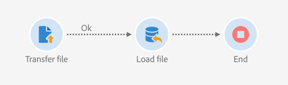

# 암호화된 데이터 관리 {#managing-encrypted-data}

## 사전 처리 단계 정보 {#about-preprocessing-stages}

경우에 따라, 캠페인 서버를 가져오려는 데이터를 암호화해야 할 수 있습니다(예: PII 데이터가 포함되어 있는 경우).

나가는 데이터를 암호화하거나 들어오는 데이터를 해독하려면 [Campaign 컨트롤 패널](https://docs.adobe.com/content/help/ko-KR/control-panel/using/instances-settings/gpg-keys-management.html)을 사용하여 GPG 키를 관리해야 합니다.

>[!NOTE]
>
>Campaign 컨트롤 패널은 AWS에서 호스팅되는 모든 고객에게 제공됩니다(마케팅 인스턴스를 전상에서 호스팅하는 고객의 경우는 제외).

Campaign 컨트롤 패널을 사용할 수 없는 경우 Adobe 고객 지원 센터에 연락하여 필요한 암호화/암호 해독 명령을 인스턴스에 제공해야 합니다. 이렇게 하려면 다음을 나타내는 요청을 제출합니다.

* 명령을 사용하기 위해 캠페인 인터페이스에 표시되는 **레이블**&#x200B;입니다. 예: &quot;파일 암호화&quot;
* 인스턴스에 설치할 **명령**&#x200B;입니다.

요청이 처리되면 **[!UICONTROL Load file]** 및 **[!UICONTROL Extract file]** 활동의 **[!UICONTROL Pre-processing stage]** 필드에서 암호화 / 암호 해독 명령을 사용할 수 있습니다. 이 암호를 사용하여 가져오거나 내보낼 파일의 암호를 해독하거나 암호화할 수 있습니다.

**관련 항목:**

* [파일 로드](../../automating/using/load-file.md)
* [파일 추출](../../automating/using/extract-file.md)

## 사용 사례:Campaign 컨트롤 패널 {#use-case-gpg-decrypt}에서 생성된 키를 사용하여 데이터를 암호화 가져오기

이 경우 Campaign 컨트롤 패널에서 생성된 키를 사용하여 외부 시스템에서 암호화된 데이터를 가져오기 위한 워크플로우를 구축합니다.

 [비디오에서 이 기능 살펴보기](#video)

이 사용 사례를 수행하는 단계는 다음과 같습니다.

1. Campaign 컨트롤 패널을 사용하여 키 쌍(공개/비공개)을 생성합니다. 자세한 단계는 [Campaign 컨트롤 패널 설명서](https://docs.adobe.com/content/help/en/control-panel/using/instances-settings/gpg-keys-management.html#decrypting-data)에서 사용할 수 있습니다.

   * 공개 키는 Campaign으로 전송할 데이터를 암호화하는 데 사용하는 외부 시스템과 공유됩니다.
   * Campaign에서 들어오는 암호화된 데이터의 암호를 해독하는 데 개인 키가 사용됩니다.

   

1. 외부 시스템에서는 Campaign 컨트롤 패널에서 다운로드한 공개 키를 사용하여 Campaign Standard으로 가져올 데이터를 암호화합니다.

1. Campaign Standard에서 암호화된 데이터를 가져오고 Campaign 컨트롤 패널을 통해 설치된 개인 키를 사용하여 암호를 해독하는 워크플로우를 만듭니다. 이를 위해 다음과 같은 워크플로우를 구축할 예정입니다.

   

   * **[!UICONTROL Transfer file]** 활동:외부 소스에서 Campaign으로 파일을 전송합니다. 이 예에서는 SFTP 서버에서 파일을 전송하려고 합니다.
   * **[!UICONTROL Load file]** 활동:파일의 데이터를 데이터베이스에 로드하고 Campaign 컨트롤 패널에서 생성된 개인 키를 사용하여 이를 해독합니다.

1. **[!UICONTROL Transfer file]** 활동을 연 다음 필요에 따라 구성합니다. 활동을 구성하는 방법에 대한 글로벌 개념은 [이 섹션](../../automating/using/load-file.md)에서 사용할 수 있습니다.

   **[!UICONTROL Protocol]** 탭에서 전송할 sftp 서버와 암호화된 .gpg 파일에 대한 세부 정보를 지정합니다.

   

1. **[!UICONTROL Load file]** 활동을 연 다음 필요에 따라 구성합니다. 활동을 구성하는 방법에 대한 글로벌 개념은 [이 섹션](../../automating/using/load-file.md)에서 사용할 수 있습니다.

   들어오는 데이터의 암호를 해독하려면 활동에 사전 처리 단계를 추가합니다. 이렇게 하려면 목록에서 **[!UICONTROL Decryption GPG]** 옵션을 선택합니다.

   >[!NOTE]
   >
   >데이터의 암호를 해독하는 데 사용할 개인 키를 지정할 필요는 없습니다. 개인 키는 Campaign 컨트롤 패널에 저장되므로 파일의 암호를 해독하는 데 사용할 키를 자동으로 검색합니다.

   

1. **[!UICONTROL OK]**&#x200B;을 클릭하여 활동 구성을 확인합니다.

1. 이제 워크플로우를 실행할 수 있습니다.

## 사용 사례:Campaign 컨트롤 패널 {#use-case-gpg-encrypt}에 설치된 키를 사용하여 데이터 암호화 및 내보내기

이 경우 Campaign 컨트롤 패널에 설치된 키를 사용하여 데이터를 암호화하고 내보낼 수 있는 워크플로우를 구축할 예정입니다.

 [비디오에서 이 기능 살펴보기](#video)

이 사용 사례를 수행하는 단계는 다음과 같습니다.

1. GPG 유틸리티를 사용하여 GPG 키 쌍(공개/비공개)을 생성한 다음 공개 키를 Campaign 컨트롤 패널에 설치합니다. 자세한 단계는 [Campaign 컨트롤 패널 설명서](https://docs.adobe.com/content/help/en/control-panel/using/instances-settings/gpg-keys-management.html#encrypting-data)에서 사용할 수 있습니다.

   

1. Campaign Standard에서 Campaign 컨트롤 패널을 통해 설치된 개인 키를 사용하여 데이터를 내보내고 암호화하는 워크플로우를 구축할 수 있습니다. 이를 위해 다음과 같은 워크플로우를 구축할 예정입니다.

   

   * **[!UICONTROL Query]** 활동:이 예에서는 내보낼 데이터베이스의 데이터를 대상으로 하는 쿼리를 실행하려 합니다.
   * **[!UICONTROL Extract file]** 활동:데이터를 암호화하여 파일로 추출합니다.
   * **[!UICONTROL Transfer file]** 활동:암호화된 데이터가 포함된 파일을 SFTP 서버로 전송합니다.

1. 데이터베이스에서 원하는 데이터를 타깃팅하도록 **[!UICONTROL Query]** 활동을 구성합니다. 이 작업에 대한 자세한 정보는 [이 섹션](../../automating/using/query.md)을 참조하십시오.

1. **[!UICONTROL Extract file]** 활동을 연 다음 필요에 따라 구성합니다(출력 파일, 열, 형식 등). 활동을 구성하는 방법에 대한 글로벌 개념은 [이 섹션](../../automating/using/extract-file.md)에서 사용할 수 있습니다.

   추출할 데이터를 암호화하기 위해 활동에 사전 처리 단계를 추가합니다. 이렇게 하려면 데이터를 암호화하는 데 사용할 암호화 GPG 키를 선택합니다.

   

   >[!NOTE]
   >
   >괄호 안의 값은 GPG 암호화 도구를 사용하여 키 쌍을 생성할 때 정의한 **comment**&#x200B;입니다. 올바른 일치 키를 선택해야 받는 사람이 파일의 암호를 해독할 수 없습니다.

1. **[!UICONTROL Transfer file]** 활동을 연 다음 파일을 전송할 SFTP 서버를 지정합니다. 활동을 구성하는 방법에 대한 글로벌 개념은 [이 섹션](../../automating/using/transfer-file.md)에서 사용할 수 있습니다.

   

1. 이제 워크플로우를 실행할 수 있습니다. 쿼리가 실행되면, 쿼리별 데이터 대상이 SFTP 서버로 암호화된 .gpg 파일로 내보내집니다.

## 튜토리얼 비디오 {#video}

이 비디오는 GPG 키를 사용하여 데이터를 해독하는 방법을 보여줍니다.

>[!VIDEO](https://video.tv.adobe.com/v/35753?quality=12)

이 비디오에서는 GPG 키를 사용하여 데이터를 암호화하는 방법을 보여 줍니다.

>[!VIDEO](https://video.tv.adobe.com/v/36380?quality=12)

추가 Campaign Standard 방법 비디오가 [여기](https://experienceleague.adobe.com/docs/campaign-standard-learn/tutorials/overview.html?lang=ko)에 제공됩니다.
