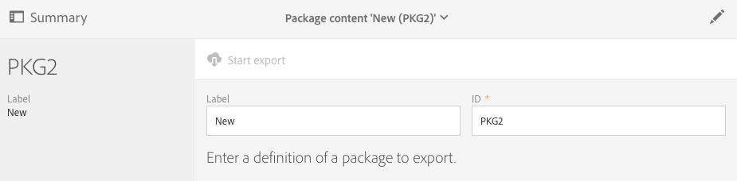
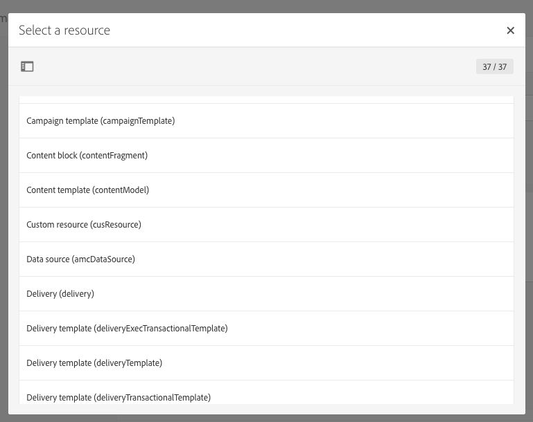

# 패키지 관리{#managing-packages}

관리자는 구조화된 XML 파일을 통해 다양한 Adobe Campaign 인스턴스 간에 리소스를 교환하기 위한 패키지를 정의할 수 있습니다. 이는 구성 매개 변수가 될 수도 있고 데이터가 될 수도 있습니다.

이 기능은 한 서버에서 다른 서버로 데이터를 전송하거나 인스턴스의 구성을 복제하는 데 유용합니다.

패키지는 **[!UICONTROL Administration]** > **[!UICONTROL Deployment]** > **[!UICONTROL Package exports]** 또는 **[!UICONTROL Package imports]** 메뉴에서 사용할 수 있습니다. 이 두 메뉴는 비슷한 기능을 합니다.

각 목록에 있는 요소는 기본적으로 수정 또는 설치 날짜에 따라 최신 요소부터 표시됩니다.

요소의 콘텐츠를 표시 및 수정하려면 해당 요소의 레이블을 클릭합니다. [패키지 내보내기](#exporting-a-package) 및 [패키지 가져오기](#importing-a-package) 섹션을 참조하십시오.

## 패키지 내보내기 {#package-exports}

### 표준 패키지 {#standard-packages}

**[!UICONTROL Platform]** 및 **[!UICONTROL Administration]**&#x200B;은(는) 내장 패키지로, 각각 사전 정의된 내보낼 리소스 목록이 들어 있습니다. 읽기 전용 모드로 열 수 있으며 내보내기에만 적합합니다.

>[!IMPORTANT]
>
>내보낸 리소스에 기본 ID가 있는 경우 패키지 내보내기가 승인되지 않습니다. 따라서 Adobe Campaign Standard에서 표준으로 제공하는 템플릿과 다른 이름을 사용하여 내보낼 수 있는 리소스의 ID를 변경해야 합니다. 예를 들어 테스트 프로필을 내보내려면 &quot;SDM&quot; 또는 &quot;sdm&quot; 값이 포함된 ID를 사용할 수 없습니다.
>
>기본 ID가 포함된 패키지를 내보내려고 하면 다음과 같은 오류가 표시됩니다. &quot;&#39;브랜드(브랜딩)&#39; 엔터티 유형에서 패키지를 가져올 때 충돌을 야기할 수 있는 기본 ID(&#39;BRD1&#39;)를 사용합니다. 이 이름을 변경하고 작업을 반복하십시오.&quot;

패키지를 내보내는 단계는 [패키지 내보내기](#exporting-a-package) 섹션에 설명되어 있습니다.

* **[!UICONTROL Platform]** 패키지는 기술 구성 시 추가한 모든 리소스(사용자 정의 리소스, 사용자 정의 리소스 세트, 트리거 및 **[!UICONTROL System]** 유형 애플리케이션 옵션)를 다시 그룹화합니다.
* **[!UICONTROL Administration]** 패키지는 비즈니스 구성 시 추가한 모든 개체(캠페인 템플릿, 콘텐츠 템플릿, 게재 템플릿, 랜딩 페이지 템플릿, 프로그램 템플릿 및 워크플로우 템플릿 등)를 다시 그룹화합니다. 

   여기에는 콘텐츠 블록, 타겟 매핑, 외부 계정, 조직 단위, **[!UICONTROL User]** 유형 애플리케이션 옵션, 역할, 유형화, 유형화 규칙 및 사용자 등의 개체도 포함됩니다.

>[!NOTE]
>
>이 두 패키지의 콘텐츠는 수정할 수 없습니다. 반면 이 두 패키지에는 사용할 수 있는 최신 데이터가 항상 들어 있습니다. [고유한 패키지를 만들어](#creating-a-package) 특정 요소를 내보낼 수 있습니다.

### 패키지 생성 {#creating-a-package}

특정 데이터 세트를 내보내려면 패키지를 만들어야 합니다.

패키지를 생성하려면 관리 권한이 필요합니다.

1. **[!UICONTROL Administration]** > **[!UICONTROL Deployment]** > **[!UICONTROL Package exports]**&#x200B;에서 패키지 콘텐츠 목록에 있는 **[!UICONTROL Create]** 버튼을 클릭합니다.

   요소가 즉시 생성됩니다. 만들기를 취소하려면 목록으로 돌아가서 해당 상자를 선택하여 삭제합니다.

1. 패키지 콘텐츠 화면에서 이름과 ID를 지정합니다.
1. **[!UICONTROL Edit properties]** 버튼을 클릭하여 설명을 추가하고 특정 사용자에 대한 액세스를 제한합니다.

   

1. **[!UICONTROL Export content]** 탭의 **[!UICONTROL Create element]** 버튼을 사용하여 내보낼 리소스를 선택합니다.

   

1. 리소스는 알파벳순으로 표시되며 이름별로 필터링할 수 있습니다. 기술적 이름은 대괄호 안에 표시됩니다. 목록에서 요소를 선택하고 확인합니다.

   

1. 리소스 이름이 **[!UICONTROL Export content]** 탭에 표시됩니다. 리소스를 수정하려면 해당 상자를 선택하고 **[!UICONTROL Show detail of the element selected]** 버튼을 사용합니다.

   

1. 쿼리 편집기를 사용하면 내보낼 요소를 필터링할 수 있습니다. 자세한 내용은 [쿼리 편집](../../automating/using/editing-queries.md#creating-queries) 섹션을 참조하십시오.

   

   >[!NOTE]
   >
   >리소스당 최대 5000개의 개체를 내보낼 수 있습니다.

1. 내보낼 리소스를 모두 지정하고 나면 선택 항목을 저장합니다.

이제 패키지가 생성되어 내보낼 수 있습니다.

### 패키지 내보내기 {#exporting-a-package}

패키지를 내보내면 리소스의 특정 상태를 저장하여 다른 인스턴스에 다시 가져오거나 나중에 같은 인스턴스에 다시 가져올 수 있습니다.

>[!CAUTION]
>
>내보낸 리소스에 기본 제공 ID가 있는 경우 패키지 내보내기가 승인되지 않습니다. 따라서 Adobe Campaign Standard에서 표준으로 제공하는 템플릿과 다른 이름을 사용하여 내보낼 수 있는 리소스의 ID를 변경해야 합니다. 예를 들어 테스트 프로필을 내보내려면 &quot;SDM&quot; 또는 &quot;sdm&quot; 값이 포함된 ID를 사용할 수 없습니다.

1. **[!UICONTROL Administration]** > **[!UICONTROL Deployment]** > **[!UICONTROL Package exports]**&#x200B;에서 패키지를 선택하여 세부 정보에 액세스합니다.
1. 패키지에 필요한 데이터가 포함되어 있는지 확인합니다.
1. **[!UICONTROL Start export]** 버튼을 클릭합니다.

내보낸 파일은 사용 중인 브라우저의 다운로드 폴더에 저장됩니다. 파일의 이름은 자동으로 &quot;package_xxx.xml&quot;로 설정되며, 여기에서 &quot;xxx&quot;는 패키지 ID에 해당합니다.

작업이 완료되면 다음과 같은 섹션이 나타납니다.

* **[!UICONTROL Export status]**: 이 섹션에서는 작업이 올바르게 수행되었는지 여부를 보여줍니다.

   

* **[!UICONTROL Log]** 탭에서 내보내기의 여러 단계를 참조할 수 있습니다. 여기에는 이전의 모든 내보내기 상태가 포함됩니다.

   

>[!NOTE]
>
>이미 내보낸 패키지 콘텐츠 목록에서 요소를 선택할 경우에도 **[!UICONTROL Log]** 및 **[!UICONTROL Last export]** 탭을 계속 사용할 수 있습니다.

## 패키지 가져오기 {#package-imports}

### 시스템 업데이트 {#system-updates}

위의 패키지 가져오기 목록에는 Adobe에서 수행한 업데이트와 연결된 자동 가져오기가 포함되어 있습니다.

**[!UICONTROL Execution logs]** 탭에는 가져오기의 모든 단계가 저장됩니다. 옆 패널에는 일반 정보가 표시됩니다.

>[!NOTE]
>
>읽기 전용 모드에서 이 요소에 액세스할 수 있습니다.

### 패키지 가져오기 {#importing-a-package}

관리자는 Adobe Campaign 인스턴스에서 이전에 실행한 내보내기에서 생성된 패키지를 수동으로 가져올 수 있습니다. 자세한 내용은 [패키지 내보내기](#package-exports) 섹션을 참조하십시오.

수동 패키지 가져오기는 두 단계로 구성됩니다. 먼저 파일을 업로드한 다음, 해당 파일의 콘텐츠를 가져올 수 있습니다.

1. **[!UICONTROL Administration]** > **[!UICONTROL Deployment]** > **[!UICONTROL Package imports]**&#x200B;에서 패키지 가져오기 목록의 **[!UICONTROL Create]** 버튼을 클릭합니다.

   요소가 즉시 생성됩니다. 만들기를 취소하려면 목록으로 돌아가서 해당 상자를 선택하여 삭제합니다.

1. 새 가져오기에 사용할 이름과 ID를 지정합니다.
1. 업로드할 파일을 끌어다 놓거나 **[!UICONTROL Select from folder]** 링크를 클릭하여 선택합니다.

   가져오는 파일은 XML 또는 ZIP(XML 파일 포함) 포맷이어야 합니다.

   

   >[!NOTE]
   >
   >업로드된 문서를 바꾸려면 먼저 이름 오른쪽에 있는 X 아이콘을 통해 파일을 삭제한 다음 같은 작업을 반복합니다.

1. 파일이 업로드되면 **[!UICONTROL Start import]** 버튼을 사용하여 해당 콘텐츠를 데이터베이스로 가져옵니다.

   

작업이 완료되면 다음과 같은 섹션이 나타납니다.

* **[!UICONTROL Import status]**: 이 섹션에서는 작업이 올바르게 수행되었는지 여부를 보여줍니다.
* **[!UICONTROL Execution logs]** 탭에서 가져오기의 여러 단계를 참조할 수 있습니다. 이는 오류를 확인하는 데 특히 중요합니다.

   

패키지를 가져온 후에는 동일한 요소에서 다시 가져올 수 없습니다. 레이블과 ID만 수정할 수 있습니다.

동일한 패키지를 다시 가져오려면 패키지 가져오기 목록으로 돌아가서 요소를 만든 다음 선택한 파일을 다시 업로드해야 합니다.
