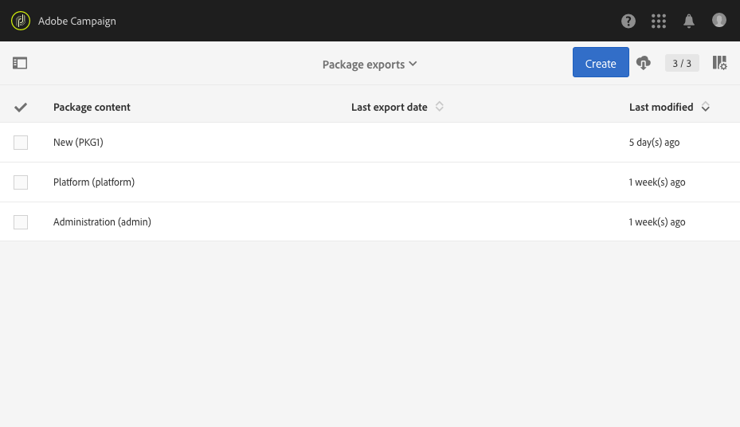

# 패키지 관리{#managing-packages}

관리자는 구조화된 XML 파일을 통해 여러 Adobe Campaign 인스턴스 간에 리소스를 교환하기 위한 패키지를 정의할 수 있습니다. 구성 매개 변수 또는 데이터일 수 있습니다.

이 기능은 한 서버에서 다른 서버로 데이터를 전송하거나 인스턴스의 구성을 복제하는 데 유용합니다.

패키지는 **[!UICONTROL Administration]** &gt; **[!UICONTROL Deployment]** &gt; **[!UICONTROL Package exports]** 또는 **[!UICONTROL Package imports]** 메뉴에서 사용할 수 있습니다. 두 메뉴는 비슷한 기능을 합니다.

각 목록의 요소는 최근 항목부터 최신 항목까지, 기본적으로 변경 날짜나 설치 날짜에 따라 표시됩니다.

요소의 컨텐츠를 표시하고 수정하려면 해당 레이블을 클릭합니다. 패키지 [내보내기](#exporting-a-package) 및 패키지 [가져오기](#importing-a-package) 섹션을 참조하십시오.

## 패키지 내보내기 {#package-exports}

### 표준 패키지 {#standard-packages}

**[!UICONTROL Platform]** 및 **[!UICONTROL Administration]** 두 개의 내장 패키지로, 각각 내보낼 사전 정의된 리소스 목록이 포함되어 있습니다. 읽기 전용 모드로 열 수 있으며 내보내기에만 적합합니다.

>[!CAUTION]
>
>내보낸 리소스에 기본 ID가 있으면 패키지 내보내기가 인증되지 않습니다. 따라서 Adobe Campaign Standard에서 표준으로 제공한 템플릿과 다른 이름을 사용하여 내보내기 가능한 리소스의 ID를 변경해야 합니다. 예를 들어 테스트 프로필을 내보내려면 값 "SDM" 또는 "sdm"을 포함하는 ID를 사용할 수 없습니다. 기본 ID 파섹"'브랜드(브랜딩)' 엔티티 유형은 패키지를 가져올 때 충돌을 일으킬 수 있는 기본 ID('BRD1')를 사용합니다. 이 이름을 변경하고 작업을 반복합니다."

패키지 내보내기 단계는 패키지 [내보내기](#exporting-a-package) 섹션에 설명되어 있습니다.

* 이 **[!UICONTROL Platform]** 패키지는 기술 구성 중에 추가된 모든 리소스를 다시 그룹화합니다.사용자 정의 리소스, 사용자 정의 리소스 세트, 트리거 및 **[!UICONTROL System]** 유형을 사용하는 응용 프로그램 옵션
* 패키지는 다음과 같은 비즈니스 구성 중에 추가된 모든 개체를 다시 그룹화합니다. **[!UICONTROL Administration]** 캠페인 템플릿, 컨텐츠 템플릿, 전달 템플릿, 랜딩 페이지 템플릿, 프로그램 템플릿 및 워크플로우 템플릿

   여기에는 다음 객체도 포함됩니다.컨텐츠 블록, 대상 매핑, 외부 계정, 조직 단위, 유형, 유형 분류 규칙 및 사용자를 포함하는 응용 프로그램 옵션 **[!UICONTROL User]** 등이 있습니다.

>[!NOTE]
>
>이 두 패키지의 내용은 수정할 수 없습니다. 반면 이러한 패키지에는 항상 사용 가능한 최신 데이터가 들어 있습니다. 고유한 패키지를 [만들어](#creating-a-package) 특정 요소를 내보낼 수 있습니다.

### 패키지 생성 {#creating-a-package}

특정 데이터 세트를 내보내려면 패키지를 만들어야 합니다.

패키지를 만들려면 관리 권한이 필요합니다.

1. &gt; **[!UICONTROL Administration]** &gt; **[!UICONTROL Deployment]** &gt; **[!UICONTROL Package exports]**&#x200B;에서 패키지 내용 목록에 있는 **[!UICONTROL Create]** 단추를 클릭합니다.

   요소가 즉시 생성됩니다. 만들기를 취소하려면 목록으로 돌아가서 해당 상자를 선택하여 삭제합니다.

1. 패키지 컨텐츠 화면에서 이름과 ID를 지정합니다.
1. 설명을 추가하고 특정 사용자에 대한 액세스를 제한하려면 **[!UICONTROL Edit properties]** 단추를 클릭합니다.

   

1. 탭의 **[!UICONTROL Create element]** 단추를 사용하여 **[!UICONTROL Export content]** 내보낼 리소스를 선택합니다.

   

1. 리소스는 알파벳 순서로 표시되며 이름으로 필터링할 수 있습니다. 그들의 기술 이름은 대괄호로 표시됩니다. 목록에서 요소를 선택하고 확인합니다.

   

1. 리소스 이름이 **[!UICONTROL Export content]** 탭에 표시됩니다. 리소스를 수정하려면 해당 상자를 선택하고 **[!UICONTROL Show detail of the element selected]** 단추를 사용합니다.

   

1. 쿼리 편집기를 사용하면 내보낼 요소를 필터링할 수 있습니다. 자세한 내용은 쿼리 편집 [섹션을 참조하십시오](../../automating/using/editing-queries.md#creating-queries) .

   

   >[!NOTE]
   >
   >리소스당 최대 5000개의 개체를 내보낼 수 있습니다.

1. 내보낼 모든 리소스를 지정했으면 선택 항목을 저장합니다.

이제 패키지가 생성되어 내보낼 준비가 되었습니다.

### 패키지 내보내기 {#exporting-a-package}

패키지를 내보내면 동일한 인스턴스에서 다른 인스턴스 이상에서 다시 가져올 수 있는 리소스의 특정 상태를 저장할 수 있습니다.

>[!CAUTION]
>
>내보낸 리소스에 기본 ID가 있으면 패키지 내보내기가 인증되지 않습니다. 따라서 Adobe Campaign Standard에서 표준으로 제공한 템플릿과 다른 이름을 사용하여 내보내기 가능한 리소스의 ID를 변경해야 합니다. 예를 들어 테스트 프로필을 내보내려면 값 "SDM" 또는 "sdm"을 포함하는 ID를 사용할 수 없습니다.

1. &gt; **[!UICONTROL Administration]** &gt; **[!UICONTROL Deployment]** &gt; **[!UICONTROL Package exports]**&#x200B;에서 세부 정보에 액세스할 패키지를 선택합니다.
1. 패키지에 필요한 데이터가 포함되어 있는지 확인합니다.
1. 단추를 **[!UICONTROL Start export]** 클릭합니다.

내보낸 파일은 사용 중인 브라우저의 다운로드 폴더에 저장됩니다. 이 패키지의 이름은 "package_xxx.xml"로 자동 지정되며, 이를 통해 "xxx"는 패키지 ID에 해당합니다.

작업이 완료되면 다음과 같은 섹션이 나타납니다.

* **[!UICONTROL Export status]**:이 섹션에서는 작업이 올바르게 수행되었는지 여부를 보여 줍니다.

   

* 이 **[!UICONTROL Log]** 탭을 통해 다양한 내보내기 단계를 참조할 수 있습니다. 여기에는 이전에 내보내기한 모든 내보내기 상태가 포함됩니다.

   

>[!NOTE]
>
>이미 내보낸 패키지 컨텐츠 목록에서 요소를 선택할 때 **[!UICONTROL Log]** 및 **[!UICONTROL Last export]** 탭을 계속 사용할 수 있습니다.

## 패키지 가져오기 {#package-imports}

### 시스템 업데이트 {#system-updates}

위의 패키지 가져오기 목록에는 Adobe에서 수행한 업데이트에 연결된 자동 가져오기가 포함되어 있습니다.

이 **[!UICONTROL Execution logs]** 탭에는 모든 가져오기 단계가 저장됩니다. 사이드 패널에는 일반 정보가 표시됩니다.

>[!NOTE]
>
>이러한 요소는 읽기 전용 모드에서 액세스할 수 있습니다.

### 패키지 가져오기 {#importing-a-package}

관리자는 Adobe Campaign 인스턴스에서 이전에 실행된 내보내기에서 생성된 패키지를 수동으로 가져올 수 있습니다. 자세한 내용은 패키지 내보내기 [섹션을 참조하십시오](#package-exports) .

수동 패키지 가져오기는 다음 두 단계로 구성됩니다.먼저 파일을 업로드한 다음 해당 컨텐츠를 가져올 수 있습니다.

1. &gt; **[!UICONTROL Administration]** &gt; **[!UICONTROL Deployment]** &gt; **[!UICONTROL Package imports]**&#x200B;에서 패키지 가져오기 목록에 있는 **[!UICONTROL Create]** 단추를 클릭합니다.

   요소가 즉시 생성됩니다. 만들기를 취소하려면 목록으로 돌아가서 해당 상자를 선택하여 삭제합니다.

1. 새 가져오기에 대한 이름과 ID를 지정합니다.
1. 드래그 앤 드롭하거나 **[!UICONTROL Select from folder]** 링크를 클릭하여 업로드할 파일을 선택합니다.

   가져온 파일은 XML 또는 ZIP(XML 파일 포함) 형식이어야 합니다.

   

   >[!NOTE]
   >
   >업로드된 문서를 바꾸려면 먼저 이름 오른쪽에 있는 X 아이콘을 통해 파일을 삭제한 다음 작업을 반복합니다.

1. 파일이 업로드되면 **[!UICONTROL Start import]** 단추를 사용하여 해당 컨텐츠를 데이터베이스로 가져옵니다.

   

작업이 완료되면 다음과 같은 섹션이 나타납니다.

* **[!UICONTROL Import status]**:이 섹션에서는 작업이 올바르게 수행되었는지 여부를 보여 줍니다.
* 탭을 통해 가져오기의 다양한 단계를 참조할 수 **[!UICONTROL Execution logs]** 있습니다. 이것은 특히 오류를 보는 데 중요합니다.

   

패키지를 가져온 후에는 동일한 요소에서 다시 가져올 수 없습니다. 레이블과 ID만 수정할 수 있습니다.

동일한 패키지를 다시 가져오려면 패키지 가져오기 목록으로 돌아가서 요소를 만든 다음 선택한 파일을 다시 업로드해야 합니다.
