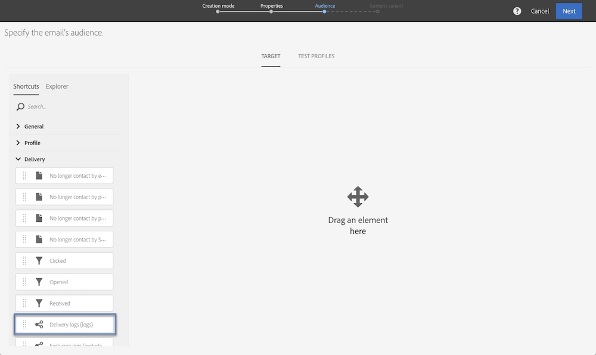

# 쿼리 샘플 {#query-samples}

이 섹션에서는 **[!UICONTROL Query]** 활동을 사용할 때의 사용 사례를 보여 줍니다. **[!UICONTROL Query]** 활동 사용 방법에 대한 자세한 내용은 [이 섹션](../../automating/using/query.md)을 참조하십시오.

## 단순 프로필 속성에 대한 타겟팅 {#targeting-on-simple-profile-attributes}

다음 예제에서는 런던에 거주하는 18세에서 30세 사이의 남성을 타겟으로 구성한 쿼리 활동을 보여줍니다.

## 이메일 속성에 대한 타겟팅 {#targeting-on-email-attributes}

다음 예제에서는 이메일 주소 도메인이 &quot;orange.co.uk&quot;인 프로필을 타겟으로 구성한 쿼리 활동을 보여줍니다.

다음 예제에서는 이메일 주소를 제공한 프로필을 타겟으로 구성한 쿼리 활동을 보여줍니다.

## 오늘이 생일인 프로필 타겟팅 {#targeting-profiles-whose-birthday-is-today}

다음 예제에서는 생일이 오늘인 프로필을 타겟으로 구성한 쿼리 활동을 보여줍니다.

1. 쿼리의 **[!UICONTROL Birthday]** 필터를 드래그합니다.

   

1. **[!UICONTROL Filter type]**&#x200B;을(를) **[!UICONTROL Relative]**(으)로 설정하고 **[!UICONTROL Today]**&#x200B;을(를) 선택합니다.

   

## 특정 게재를 연 프로필 타겟팅 {#targeting-profiles-who-opened-a-specific-delivery}

다음 예제에서는 &quot;Summer Time&quot; 레이블이 있는 게재를 연 프로필을 필터링하도록 구성한 쿼리 활동을 보여줍니다.

1. 쿼리의 **[!UICONTROL Opened]** 필터를 드래그합니다.

   

1. 게재를 선택하고 **[!UICONTROL Confirm]**&#x200B;을(를) 클릭합니다.

   

## 특정한 이유로 게재에 실패한 프로필 타겟팅 {#targeting-profiles-for-whom-deliveries-failed-for-a-specific-reason}

다음 예제에서는 사서함이 가득 차서 게재에 실패한 프로필을 필터링하도록 구성한 쿼리 활동을 보여줍니다. 이 쿼리는 관리 권한이 있고 **[!UICONTROL All (all)]** 조직 단위에 속하는 사용자만 사용할 수 있습니다([이 섹션](../../administration/using/organizational-units.md) 참조).

1. **[!UICONTROL Delivery logs]** 리소스를 선택하여 게재 로그 표에서 직접 필터링합니다([타겟팅 차원과 다른 리소스 사용](../../automating/using/using-resources-different-from-targeting-dimensions.md) 참조).

   

1. 쿼리의 **[!UICONTROL Nature of failure]** 필터를 드래그합니다.

   

1. 타겟팅할 실패 유형을 선택합니다. 이 예제에서는 **[!UICONTROL Mailbox full]**&#x200B;입니다.

   

## 지난 7일 동안 연락이 없는 프로필 타겟팅 {#targeting-profiles-not-contacted-during-the-last-7-days}

다음 예제에서는 지난 7일 동안 연락하지 않은 프로필을 필터링하도록 구성한 쿼리 활동을 보여줍니다.

1. 쿼리의 **[!UICONTROL Delivery logs (logs)]** 필터를 드래그합니다.

   

   드롭다운 목록에서 **[!UICONTROL Does not exist]**&#x200B;을(를) 선택한 다음 **[!UICONTROL Delivery]** 필터를 드래그합니다.

   

1. 다음과 같이 필터를 구성합니다.

   

## 특정 링크를 클릭한 프로필 타겟팅 {#targeting-profiles-who-clicked-a-specific-link-}

1. 쿼리의 **[!UICONTROL Tracking logs (tracking)]** 필터를 드래그합니다.

   

1. **[!UICONTROL Label (urlLabel)]** 필터를 드래그합니다.

   

1. **[!UICONTROL Value]** 필드에서 게재에 링크를 삽입할 때 정의한 레이블을 입력한 다음 확인합니다.

   
