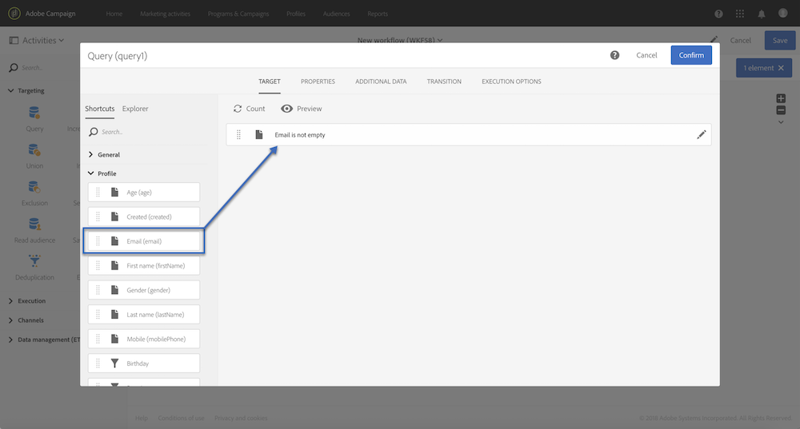

# 쿼리 샘플 {#query-samples}

이 섹션에서는 **[!UICONTROL Query]** 활동을 사용할 때의 사용 사례를 설명합니다. 활동 사용 방법에 대한 자세한 내용은 **[!UICONTROL Query]** 이 섹션을 참조하십시오 .

## 단순 프로필 속성에 대한 타깃팅 {#targeting-on-simple-profile-attributes}

다음 예는 런던에 거주하는 18세에서 30세 사이의 남성을 대상으로 구성된 쿼리 활동을 보여줍니다.

## 이메일 특성에 대한 타깃팅 {#targeting-on-email-attributes}

다음 예는 이메일 주소 도메인이 &quot;orange.co.uk&quot;인 프로필을 대상으로 구성된 쿼리 활동을 보여줍니다.

다음 예는 이메일 주소가 제공된 프로파일을 대상으로 구성된 쿼리 활동을 보여줍니다.

## 오늘이 생일인 프로필 타깃팅 {#targeting-profiles-whose-birthday-is-today}

다음 예에서는 생일이 오늘인 프로필을 대상으로 구성된 쿼리 활동을 보여줍니다.

1. 쿼리의 **[!UICONTROL Birthday]** 필터를 드래그합니다.

   

1. 을 **[!UICONTROL Filter type]** 설정하고 **[!UICONTROL Relative]** 선택합니다 **[!UICONTROL Today]**.

   

## 특정 배달을 연 타깃팅 프로필 {#targeting-profiles-who-opened-a-specific-delivery}

다음 예는 &quot;여름 시간&quot; 레이블이 있는 배달을 연 프로필을 필터링하도록 구성된 쿼리 활동을 보여줍니다.

1. 쿼리의 **[!UICONTROL Opened]** 필터를 드래그합니다.

   

1. 배달을 선택하고 을 클릭합니다 **[!UICONTROL Confirm]**.

   

## 특정 이유로 배달이 실패한 타깃팅 프로필 {#targeting-profiles-for-whom-deliveries-failed-for-a-specific-reason}

다음 예는 해당 사서함이 가득 차서 배달이 실패한 프로필을 필터링하도록 구성된 쿼리 활동을 보여줍니다. 이 쿼리는 관리 권한이 있고 조직 단위에 속하는 사용자만 사용할 수 있습니다( **[!UICONTROL All (all)]** 이 섹션 참조 ).

1. 배달 **[!UICONTROL Delivery logs]** 로그 테이블에서 직접 필터링하려면 리소스를 선택합니다(타깃팅 차원과 다른 리소스 [사용 참조](../../automating/using/using-resources-different-from-targeting-dimensions.md)).

   

1. 쿼리의 **[!UICONTROL Nature of failure]** 필터를 드래그합니다.

   

1. 타깃팅할 실패 유형을 선택합니다. 우리의 경우 **[!UICONTROL Mailbox full]**.

   

## 지난 7일 동안 타깃팅 프로필과 연결되지 않았습니다. {#targeting-profiles-not-contacted-during-the-last-7-days}

다음 예는 지난 7일 동안 연락하지 않은 프로파일을 필터링하도록 구성된 쿼리 활동을 보여줍니다.

1. 쿼리의 **[!UICONTROL Delivery logs (logs)]** 필터를 드래그합니다.

   

   드롭다운 목록 **[!UICONTROL Does not exist]** 에서 선택한 다음 **[!UICONTROL Delivery]** 필터를 드래그합니다.

   

1. 다음과 같이 필터를 구성합니다.

   

## 특정 링크를 클릭한 대상 프로필 {#targeting-profiles-who-clicked-a-specific-link-}

1. 쿼리의 **[!UICONTROL Tracking logs (tracking)]** 필터를 드래그합니다.

   

1. 필터를 **[!UICONTROL Label (urlLabel)]** 드래그합니다.

   

1. 필드에 **[!UICONTROL Value]** 배달에 링크를 삽입할 때 정의된 레이블을 입력한 다음 확인합니다.

   
