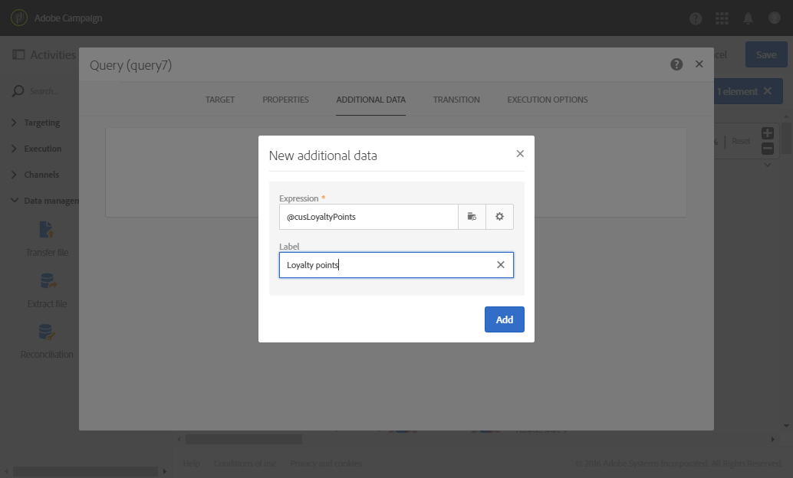
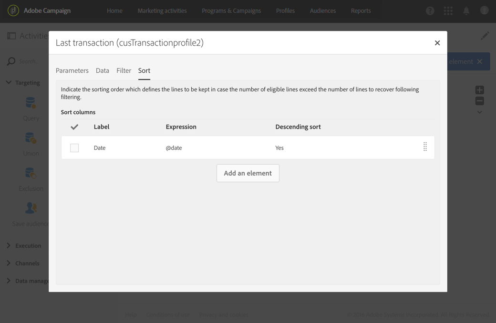
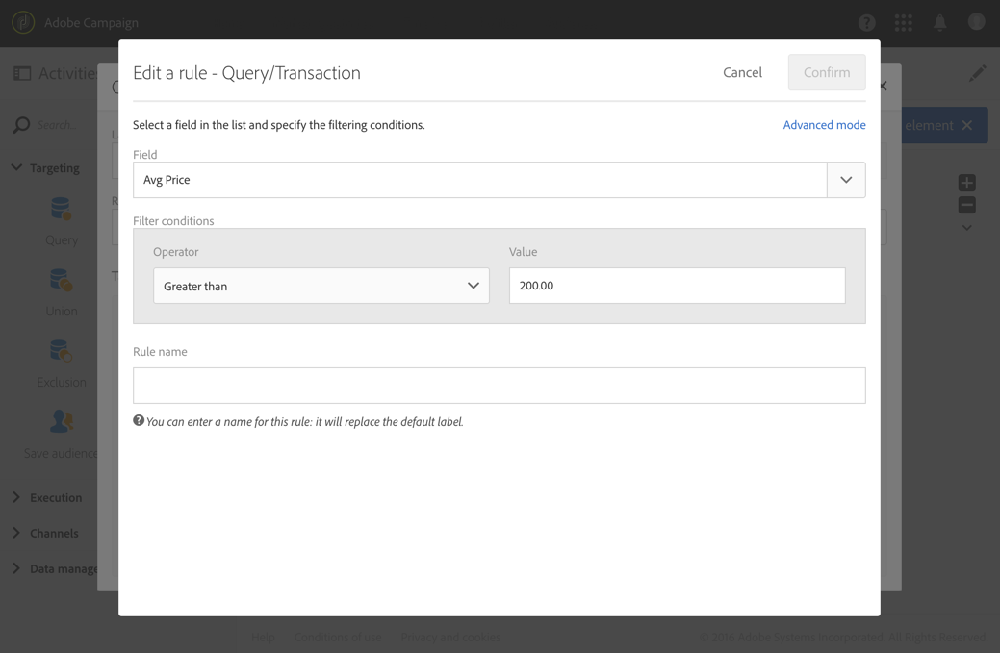

# 쿼리{#query}

## 설명 {#description}

**[!UICONTROL Query]** 활동을 통해 Adobe Campaign 데이터베이스에서 요소 모집단을 필터링하고 추출할 수 있습니다. 전용 탭을 통해 타겟팅된 모집단에 대한 **[!UICONTROL Additional data]**&#x200B;을(를) 정의할 수 있습니다. 이 데이터는 추가 열에 저장되며 진행 중인 워크플로우에만 사용할 수 있습니다.

이 활동은 쿼리 편집기 도구를 사용합니다. 이 도구는 [전용 섹션](../../automating/using/editing-queries.md#about-query-editor)에 자세히 설명되어 있습니다.

**관련 항목:**

* [쿼리 샘플](../../automating/using/query-samples.md)
* [사용 사례: 열지 않은 사용자에게 새 게재를 보내는 워크플로우 재타겟팅](../../automating/using/workflow-cross-channel-retargeting.md)

## 사용의 컨텍스트 {#context-of-use}

**[!UICONTROL Query]** 활동은 다양한 용도로 사용할 수 있습니다.

* 메시지, 대상자 등의 타겟을 정의하기 위한 개인 세그먼트화.
* 전체 Adobe Campaign 데이터베이스 표의 데이터를 보강하는 용도.
* 데이터 내보내기.

## 구성 {#configuration}

1. **[!UICONTROL Query]** 활동을 워크플로우로 끌어서 놓습니다.
1. 활동을 선택한 다음 나타나는 빠른 작업에서  버튼을 사용하여 활동을 엽니다. 이 활동은 기본적으로 프로필을 검색하도록 사전 구성되어 있습니다.
1. 프로필 리소스 이외의 리소스에 대해 쿼리를 실행하려면 활동의 **[!UICONTROL Properties]** 탭으로 이동하여 **[!UICONTROL Resource]** 및 **[!UICONTROL Targeting dimension]**&#x200B;을(를) 선택합니다.

   **[!UICONTROL Resource]**&#x200B;을(를) 사용하면 팔레트에 표시된 필터를 세분화할 수 있지만, 선택한 리소스와 관련된 상황별 **[!UICONTROL Targeting dimension]**&#x200B;은(는) 가져오려는 모집단 유형(식별된 프로필, 게재, 선택한 리소스에 연결된 데이터 등)에 해당합니다.

   자세한 내용은 [차원 및 리소스 타겟팅](#targeting-dimensions-and-resources)을 참조하십시오.

1. **[!UICONTROL Target]** 탭에서 규칙을 정의하고 결합하여 쿼리를 실행합니다.
1. 전용 탭을 통해 타겟팅된 모집단에 대한 **[!UICONTROL Additional data]**&#x200B;을(를) 정의할 수 있습니다. 이 데이터는 추가 열에 저장되며 진행 중인 워크플로우에만 사용할 수 있습니다. 특히 쿼리의 타겟팅 차원에 연결된 Adobe Campaign 데이터베이스 테이블에서 데이터를 추가할 수 있습니다. [데이터 강화](#enriching-data) 섹션을 참조하십시오.

   >[!NOTE]
   >
   >쿼리의 **[!UICONTROL Additional data]** 탭에 있는 **[!UICONTROL Advanced options]**&#x200B;에는 **[!UICONTROL Remove duplicate rows (DISTINCT)]** 옵션이 기본적으로 선택되어 있습니다. **[!UICONTROL Query]** 활동에 정의된 추가 데이터가 많은 경우(100개 이상), 성능상의 이유로 이 옵션의 선택을 해제하는 것을 추천합니다. 단, 이 옵션을 선택 해제하면 쿼리된 데이터에 따라 중복 항목이 발생할 수 있습니다.

1. **[!UICONTROL Transition]** 탭에서 **[!UICONTROL Enable an outbound transition]** 옵션을 사용하면 검색된 데이터가 없는 경우에도 쿼리 활동 뒤에 아웃바운드 전환을 추가할 수 있습니다.

   아웃바운드 전환의 세그먼트 코드는 표준 표현식 및 이벤트 변수를 사용하여 개인화할 수 있습니다([이벤트 변수를 사용하여 활동 사용자 지정](../../automating/using/calling-a-workflow-with-external-parameters.md#customizing-activities-with-events-variables) 참조).

1. 활동 구성을 확인하고 워크플로우를 저장합니다.

## 타겟팅 차원 및 리소스 {#targeting-dimensions-and-resources}

타겟팅 차원 및 리소스를 통해 쿼리의 기반이 되는 요소를 정의하여 게재 타겟을 결정할 수 있습니다.

타겟팅 차원은 타겟 매핑에서 정의됩니다. 자세한 정보는 [이 섹션](../../administration/using/target-mappings-in-campaign.md)을 참조하십시오.

워크플로우를 만들 때 쿼리 활동의 **[!UICONTROL Properties]** 탭에서 타겟팅 차원 및 리소스를 정의합니다.

>[!NOTE]
>
>대상자를 만들 때도 타겟팅 차원을 정의할 수 있습니다([이 섹션](../../audiences/using/creating-audiences.md) 참조).

타겟팅 차원과 리소스는 연결되어 있습니다. 따라서 사용 가능한 타겟팅 차원은 선택한 리소스에 따라 다릅니다.

예를 들어 **[!UICONTROL Profiles (profile)]** 리소스의 경우 다음 타겟팅 차원을 사용할 수 있습니다.

한편 **[!UICONTROL Deliveries (delivery)]**&#x200B;의 경우 다음 타겟팅 차원이 포함됩니다.

타겟팅 차원 및 리소스를 지정하고 나면 쿼리에 다양한 필터를 사용할 수 있습니다.

**[!UICONTROL Profiles (profile)]** 리소스에 사용할 수 있는 필터의 예:

**[!UICONTROL Deliveries (delivery)]** 리소스에 사용할 수 있는 필터의 예:

타겟팅 차원 및 리소스는 기본적으로 프로필을 타겟팅하도록 설정되어 있습니다. 하지만 떨어진 표에 있는 특정 레코드를 검색하려는 경우, 타겟팅 차원과 다른 리소스를 사용하면 유용할 수 있습니다.

자세한 내용은 다음 사용 사례를 참조하십시오. [타깃팅 차원과 다른 리소스 사용](../../automating/using/using-resources-different-from-targeting-dimensions.md)

## 데이터 강화 {#enriching-data}

**[!UICONTROL Query]**, **[!UICONTROL Incremental query]** 및 **[!UICONTROL Enrichment]** 활동의 **[!UICONTROL Additional data]** 탭에서 타겟팅한 데이터를 보강하고 이 데이터를 다음 워크플로우 활동으로 전송하여 활용할 수 있습니다. 특히 다음을 추가할 수 있습니다.

* 단순 데이터
* 집계
* 컬렉션

합계 및 컬렉션의 경우 **[!UICONTROL Alias]**&#x200B;이(가) 자동으로 정의되어 복잡한 표현식에 기술 ID를 제공합니다. 이 고유한 별칭을 통해 이후 합계 및 컬렉션을 쉽게 찾을 수 있습니다. 별칭을 알아보기 쉬운 이름으로 수정할 수 있습니다.

>[!NOTE]
>
>별칭은 다음 구문 규칙을 준수해야 합니다. 영숫자 문자 및 &quot;_&quot; 문자만 허용됩니다. 별칭은 대소문자를 구분합니다. 별칭은 &quot;@&quot; 문자로 시작해야 합니다. &quot;@&quot; 바로 다음에 오는 문자가 숫자이면 안 됩니다. 예: @myAlias_1이나 @_1Alias라는 별칭은 사용할 수 있지만, @myAlias#1이나 @1Alias라는 별칭은 사용할 수 없습니다.

데이터를 추가할 경우, 정의한 추가 데이터를 기반으로 조건을 만들어 처음에 타겟팅한 데이터에 필터링 수준을 추가로 적용할 수 있습니다.

>[!NOTE]
>
>쿼리의 **[!UICONTROL Additional data]** 탭에 있는 **[!UICONTROL Advanced options]**&#x200B;에는 **[!UICONTROL Remove duplicate rows (DISTINCT)]** 옵션이 기본적으로 선택되어 있습니다. **[!UICONTROL Query]** 활동에 정의된 추가 데이터가 많은 경우(100개 이상), 성능상의 이유로 이 옵션의 선택을 해제하는 것을 추천합니다. 단, 이 옵션을 선택 해제하면 쿼리된 데이터에 따라 중복 항목이 발생할 수 있습니다.

추가 데이터가 포함된 이메일을 개인화하는 방법에 대한 사용 사례가 [이 섹션에 나와 있습니다](../../automating/using/personalizing-email-with-additional-data.md).

### 단순 필드 추가 {#adding-a-simple-field}

단순 필드를 추가 데이터로 넣으면 해당 필드가 활동의 아웃바운드 전환 시 직접 표시됩니다. 이를 통해 쿼리에서 얻은 데이터가 원하는 데이터인지 등을 확인할 수 있습니다.

1. **[!UICONTROL Additional data]** 탭에서 새 요소를 추가합니다.
1. 열리는 창의 **[!UICONTROL Expression]** 필드에서 타겟팅 차원 또는 연결된 차원 중 하나에서 직접 사용할 수 있는 필드 하나를 선택합니다. 차원 필드에서는 표현식을 편집하고 함수나 단순 계산(합계 제외)을 사용할 수 있습니다.

   단순 XPATH 경로(예: &quot;Year(&lt;@birthDate>)&quot;)가 아닌 표현식을 편집하면 **[!UICONTROL Alias]**&#x200B;이(가) 자동으로 만들어집니다. 원한다면 수정할 수 있습니다. 필드를 하나만 선택하는 경우(예: &quot;@age&quot;), **[!UICONTROL Alias]**&#x200B;을(를) 정의할 필요가 없습니다.

1. **[!UICONTROL Add]**&#x200B;을(를) 선택하여 추가 데이터에 대한 필드 추가를 확인합니다. 쿼리 실행 시 추가한 필드에 상응하는 추가 열이 활동의 아웃바운드 전환에 표시됩니다.

### 합계 추가 {#adding-an-aggregate}

합계를 사용하면 타겟팅 차원의 필드 또는 타겟팅 차원에 연결된 차원의 필드에서 값을 계산할 수 있습니다. 예를 들면 한 프로필이 구매한 평균 금액을 계산할 수 있습니다.
합계를 쿼리와 함께 사용할 경우 그 함수는 0으로 반환될 수 있으며, 이는 NULL로 간주됩니다. 쿼리의 **[!UICONTROL Output filtering]** 탭을 사용하여 합계된 값을 필터링합니다.

* 0 값을 원하는 경우 **[!UICONTROL is null]**(으)로 필터링해야 합니다.
* 0 값을 원하지 않는 경우 **[!UICONTROL is not null]**(으)로 필터링합니다.

합계에 정렬을 적용해야 하는 경우 0 값을 필터링해야 합니다. 그렇지 않으면 NULL 값이 가장 큰 숫자로 나타납니다.

1. **[!UICONTROL Additional data]** 탭에서 새 요소를 추가합니다.
1. 열리는 창에서 **[!UICONTROL Expression]** 필드에서 합계를 만드는 데 사용할 컬렉션을 선택합니다.

   **[!UICONTROL Alias]**&#x200B;이(가) 자동으로 만들어집니다. 원한다면 쿼리의 **[!UICONTROL Additional data]** 탭으로 돌아가 수정할 수 있습니다.

   합계 정의 창이 열립니다.

1. **[!UICONTROL Data]** 탭에서 합계를 정의합니다. 선택한 합계 유형에 따라 데이터가 호환되는 요소만 **[!UICONTROL Expression]** 필드에서 사용할 수 있습니다. 예를 들어 총합을 계산할 때는 숫자 데이터만 사용할 수 있습니다.

   

   선택한 컬렉션의 필드에 여러 개의 합계를 추가할 수 있습니다. 활동의 아웃바운드 데이터에 대한 세부 사항에서 서로 다른 열을 구분할 수 있도록 레이블을 명시적으로 정의해야 합니다.

   각 합계에 대해 자동으로 정의된 별칭을 변경할 수도 있습니다.

   

1. 필요한 경우 필터를 추가하여 고려되는 데이터를 제한할 수 있습니다.

   [추가된 데이터 필터링](#filtering-added-data) 섹션을 참조하십시오.

1. **[!UICONTROL Confirm]**&#x200B;을(를) 선택하여 합계를 추가합니다.

>[!NOTE]
>
>**[!UICONTROL New additional data]** 창의 **[!UICONTROL Expression]** 필드에서 직접 합계를 포함하는 표현식을 만들 수는 없습니다.

### 컬렉션 추가 {#adding-a-collection}

1. **[!UICONTROL Additional data]** 탭에서 새 요소를 추가합니다.
1. 열리는 창에서 **[!UICONTROL Expression]** 필드에 추가할 컬렉션을 선택합니다. **[!UICONTROL Alias]**&#x200B;이(가) 자동으로 만들어집니다. 원한다면 쿼리의 **[!UICONTROL Additional data]** 탭으로 돌아가 수정할 수 있습니다.
1. **[!UICONTROL Add]**&#x200B;을(를) 선택합니다. 표시할 컬렉션 데이터를 정교화할 수 있는 새 창이 열립니다.
1. **[!UICONTROL Parameters]** 탭에서 **[!UICONTROL Collection]**&#x200B;을(를) 선택하고 추가할 컬렉션의 행 수를 정의합니다. 예를 들어 각 프로필의 최근 구매 내역 3개를 얻으려면 **[!UICONTROL Number of lines to return]** 필드에 &quot;3&quot;을 입력합니다.

   >[!NOTE]
   >
   >입력하는 숫자는 1 이상이어야 합니다.

1. **[!UICONTROL Data]** 탭에서 각 행에 표시할 컬렉션 필드를 정의합니다.

   

1. 원한다면 필터를 추가하여 고려되는 컬렉션 행을 제한할 수 있습니다.

   [추가된 데이터 필터링](#filtering-added-data) 섹션을 참조하십시오.

1. 원한다면 데이터 정렬을 정의할 수 있습니다.

   예를 들어 **[!UICONTROL Parameters]** 탭에서 3행을 반환하도록 선택한 뒤, 최근 3개의 구매 내역을 확인하려면 트랜잭션에 해당하는 컬렉션의 &quot;날짜&quot; 필드에 내림차순 정렬을 정의할 수 있습니다.

1. [추가 데이터 정렬](#sorting-additional-data) 섹션을 참조하십시오.
1. **[!UICONTROL Confirm]**&#x200B;을(를) 선택하여 컬렉션을 추가합니다.

### 추가된 데이터 필터링 {#filtering-added-data}

합계 또는 컬렉션을 추가할 때 표시할 데이터를 제한하는 추가 필터를 지정할 수 있습니다.

예를 들어 금액이 50달러 이상인 트랜잭션에 대한 컬렉션 행만 처리하려는 경우, **[!UICONTROL Filter]** 탭에서 트랜잭션 금액에 해당하는 필드에 조건을 추가할 수 있습니다.

### 추가 데이터 정렬 {#sorting-additional-data}

쿼리의 데이터에 합계나 컬렉션을 추가할 때, 정의한 필드나 표현식의 값을 기반으로 (오름차순이든 내림차순이든) 정렬을 적용할지 여부를 지정할 수 있습니다.

예를 들어, 한 프로필에서 가장 최근에 실행한 트랜잭션만 저장하려면 **[!UICONTROL Parameters]** 탭의 **[!UICONTROL Number of lines to return]** 필드에 &quot;1&quot;을 입력하고 **[!UICONTROL Sort]** 탭을 통해 트랜잭션 날짜에 해당하는 필드에 내림차순 정렬을 적용합니다.

### 타겟팅된 데이터를 추가 데이터에 따라 필터링 {#filtering-the-targeted-data-according-to-additional-data}

데이터를 추가하면 **[!UICONTROL Query]**&#x200B;에 새로운 **[!UICONTROL Output filtering]** 탭이 나타납니다 . 이 탭에서는 추가한 데이터를 고려하여 처음에 **[!UICONTROL Target]** 탭에서 타겟팅한 데이터에 추가 필터를 적용할 수 있습니다.

예를 들어 하나 이상의 트랜잭션을 수행한 모든 프로필을 타겟팅하고, 각 프로필에 대해 수행된 평균 트랜잭션 금액을 계산한 합계를 **[!UICONTROL Additional data]**&#x200B;에 추가한 경우, 이 평균을 사용하여 처음에 계산된 모집단을 정교화할 수 있습니다.

이렇게 하려면 **[!UICONTROL Output filtering]** 탭에서 이 추가 데이터에 조건을 추가하기만 하면 됩니다.

