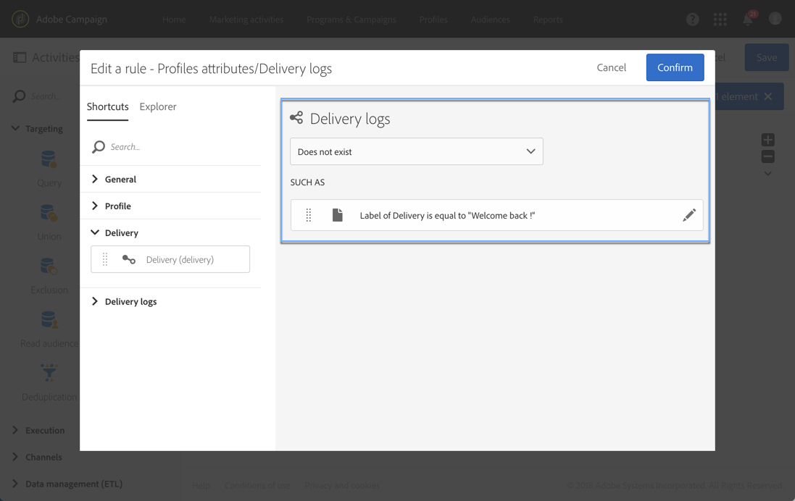
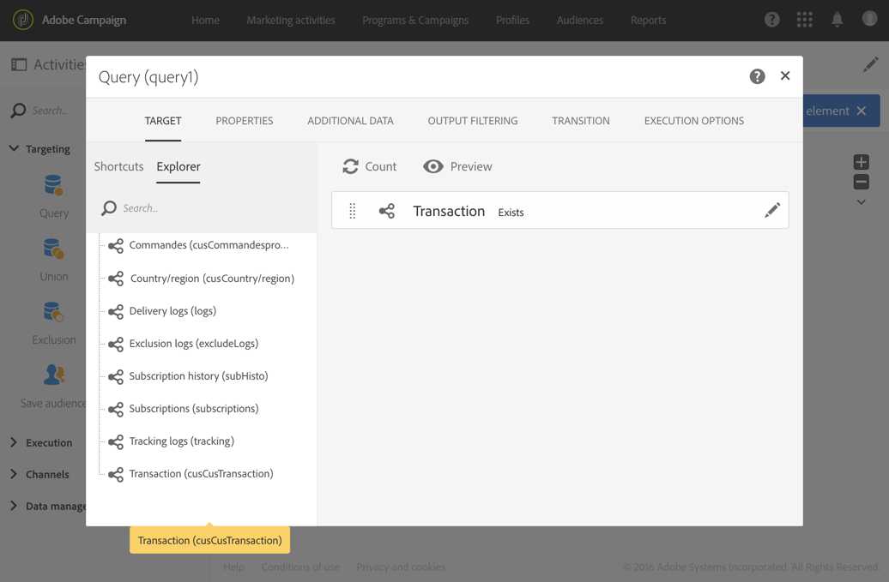
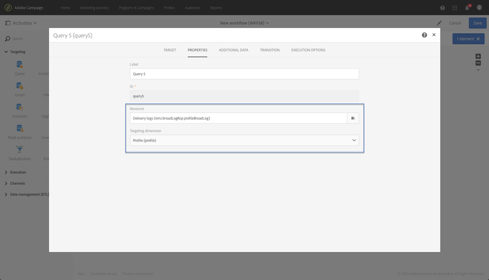

# Query{#query}

## Description {#description}

**[!UICONTROL Query]** 활동을 통해 Adobe Campaign 데이터베이스에서 요소 모집단을 필터링하고 추출할 수 있습니다. You can define **[!UICONTROL Additional data]** for the targeted population via a dedicated tab. 이 데이터는 추가 열에 저장되며 진행 중인 워크플로우에만 사용할 수 있습니다.

활동은 쿼리 편집기 도구를 사용합니다. This tool is detailed in a [dedicated section](../../automating/using/editing-queries.md#about-query-editor).

## Context of use {#context-of-use}

**[!UICONTROL Query]** 활동은 다양한 유형의 사용에 사용할 수 있습니다.

* 개인을 세그먼트화하여 메시지 대상, 대상자 등을 정의합니다.
* 전체 Adobe Campaign 데이터베이스 테이블 데이터 강화
* 데이터 내보내기를 참조하십시오.

## Configuration {#configuration}

1. **[!UICONTROL Query]** 워크플로우를 워크플로우로 드래그하여 놓습니다.
1. Select the activity, then open it using the  button from the quick actions that appear. 기본적으로 활동은 프로필을 검색할 수 있도록 미리 구성되어 있습니다.
1. If you would like to run a query on a resource other than the profile resource, go to the activity's **[!UICONTROL Properties]** tab and select a **[!UICONTROL Resource]** and a **[!UICONTROL Targeting dimension]**.

   The **[!UICONTROL Resource]** allows you to refine the filters displayed in the palette whereas the **[!UICONTROL Targeting dimension]**, contextual with regard to the resource selected, corresponds to the type of population that you would like to obtain (identified profiles, deliveries, data linked to the selected resource, etc.).

   For more on this, refer to [Targeting dimensions and resources](../../automating/using/query.md#targeting-dimensions-and-resources)

1. **[!UICONTROL Target]** 탭에서 규칙을 정의하고 결합하여 쿼리를 실행합니다.
1. You can define **[!UICONTROL Additional data]** for the targeted population via a dedicated tab. 이 데이터는 추가 열에 저장되며 진행 중인 워크플로우에만 사용할 수 있습니다. 특히, 쿼리의 타깃팅 차원에 연결된 Adobe Campaign 데이터베이스 테이블의 데이터를 추가할 수 있습니다. [데이터 강화](../../automating/using/query.md#enriching-data) 섹션을 참조하십시오.

   >[!NOTE]
   >
   >By default, the **[!UICONTROL Remove duplicate rows (DISTINCT)]** option is checked in the **[!UICONTROL Advanced options]** of the **[!UICONTROL Additional data]** tab of the query. If the **[!UICONTROL Query]** activity contains many (from 100) additional data defined, it is recommended to uncheck this option, for performance reasons. 이 옵션을 선택 해제하면 쿼리한 데이터에 따라 중복이 생길 수 있습니다.

1. **[!UICONTROL Transition]** 탭에서 **[!UICONTROL Enable an outbound transition]** 이 옵션을 사용하면 데이터를 검색하지 않아도 쿼리 활동 후 아웃바운드 전환을 추가할 수 있습니다.

   The outbound transition's segment code can be personalized using a standard expression and events variables (see [Customizing activities with events variables](../../automating/using/calling-a-workflow-with-external-parameters.md#customizing-activities-with-events-variables)).

1. 활동의 구성을 확인하고 워크플로우를 저장합니다.

## Targeting dimensions and resources {#targeting-dimensions-and-resources}

차원 및 리소스를 타깃팅하면 어떤 요소가 기반으로 제공될지를 정의하여 게재의 타겟을 결정할 수 있습니다.

타깃팅 차원은 Target 매핑에서 정의됩니다. For more on this, refer to [this section](../../administration/using/target-mappings-in-campaign.md).

### Defining the targeting dimension and resource of a query {#defining-the-targeting-dimension-and-resource-of-a-query}

Targeting dimension and resources are defined when creating a workflow, in the **[!UICONTROL Properties]** tab of a Query activity.

>[!NOTE]
>
>The targeting dimension can also be defined when creating an audience (see [this section](../../audiences/using/creating-audiences.md)).

타겟 차원 및 리소스가 연결되어 있습니다. 따라서 사용 가능한 타깃팅 차원은 선택한 리소스에 따라 다릅니다.

For example, for the Resource **[!UICONTROL Profiles (profile)]**, the following targeting dimensions will be available:

While for **[!UICONTROL Deliveries (delivery)]**, the list will contain the following targeting dimensions:

타깃팅 차원과 리소스가 지정되면 쿼리에서 다른 필터를 사용할 수 있습니다.

Example of available filters for the **[!UICONTROL Profiles (profile)]** resource:

Example of available filters for the **[!UICONTROL Deliveries (delivery)]** resource:

### Using resources different from targeting dimensions {#using-resources-different-from-targeting-dimensions}

기본적으로 타깃팅 차원과 리소스는 프로필을 타깃팅하기 위해 설정됩니다.

하지만 멀리 떨어진 테이블에서 특정 레코드를 조회하려는 경우 타깃팅 차원에서 다른 리소스를 사용하는 것이 유용할 수 있습니다.

**예제 1: 레이블로 배달이 타깃팅한 프로필 "Welcome Back!**».

* 이 경우, 프로파일을 타깃팅합니다. We will set the targeting dimension to **[!UICONTROL Profiles (profile)]**.
* 배달 레이블에 따라 선택한 프로필을 필터링하려고 합니다. We will therefore set the resource to **[!UICONTROL Delivery logs]**. 이렇게 하면 배달 로그 테이블에서 직접 필터링되고 더 나은 성능을 제공하게 됩니다.

**예제 2: " 다시 시작! "레이블이 있는 게재의 타깃팅되지 않은 프로필 식별»**

이전 예에서는 타깃팅 차원과 다른 리소스를 사용했습니다. This operation is only possible if you want to find a record that **is present** in the distant table (delivery logs in our example).

If we want to find a record that **is not present** in the distant table (for example, profiles who were not targeted by a specific delivery), you must use the same resource and targeting dimension, as the record will not be present in the distant table (delivery logs).

* 이 경우, 프로파일을 타깃팅합니다. We will set the targeting dimension to **[!UICONTROL Profiles (profile)]**.
* 배달 레이블에 따라 선택한 프로필을 필터링하려고 합니다. 배달 로그 테이블에 존재하지 않는 레코드가 있으므로 배달 로그에서 직접 필터링할 수 없습니다. We will therefore set the resource to **[!UICONTROL Profile (profile)]** and build our query on the profiles table.

## Enriching data {#enriching-data}

The **[!UICONTROL Additional data]** tab of the **[!UICONTROL Query]**, **[!UICONTROL Incremental query]** and **[!UICONTROL Enrichment]** activities allows you to enrich the data targeted and transfer this data to the following workflow activities, where it can be utilized. 특히 다음을 추가할 수 있습니다.

* 간단한 데이터
* 집계
* 컬렉션

For aggregates and collections, an **[!UICONTROL Alias]** is automatically defined to give a technical ID to a complex expression. 이 별칭은 고유해야 하며, 나중에 집계와 컬렉션을 쉽게 찾을 수 있습니다. 이를 수정하여 쉽게 인식할 수 있는 이름을 지정할 수 있습니다.

>[!NOTE]
>
>별칭은 다음 구문 규칙을 따라야 합니다. 영숫자 및 "_" 문자만 인증됩니다. 별칭은 대소문자를 구분합니다. 별칭은 " @" 문자로 시작해야 합니다. " @ "다음에 오는 문자는 숫자이면 안 됩니다. 예를 들면 다음과 같습니다. @ Myalias_ 1 및 @_ 1 별칭이 올바릅니다. 반면에 @ Myalias # 1와 @ 1 별칭은 올바르지 않습니다.

추가 데이터를 추가한 후, 정의된 추가 데이터를 기반으로 조건을 만들어 처음에 타깃팅된 데이터에 추가 필터 수준을 적용할 수 있습니다.

>[!NOTE]
>
>By default, the **[!UICONTROL Remove duplicate rows (DISTINCT)]** option is checked in the **[!UICONTROL Advanced options]** of the **[!UICONTROL Additional data]** tab of the query. If the **[!UICONTROL Query]** activity contains many (from 100) additional data defined, it is recommended to uncheck this option, for performance reasons. 이 옵션을 선택 해제하면 쿼리한 데이터에 따라 중복이 생길 수 있습니다.

### Adding a simple field {#adding-a-simple-field}

간단한 필드를 추가 데이터로 추가하면 해당 필드가 활동의 아웃바운드 전환 시 바로 표시됩니다. 예를 들어 사용자는 쿼리의 데이터가 원하는 데이터임을 확인할 수 있습니다.

1. **[!UICONTROL Additional data]** 탭에서 새 요소를 추가합니다.
1. In the window that opens, in the **[!UICONTROL Expression]** field, select one of the fields available directly in the targeting dimension or in one of the linked dimensions. 표현식을 편집하고 차원 필드에서 함수 또는 간단한 계산 (집계 제외) 를 사용할 수 있습니다.

   An **[!UICONTROL Alias]** is automatically created if you edit an expression that is not a simple XPATH path (for example: "Year(&lt;@birthDate&gt;)"). 원하는 경우 수정할 수 있습니다. If you only select one field (for example: "@age"), you do not need to define an **[!UICONTROL Alias]**.

1. Select **[!UICONTROL Add]** to confirm adding the field to the additional data. 쿼리가 실행되면 추가된 필드에 해당하는 추가 열이 활동의 아웃바운드 전환 시 표시됩니다.

### Adding an aggregate {#adding-an-aggregate}

집계 기능을 사용하면 타깃팅 차원의 필드나 타깃팅 차원에 연결된 차원의 필드에서 값을 계산할 수 있습니다. 예를 들면 다음과 같습니다. 프로필로 구매한 평균 금액입니다.

1. **[!UICONTROL Additional data]** 탭에서 새 요소를 추가합니다.
1. In the window that opens, select the collection that you want to use to create your aggregate in the **[!UICONTROL Expression]** field.

   An **[!UICONTROL Alias]** is created automatically. If you like, you can modify it by going back to the query's **[!UICONTROL Additional data]** tab.

   [집계 정의] 창이 열립니다.

1. Define an aggregate from the **[!UICONTROL Data]** tab. Depending on the type of aggregate selected, only the elements whose data is compatible are available in the **[!UICONTROL Expression]** field. 예를 들어 합계는 숫자 데이터로만 계산할 수 있습니다.

   

   선택한 컬렉션의 필드에 대해 여러 집계를 추가할 수 있습니다. 활동의 아웃바운드 데이터 세부 정보에서 서로 다른 열을 구별하려면 명시적 레이블을 정의해야 합니다.

   각 집계 항목에 대해 자동으로 정의된 별칭을 변경할 수도 있습니다.

   

1. 필요한 경우 필터를 추가하여 고려되는 데이터를 제한할 수 있습니다.

   Refer to the [Filtering added data](../../automating/using/query.md#filtering-added-data) section.

1. Select **[!UICONTROL Confirm]** to add aggregates.

>[!NOTE]
>
>You cannot create an expression containing an aggregate directly from the **[!UICONTROL Expression]** field of the **[!UICONTROL New additional data]** window.

### Adding a collection {#adding-a-collection}

1. **[!UICONTROL Additional data]** 탭에서 새 요소를 추가합니다.
1. In the window that opens, select the collection that you want to add in the **[!UICONTROL Expression]** field. An **[!UICONTROL Alias]** is created automatically. If you like, you can modify it by going back to the query's **[!UICONTROL Additional data]** tab.
1. **[!UICONTROL Add]** Select. 새 창이 열리므로 표시할 컬렉션 데이터를 세밀하게 수정할 수 있습니다.
1. **[!UICONTROL Parameters]** 탭에서 추가하려는 컬렉션의 줄 수를 선택하고 **[!UICONTROL Collection]** 정의합니다. For example, if you want to get the three most recent purchases carried out by each profile, enter "3" in the **[!UICONTROL Number of lines to return]** field.

   >[!NOTE]
   >
   >1 보다 크거나 같은 숫자를 입력해야 합니다.

1. **[!UICONTROL Data]** 탭에서 각 행에 대해 표시할 컬렉션의 필드를 정의합니다.

   

1. 원하는 경우 필터를 추가하여 고려되는 수집 라인을 제한할 수 있습니다.

   Refer to the [Filtering added data](../../automating/using/query.md#filtering-added-data) section.

1. 원하는 경우 데이터 정렬을 정의할 수 있습니다.

   For example, if you have selected 3 lines to return in the **[!UICONTROL Parameters]** tab, and you want to determine the three most recent purchases, you can define a descending sort on the "date" field of the collection that corresponds to the transactions.

1. Refer to the [Sorting additional data](../../automating/using/query.md#sorting-additional-data) section.
1. Select **[!UICONTROL Confirm]** to add the collection.

### Filtering added data {#filtering-added-data}

집계 또는 컬렉션을 추가할 때 표시할 데이터를 제한할 추가 필터를 지정할 수 있습니다.

For example, if you want to only process the collection lines of transactions with amounts of 50 dollars and above, you can add a condition on the field corresponding to the transaction amount from the **[!UICONTROL Filter]** tab.

### Sorting additional data {#sorting-additional-data}

집계 또는 컬렉션을 쿼리의 데이터에 추가할 때 필드 값이나 정의된 표현식에 따라 오름차순 또는 내림차순 정렬 여부를 지정할 수 있습니다.

For example, if you want to save only the transaction that was carried out most recently by a profile, enter "1" in the **[!UICONTROL Number of lines to return]** field of the **[!UICONTROL Parameters]** tab, and apply a descending sort on the field corresponding to the transaction date via the **[!UICONTROL Sort]** tab.

### Filtering the targeted data according to additional data {#filtering-the-targeted-data-according-to-additional-data}

Once you have added additional data, a new **[!UICONTROL Output filtering]** tab appears in the **[!UICONTROL Query]**. This tab allows you to apply an additional filter on the data initially targeted in the **[!UICONTROL Target]** tab, by taking into account the added data.

For example, if you have targeted all of the profiles that carried out at least one transaction and an aggregate calculating the average transaction amount carried out for each profile was added to the **[!UICONTROL Additional data]**, you can refine the population initially calculated using this average.

To do this, in the **[!UICONTROL Output filtering]** tab, simply add a condition on this additional data.

### Example: personalizing an email with additional data {#example--personalizing-an-email-with-additional-data}

다음 예에서는 쿼리에 다른 유형의 추가 데이터를 추가하고 이메일에서 개인화 필드로 사용하는 것을 보여줍니다.

For this example, [custom resources](../../developing/using/data-model-concepts.md) are used:

* **각 프로필의 충성도 저장할 수 있는 필드를 추가하기 위해 프로필** 리소스가 확장되었습니다.
* **트랜잭션** 리소스가 생성되었으며 데이터베이스에서 프로파일로 수행하는 모든 구매를 식별합니다. 구매한 날짜, 가격 및 제품은 각 거래에 대해 저장됩니다.
* **제품** 리소스가 생성되었으며 구입 가능한 제품을 참조합니다.

목표는 하나 이상의 트랜잭션이 저장된 프로필로 이메일을 전송하는 것입니다. 클라이언트는 이 이메일을 통해 마지막 거래와 모든 거래에 대한 개요를 알려주는 메시지를 수신하게 됩니다. 구입한 제품 수, 총 지출 횟수, 사용한 총 충성도 포인트 미리 알림

워크플로우는 다음과 같이 표시됩니다.

1. **[!UICONTROL Query]** 하나 이상의 트랜잭션을 수행한 프로필을 타깃팅할 수 있는 활동을 추가합니다.

   

   From the query's **[!UICONTROL Additional data]** tab, define the different data to be displayed in the final email:

   * The simple field of the **profile** dimension corresponding to the loyalty points. Refer to the [Adding a simple field](../../automating/using/query.md#adding-a-simple-field) section.
   * Transactions Collection를 기반으로 한 두 개의 집계는 다음과 같습니다. 구입한 제품 수와 총 지출 금액입니다. You can add them from the **[!UICONTROL Data]** tab of the aggregate configuration window, using the **Count** and **Sum** aggregates. Refer to the [Adding an aggregate](../../automating/using/query.md#adding-an-aggregate) section.
   * 지출 금액, 날짜 및 마지막 거래의 제품을 반환하는 컬렉션입니다.

      To do this, you have to add the different fields that you want to display from the **[!UICONTROL Data]** tab of the collection configuration window.

      To return only the most recent transaction, you have to enter "1" for the **[!UICONTROL Number of lines to return]** and apply a descending sort on the **Date** field of the collection from the **[!UICONTROL Sort]** tab.

      Refer to the [Adding a collection](../../automating/using/query.md#adding-a-collection) and [Sorting additional data](../../automating/using/query.md#sorting-additional-data) sections.
   

   If you would like to check that the data is correctly transferred by the activity's outbound transition, start the workflow for the first time (without the **[!UICONTROL Email delivery]** activity) and open the query's outbound transition.

   

1. **[!UICONTROL Email delivery]** 활동을 추가합니다. 이메일 컨텐츠에서 쿼리에 계산된 데이터에 해당하는 개인화 필드를 삽입합니다. You can find it via the **[!UICONTROL Additional data (targetData)]** link of the personalization fields explorer.

   

이제 워크플로우를 실행할 준비가 되었습니다. 쿼리에서 타깃팅된 프로필은 트랜잭션에서 계산된 데이터가 포함된 개인화된 이메일을 받게 됩니다.

## Query samples {#query-samples}

### Targeting on simple profile attributes {#targeting-on-simple-profile-attributes}

다음 예는 런던에 거주하며 18 세에서 30 세 사이의 남자를 타깃팅하도록 구성된 쿼리 활동을 보여줍니다.

### Targeting on email attributes {#targeting-on-email-attributes}

다음 예는 이메일 주소 도메인 "orange.co.uk" 로 프로파일을 타깃팅하도록 구성된 쿼리 활동을 보여줍니다.

다음 예는 이메일 주소가 제공된 프로필 타깃팅에 구성된 쿼리 활동을 보여줍니다.

### Targeting profiles whose birthday is today {#targeting-profiles-whose-birthday-is-today}

다음 예는 생일이 오늘인 프로필을 타깃팅하도록 구성된 쿼리 활동을 보여줍니다.

1. Drag the **[!UICONTROL Birthday]** filter in your query.

   

1. **[!UICONTROL Filter type]** To **[!UICONTROL Relative]** 를 설정하고 선택합니다 **[!UICONTROL Today]**.

   

### Targeting profiles who opened a specific delivery {#targeting-profiles-who-opened-a-specific-delivery}

다음 예는 "Summer Time" 레이블이 있는 배달을 연 프로필을 필터링하도록 구성된 쿼리 활동을 보여줍니다.

1. Drag the **[!UICONTROL Opened]** filter in your query.

   

1. Select the delivery then click **[!UICONTROL Confirm]**.

   

### Targeting profiles for whom deliveries failed for a specific reason {#targeting-profiles-for-whom-deliveries-failed-for-a-specific-reason}

다음 예는 사서함이 꽉 차서 배달이 실패한 프로필을 필터링하도록 구성된 쿼리 활동을 보여줍니다. This query is only available for users with administration rights and belonging to the **[!UICONTROL All (all)]** organizational units (see [this section](../../administration/using/organizational-units.md)).

1. Select the **[!UICONTROL Delivery logs]** resource in order to filter directly in the delivery log table (see [Using resources different from targeting dimensions](../../automating/using/query.md#using-resources-different-from-targeting-dimensions)).

   

1. Drag the **[!UICONTROL Nature of failure]** filter in your query.

   

1. 타깃팅할 실패 유형을 선택합니다. **[!UICONTROL Mailbox full]**&#x200B;이 경우

   

### Targeting profiles not contacted during the last 7 days {#targeting-profiles-not-contacted-during-the-last-7-days}

다음 예는 지난 7 일 동안 연결되지 않은 위치에서 프로필을 필터링하도록 구성된 쿼리 활동을 보여줍니다.

1. Drag the **[!UICONTROL Delivery logs (logs)]** filter in your query.

   

   Select **[!UICONTROL Does not exist]** in the drop-down list, then drag the **[!UICONTROL Delivery]** filter.

   

1. 다음과 같이 필터를 구성합니다.

   

### Targeting profiles who clicked a specific link {#targeting-profiles-who-clicked-a-specific-link-}

1. Drag the **[!UICONTROL Tracking logs (tracking)]** filter in your query.

   

1. **[!UICONTROL Label (urlLabel)]** 필터를 드래그합니다.

   

1. In the **[!UICONTROL Value]** field, type the label that was defined when inserting the link in the delivery, then confirm.

   

