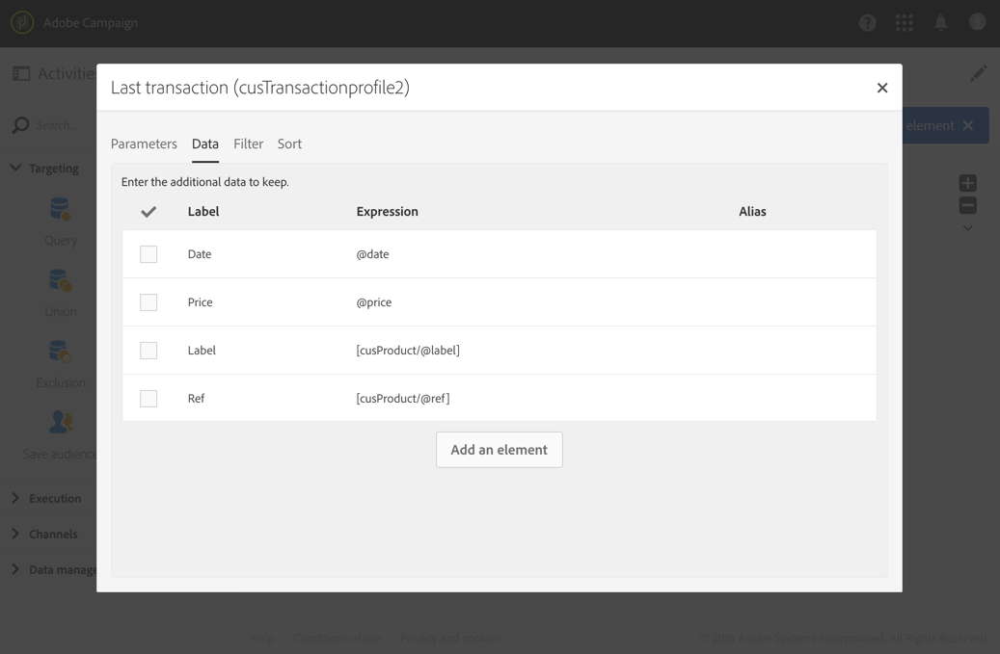

# 쿼리{#query}

## 설명 {#description}

이 **[!UICONTROL Query]** 활동을 통해 Adobe Campaign 데이터베이스에서 요소 모집단을 필터링하고 추출할 수 있습니다. 전용 탭을 통해 타깃팅된 **[!UICONTROL Additional data]** 모집단에 대해 정의할 수 있습니다. 이 데이터는 추가 열에 저장되며 진행 중인 워크플로우에만 사용할 수 있습니다.

활동은 쿼리 편집기 도구를 사용합니다. 이 도구는 [전용 섹션에](../../automating/using/editing-queries.md#about-query-editor)자세히 설명되어 있습니다.

## 사용 상황 {#context-of-use}

이 **[!UICONTROL Query]** 활동은 다양한 유형의 용도로 사용할 수 있습니다.

* 메시지, 대상 등을 정의하기 위한 개인 세그먼트화
* 전체 Adobe Campaign 데이터베이스 테이블의 데이터 강화
* 데이터 내보내기를 참조하십시오.

## 구성 {#configuration}

1. 워크플로우를 워크플로우로 드래그하여 **[!UICONTROL Query]** 놓을 수 있습니다.
1. 활동을 선택한 다음 나타나는 빠른 작업의  단추를 사용하여 엽니다. 기본적으로 활동이 프로파일을 검색하도록 미리 구성됩니다.
1. 프로필 리소스 이외의 리소스에서 쿼리를 실행하려면 활동의 **[!UICONTROL Properties]** 탭으로 이동하여 **[!UICONTROL Resource]** 및 **[!UICONTROL Targeting dimension]** a를 선택합니다.

   The **[!UICONTROL Resource]** allows you to refine the filters displayed in the palette while the contextual **[!UICONTROL Targeting dimension]**, contextual to the resource selected, delivery, data linked to the selected resource, etc.

   자세한 내용은 [차원 및 리소스](#targeting-dimensions-and-resources)타깃팅을 참조하십시오.

1. 탭에서 규칙을 정의하고 결합하여 쿼리를 **[!UICONTROL Target]** 실행합니다.
1. 전용 탭을 통해 타깃팅된 **[!UICONTROL Additional data]** 모집단에 대해 정의할 수 있습니다. 이 데이터는 추가 열에 저장되며 진행 중인 워크플로우에만 사용할 수 있습니다. 특히 쿼리의 타깃팅 차원에 연결된 Adobe Campaign 데이터베이스 테이블에서 데이터를 추가할 수 있습니다. 데이터 [수집](#enriching-data) 섹션을 참조하십시오.

   >[!NOTE]
   >
   >기본적으로 이 **[!UICONTROL Remove duplicate rows (DISTINCT)]** 옵션은 쿼리의 **[!UICONTROL Advanced options]****[!UICONTROL Additional data]** 탭에서 선택됩니다. 활동에 많은(100부터) 추가 데이터가 정의된 경우, 성능상의 이유로 이 옵션의 선택을 취소하는 것이 좋습니다. **[!UICONTROL Query]** 이 옵션을 선택 해제하면 쿼리된 데이터에 따라 중복 항목이 생성될 수 있습니다.

1. 이 **[!UICONTROL Transition]** 탭에서 쿼리 활동 뒤에 아웃바운드 전환을 추가할 수 **[!UICONTROL Enable an outbound transition]** 있습니다.

   아웃바운드 전환의 세그먼트 코드는 표준 표현식 및 이벤트 변수를 사용하여 개인화할 수 있습니다(이벤트 변수를 [사용하여 활동 사용자 지정](../../automating/using/calling-a-workflow-with-external-parameters.md#customizing-activities-with-events-variables)참조).

1. 활동 구성을 확인하고 워크플로우를 저장합니다.

## 차원 및 리소스 타깃팅 {#targeting-dimensions-and-resources}

차원 및 리소스를 타깃팅하면 질의 기준이 되는 요소를 정의하여 게재의 대상을 결정할 수 있습니다.

타깃팅 차원은 대상 매핑에서 정의됩니다. For more on this, refer to [this section](../../administration/using/target-mappings-in-campaign.md).

### 쿼리의 타깃팅 차원 및 리소스 정의 {#defining-the-targeting-dimension-and-resource-of-a-query}

타깃팅 차원 및 리소스는 쿼리 활동의 **[!UICONTROL Properties]** 탭에서 워크플로우를 만들 때 정의됩니다.

>[!NOTE]
>
>대상을 만들 때도 타깃팅 차원을 정의할 수 있습니다( [이 섹션](../../audiences/using/creating-audiences.md)참조).

타깃팅 차원 및 리소스가 연결됩니다. 따라서 사용 가능한 타깃팅 차원은 선택한 리소스에 따라 다릅니다.

예를 들어 리소스의 경우 **[!UICONTROL Profiles (profile)]**&#x200B;다음 타깃팅 차원을 사용할 수 있습니다.

for **[!UICONTROL Deliveries (delivery)]** the list will contain the following targeting dimensions:

타깃팅 차원과 리소스가 지정되면 쿼리에서 다른 필터를 사용할 수 있습니다.

리소스에 대한 사용 가능한 필터의 예 **[!UICONTROL Profiles (profile)]** :

리소스에 대한 사용 가능한 필터의 예 **[!UICONTROL Deliveries (delivery)]** :

### 타깃팅 차원과 다른 리소스 사용 {#using-resources-different-from-targeting-dimensions}

기본적으로 타깃팅 차원과 리소스는 프로파일을 타깃팅하기 위해 설정됩니다.

하지만 멀리 떨어진 테이블에서 특정 레코드를 검색하려는 경우 타깃팅 차원과 다른 리소스를 사용하는 것이 유용할 수 있습니다.

**예 1:&quot;Welcome back!&quot;**&#x200B;레이블을 사용하여 배달을 대상으로 하는 프로필을 식별합니다.

* 이 경우 프로파일을 타깃팅하려고 합니다. 타깃팅 차원을 다음으로 **[!UICONTROL Profiles (profile)]**&#x200B;설정합니다.
* 배달 레이블에 따라 선택한 프로필을 필터링하려고 합니다. 따라서 리소스를 로 설정할 **[!UICONTROL Delivery logs]**&#x200B;것입니다. 이렇게 해서 배달 로그 테이블에서 바로 필터링하여 더 나은 성과를 제공합니다.

**예 2:&quot;Welcome back!&quot; 레이블이 있는 배달에서 타깃팅되지 않은 프로필 식별**

이전 예에서는 타깃팅 차원과 다른 리소스를 사용했습니다. 이 작업은 먼 테이블에 **있는** 레코드를 찾으려는 경우에만 가능합니다(예: 배달 로그).

멀리 떨어진 테이블에 **없는** 레코드(예: 특정 게재의 대상이 아닌 프로파일)를 찾으려면 동일한 리소스 및 타깃팅 차원을 사용해야 합니다. 이 레코드는 멀리 떨어진 테이블(배달 로그)에 표시되지 않습니다.

* 이 경우 프로파일을 타깃팅하려고 합니다. 타깃팅 차원을 다음으로 **[!UICONTROL Profiles (profile)]**&#x200B;설정합니다.
* 배달 레이블에 따라 선택한 프로필을 필터링하려고 합니다. 배달 로그 테이블에 없는 레코드를 찾고 있으므로 배달 로그에서 직접 필터링할 수 없습니다. 따라서 리소스를 설정하고 프로필 테이블에 쿼리를 **[!UICONTROL Profile (profile)]** 작성합니다.

## 데이터 강화 {#enriching-data}

탭 **[!UICONTROL Additional data]****[!UICONTROL Query]**&#x200B;및 **[!UICONTROL Incremental query]** **[!UICONTROL Enrichment]** 활동을 통해 타깃팅된 데이터를 보완하고 이 데이터를 활용할 수 있는 다음 워크플로우 활동으로 전송할 수 있습니다. 특히 다음을 추가할 수 있습니다.

* 간단한 데이터
* 집계
* 컬렉션

집계 및 컬렉션의 경우, 는 복잡한 표현식에 기술 ID를 제공하도록 자동으로 **[!UICONTROL Alias]** 정의됩니다. 이 별칭은 고유해야 하며 이후 수집 및 컬렉션을 쉽게 찾을 수 있습니다. 쉽게 인식할 수 있는 이름을 제공하도록 수정할 수 있습니다.

>[!NOTE]
>
>별칭은 다음 구문 규칙을 준수해야 합니다.영숫자 문자와 &quot;_&quot; 문자만 허용됩니다. 별칭은 대소문자를 구분합니다. 별칭은 &quot;@&quot; 문자로 시작해야 합니다. &quot;@&quot; 바로 다음에 오는 문자는 숫자일 수 없습니다. 예:@myAlias_1 및 @_1별칭이 올바릅니다.반면에 @myAlias#1 및 @1별칭이 잘못되었습니다.

추가 데이터를 추가한 후 정의된 추가 데이터를 기반으로 조건을 만들어 처음에 타깃팅된 데이터에 추가 필터 수준을 적용할 수 있습니다.

>[!NOTE]
>
>기본적으로 이 **[!UICONTROL Remove duplicate rows (DISTINCT)]** 옵션은 쿼리의 **[!UICONTROL Advanced options]****[!UICONTROL Additional data]** 탭에서 선택됩니다. 활동에 많은(100부터) 추가 데이터가 정의된 경우, 성능상의 이유로 이 옵션의 선택을 취소하는 것이 좋습니다. **[!UICONTROL Query]** 이 옵션을 선택 해제하면 쿼리된 데이터에 따라 중복 항목이 생성될 수 있습니다.

### 단순 필드 추가 {#adding-a-simple-field}

단순 필드를 추가 데이터로 추가하면 해당 필드가 활동의 아웃바운드 전환에서 직접 표시됩니다. 이렇게 하면 사용자가 쿼리의 데이터가 원하는 데이터인지 확인할 수 있습니다.

1. 탭에서 새 요소를 **[!UICONTROL Additional data]** 추가합니다.
1. 표시되는 창의 **[!UICONTROL Expression]** 필드에서 타깃팅 차원이나 연결된 차원 중 하나에서 직접 사용할 수 있는 필드 중 하나를 선택합니다. 표현식을 편집하고 차원 필드에서 함수 또는 간단한 계산(합계 제외)을 사용할 수 있습니다.

   단순 XPATH 경로가 아닌 표현식을 편집하면 가 자동으로 생성됩니다(예: **[!UICONTROL Alias]** &quot;Year(&lt;@birthDate>)&quot;). 원하는 경우 수정할 수 있습니다. 필드를 하나만 선택하는 경우(예:&quot;@age&quot;)를 **[!UICONTROL Alias]**&#x200B;정의하지 않아도 됩니다.

1. 추가 데이터에 필드를 **[!UICONTROL Add]** 추가하려면 선택합니다. 쿼리가 실행되면 추가된 필드에 해당하는 추가 열이 활동의 아웃바운드 전환에 표시됩니다.

### 집계 추가 {#adding-an-aggregate}

집계를 사용하면 타깃팅 차원의 필드 또는 타깃팅 차원에 연결된 차원의 필드에서 값을 계산할 수 있습니다. 예:프로필에서 구매한 평균 금액.
쿼리와 함께 합산을 사용할 때 해당 함수는 0으로 반환되고, 이 함수는 NULL로 간주됩니다. 쿼리의 **[!UICONTROL Output filtering]** 탭을 사용하여 집계된 값을 필터링합니다.

* 0을 원하는 경우 필터링해야 **[!UICONTROL is null]**&#x200B;합니다.
* 0으로 필터링하지 않으려는 **[!UICONTROL is not null]**&#x200B;경우

집계에 정렬을 적용해야 하는 경우 0을 필터링해야 합니다. 그렇지 않으면 NULL 값이 가장 큰 숫자로 나타납니다.

1. 탭에서 새 요소를 **[!UICONTROL Additional data]** 추가합니다.
1. 표시되는 창에서 **[!UICONTROL Expression]** 필드에 집계를 만들 때 사용할 컬렉션을 선택합니다.

   자동으로 **[!UICONTROL Alias]** 만들어집니다. 원하는 경우 쿼리의 **[!UICONTROL Additional data]** 탭으로 돌아가 수정할 수 있습니다.

   합계 정의 창이 열립니다.

1. 탭에서 합계를 **[!UICONTROL Data]** 정의합니다. 선택한 집계 유형에 따라 데이터가 호환되는 요소만 **[!UICONTROL Expression]** 필드에서 사용할 수 있습니다. 예를 들어, 합은 숫자 데이터만 사용하여 계산할 수 있습니다.

   

   선택한 컬렉션의 필드에 대해 여러 개의 집계를 추가할 수 있습니다. 활동의 아웃바운드 데이터에 대한 세부 사항에서 서로 다른 열을 구분하려면 명시적인 레이블을 정의해야 합니다.

   각 집계에 대해 자동으로 정의된 별칭을 변경할 수도 있습니다.

   

1. 필요한 경우 필터를 추가하여 고려된 데이터를 제한할 수 있습니다.

   추가된 [데이터](#filtering-added-data) 필터링 섹션을 참조하십시오.

1. 집계를 **[!UICONTROL Confirm]** 추가하려면 선택합니다.

>[!NOTE]
>
>창의 **[!UICONTROL Expression]** 필드에서 직접 집계를 포함하는 식을 만들 수 **[!UICONTROL New additional data]** 없습니다.

### 컬렉션 추가 {#adding-a-collection}

1. 탭에서 새 요소를 **[!UICONTROL Additional data]** 추가합니다.
1. 표시되는 창에서 **[!UICONTROL Expression]** 필드에 추가할 컬렉션을 선택합니다. 자동으로 **[!UICONTROL Alias]** 만들어집니다. 원하는 경우 쿼리의 **[!UICONTROL Additional data]** 탭으로 돌아가 수정할 수 있습니다.
1. 을 **[!UICONTROL Add]**&#x200B;선택합니다. 표시할 컬렉션 데이터를 조정할 수 있는 새 창이 열립니다.
1. 탭에서 추가하려는 컬렉션의 줄 수를 **[!UICONTROL Parameters]** **[!UICONTROL Collection]** 선택하고 정의합니다. 예를 들어 각 프로필에서 수행한 최근 3개 구매를 받으려면 **[!UICONTROL Number of lines to return]** 필드에 &quot;3&quot;을 입력합니다.

   >[!NOTE]
   >
   >1보다 크거나 같은 숫자를 입력해야 합니다.

1. 탭에서 각 행에 대해 표시할 컬렉션의 필드를 **[!UICONTROL Data]** 정의합니다.

   

1. 원하는 경우 필터를 추가하여 고려되는 수집 라인을 제한할 수 있습니다.

   추가된 [데이터](#filtering-added-data) 필터링 섹션을 참조하십시오.

1. 원하는 경우 데이터 정렬을 정의할 수 있습니다.

   예를 들어, **[!UICONTROL Parameters]** 탭에서 반환할 3개의 라인을 선택하고 가장 최근 3개의 구매를 결정하려는 경우 트랜잭션에 해당하는 컬렉션의 &quot;날짜&quot; 필드에 내림차순 정렬을 정의할 수 있습니다.

1. 추가 데이터 [정렬](#sorting-additional-data) 섹션을 참조하십시오.
1. 컬렉션을 **[!UICONTROL Confirm]** 추가하려면 선택합니다.

### 추가된 데이터 필터링 {#filtering-added-data}

집계 또는 컬렉션을 추가할 때 표시할 데이터를 제한하는 추가 필터를 지정할 수 있습니다.

예를 들어 50달러 이상의 금액을 가진 트랜잭션 수집 라인만 처리하려는 경우 **[!UICONTROL Filter]** 탭에서 트랜잭션 금액에 해당하는 필드에 조건을 추가할 수 있습니다.

### 추가 데이터 정렬 {#sorting-additional-data}

쿼리의 데이터에 집계 또는 컬렉션을 추가할 때 필드의 값 또는 정의된 식을 기준으로 오름차순인지 내림차순인지를 정렬할지 여부를 지정할 수 있습니다.

예를 들어, 프로필에서 가장 최근에 수행한 거래만 저장하려면 **[!UICONTROL Number of lines to return]** 탭의 **[!UICONTROL Parameters]** 필드에 &quot;1&quot;을 입력하고 **[!UICONTROL Sort]** 탭을 통해 거래 날짜에 해당하는 필드에 내림차순 정렬을 적용합니다.

### 추가 데이터에 따라 타깃팅된 데이터 필터링 {#filtering-the-targeted-data-according-to-additional-data}

추가 데이터를 추가하면 에 새 **[!UICONTROL Output filtering]** 탭이 나타납니다 **[!UICONTROL Query]**. 이 탭에서는 추가된 데이터를 고려하여 **[!UICONTROL Target]** 탭에서 처음에 타깃팅된 데이터에 추가 필터를 적용할 수 있습니다.

예를 들어 하나 이상의 트랜잭션을 수행한 모든 프로파일을 타깃팅하고 각 프로파일에 대해 수행된 평균 트랜잭션 금액을 계산하여 집계한 **[!UICONTROL Additional data]**&#x200B;경우 이 평균을 사용하여 처음에 계산된 인구를 조정할 수 있습니다.

이렇게 하려면 **[!UICONTROL Output filtering]** 탭에서 이 추가 데이터에 조건을 추가하면 됩니다.

### 예:추가 데이터를 사용하여 이메일 개인화 {#example--personalizing-an-email-with-additional-data}

다음 예에서는 쿼리에 다른 유형의 추가 데이터를 추가하고 이메일의 개인화 필드로 사용하는 방법을 보여 줍니다.

이 예에서는 [사용자 지정 리소스가](../../developing/using/data-model-concepts.md) 사용됩니다.

* 각 프로필의 충성도 지점을 저장할 수 있는 필드를 추가하기 위해 **프로필** 리소스가 확장되었습니다.
* 트랜잭션 **리소스가 생성되어 데이터베이스의 프로필에서 수행한 모든 구매를 식별합니다** . 구매한 날짜, 가격 및 제품은 각 거래에 대해 저장됩니다.
* 제품 **리소스가** 생성되어 구매 가능한 제품을 참조합니다.

목표는 하나 이상의 트랜잭션이 저장된 프로필로 이메일을 보내는 것입니다. 이 이메일을 통해 클라이언트는 마지막으로 수행된 트랜잭션에 대한 미리 알림과 모든 거래에 대한 개요를 수신하게 됩니다.구매한 제품 수, 총 체류 시간, 누적된 총 충성도 포인트 수에 대한 미리 알림

워크플로우는 다음과 같이 표시됩니다.

1. 하나 이상의 트랜잭션을 수행한 프로파일을 타깃팅할 수 있는 **[!UICONTROL Query]** 활동을 추가합니다.

   

   쿼리의 **[!UICONTROL Additional data]** 탭에서 최종 이메일에 표시할 다른 데이터를 정의합니다.

   * 충성도 포인트에 해당하는 **프로필** 차원의 단순 필드. 단순 필드 [추가](#adding-a-simple-field) 섹션을 참조하십시오.
   * 트랜잭션 수집에 기반한 두 개의 합계:구매한 제품 수 및 총 지출 금액. 합계 구성 창의 **[!UICONTROL Data]** 탭에서 계산 및 합계 **합계를 사용하여** 추가할 수 **** 있습니다. 집계 [추가](#adding-an-aggregate) 섹션을 참조하십시오.
   * 사용한 금액, 날짜 및 영향을 받은 마지막 거래의 제품을 반환하는 컬렉션입니다.

      이렇게 하려면 컬렉션 구성 창의 **[!UICONTROL Data]** 탭에서 표시할 여러 필드를 추가해야 합니다.

      가장 최근 트랜잭션만 반환하려면 에 대해 &quot;1&quot;을 **[!UICONTROL Number of lines to return]** 입력하고 **탭에서 컬렉션의 날짜** 필드에 **[!UICONTROL Sort]** 내림차순 정렬을 적용해야합니다.

      컬렉션 [추가 및](#adding-a-collection) 추가 데이터  정렬 섹션을 참조하십시오.
   

   데이터가 활동의 아웃바운드 전환으로 올바르게 전송되었는지 확인하려면, 활동 없이 처음으로 워크플로우를 시작하고 쿼리의 아웃바운드 전환을 엽니다. **[!UICONTROL Email delivery]**

   

1. 활동을 **[!UICONTROL Email delivery]** 추가합니다. 이메일 컨텐츠에서 쿼리에 계산된 데이터에 해당하는 개인화 필드를 삽입합니다. 개인화 필드 탐색기의 **[!UICONTROL Additional data (targetData)]** 링크를 통해 찾을 수 있습니다.

   

이제 워크플로우를 실행할 준비가 되었습니다. 쿼리에서 타깃팅된 프로필은 트랜잭션에서 계산된 데이터가 포함된 개인화된 이메일을 수신하게 됩니다.

## 쿼리 샘플 {#query-samples}

### 단순 프로필 속성에 대한 타깃팅 {#targeting-on-simple-profile-attributes}

다음 예는 런던에 거주하는 18세에서 30세 사이의 남성을 대상으로 구성된 쿼리 활동을 보여줍니다.

### 이메일 특성에 대한 타깃팅 {#targeting-on-email-attributes}

다음 예는 이메일 주소 도메인이 &quot;orange.co.uk&quot;인 프로필을 대상으로 구성된 쿼리 활동을 보여줍니다.

다음 예는 이메일 주소가 제공된 프로파일을 대상으로 구성된 쿼리 활동을 보여줍니다.

### 오늘이 생일인 프로필 타깃팅 {#targeting-profiles-whose-birthday-is-today}

다음 예에서는 생일이 오늘인 프로필을 대상으로 구성된 쿼리 활동을 보여줍니다.

1. 쿼리에서 **[!UICONTROL Birthday]** 필터를 드래그합니다.

   

1. 을 **[!UICONTROL Filter type]** 설정하고 **[!UICONTROL Relative]** 선택합니다 **[!UICONTROL Today]**.

   

### 특정 전달을 연 타깃팅 프로필 {#targeting-profiles-who-opened-a-specific-delivery}

다음 예는 &quot;여름 시간&quot; 레이블이 있는 배달을 연 프로필을 필터링하도록 구성된 쿼리 활동을 보여줍니다.

1. 쿼리에서 **[!UICONTROL Opened]** 필터를 드래그합니다.

   

1. 배달을 선택한 다음 을 **[!UICONTROL Confirm]**&#x200B;클릭합니다.

   

### 특정 이유로 배달이 실패한 타깃팅 프로필 {#targeting-profiles-for-whom-deliveries-failed-for-a-specific-reason}

다음 예는 해당 사서함이 가득 차서 배달이 실패한 프로필을 필터링하도록 구성된 쿼리 활동을 보여줍니다. 이 쿼리는 관리 권한이 있고 조직 단위에 속한 사용자만 사용할 수 있습니다( **[!UICONTROL All (all)]** 이 섹션 참조).

1. 배달 로그 테이블에서 직접 필터링하려면 **[!UICONTROL Delivery logs]** 리소스를 선택합니다(타깃팅 차원과 [다른 리소스](#using-resources-different-from-targeting-dimensions)사용 참조).

   

1. 쿼리에서 **[!UICONTROL Nature of failure]** 필터를 드래그합니다.

   

1. 타깃팅할 실패 유형을 선택합니다. 우리의 경우 **[!UICONTROL Mailbox full]**.

   

### 지난 7일 동안 타깃팅 프로필에 연결되지 않음 {#targeting-profiles-not-contacted-during-the-last-7-days}

다음 예는 지난 7일 동안 연결되지 않은 프로파일을 필터링하도록 구성된 쿼리 활동을 보여줍니다.

1. 쿼리에서 **[!UICONTROL Delivery logs (logs)]** 필터를 드래그합니다.

   

   드롭다운 **[!UICONTROL Does not exist]** 목록에서 선택한 다음 **[!UICONTROL Delivery]** 필터를 드래그합니다.

   

1. 다음과 같이 필터를 구성합니다.

   

### 특정 링크를 클릭한 대상 프로필 {#targeting-profiles-who-clicked-a-specific-link-}

1. 쿼리에서 **[!UICONTROL Tracking logs (tracking)]** 필터를 드래그합니다.

   

1. 필터를 **[!UICONTROL Label (urlLabel)]** 드래그합니다.

   

1. 필드에 **[!UICONTROL Value]** 배달에 링크를 삽입할 때 정의된 레이블을 입력한 다음 확인합니다.

   

