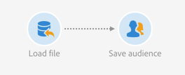

# 대상자 읽기{#read-audience}

## 설명 {#description}


이 **[!UICONTROL Read audience]** 활동을 통해 기존 대상을 검색하고 추가 필터링 조건을 적용하여 세분화할 수 있습니다.

## 사용 상황 {#context-of-use}

이 **[!UICONTROL Read audience]** 활동은 기존 대상을 선택하기만 하면 되는 경우에 사용하기 위해 고안된 보다 간단한 **[!UICONTROL Query]** 활동 버전입니다.

## 구성 {#configuration}

1. 워크플로우에 **[!UICONTROL Read audience]** 활동 삽입
1. 활동을 선택한 다음 나타나는 빠른 작업의  단추를 사용하여 엽니다.
1. 탭에서 검색할 대상을 **[!UICONTROL Properties]** 선택합니다.

   다음 유형의 대상을 검색할 수 있습니다. **[!UICONTROL List]**&#x200B;및 **[!UICONTROL Query]****[!UICONTROL File]** 를 **[!UICONTROL Experience Cloud]**&#x200B;참조하십시오. 대상 유형에 대한 자세한 내용은 대상 [설명서를](../../audiences/using/about-audiences.md) 참조하십시오.

   이 **[!UICONTROL Use a dynamic audience]** 옵션을 사용하면 워크플로우의 이벤트 변수를 기반으로 타게팅할 대상의 이름을 정의할 수 있습니다. 자세한 내용은 이벤트 변수를 사용하여 [활동 사용자 지정](../../automating/using/calling-a-workflow-with-external-parameters.md#customizing-activities-with-events-variables) 섹션을 참조하십시오.

   

1. 선택한 대상에 추가적인 필터링을 적용하려면 활동의 **[!UICONTROL Source filtering]** 탭을 통해 조건을 추가합니다.

   필터링 조건을 만드는 방법에 대한 자세한 내용은 쿼리 [만들기](../../automating/using/editing-queries.md#creating-queries) 설명서를 참조하십시오.

1. 활동 구성을 확인하고 워크플로우를 저장합니다.

## 예:데이터베이스와 파일 대상 조정 {#example--reconcile-a-file-audience-with-the-database}

이 예에서는 **[!UICONTROL Read audience]** 활동을 사용하여 파일 가져오기에서 직접 만든 대상을 조정하는 방법을 보여 줍니다.

파일 가져오기를 수행할 때 해당 컨텐츠를 대상에 직접 저장할 수 있습니다. 이 대상은 파일 대상이며 해당 데이터는 데이터베이스 리소스에 연결되어 있지 않습니다.

가져오기 작업 과정은 다음과 같이 설계되었습니다.



* 파일 [로드](../../automating/using/load-file.md) 활동은 외부 도구에서 추출한 프로필 데이터가 포함된 파일을 업로드합니다.

   예:

   ```
   lastname;firstname;birthdate;email;crmID
   Smith;Hayden;23/05/1989;hayden.smith@example.com;124365
   Mars;Daniel;17/11/1987;dannymars@example.com;123545
   Smith;Clara;08/02/1989;hayden.smith@example.com;124567
   Durance;Allison;15/12/1978;allison.durance@example.com;120987
   Lucassen;Jody;28/03/1988;jody.lucassen@example.com;127634
   Binder;Tom;19/01/1982;tombinder@example.com;128653
   Binder;Tommy;19/01/1915;tombinder@example.com;134576
   Connor;Jade;10/10/1979;connor.jade@example.com;132452
   Mack;Clarke;02/03/1985;clarke.mack@example.com;149876
   Ross;Timothy;04/07/1986;timross@example.com;157643
   ```

* 대상자 [저장](../../automating/using/save-audience.md) 활동은 들어오는 데이터를 대상으로 저장합니다. 데이터가 아직 조정되지 않았기 때문에 대상이 파일 대상이고 데이터가 아직 프로필 데이터로 인식되지 않습니다.

조정 워크플로우는 다음과 같이 설계되었습니다.


* 활동은 가져오기 워크플로우에서 만든 파일 대상을 업로드합니다. **[!UICONTROL Read audience]** 대상 데이터가 아직 Adobe Campaign 데이터베이스와 조정되지 않았습니다.
* 조정 [활동은](../../automating/using/reconciliation.md) 해당 **[!UICONTROL Identification]** 탭을 통해 들어오는 데이터를 프로필로 식별합니다. 예를 들어 **이메일** 필드를 조정 기준으로 사용합니다.
* 데이터 [업데이트](../../automating/using/update-data.md) 활동은 들어오는 데이터로 데이터베이스의 프로필 리소스를 삽입하고 업데이트합니다. 데이터가 이미 프로필로 식별되었으므로 **[!UICONTROL Directly using the targeting dimension]** 옵션을 선택하고 활동의 **[!UICONTROL Profiles]** **[!UICONTROL Identification]** 탭에서 선택할 수 있습니다. 그런 다음 각 탭에 업데이트해야 하는 필드 목록을 추가하면 됩니다.

## 예:세련된 두 고객을 위한 결합 {#example--union-on-two-refined-audiences}

이 예에서 정의된 워크플로우는 두 **[!UICONTROL Read audience]** 활동의 결합을 보여줍니다. 이 워크플로우의 목표는 18세에서 30세 사이의 골드 또는 실버 멤버에게 이메일을 보내는 것입니다.

Gold 및 Silver 멤버를 추적할 수 있도록 특정 대상이 이미 시스템에 생성되었습니다.

워크플로우는 다음과 같이 설계되었습니다.


* 18세에서 30세 사이의 프로필만 선택하여 Gold 멤버 고객을 검색하고 재평가하는 첫 번째 **[!UICONTROL Read audience]** 활동입니다.
* 실버 멤버 대상을 검색하고 18세에서 30세 사이의 프로필만 선택하여 재정의하는 두 번째 **[!UICONTROL Read audience]** 활동입니다.
* 두 활동 모두에서 인구를 하나의 최종 인구로 통합하는 **[!UICONTROL Union]** **[!UICONTROL Read audiences]** 활동.
* 활동에서 오는 모집단에게 이메일을 보내는 **[!UICONTROL Email delivery]** 활동입니다 **[!UICONTROL Union]** .

