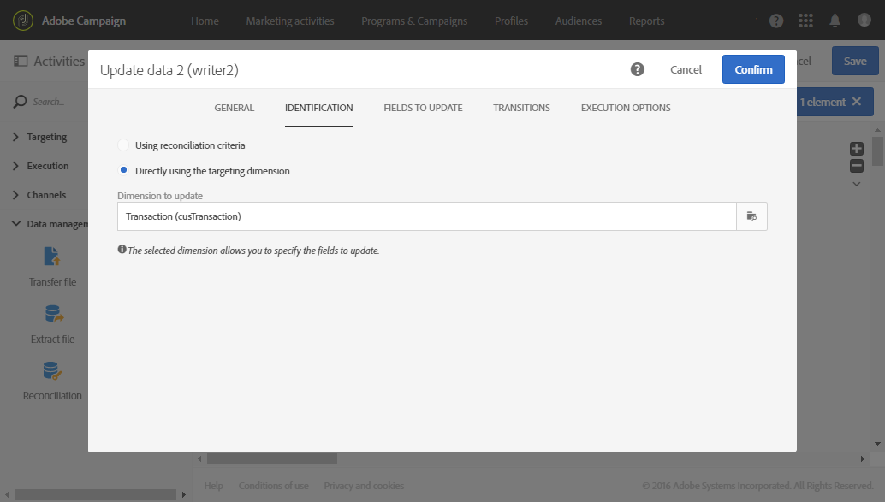

# 관계를 사용한 데이터 조정 {#reconciliation-relations}

다음 예제에서는 파일에 있는 구매 데이터를 사용하여 데이터베이스를 업데이트하는 워크플로우를 보여줍니다. 구매 데이터에는 고객 이메일 및 제품 코드 등 다른 차원의 요소를 참조하는 데이터가 포함됩니다.

>[!NOTE]
>
>이 예제에 사용된 **트랜잭션** 및 **제품** 리소스는 Adobe Campaign 데이터베이스에 기본으로 포함되어 있지 않습니다. 따라서 [사용자 정의 리소스](../../developing/using/data-model-concepts.md) 기능을 사용하여 미리 만들었습니다 . 가져온 파일의 이메일 주소에 해당하는 프로필과 제품을 미리 데이터베이스에 로드해 두었습니다.

워크플로우는 다음 활동으로 구성됩니다.


* 가져올 파일의 데이터를 로드하고 감지하는 [Load 파일](../../automating/using/load-file.md) 활동. 가져온 파일에는 다음 데이터가 포함됩니다.

   * 트랜잭션 날짜
   * 고객 이메일 주소
   * 구매한 제품 코드

   ```
   date;client;product
   2015-05-19 09:00:00;mail1@email.com;ZZ1
   2015-05-19 09:01:00;mail2@email.com;ZZ2
   2015-05-19 09:01:01;mail3@email.com;ZZ2
   2015-05-19 09:01:02;mail4@email.com;ZZ2
   2015-05-19 09:02:00;mail5@email.com;ZZ3
   2015-05-19 09:03:00;mail6@email.com;ZZ4
   2015-05-19 09:04:00;mail7@email.com;ZZ5
   2015-05-19 09:05:00;mail8@email.com;ZZ7
   2015-05-19 09:06:00;mail9@email.com;ZZ6
   ```

* 구매 데이터를 제품 및 데이터베이스 프로필에 바인딩하는 [조정 작업](../../automating/using/reconciliation.md). 따라서 파일 데이터와 프로필 표 및 제품 표 간의 관계를 정의해야 합니다. 해당 활동의 **[!UICONTROL Relations]** 탭에서 이 구성을 수행합니다. 

   * **프로필**&#x200B;과의 관계: 파일의 **고객** 열은 **프로필** 차원의 **이메일** 필드에 연결됩니다.
   * **제품**&#x200B;과의 관계: 파일의 **제품** 열은 **프로필** 차원의 **제품 코드** 필드에 연결됩니다.

   연결된 차원의 외래 키를 참조할 수 있도록 인바운드 데이터에 열이 추가됩니다.

   

* [데이터 업데이트](../../automating/using/update-data.md) 활동을 사용하면 가져온 데이터를 사용하여 업데이트할 데이터베이스 필드를 정의할 수 있습니다. 앞선 활동에서 데이터가 이미 **트랜잭션** 차원에 속하는 것으로 식별되었으므로, **[!UICONTROL Directly using the targeting dimension]** 식별 옵션을 사용할 수 있습니다.

   업데이트할 필드를 자동으로 감지하는 옵션을 사용하면, 앞의 활동에서 구성한 (프로필 및 제품에 대한) 연결이 **[!UICONTROL Fields to update]** 목록에 추가됩니다. 또한 트랜잭션 날짜에 해당하는 필드가 이 목록에 올바르게 추가되어 있는지 확인해야 합니다.

   

   
