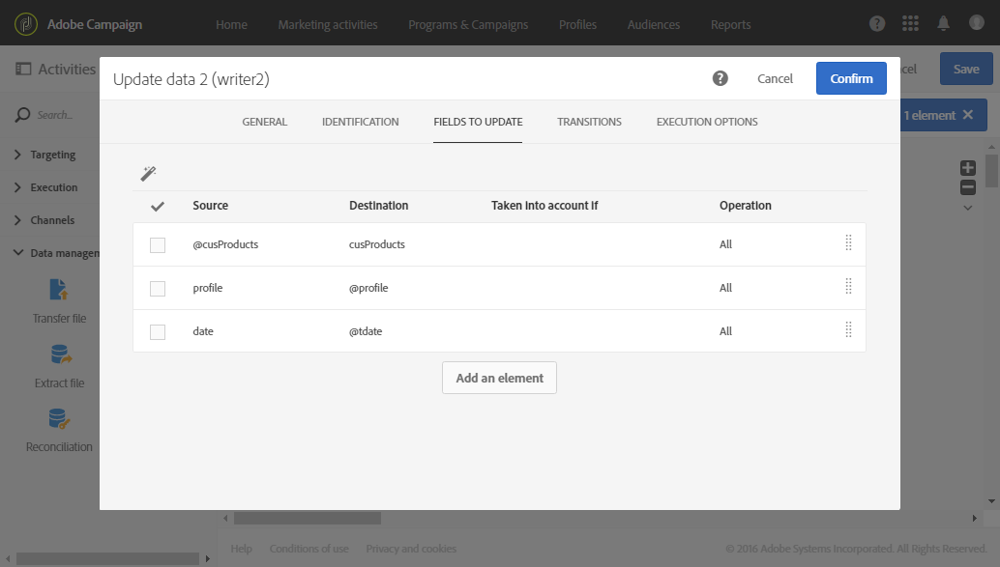

# 조정{#reconciliation}

## 설명 {#description}


이 **[!UICONTROL Reconciliation]** 활동을 통해 식별되지 않은 데이터를 기존 리소스에 연결할 수 있습니다.

## 사용 상황 {#context-of-use}

이 **[!UICONTROL Reconciliation]** 활동은 기본적으로 데이터 관리 용도로 사용되며 두 가지 다른 사용 사례를 의미합니다.

* 관계 추가:한 **[!UICONTROL Links]** 탭에서는 인바운드 데이터와 다른 여러 Adobe Campaign 데이터베이스 차원 사이에 링크를 추가할 수 있습니다.

   예를 들어 구입 데이터가 들어 있는 파일에는 구매자와 구매자를 식별하기 위한 정보도 들어 있을 수 있습니다. 따라서 두 개의 추가 차원(구매 **차원**&#x200B;제외)은 파일 데이터에 의해 고려됩니다.제품 **및** 프로필 **차원** . 그런 다음 이러한 차원과 구매 **차원** 사이에 관계를 만들어야 합니다(다음 예제 참조).

   관계를 정의할 때 연결된 차원의 외래 키를 참조하기 위해 인바운드 데이터에 열이 추가됩니다.

   >[!NOTE]
   >
   >이 작업은 연결된 차원의 데이터가 이미 데이터베이스에 있음을 의미합니다. 예를 들어, 구매한 제품을 언제 어떤 클라이언트 등으로 표시하는지 보여주는 구매 파일을 가져오는 경우 해당 제품뿐만 아니라 클라이언트가 이미 데이터베이스에 있어야 합니다.

* 데이터 식별:탭을 사용하면 인바운드 데이터를 Adobe Campaign 데이터베이스의 기존 차원 열에 간단히 연결할 수 있습니다. **[!UICONTROL Identification]** 활동 후에는 데이터가 정의된 차원에 속하는 것으로 식별됩니다.

   예를 들어 대상자 저장, 데이터베이스 업데이트 등을 수행할 수 있습니다.

예를 들어, 비표준 데이터를 데이터베이스로 가져오기 위해 로드 데이터 활동 후에 **[!UICONTROL Reconciliation]** 활동을 배치할 수 있습니다.

## 구성 {#configuration}

1. 타깃팅 차원이 Adobe Campaign에서 바로 오지 않는 모집단 전환이 포함된 전환 후에 **[!UICONTROL Reconciliation]** 활동을 워크플로우로 드래그하여 놓습니다. 자세한 내용은 [차원 및 리소스](../../automating/using/query.md#targeting-dimensions-and-resources)타깃팅을 참조하십시오.
1. 활동을 선택한 다음 나타나는 빠른 작업의  단추를 사용하여 엽니다.
1. 인바운드 데이터와 다른 데이터베이스 차원 간에 링크를 정의하려면 **[!UICONTROL Links]** 탭으로 이동합니다.

   필요한 만큼 관계를 추가합니다. 각 관계식에 대해 먼저 연결된 차원을 선택한 다음 링크 세부 정보에서 해당 필드를 지정합니다.

1. 인바운드 데이터를 간단히 식별하려면 **[!UICONTROL Identification]** 탭으로 이동하여 **[!UICONTROL Identify the document from the working data]** 상자를 선택합니다.

   인바운드 데이터를 대사할 타깃팅 차원을 선택합니다.

   조정 기준을 추가하여 인바운드 전환 레코드를 선택한 타깃팅 차원 레코드에 연결합니다. 여러 기준이 지정된 경우 모든 데이터 간의 링크가 작동하려면 모든 기준을 확인해야 합니다.

   다음 **[!UICONTROL Processing unidentified source lines]** 모드를 선택합니다.

   * **[!UICONTROL Ignore them]**:식별이 가능한 데이터만 활동의 아웃바운드 전환에 보관됩니다.
   * **[!UICONTROL Keep in the outbound population]**:인바운드 전환의 모든 데이터는 활동의 아웃바운드 전환에 보관됩니다.

1. 활동 구성을 확인하고 워크플로우를 저장합니다.

## 예 1:관계 정의 {#example-1--relation-definition}

다음 예는 파일의 구매 데이터를 사용하여 데이터베이스를 업데이트하는 워크플로우를 보여줍니다. 구매 데이터에는 클라이언트 이메일 및 제품 코드와 같은 다른 차원의 요소를 참조하는 데이터가 포함됩니다.

>[!NOTE]
>
>이 **예제에서****** 사용되는 트랜잭션 및 제품 리소스는 기본적으로 Adobe Campaign 데이터베이스에 없습니다. 따라서 사용자 지정 리소스 [기능을 사용하여 미리](../../developing/using/data-model-concepts.md) 만들어졌습니다. 가져온 파일의 이메일 주소와 제품에 해당하는 프로파일이 미리 데이터베이스로 로드되었습니다.

워크플로우는 다음 활동으로 구성됩니다.


* 가져올 파일의 데이터를 로드하여 검색하는 **[!UICONTROL Load file]** 활동. 가져온 파일에는 다음 데이터가 포함됩니다.

   * 거래 날짜
   * 클라이언트 이메일 주소
   * 구입한 제품 코드
   ```
   date;client;product
   2015-05-19 09:00:00;mail1@email.com;ZZ1
   2015-05-19 09:01:00;mail2@email.com;ZZ2
   2015-05-19 09:01:01;mail3@email.com;ZZ2
   2015-05-19 09:01:02;mail4@email.com;ZZ2
   2015-05-19 09:02:00;mail5@email.com;ZZ3
   2015-05-19 09:03:00;mail6@email.com;ZZ4
   2015-05-19 09:04:00;mail7@email.com;ZZ5
   2015-05-19 09:05:00;mail8@email.com;ZZ7
   2015-05-19 09:06:00;mail9@email.com;ZZ6
   ```

* 구매 데이터를 데이터베이스 프로필과 제품에 바인딩하는 **[!UICONTROL Reconciliation]** 활동입니다. 따라서 파일 데이터와 프로필 테이블 및 제품 테이블 간의 관계를 정의해야 합니다. 이 구성은 활동의 **[!UICONTROL Relations]** 탭에서 수행됩니다.

   * 프로파일과 관계 ****:파일의 **클라이언트** 열이 프로필 **차원의 이메일** 필드에 **연결되어** 있습니다.
   * 제품과 관련된 **관계**:파일의 **제품** 열이 프로필 **차원의** productCode **필드에** 연결되어있습니다.
   연결된 차원의 외래 키를 참조하기 위해 인바운드 데이터에 열이 추가됩니다.

   

* 활동을 **[!UICONTROL Update data]** 사용하면 가져온 데이터를 사용하여 업데이트할 데이터베이스 필드를 정의할 수 있습니다. 데이터가 이전 활동에서 트랜잭션 **차원에 속하는 것으로** 이미 확인되었으므로 여기에서 **[!UICONTROL Directly using the targeting dimension]** 식별 옵션을 사용할 수 있습니다.

   업데이트할 필드를 자동으로 감지하는 옵션을 사용하면 이전 활동(프로필 및 제품에 대해)에 구성된 링크가 **[!UICONTROL Fields to update]**&#x200B;목록 목록에 추가됩니다. 또한 거래 날짜에 해당하는 필드가 이 목록에 올바르게 추가되어 있는지 확인해야 합니다.

   

   

## 예 2:식별 {#example-2--identification}

다음 예에서는 새 클라이언트가 들어 있는 가져온 파일에서 직접 프로파일 대상을 생성하는 워크플로우를 보여 줍니다. 다음 활동으로 구성됩니다.


* 가져올 파일의 데이터를 로드하여 검색하는 **[!UICONTROL Load file]** 활동. 가져온 파일에는 다음 데이터가 포함됩니다.

   ```
   lastname;firstname;email;dateofbirth
   jackman;megan;megan.jackman@testmail.com;07/08/1975
   phillips;edward;phillips@testmail.com;09/03/1986
   weaver;justin;justin_w@testmail.com;11/15/1990
   martin;babeth;babeth_martin@testmail.net;11/25/1964
   reese;richard;rreese@testmail.com;02/08/1987
   cage;nathalie;cage.nathalie227@testmail.com;07/03/1989
   xiuxiu;andrea;andrea.xiuxiu@testmail.com;09/12/1992
   grimes;daryl;daryl_890@testmail.com;12/06/1979
   tycoon;tyreese;tyreese_t@testmail.net;10/08/1971
   ```

* 로드된 파일의 각 열을 프로필 차원 열에 연결하는 **[!UICONTROL Reconciliation]** 활동. 식별할 수 없는 파일 레코드(데이터 누락, 호환되지 않는 데이터 유형 등) 는 최종 대상 데이터의 무결성을 유지하기 위해 무시됩니다.

   

* 프로필 대상자를 저장하는 **[!UICONTROL Save audience]** 활동입니다.

   

