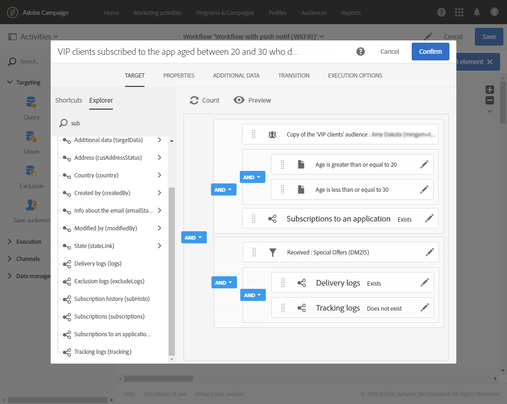

# 워크플로우로 반복 푸시 알림 전송 {#sending-a-recurring-push-notification-with-a-workflow}

이 예에서, 개인화된 푸시 알림은 시간대에 따라 매달 1일 오후 8시에 모바일 애플리케이션 가입자에게 전송됩니다.

워크플로우를 빌드하려면 다음 단계를 따르십시오.

1. 스케줄러  활동을 사용하면 배달을 시작하기 전에 워크플로우 날짜를 시작하여 지정된 시간대의 오후 8시에 모든 가입자에게 알림을 전송할 수 있습니다.

   * In the **[!UICONTROL Execution frequency]** field, select Monthly.
   * 필드에서 오후 8시를 **[!UICONTROL Time]** 선택합니다.
   * 매달 배달되는 날짜를 선택합니다.
   * 배달을 시작하기 하루 전에 워크플로우의 시작 날짜를 선택합니다. 그렇지 않으면 선택한 시간이 해당 시간대에서 이미 경과한 경우 일부 받는 사람이 하루 뒤에 메시지를 받을 수 있습니다.
   * 탭에서 **[!UICONTROL Execution options]** 워크플로우가 시작되는 시간대를 **[!UICONTROL Time zone]** 필드에서 선택합니다. 예를 들어, 워크플로우는 해당 월의 첫째 날 1주 전인 오후 8시에 시작되어 적용 가능한 모든 시간대에 대해 게재가 생성될 시간을 허용합니다.

   >[!NOTE]
   >
   >기본적으로 선택된 시간대는 워크플로우 속성에 정의된 시간대입니다([워크플로우 구축](../../automating/using/building-a-workflow.md) 참조).

   

1. 쿼리  활동을 통해 20-30세 이하의 VIP 고객을 대상으로 모바일 애플리케이션을 구독했고 보낸 이메일을 열지 않은 고객을 타깃팅할 수 있습니다.

   * 대상자(VIP 고객)를 선택하고 해당 나이에 대해 필터링합니다.
   * 애플리케이션 **요소로 가입을 작업** 영역으로 드래그하여 놓습니다. 존재함 **을** 선택하고 사용할 모바일 응용 프로그램을 선택합니다.
   * 고객에게 보낸 이메일을 선택합니다.
   * 배달 **로그(로그)** 요소를 작업 공간으로 드래그 앤 드롭한 다음 **존재함을 선택하여** 이메일을 받은 모든 고객을 타깃팅합니다.
   * 추적 **로그(추적)** 요소를 작업 공간으로 드래그하여 놓고 이메일을 **열지** 않은 모든 고객을 타깃팅하려면 존재하지 않음을 선택합니다.

      

1. 푸시 [알림 배달](../../automating/using/push-notification-delivery.md) 활동을 통해 메시지 내용을 입력하고 사용할 개인화 필드를 선택할 수 있습니다.

   * 옵션을 **[!UICONTROL Recurring notification]** 선택합니다.
   * 푸시 알림 컨텐츠를 정의합니다. For more information on push notification content, refer to this [section](../../channels/using/preparing-and-sending-a-push-notification.md).
   * In the **[!UICONTROL Schedule]** block, select **[!UICONTROL Messages to be sent automatically on the time zone specified below]**. 여기에서는 워크플로우에서와 같이 **[!UICONTROL Time zone of the contact date]** 태평양을 선택했습니다 **[!UICONTROL Scheduler]**.
   * **[!UICONTROL Optimize the sending time per recipient]** 필드에서 **[!UICONTROL Send at the recipient's time zone]**&#x200B;을(를) 선택합니다.

      

1. 단추를 **[!UICONTROL Start]** 클릭하여 반복되는 워크플로우를 시작합니다.

   

이제 워크플로우가 실행 중입니다. 태평양 표준시 오후 8 **[!UICONTROL Scheduler]** 시에 선택한 시작 날짜에 시작하여 고객 시간대에 따라 해당 월의 첫 날 오후 8시에 반복 푸시가 전송됩니다.
