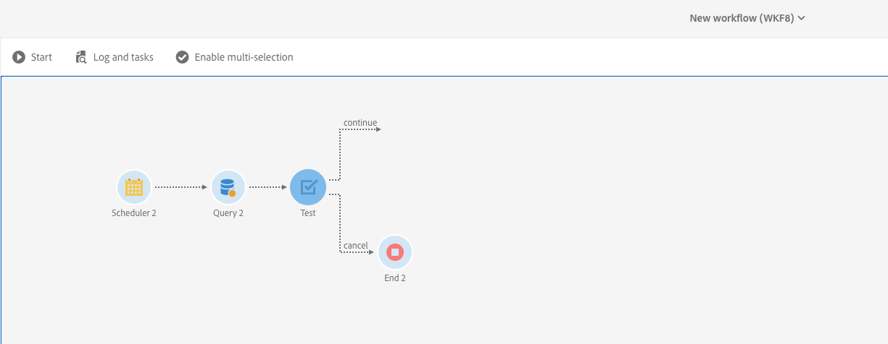

# 예약된 워크플로의 중복 실행{#preventing-overlapping-execution-of-scheduled-workflows}

## 예약된 워크플로우 실행 정보

Campaign Standard에서 워크플로우 엔진은 워크플로우 인스턴스가 하나의 프로세스로만 실행되도록 보장합니다. 가져오기, 긴 실행 쿼리 또는 데이터베이스에 쓰는 작업과 같은 활동을 차단하면 실행 시 다른 작업을 실행할 수 없습니다.

반면, 비차단 활동은 다른 작업의 실행을 차단하지 않습니다(일반적으로 **[!UICONTROL Scheduler]** 활동과 같은 이벤트를 기다리는 활동).

이로 인해 일정 기반 워크플로우가 동일한 워크플로우의 이전 실행이 아직 완료되지 않은 경우에도 실행을 시작할 수 있어 예상치 못한 데이터 문제가 발생할 수 있습니다.

따라서 여러 활동이 포함된 예약된 워크플로우를 디자인할 때 작업이 완료될 때까지 워크플로우의 일정을 조정하지 않아야 합니다. 이렇게 하려면 이전에 수행한 하나 이상의 작업이 아직 보류 중일 때 해당 작업을 실행하지 않도록 워크플로우를 구성해야 합니다.

## 워크플로우 구성

이전 워크플로우 실행에서 하나 이상의 작업이 아직 보류 중인지 확인하려면 **[!UICONTROL Query]** 및 **[!UICONTROL Test]** 활동을 사용해야 합니다.

1. **[!UICONTROL Scheduler]** 활동 뒤에 **[!UICONTROL Query]** 활동을 추가한 다음 다음과 같이 구성합니다.

1. 활동의 리소스를 **[!UICONTROL WorkflowTaskDetail]**&#x200B;으로 변경합니다. 이는 워크플로우의 현재 작업을 타깃팅함을 의미합니다.

   

1. 아래 규칙으로 쿼리를 구성하십시오.

   

   * 첫 번째 규칙은 현재 작업(쿼리2)과 현재 워크플로우에 속하는 다음 예약 작업(schedule2)을 필터링합니다.

      >[!NOTE]
      >
      >**[!UICONTROL Scheduler]** 활동이 시작되면 즉시 다른 예약 작업이 추가되어 다음 예약 시간에 실행되고 워크플로우가 시작됩니다. 따라서 이전 실행에서 보류 중인 작업을 찾을 때는 쿼리 및 예약 작업을 모두 필터링하는 것이 중요합니다.

   * 두 번째 규칙은 0개의 실행 상태에 해당하는 워크플로우의 이전 실행의 작업이 여전히 활성(보류 중) 상태인지 여부를 결정합니다.

1. **[!UICONTROL Query]** 활동에서 반환되는 보류 중인 작업의 수를 확인하려면 **[!UICONTROL Test]** 활동을 추가합니다. 이렇게 하려면 2개의 아웃바운드 전환을 구성합니다.

   

   * 보류 중인 작업이 없는 경우 첫 번째 전환은 워크플로우 실행을 계속합니다.
   * 두 번째 전환은 보류 중인 작업이 있는 경우 워크플로우 실행을 취소합니다.

   

이제 필요에 따라 워크플로우의 나머지 부분을 구성할 수 있습니다. 보류 중인 작업으로 인해 워크플로우 실행이 취소되는 경우 작업 과정이 일정에 따라 다시 실행될 때 이 단계를 진행할 수 있습니다. 그러면 이전 실행에서 활성(보류 중) 작업이 없는 경우에만 워크플로우 실행이 계속됩니다.
