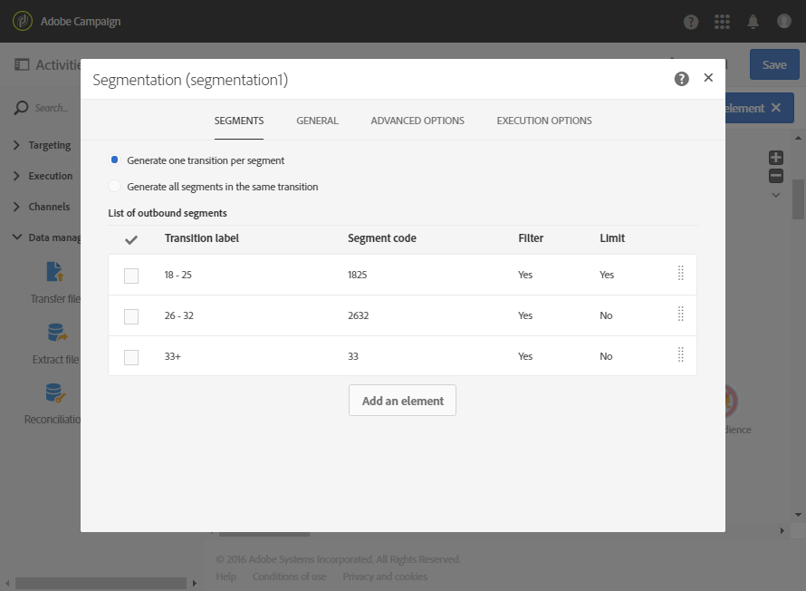

# 연령 그룹에 따른 세분화 {#segmentation-age-groups}

다음 예에서는 해당 연령 그룹에 따라 데이터베이스 프로필의 세그먼테이션을 보여줍니다.

워크플로우의 목표는 각 연령 그룹에 대해 특정 이메일을 보내는 것입니다. 이 워크플로가 테스트 캠페인의 일부라는 사실을 고려할 때, 제한적이고 동시에 대표적인 대상을 사용하기 위해 각 세그먼트는 임의로 선택된 최대 100개의 프로필만 포함할 수 있습니다.

워크플로우는 다음 요소로 구성됩니다.

* 워크플로우의 실행 날짜를 지정하는 [스케줄러 활동](../../automating/using/segmentation.md) .
* 생일 및 이메일 주소를 입력한 사람의 프로필을 타게팅하는 [쿼리](../../automating/using/query.md) 활동.
* 세 개의 세그먼트를 다른 아웃바운드 [전환](../../automating/using/segmentation.md) 으로 나누는 세그멘테이션 활동: 18-25세, 26-32세, 그리고 32세 이상 된 프로파일. 세그먼트는 다음 매개 변수에 따라 정의됩니다.

   

   * 세그먼트의 연령 그룹을 정의하는 페이지의 필터

      

   * 100 **[!UICONTROL Random sampling]** 으로 연결된 **[!UICONTROL Maximum size]** 형식 제한

      

* 세그먼트별 [이메일 배달](../../automating/using/email-delivery.md) 활동.
