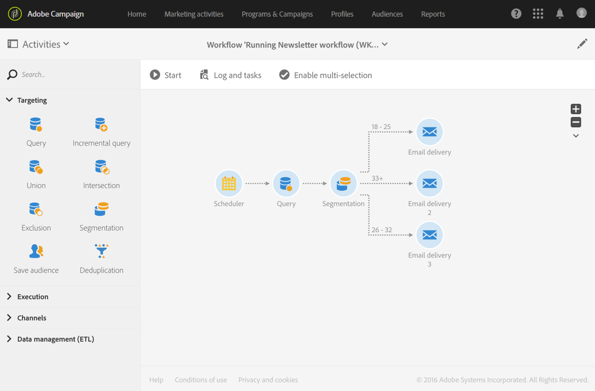

# Segmentation{#segmentation}

## Description {#description}

**[!UICONTROL Segmentation]** 활동을 사용하면 워크플로우 이전에 제출한 활동에 의해 계산된 모집단으로부터 하나 또는 여러 세그먼트를 만들 수 있습니다. 활동이 종료되면 하나의 전환 또는 다른 전환을 통해 처리할 수 있습니다.

>[!NOTE]
>
>기본적으로, 인바운드 모집단의 구성원은 하나의 단일 세그먼트에만 속할 수 있습니다. 활동은 활동에서 세그먼트 순서에 따라 적용됩니다.

## Context of use {#context-of-use}

**[!UICONTROL Segmentation]** 활동은 일반적으로 타깃팅 활동 (쿼리, 교차, 조합, 제외 등) 을 를 사용하여 세그먼트를 형성할 표준 모집단을 정의합니다.

## Configuration {#configuration}

1. **[!UICONTROL Segmentation]** 워크플로우를 워크플로우로 드래그하여 놓습니다.
1. Select the activity, then open it using the  button from the quick actions that appear.
1. Select the **[!UICONTROL Resource type]** on which the segmentation has to be carried out:

   * **[!UICONTROL Database resource]** 세그먼테이션이 데이터베이스에 이미 존재하는 데이터에 대해 수행됩니다. Select the **[!UICONTROL Filtering dimension]** depending on the data that you want to segment. By default, segmentation is carried out on the **profiles**.
   * **[!UICONTROL Temporary resource]** 워크플로우의 임시 데이터에 대해 세그멘테이션이 수행되는 경우: 세그먼트에 대한 **[!UICONTROL Targeted set]** 데이터 포함을 선택합니다. 이 사용 사례는 파일을 가져온 후 또는 데이터베이스의 데이터가 풍부한 경우 발생할 수 있습니다.

1. 사용할 아웃바운드 전환 유형을 선택합니다.

   * **[!UICONTROL Generate one transition per segment]**: 활동 끝에 구성된 각 세그먼트에 대해 아웃바운드 전환이 하나씩 추가됩니다.
   * **[!UICONTROL Generate all segments in one transition]**: 구성된 모든 세그먼트가 단일 아웃바운드 전환 하나로 다시 그룹화됩니다. 전환 레이블을 지정합니다. 각 세그먼트 구성원은 지정된 세그먼트 코드를 유지합니다.

1.  OR **[!UICONTROL Add an element]** 단추를 사용하여 세그먼트를 추가하고 표준 속성을 지정합니다.

   * **[!UICONTROL Do not activate the transition if the population is empty]**: 세그먼트는 데이터가 검색되는 경우에만 활성화됩니다.
   * **[!UICONTROL Filter initial population (query)]**: 이 세그먼트의 모집단을 필터링할 수 있습니다.
   * **[!UICONTROL Limit segment population]**: 세그먼트 크기를 제한할 수 있습니다.
   * **[!UICONTROL Filter and limit segment population]**: 세그먼트 모집단을 필터링하고 크기를 제한할 수 있습니다.
   * **[!UICONTROL Label]**: 세그먼트 레이블.
   * **[!UICONTROL Segment code]**: 코드 세그먼트에 지정된 코드입니다. 표준 표현식 및 이벤트 변수를 사용하여 세그먼트 코드를 개인화할 수 있습니다 (이벤트 변수를 사용한 활동 [사용자 지정 참조](../../automating/using/calling-a-workflow-with-external-parameters.md#customizing-activities-with-events-variables)).
   * **[!UICONTROL Exclude segment from population]**: 활동의 아웃바운드 모집단에서 지정된 세그먼트를 제외할 수 있습니다. This option can only be used if the **[!UICONTROL Generate all segments in the same transition]** option is selected.
   

1. 세그먼트의 세부 사항 보기를 열어 후자의 구성 옵션에 액세스합니다. To do this, check the relevant box in the activity's segment list, then select .
1. If the option to filter the initial population is checked, open the **[!UICONTROL Filter]** tab and specify your segment's population. 필터는 4 단계에서 선택한 필터링 차원을 기반으로 합니다. Consult the [Query editing](../../automating/using/editing-queries.md) section for further information on population filtering.

   임시 리소스에서 세그멘테이션이 수행되는 경우 이 탭에서 모집단의 수와 미리 보기를 사용할 수 없습니다.

1. If the option to limit the segment size is checked, open the **[!UICONTROL Limitation]** tab.

   **[!UICONTROL Type of limit]** 먼저 사용할 항목을 선택합니다.

   * **[!UICONTROL Random sampling]**: 필요한 경우 세그먼트 구성을 임의로 고려하여 **[!UICONTROL Filter]** 세그먼트 구성을 고려합니다.
   * **[!UICONTROL Ordered sampling]**: 세그먼트 모집단은 순서가 지정된 방식으로 선택됩니다. 따라서 고려해야 할 열과 적용할 정렬 유형을 지정해야 합니다. For example, if you select the **Age** field as the sort column while applying a **[!UICONTROL Descending sort]** and setting a limit of 100, only the profiles of the top 100 oldest people will be kept.
   Now specify the size **[!UICONTROL Limit]** of the segment:

   * **[!UICONTROL Size (as a % of the initial population)]**: 활동 초기 인구의 백분율을 사용하여 세그먼트 크기를 지정합니다.
   * **[!UICONTROL Maximum size]**: 세그먼트 모집단에 대한 최대 구성원 수를 지정합니다.
   * **[!UICONTROL By data grouping]**: 인바운드 인구의 특정 필드 값에 따라 세그먼트 모집단을 제한할 수 있습니다. 그룹화할 필드를 선택한 다음 사용할 값을 지정합니다.
   * **[!UICONTROL By data grouping (as a %)]**: 백분율을 사용하여 특정 인바운드 모집단 필드의 값에 따라 세그먼트 모집단을 제한할 수 있습니다. 필드를 선택하여 그룹을 적용한 다음 사용할 값을 지정합니다.

      >[!NOTE]
      >
      >각 값에 대한 다양한 제한 사항을 사용할 수 있습니다. For example, you can specify a grouping for the **[!UICONTROL Gender]** field and limit the population with **[!UICONTROL Male]** members to 10 and the population with **[!UICONTROL Female]** members to 30 people. 여러 데이터 그룹화 필드를 사용하는 경우 모든 그룹의 크기가 같아야 합니다.
   

1. 세그먼트의 구성을 확인합니다.
1. 이 절차의 6 ~ 10 단계를 반복하여 필요한 만큼 세그먼트를 추가합니다.
1. If necessary, edit the parameters in the **[!UICONTROL Advanced options]** tab:

   * Check the **[!UICONTROL Enable overlapping of outbound populations]** option if you want a member of the inbound population to belong to several segments at the same time. 활동의 아웃바운드 인구는 인바운드 모집단을 초과할 수 있습니다.
   * Check the **[!UICONTROL Concatenate the code of each segment]** option if the inbound population has already been assigned a segment code that you want to keep. 활동에 지정된 세그먼트 코드가 초기 세그먼트 코드에 추가됩니다.
   * Check the **[!UICONTROL Generate complement]** option if you would like to exploit the remaining population.

1. 활동의 구성을 확인하고 워크플로우를 저장합니다.

## Example {#example}

다음 예는 연령 그룹에 따른 데이터베이스 프로파일의 세그멘테이션을 보여줍니다. 워크플로우의 목표는 각 연령 그룹에 특정 이메일을 보내는 것입니다. 이 워크플로우가 테스트 캠페인의 일부임을 고려할 때, 각 세그먼트는 동시에 제한된 대상을 사용하기 위해 무작위로 선택되는 최대 100 개의 프로필만 포함할 수 있습니다.

워크플로우는 다음 요소로 구성됩니다.

* A **[!UICONTROL Scheduler]** activity to specify the workflow's execution date. [스케줄러](../../automating/using/scheduler.md) 섹션을 참조하십시오.
* A **[!UICONTROL Query]** activity to target profiles of people whose birthday and email address have been entered. [쿼리](../../automating/using/query.md) 섹션을 참조하십시오.
* A **[!UICONTROL Segmentation]** activity to create 3 segments divided into different outbound transitions: 18-25-year old, 26-32-year old and profiles that are over 32 years old. 세그먼트는 다음 매개 변수에 따라 정의됩니다.

   

   * 세그먼트 연령 그룹을 정의하기 위한 연령 필터

      

   * A **[!UICONTROL Random sampling]** type limit that is linked to a **[!UICONTROL Maximum size]** limit of 100

      

* An **[!UICONTROL Email delivery]** activity per segment. Refer to the [Email delivery](../../automating/using/email-delivery.md) section.

