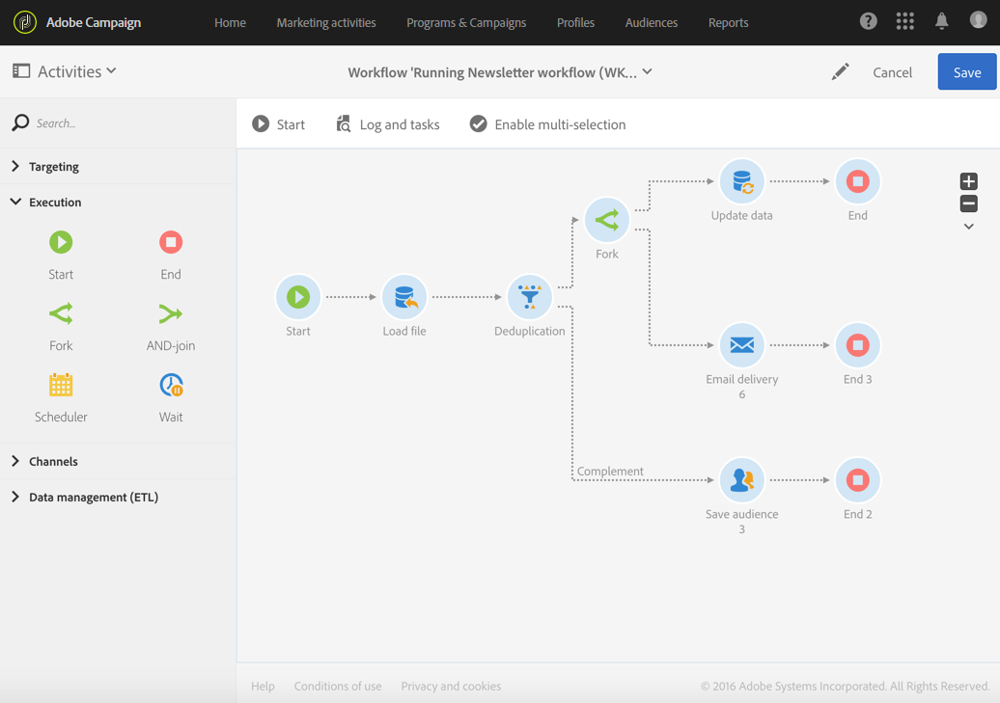

# 시작 및 종료{#start-and-end}

## 설명 {#description}

**[!UICONTROL Start]** 및 **[!UICONTROL End]** 활동을 사용하면 워크플로우의 시작과 끝을 명확하게 표시할 수 있습니다.

## 사용의 컨텍스트 {#context-of-use}

워크플로우 실행은 인바운드 전환 없이 활동으로 시작하며, 진행 중인 작업이 더 이상 없을 때 중지됩니다. 하지만 **[!UICONTROL Start]** 및 **[!UICONTROL End]** 활동을 추가하여 워크플로우의 시작과 끝 지점을 명확하게 표시할 수 있습니다. 이는 상대적으로 복잡한 워크플로우에 특히 유용합니다.

모범 사례로는 워크플로우의 마지막 전환을 그대로 두지 않고 워크플로우가 제대로 종료될 수 있도록 **[!UICONTROL End]** 활동을 사용하는 경우가 있습니다.

## 구성 {#configuration}

1. **[!UICONTROL Start]** 또는 **[!UICONTROL End]** 활동을 워크플로우로 끌어서 놓습니다.
1. **[!UICONTROL Start]** 활동을 쿼리 등 다른 활동 앞에 놓고, 일련의 활동 뒤에 **[!UICONTROL End]** 활동을 놓습니다.
1. 활동을 선택한 다음 나타나는 빠른 작업에서  버튼을 사용하여 활동을 엽니다.
1. **끝** 개체를 구성하면 완료되지 않은 작업을 포함하여 워크플로우의 진행 중인 모든 작업을 중단시킬 수 있습니다. 이렇게 하려면 해당 옵션을 선택합니다.
1. 활동 구성을 확인하고 워크플로우를 저장합니다.

## 다른 워크플로우 트리거 {#triggering-another-workflow}

**[!UICONTROL End]** 활동의 **[!UICONTROL External signal]** 탭을 사용하여 다른 워크플로우를 트리거할 수 있습니다. [외부 신호](../../automating/using/external-signal.md) 섹션을 참조하십시오.

## 예제 {#example}

다음 예제에서는 복잡한 워크플로우를 **[!UICONTROL Start]** 활동 하나와 **[!UICONTROL End]** 활동 여러 개로 실행하는 방법을 보여줍니다. 첫 번째 **[!UICONTROL End]** 활동에 대해 **[!UICONTROL Stop all tasks in progress]** 상자를 선택했습니다. 해당 작업이 완료되면 전체 워크플로우가 중지됩니다. 이는  버튼을 선택한 것과 동일한 효과를 냅니다([작업 표시줄](../../automating/using/workflow-interface.md#action-bar) 섹션 참조).

