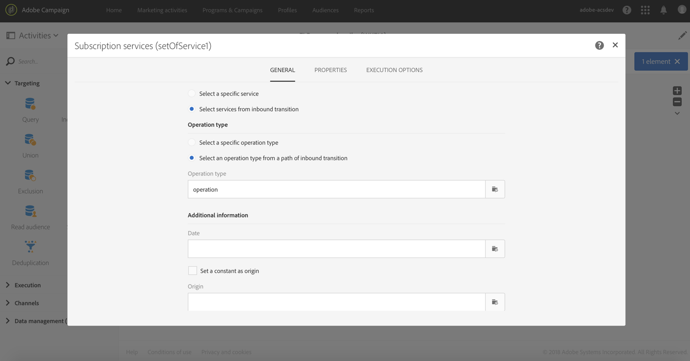

# 구독 서비스{#subscription-services}

## 설명 {#description}


이 **[!UICONTROL Subscription Services]** 활동을 통해 프로파일을 대량으로 가져와 서비스에 가입하거나 서비스에서 가입을 해지할 수 있습니다.

>[!CAUTION]
>
>워크플로우의 컨텍스트에서 구독을 관리하는 경우 구독되거나 구독되지 않은 프로필은 서비스 속성에 정의된 다른 확인 이메일을 받지 못합니다.

## 사용 상황 {#context-of-use}

이 **[!UICONTROL Subscription Services]** 활동은 하나의 동작으로 여러 프로필을 구독하거나 서비스에서 구독하지 않도록 하는 유일한 Adobe Campaign 기능입니다.

타깃팅을 수행하거나 식별된 데이터가 있는 파일을 가져온 후에 이 활동을 사용할 수 있습니다.

전용 열을 통해 파일에 지정된 경우 이 활동을 통해 작업(구독 또는 구독 취소)과 작업을 수행할 서비스를 선택할 수도 있습니다.

## 구성 {#configuration}

1. 워크플로우를 워크플로우로 드래그하여 **[!UICONTROL Subscription Services]** 놓을 수 있습니다.
1. 가져오기 후 쿼리 또는 조정과 같은 다른 타게팅 활동 다음에 연결합니다.
1. 활동을 선택한 다음 나타나는 빠른 작업의  단추를 사용하여 엽니다.
1. 다음 옵션 중 하나를 사용하여 구독을 관리할 **[!UICONTROL Service]** 항목을 선택합니다.

   * **[!UICONTROL Select a specific service]**:서비스를 수동으로 선택합니다.
   * **[!UICONTROL Select services from the inbound transition]**:서비스가 인바운드 전환에서 지정되었습니다. 예를 들어 각 행에 대해 관리할 서비스를 지정하는 파일을 가져올 수 있습니다. 이 옵션을 선택하는 경우, **이 예와** 같이 데이터와 서비스 리소스 간에 미리 링크가 [](#example--updating-multiple-subscription-statuses-from-a-file)만들어졌는지 확인하십시오.

      작업을 수행할 서비스가 각 레코드에 대해 동적으로 선택됩니다.

1. 다음 옵션 중 하나를 사용하여 **[!UICONTROL Operation type]** 실행할 옵션을 선택합니다.

   * **[!UICONTROL Select a specific operation type]**:프로파일을 **[!UICONTROL Subscribe]** 선택하거나 **[!UICONTROL Unsubscribe]** 수동으로 선택합니다.
   * **[!UICONTROL Select an operation type from a path of inbound transition]**:각 레코드에 대해 수행할 작업을 지정하는 인바운드 데이터의 열을 선택합니다.

      이 열에서 연산을 부울 또는 정수로 지정해야 합니다. 0 **을** 사용하여 기록 구독 취소 및 **1** 구독 신청

      가져온 파일에 포함된 값이 위의 요구 사항과 일치하지 않는 경우에도 [활동에서 사용할 수 있는 값](../../automating/using/load-file.md#column-format) **[!UICONTROL Load file]** 다시 매핑 옵션을 사용할 수 있습니다.

1. 인바운드 데이터에 서비스에 대한 프로필의 가입 날짜에 해당하는 열이 포함된 경우 해당 열을 선택합니다. 비워 둘 수 있지만 워크플로우를 실행할 때 구독 날짜가 설정되지 않습니다.
1. 구독의 출처를 정의합니다. 옵션을 선택하여 인바운드 데이터의 필드 중 하나 또는 원하는 상수 값으로 설정할 수 **[!UICONTROL Set a constant as origin]** 있습니다. 워크플로우를 실행할 때 원본을 설정하지 않고 비워 둘 수 있습니다.
1. 필요한 경우 아웃바운드 전환을 생성할 수 있습니다. 이 전환에는 인바운드 활동의 데이터와 정확히 동일한 데이터가 포함됩니다.
1. 활동 구성을 확인하고 워크플로우를 저장합니다.

   이제 실행할 준비가 되었습니다. 실행된 후에는 서비스의 세부 사항에서 서비스에 가입하거나 가입을 해지한 프로파일을 볼 수 있습니다.

## 예:파일을 가져온 후 특정 서비스에 프로필 가입 {#example--subscribing-profiles-to-a-specific-service-after-importing-a-file}

이 예에서는 프로파일이 포함된 파일을 가져와 기존 서비스에 가입하는 방법을 보여 줍니다. 파일을 가져온 후 가져온 데이터를 프로필로 식별할 수 있도록 조정을 수행해야 합니다. 파일에 중복 항목이 포함되어 있지 않도록 데이터 중복 제거 작업이 실행됩니다.

워크플로우는 다음과 같이 표시됩니다.


* 활동은 프로필 파일을 로드하고 가져온 열의 구조를 정의합니다. **[!UICONTROL Load file]**

   이 예제에서 로드된 파일은 .csv 형식으로 되어 있으며 다음 데이터를 포함합니다.

   ```
   lastname;firstname;email;birthdate;subdate
   jackman;megan;megan.jackman@testmail.com;07/08/1975;10/08/2017
   phillips;edward;phillips@testmail.com;09/03/1986;10/08/2017
   weaver;justin;justin_w@testmail.com;11/15/1990;10/08/2017
   martin;babeth;babeth_martin@testmail.net;11/25/1964;10/08/2017
   reese;richard;rreese@testmail.com;02/08/1987;11/08/2017
   cage;nathalie;cage.nathalie227@testmail.com;07/03/1989;11/08/2017
   xiuxiu;andrea;andrea.xiuxiu@testmail.com;09/12/1992;11/08/2017
   grimes;daryl;daryl_890@testmail.com;12/06/1979;12/08/2017
   tycoon;tyreese;tyreese_t@testmail.net;10/08/1971;12/08/2017
   ```

   

* 활동은 파일의 데이터를 Adobe Campaign 데이터베이스의 프로필 차원에 속하는 것으로 식별합니다. **[!UICONTROL Reconciliation]** 탭만 **[!UICONTROL Identification]** 구성됩니다. 프로필의 이메일 주소에 따라 파일 데이터를 식별합니다.

   

* 임시 리소스의 **[!UICONTROL Deduplication]** 이메일 **** 필드(조정 결과)를 기반으로 하면 중복 항목이 식별됩니다. 파일에서 가져온 데이터에 중복 항목이 포함되어 있으면 모든 데이터에 대한 서비스 구독이 실패합니다.

   

* 활동을 **[!UICONTROL Subscription Services]** 사용하면 프로파일을 가입해야 하는 서비스, 가입 날짜에 해당하는 필드 및 가입의 출처를 선택할 수 있습니다.

   

## 예:파일에서 여러 구독 상태 업데이트 {#example--updating-multiple-subscription-statuses-from-a-file}

이 예에서는 프로파일이 포함된 파일을 가져오고 파일에 지정된 여러 서비스에 대한 가입을 업데이트하는 방법을 보여 줍니다. 파일을 가져온 후 가져온 데이터를 서비스 링크가 있는 프로필로 식별할 수 있도록 조정을 수행해야 합니다. 파일에 중복 항목이 포함되어 있지 않도록 데이터 중복 제거 작업이 실행됩니다.

워크플로우는 다음과 같이 표시됩니다.


* 활동은 프로필 파일을 로드하고 가져온 열의 구조를 정의합니다. **[!UICONTROL Load file]**

   이 예제에서 로드된 파일은 .csv 형식으로 되어 있으며 다음 데이터를 포함합니다.

   ```
   lastname;firstname;email;birthdate;service;operation
   jackman;megan;megan.jackman@testmail.com;07/08/1975;SVC2;sub
   phillips;edward;phillips@testmail.com;09/03/1986;SVC3;unsub
   weaver;justin;justin_w@testmail.com;11/15/1990;SVC3;sub
   martin;babeth;babeth_martin@testmail.net;11/25/1964;SVC3;unsub
   reese;richard;rreese@testmail.com;02/08/1987;SVC3;sub
   cage;nathalie;cage.nathalie227@testmail.com;07/03/1989;SVC3;sub
   xiuxiu;andrea;andrea.xiuxiu@testmail.com;09/12/1992;SVC4;sub
   grimes;daryl;daryl_890@testmail.com;12/06/1979;SVC3;unsub
   tycoon;tyreese;tyreese_t@testmail.net;10/08/1971;SVC2;sub
   ```

   

   아마 아시겠지만, 이 작업은 파일에 &quot;하위&quot; 또는 &quot;미확인자&quot;로 지정되어 있습니다. 시스템에서 수행할 작업을 **인식하려면 부울** 또는 **정수** 값이 필요합니다.&quot;0&quot;을 클릭하여 구독을 취소하고 &quot;1&quot;을 구독하십시오. 이 요구 사항과 일치하도록 값의 다시 매핑이 &quot;작업&quot; 열의 세부 사항에서 수행됩니다.

   

   파일이 이미 &quot;0&quot; 및 &quot;1&quot;을 사용하여 작업을 식별하는 경우 해당 값을 다시 매핑할 필요가 없습니다. 열이 **탭에서 부울** 또는 정수로 **처리되도록** 해야 **[!UICONTROL Column definition]** 합니다.

* 활동은 파일의 데이터를 Adobe Campaign 데이터베이스의 프로필 차원에 속하는 것으로 식별합니다. **[!UICONTROL Reconciliation]** 이 **[!UICONTROL Identification]** 탭을 통해 파일의 **이메일** 필드가 프로필 리소스의 **이메일** 필드와 일치합니다.

   

   이 **[!UICONTROL Relations]** 탭에서 파일의 **서비스** 필드를 인식할 수 있도록 서비스 리소스와 함께 링크가 만들어집니다. 이 예에서는 값이 서비스 리소스의 **이름** 필드와 일치합니다.

   

* 임시 리소스의 **[!UICONTROL Deduplication]** 이메일 **** 필드(조정 결과)를 기반으로 하면 중복 항목이 식별됩니다. 중복의 경우 모든 데이터에 대한 서비스 가입이 실패하므로 중복 항목을 제거하는 것이 중요합니다.

   

* A **[!UICONTROL Subscription Services]** 는 **[!UICONTROL Reconciliation]** 활동에 생성된 링크를 통해 전환에서 온 것으로 업데이트할 서비스를 식별합니다.

   이 **[!UICONTROL Operation type]** 파일은 파일의 **작업** 필드에서 가져온 것으로 식별됩니다. 여기에서 부울 또는 정수 필드만 선택할 수 있습니다. 수행할 작업을 포함하는 파일의 열이 목록에 나타나지 않는 경우 이 예제의 앞부분에서 설명한 대로 **[!UICONTROL Load file]** 활동에서 열 형식을 올바르게 설정했는지 확인하십시오.

   

