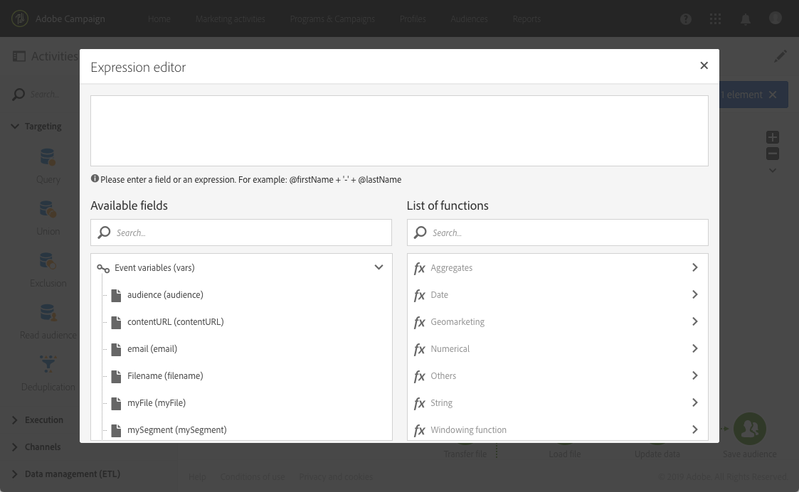

# 테스트{#test}

## 설명 {#description}

**[!UICONTROL Test]** 활동을 통해 테스트 결과를 기반으로 전환을 실행할 수 있습니다.

## 사용의 컨텍스트 {#context-of-use}

**테스트** 활동은 연결된 조건을 충족하는 첫 번째 전환을 활성화합니다.

충족된 조건이 없고 **기본 전환 사용** 옵션이 활성화된 경우, 기본 전환이 활성화됩니다.

조건은 **함수**&#x200B;또는 **변수**(예: 해당 워크플로우의 **[!UICONTROL External signal]** 활동으로 선언된 이벤트 변수)를 기반으로 만들 수 있습니다.

**관련 항목:**

* [함수 목록](../../automating/using/list-of-functions.md)
* [외부 파라미터로 워크플로우 호출](../../automating/using/calling-a-workflow-with-external-parameters.md)

## 구성 {#configuration}

1. **[!UICONTROL Test]** 활동을 워크플로우에 끌어다 놓습니다.
1. 활동을 선택한 다음 나타나는 빠른 작업에서  버튼을 사용하여 활동을 엽니다.
1. 각 조건의 속성을 정의합니다.

   **[!UICONTROL Condition]** 필드 편집 시 이벤트 변수를 호출하고 변수와 함수를 결합한 표현식을 편집하는 데 도움이 되는 버튼이 두 가지 있습니다.

   * :워크플로우에서 사용할 수 있는 모든 변수 중에서 events 변수를 선택합니다( [이 페이지 참조](../../automating/using/customizing-workflow-external-parameters.md)).

      예를 들어 **[!UICONTROL filesCount]** 변수를 사용하여 [파일 전송](../../automating/using/transfer-file.md) 활동 후 다운로드한 파일의 수를 확인할 수 있습니다.

      

   * : 변수와 함수를 결합한 표현식을 편집합니다. 표현식 편집기에 대한 자세한 정보는 [이 섹션](../../automating/using/advanced-expression-editing.md)을 참조하십시오.

      
