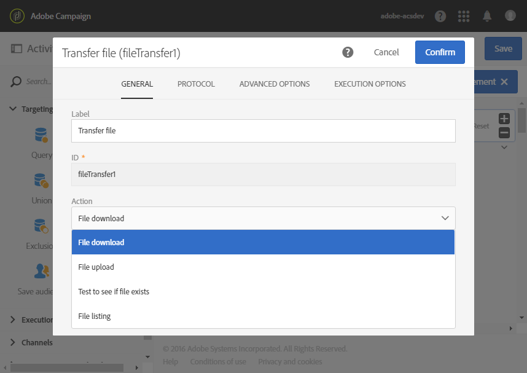

# 파일 전송{#transfer-file}

## 설명 {#description}

**[!UICONTROL Transfer file]** 활동을 사용하면 Adobe Campaign에서 파일을 받거나 보내고, 파일이 있는지 테스트하거나, 파일 목록을 만들 수 있습니다.

## 사용 컨텍스트 {#context-of-use}

활동을 구성할 때 데이터 추출 방법을 정의합니다. 예를 들어 로드할 파일이 연락처 목록이라고 해 보겠습니다.

이 활동을 사용하여 데이터를 복구한 뒤 **[!UICONTROL Load file]** 활동으로 구조화할 수 있습니다.

**관련 항목:**

* [사용 사례:자동 파일 다운로드를 기반으로 데이터 업데이트](../../automating/using/update-data-automatic-download.md)

## 구성 {#configuration}

1. **[!UICONTROL Transfer file]** 활동을 워크플로우에 드롭합니다.
1. 활동을 선택한 다음 나타나는 빠른 작업에서  버튼을 사용하여 활동을 엽니다.
1. **[!UICONTROL Action]** 필드의 드롭다운 목록을 사용하여 다음 활동 작업 중 하나를 선택합니다.

   

   * **파일 다운로드**: 파일을 다운로드할 수 있습니다.
   * **파일 업로드**: 파일을 업로드할 수 있습니다. Adobe Campaign 파일에서 파일을 업로드하면 **[!UICONTROL Export audits]** 메뉴에서 로그 항목이 생성됩니다. 감사 내보내기에 대한 자세한 내용은 [감사 내보내기](../../administration/using/auditing-export-logs.md) 섹션을 참조하십시오.
   * **파일이 있는지 테스트**: 파일이 있는지 확인할 수 있습니다.
   * **파일 목록**: **[!UICONTROL Protocol]** 탭에서 정의한 서버에 있는 파일의 목록을 만들 수 있습니다. 이 작업은 주로 디버깅을 위해 사용됩니다. 원격 서버에서 파일을 다운로드하기에 앞서 활동이 필요에 따라 구성되어 있는지 확인할 수 있습니다.

1. 사용할 프로토콜을 선택합니다.
   * [HTTP](#HTTP-configuration-wf)
   * [SFTP](#SFTP-configuration-wf)
   * [Amazon S3](#S3-configuration-wf)
   * [Microsoft Azure Blob 저장소](#azure-blob-configuration-wf)
   * [Adobe Campaign 서버에 있는 파일](#files-server-configuration-wf)

1. 선택한 프로토콜에 따라 활성화되는 **[!UICONTROL Additional options]** 섹션에서 프로토콜에 매개 변수를 추가할 수 있습니다. 다음을 수행할 수 있습니다.

   * **[!UICONTROL Delete the source files after transfer]**
   * **[!UICONTROL Disable passive mode]**
   * **[!UICONTROL List all files]**: 이 옵션은 **[!UICONTROL General]** 탭에서 **[!UICONTROL File listing]** 작업을 선택할 경우 사용할 수 있습니다. 이 옵션을 통해 서버에 있는 모든 파일을 **변수.파일명** 이벤트 변수로 색인화할 수 있습니다. 이때 파일 이름은 **&#39;n&#39;** 문자로 구분됩니다.

1. **[!UICONTROL Advanced options]** 탭의 **[!UICONTROL If no files are found]** 섹션에서 활동 시작 시 오류 또는 존재하지 않는 파일이 감지될 경우 실행할 작업을 구성할 수 있습니다.

   다시 시도를 정의할 수도 있습니다. 워크플로우 실행 로그에 여러 다시 시도 기록이 나타납니다.

   

1. 활동 구성을 확인하고 워크플로우를 저장합니다.

### HTTP를 사용한 구성 {#HTTP-configuration-wf}

HTTP 프로토콜을 통해 외부 계정 또는 URL에서 파일 다운로드를 시작할 수 있습니다.

이 프로토콜을 사용하면 **[!UICONTROL Use connection parameters defined in an external account]** 옵션을 선택할 수 있습니다. 이 경우 원하는 계정을 선택하고 다운로드할 파일의 경로를 지정합니다.

**[!UICONTROL Quick configuration]** 옵션을 선택할 수도 있습니다. URL 필드에 URL을 입력하기만 하면 됩니다.

### SFTP를 사용한 구성 {#SFTP-configuration-wf}

SFTP 프로토콜을 통해 URL 또는 외부 계정에서 파일 다운로드를 시작할 수 있습니다.

이 프로토콜을 사용하면 **[!UICONTROL Use connection parameters defined in an external account]** 옵션을 선택할 수 있습니다. 그 다음 원하는 계정을 선택하고 다운로드할 파일의 경로를 지정합니다.

>[!CAUTION]
>
>와일드카드가 지원됩니다.

**[!UICONTROL Quick configuration]** 옵션을 선택할 수도 있습니다. URL 필드에 URL을 입력하기만 하면 됩니다.

### Amazon S3를 사용한 구성 {#S3-configuration-wf}

Amazon S3 프로토콜을 사용하면 URL 또는 외부 계정에서 Amazon Simple Storage Service(S3)를 통해 파일 다운로드를 시작할 수 있습니다.

1. Amazon S3 외부 계정을 선택합니다. 자세한 정보는 이 [페이지](../../administration/using/external-accounts.md#amazon-s3-external-account)를 참조하십시오.

2. **[!UICONTROL Define a file path]** 또는 **[!UICONTROL Use a dynamic file path]**&#x200B;을(를) 원할 경우 선택합니다.

3. 다운로드할 파일의 경로를 지정합니다.

   

4. 전송이 완료되었을 때 소스 파일을 삭제하려면 **[!UICONTROL Delete the source files after transfer]**&#x200B;을(를) 선택합니다.

### Microsoft Azure Blob 저장소를 사용한 구성 {#azure-blob-configuration-wf}

Microsoft Azure Blob 프로토콜을 사용하면 Microsoft Azure Blob 저장소 계정에 있는 블롭에 액세스할 수 있습니다.

1. **[!UICONTROL Microsoft Azure Blob]** 외부 계정을 선택합니다. 자세한 정보는 이 [페이지](../../administration/using/external-accounts.md#microsoft-azure-external-account)를 참조하십시오.

1. **[!UICONTROL Define a file path]** 또는 **[!UICONTROL Use a dynamic file path]**&#x200B;을(를) 원할 경우 선택합니다.

   

1. 다운로드할 파일의 경로를 지정합니다. 이 경로는 여러 블롭이 일치할 수 있습니다. 이 경우, **[!UICONTROL File transfer]** 활동은 찾은 블롭 한 개당 한 번씩 아웃바운드 전환을 활성화합니다. 그 다음 블롭을 알파벳순으로 처리합니다.

   >[!CAUTION]
   >
   >와일드카드는 여러 파일 이름이 일치하도록 지원하지 않습니다. 대신 접두사를 입력해야 합니다. 접두사와 일치하는 모든 블롭 이름을 사용할 수 있습니다.

   파일 경로의 예는 다음과 같습니다.

   * **&quot;campaign/&quot;**: 컨테이너의 루트에 있는 Campaign 폴더의 모든 블롭에 해당합니다.
   * **&quot;campaign/new-&quot;**: &quot;new-&quot;로 시작하는 파일 이름을 가지고 Campaign 폴더 아래에 있는 모든 블롭에 해당합니다.
   * **&quot;&quot;**: 빈 경로를 추가하면 컨테이너에 있는 사용 가능한 모든 블롭을 찾을 수 있습니다.

### Adobe Campaign 서버에 있는 파일을 사용한 구성 {#files-server-configuration-wf}

**[!UICONTROL File(s) present on the Adobe Campaign server]** 프로토콜은 복구할 파일이 포함된 저장소에 해당합니다.
메타문자 또는 와일드카드(예: * 또는 ?) 를 사용하여 파일을 필터링할 수 있습니다.

**[!UICONTROL Define a file path]** 또는 **[!UICONTROL Use a dynamic file path]**을(를) 원할 경우 선택합니다.
**[!UICONTROL Use a dynamic file path]** 옵션을 선택하면 표준 표현식 및 이벤트 변수를 사용하여 전송할 파일의 이름을 개인화할 수 있습니다. 자세한 정보는 이 [페이지](../../automating/using/customizing-workflow-external-parameters.md)를 참조하십시오.

경로는 Adobe Campaign 서버의 저장소 공간 디렉토리에 대한 상대적 경로여야 합니다. 파일은 **sftp&lt;인스턴스명>/** 디렉토리에 있습니다. 또한 저장소 공간보다 상위 디렉토리는 검색할 수 없습니다. 예제:

    >**user&amp;lt;yourinstancename>/my_recipients.csv**는 올바른 경로입니다.
    >
    >**../hello/my_recipients.csv**는 잘못된 경로입니다.
    >
    >**//myserver/hello/myrecipients.csv**는 잘못된 경로입니다.

## 내역 설정 {#historization-settings}

**[!UICONTROL Transfer file]** 활동이 실행될 때마다 업로드 또는 다운로드한 파일이 전용 폴더에 저장됩니다.  워크플로우의 각 **[!UICONTROL Transfer file]** 활동마다 폴더가 하나씩 생성됩니다. 따라서 서버의 물리적 공간을 유지하려면 이 폴더의 크기를 제한할 수 있어야 합니다.

이를 위해 **[!UICONTROL Transfer File]** 활동의 **[!UICONTROL Advanced options]**&#x200B;에서 **[!UICONTROL Historization settings]**&#x200B;을(를) 정의할 수 있습니다.

**[!UICONTROL Historization settings]**&#x200B;을(를) 통해 해당 활동 폴더의 최대 파일 수나 총 크기를 정의할 수 있습니다. 기본적으로 파일 100개와 50MB가 승인됩니다.

활동이 실행될 때마다 폴더를 다음과 같이 확인합니다.

* 활동 실행 24시간 이전에 만든 파일만 고려합니다.
* 고려하는 파일 수가 **[!UICONTROL Maximum number of files]** 매개 변수의 값보다 큰 경우, 허용하는 **[!UICONTROL Maximum number of files]**&#x200B;에 도달할 때까지 가장 오래된 파일부터 삭제합니다.
* 고려하는 파일의 총 크기가 **[!UICONTROL Maximum size (in MB)]** 매개 변수의 값보다 큰 경우, 허용하는 **[!UICONTROL Maximum size (in MB)]**&#x200B;에 도달할 때까지 가장 오래된 파일부터 삭제합니다.

>[!NOTE]
>
>활동을 다시 실행하지 않는 경우 해당 폴더는 확인되거나 삭제되지 않습니다. 따라서 대용량 파일을 전송할 때는 주의하십시오.
