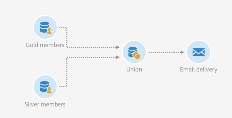

# 정교화한 두 대상자 결합 {#example--union-on-two-refined-audiences}

이 예제에 정의된 워크플로는 두 **[!UICONTROL Read audience]** 활동의 결합을 보여줍니다. 이 워크플로우의 목표는 18세에서 30세 사이의 골드 또는 실버 멤버에게 이메일을 보내는 것입니다. 골드 및 실버 멤버를 추적하기 위해 특정 대상자를 시스템에 미리 만들어 놓았습니다.

워크플로는 다음과 같이 디자인됩니다.

* 골드 멤버 대상자를 검색하고 18세에서 30세 사이의 프로필만 선택하여 정교화하는 첫 번째 [대상자 읽기](../../automating/using/read-audience.md) 활동.
* 두 번째 **[!UICONTROL Read audience]** 활동으로 실버 멤버 대상자를 검색하고 18세에서 30세 사이의 프로필만 선택하여 정교화합니다.
* 두 **[!UICONTROL Read audiences]** 활동의 모집단을 하나의 최종 모집단으로 통합하는 [Union](../../automating/using/union.md) 활동입니다.
* **[!UICONTROL Union]** 활동에서 만든 모집단에 전자 메일을 보내는 [전자 메일 게재](../../automating/using/email-delivery.md) 활동.
