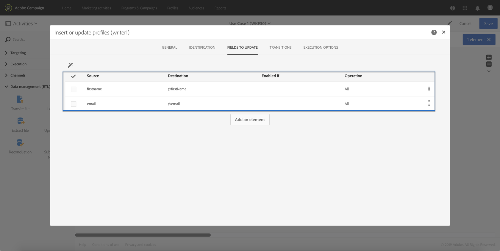
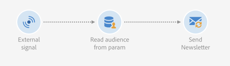
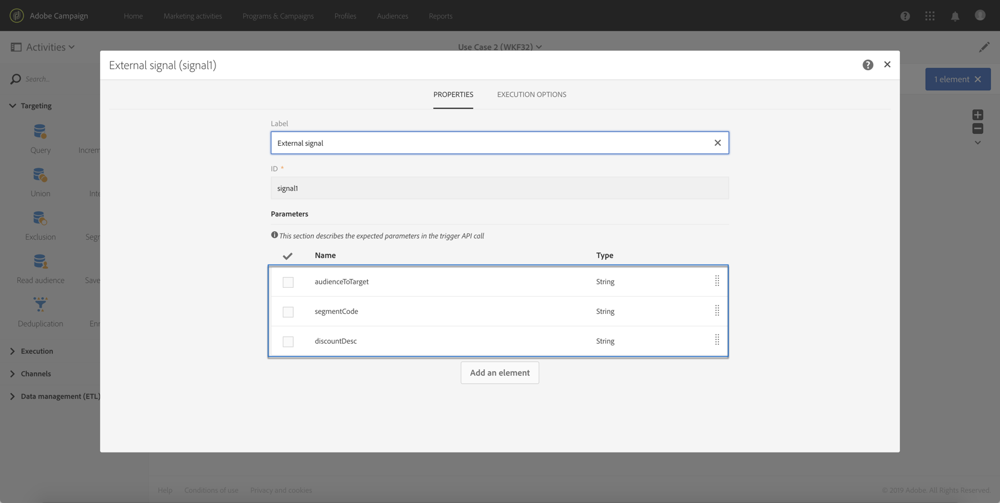
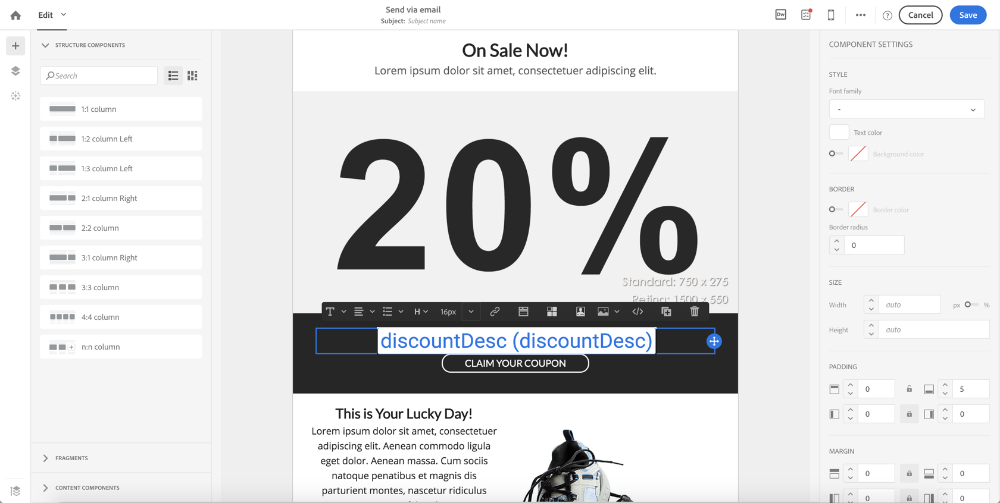

# 사용 사례 {#use-case}

아래의 사용 사례는 워크플로우 내의 매개 변수를 사용하여 워크플로우를 호출하는 방법을 보여줍니다.

목표는 외부 매개 변수를 사용하는 API 호출에서 워크플로우를 트리거하는 것입니다. 이 워크플로우는 파일에서 데이터베이스에 데이터를 로드하고 관련 대상을 만듭니다. 대상이 만들어지면 API 호출에 정의된 외부 매개 변수를 사용하여 개인화된 메시지를 보내도록 두 번째 워크플로우가 트리거됩니다.

이 사용 사례를 수행하려면 아래 작업을 수행해야 합니다.

1. **외부 매개 변수를 사용하여 Workflow 1을 트리거하는 API 호출을** 만듭니다. 1단계 [를 참조하십시오.API 호출](../../automating/using/use-case-calling-workflow.md#step-1--configuring-the-api-call)구성
1. **빌드 워크플로 1**:워크플로우는 파일을 전송하고 데이터베이스로 로드합니다. 그런 다음 데이터가 비어 있는지 여부를 테스트하고, 결국 프로필에 저장합니다. 마지막으로 워크플로우 2가 트리거됩니다. 2단계 [를 참조하십시오.워크플로우 구성 1](../../automating/using/use-case-calling-workflow.md#step-2--configuring-workflow-1).
1. **빌드 워크플로우 2**:워크플로우는 워크플로우 1에서 만든 고객을 읽은 다음, 매개 변수에 맞게 맞춤화된 세그먼트 코드와 함께 개인화된 메시지를 프로필에 보냅니다. 3단계 [를 참조하십시오.워크플로우 구성 2](../../automating/using/use-case-calling-workflow.md#step-3--configuring-workflow-2).


## 사전 요구 사항 {#prerequisites}

워크플로우를 구성하려면 먼저 각각 활동 내용이 포함된 Workflow 1과 2를 만들어야 **[!UICONTROL External signal]** 합니다. 이렇게 하면 워크플로우를 호출할 때 이러한 신호 활동을 타깃팅할 수 있습니다.

## 1단계:API 호출 구성 {#step-1--configuring-the-api-call}

매개 변수를 사용하여 워크플로우 1을 트리거하는 API 호출을 만듭니다. API 호출 구문에 대한 자세한 내용은 [Campaign Standard REST API 설명서를 참조하십시오](../../api/using/triggering-a-signal-activity.md).

Adobe에서는 아래 매개 변수를 사용하여 워크플로우를 호출하려고 합니다.

* **fileToTarget**:데이터베이스로 가져올 파일의 이름입니다.
* **discountDesc**:할인 가격에 납품에 표시할 설명입니다.

```
-X POST https://mc.adobe.io/<ORGANIZATION>/campaign/<TRIGGER_URL>
-H 'Authorization: Bearer <ACCESS_TOKEN>' 
-H 'Cache-Control: no-cache' 
-H 'X-Api-Key: <API_KEY>' 
-H 'Content-Type: application/json;charset=utf-8' 
-H 'Content-Length:79' 
-i
-d {
-d "source:":"API",
-d "parameters":{
-d "fileToTarget":"profile.txt",
-d "discountDesc":"Running shoes"
-d } 
```

## 2단계:워크플로우 구성 1 {#step-2--configuring-workflow-1}

Workflow 1은 다음과 같이 빌드됩니다.

* **[!UICONTROL External signal]** 활동:여기서 외부 매개 변수를 선언해야 워크플로우 내에서 사용할 수 있습니다.
* **[!UICONTROL Transfer file]** 활동:매개 변수에 정의된 이름으로 파일을 가져옵니다.
* **[!UICONTROL Load file]** 활동:가져온 파일의 데이터를 데이터베이스로 로드합니다.
* **[!UICONTROL Update data]** 활동:가져온 파일의 데이터로 데이터베이스를 삽입하거나 업데이트합니다.
* **[!UICONTROL Test]** 활동:가져온 데이터가 있는지 확인합니다.
* **[!UICONTROL Save audience]** 활동:파일에 데이터가 들어 있으면 해당 프로필을 대상에 저장합니다.
* **[!UICONTROL End activity]** 활동:워크플로 2를 호출합니다.


아래 절차에 따라 워크플로우를 구성합니다.

1. API 호출에 정의된 매개 변수를 선언합니다. 이렇게 하려면 활동을 연 다음 매개 변수의 이름과 유형을 추가합니다. **[!UICONTROL External signal]**

   

1. 데이터를 데이터베이스에 가져올 **[!UICONTROL Transfer file]** 활동을 추가합니다.이렇게 하려면 활동을 드래그 앤 드롭한 다음 열고 **[!UICONTROL Protocol]** 탭을 선택합니다.
1. 옵션을 **[!UICONTROL Use a dynamic file path]** 선택한 다음 **fileToTarget** 매개 변수를 전송할 파일로 사용합니다.

   ```
   $(vars/@fileToTarget)
   ```

   

1. 파일의 데이터를 데이터베이스로 로드합니다.

   이렇게 하려면 작업을 워크플로우로 드래그 앤 드롭한 다음 필요에 따라 구성합니다. **[!UICONTROL Load file]**

1. 가져온 파일의 데이터로 데이터베이스를 삽입하고 업데이트합니다.

   이렇게 하려면 **[!UICONTROL Update data]** 활동을 끌어다 놓은 다음 **[!UICONTROL Identification]** 탭을 선택하여 조정 기준을 추가합니다(이메일 **** 필드).

   

1. 탭을 **[!UICONTROL Fields to update]** 선택한 다음 데이터베이스에서 업데이트할 필드를 지정합니다( **이름** 및 **이메일** 필드).

   

1. 파일에서 데이터가 검색되는지 확인합니다. 이렇게 하려면 **[!UICONTROL Test]** 활동을 워크플로우로 드래그 앤 드롭한 다음 **[!UICONTROL Add an element]** 단추를 클릭하여 조건을 추가합니다.
1. 조건의 이름을 지정하고 정의합니다. 이 경우 아웃바운드 전환 시 아래 구문을 포함한 데이터가 들어 있는지 테스트하려고 합니다.

   ```
   $long(vars/@recCount)>0
   ```

   

1. 데이터가 검색되면 대상에 저장합니다. 이렇게 하려면 **[!UICONTROL Save audience]** Target에 빈 **** 전환이 아닌 활동을 추가한 다음 엽니다.
1. 옵션을 **[!UICONTROL Use a dynamic label]** 선택한 다음 **fileToTarget** 매개 변수를 대상 레이블로 사용합니다.

   ```
   $(vars/@fileToTarget)
   ```

   

1. 매개 변수를 사용하여 Workflow 2를 호출할 **[!UICONTROL End]** 활동을 드래그하여 놓은 다음 엽니다.
1. 탭을 **[!UICONTROL External signal]** 선택한 다음 트리거할 워크플로우와 연관된 신호 활동을 지정합니다.
1. 워크플로우 2 내에서 사용할 매개 변수와 관련 값을 정의합니다.

   이 경우, API 호출에 원래 정의된 매개 변수(fileToTarget **및** discountDesc **)와 상수 값이 있는 추가** segmentCode **매개 변수(&quot;20% 할인&quot;)를 전달하려고 합니다** .

   

워크플로우 1이 구성되었으므로 이제 워크플로우 2를 작성할 수 있습니다. 이 작업에 대한 자세한 정보는 [이 섹션](../../automating/using/use-case-calling-workflow.md#step-3--configuring-workflow-2)을 참조하십시오.

## 3단계:워크플로우 구성 2 {#step-3--configuring-workflow-2}

Workflow 2는 다음과 같이 빌드됩니다.

* **[!UICONTROL External signal]** 활동:여기서 는 워크플로우 내에서 사용하기 위해 매개 변수를 선언해야 합니다.
* **[!UICONTROL Read audience]** 활동:워크플로우 1에 저장된 대상을 읽습니다.
* **[!UICONTROL Email delivery]** 활동:매개 변수를 사용하여 개인화된 타깃팅된 대상자에게 반복 메시지를 보냅니다.



아래 절차에 따라 워크플로우를 구성합니다.

1. 워크플로우 1에서 정의된 매개 변수를 선언합니다.

   이렇게 하려면 **[!UICONTROL External signal]** 활동을 연 다음 워크플로우 1의 활동에 정의된 각 매개 변수의 이름과 유형을 **[!UICONTROL End]** 추가합니다.

   

1. 워크플로우 1에서 저장된 대상을 사용합니다. 이렇게 하려면 활동을 워크플로우로 드래그하여 놓은 다음 **[!UICONTROL Read audience]** 엽니다.
1. 옵션을 **[!UICONTROL Use a dynamic audience]** 선택한 다음 **fileToTarget** 매개 변수를 읽을 대상 이름으로 사용합니다.

   ```
   $(vars/@fileToTarget)
   ```

   

1. segmentCode 매개 변수에 따라 아웃바운드 전환 **이름을** 지정합니다.

   To do this, select the **[!UICONTROL Transition]** tab, then the **[!UICONTROL Use a dynamic segment code]** option.

1. 아웃바운드 전환 **의** 이름으로 segmentCode 매개 변수를 사용합니다.

   ```
   $(vars/@segmentCode)
   ```

   

1. 대상을 대상으로 메시지를 보낼 **[!UICONTROL Email delivery]** 활동을 끌어다 놓습니다.
1. 메시지에 사용할 매개 변수를 식별하여 **discountDesc 매개 변수로 개인화합니다** . 이렇게 하려면 활동의 고급 옵션을 연 다음 매개 변수 이름과 값을 추가합니다.

   

1. 이제 메시지를 구성할 수 있습니다. 활동을 열고 선택합니다 **[!UICONTROL Recurring email]**.

   

1. 사용할 템플릿을 선택한 다음 필요에 따라 이메일 속성을 정의합니다.
1. personalization 필드로 **discountDesc** 매개 변수를 사용합니다. 이렇게 하려면 개인화 필드 목록에서 선택합니다.

   

1. 이제 메시지 구성을 완료한 다음 평소대로 보낼 수 있습니다.

   

## 워크플로우 실행 {#executing-the-workflows}

워크플로우가 만들어지면 실행할 수 있습니다. API 호출을 수행하기 전에 두 개의 워크플로우가 시작되었는지 확인합니다.
