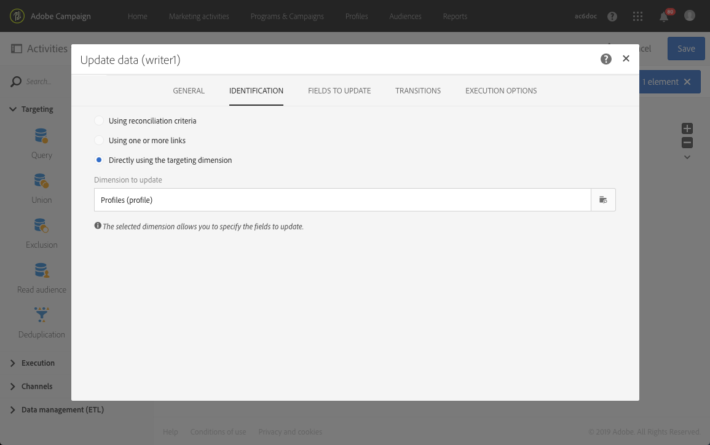
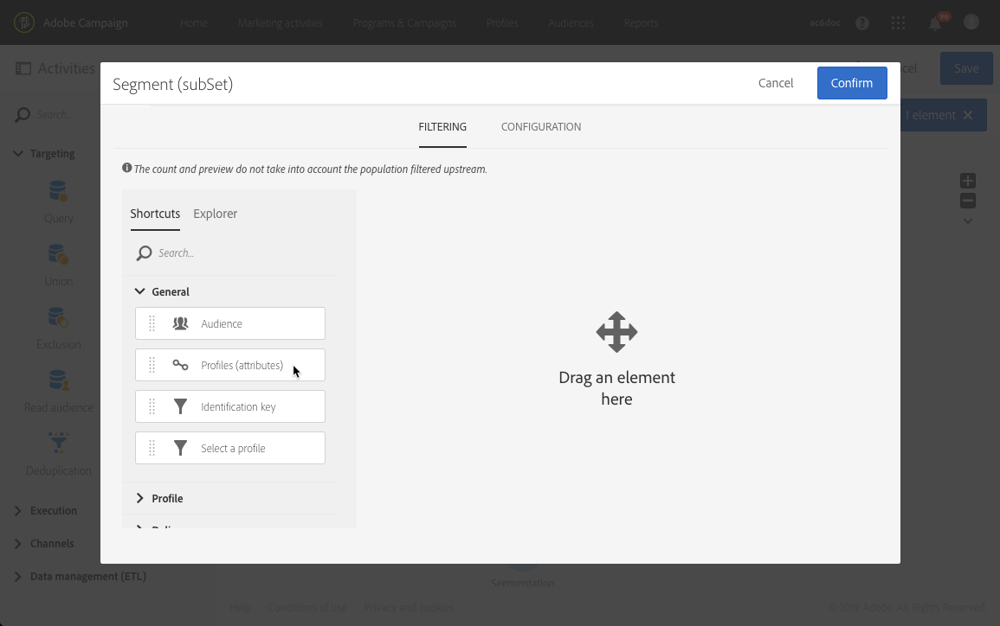
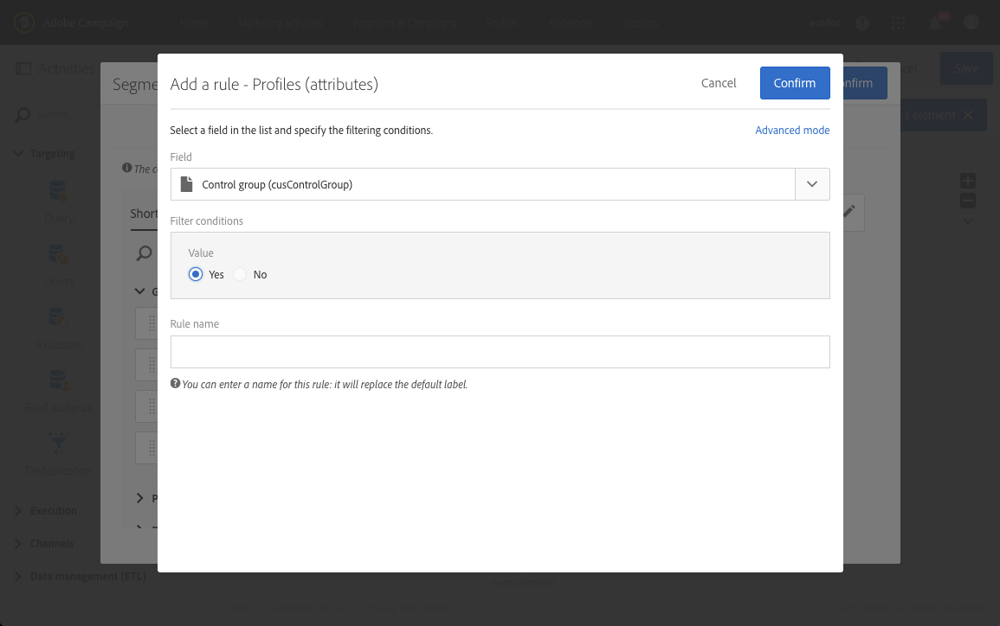

# 워크플로우 사용 사례:컨트롤 그룹 만들기 {#building-control-group}

게재의 영향을 측정하려면 특정 메시지를 받지 않도록 일부 프로필을 대상에서 제외할 수 있습니다. 이 제어 그룹을 사용하여 메시지를 받은 대상 모집단 동작과 비교할 수 있습니다.

Adobe Campaign Standard에서 이렇게 하려면 다음 활동을 포함하는 워크플로우를 빌드할 수 있습니다.
* 지정된 모집단을 타깃팅하는 질의 활동.
* 이 모집단에서 임의 제어 그룹을 격리하는 세그멘테이션 활동.
* 메시지를 기본 타겟으로 보내는 이메일 배달 활동.
* 대상에서 제외된 프로파일(임의 제어 그룹)을 업데이트하기 위한 데이터 활동 업데이트

## 프로필 리소스 확장 {#extending-profile}

먼저 제어 그룹에 해당하는 새 필드를 사용하여 **[!UICONTROL Profile]** 리소스를 확장해야 합니다. 워크플로우가 실행되면 이 필드에서 대상에서 제외된 프로파일이 확인됩니다.

1. &gt; **[!UICONTROL Administration]** &gt; **[!UICONTROL Development]** &gt; **[!UICONTROL Custom Resources]**&#x200B;에서 을 **[!UICONTROL Create]**&#x200B;클릭합니다.
1. 아직 연장하지 않은 경우 리소스를 선택하고 **[!UICONTROL Extend an existing resource]** 선택합니다 **[!UICONTROL Profile]** .
1. 탭에서 제어 그룹에 대한 새 필드를 추가하고 **[!UICONTROL Data structure]** 필드에 **[!UICONTROL Boolean]** **[!UICONTROL Type]** 대해 선택합니다.

   

1. 탭에서 섹션을 **[!UICONTROL Screen definition]** **[!UICONTROL Detail screen configuration]** 펼쳐서 방금 만든 필드를 선택하여 각 프로필에 대해 표시되도록 합니다.

   

1. 변경 내용을 저장합니다.
1. 데이터베이스 구조를 업데이트하여 **[!UICONTROL Profile]** 확장 리소스를 게시합니다. 사용자 [지정 리소스](../../developing/using/updating-the-database-structure.md#publishing-a-custom-resource)게시를 참조하십시오.

사용자 지정 리소스 확장에 대한 자세한 내용은 리소스를 [추가하는 주요 단계를 참조하십시오](../../developing/using/key-steps-to-add-a-resource.md).

## 워크플로우 만들기 {#creating-a-workflow}

1. 에서 **[!UICONTROL Marketing Activities]**&#x200B;을 클릭하고 **[!UICONTROL Create]** 선택합니다 **[!UICONTROL Workflow]**.
1. 워크플로우 **[!UICONTROL New Workflow]** 유형으로 선택하고 을 클릭합니다 **[!UICONTROL Next]**.
1. 워크플로우의 속성을 입력하고 을 클릭합니다 **[!UICONTROL Create]**.

워크플로우  만들기에 대한 자세한 단계는 워크플로우 작성 섹션에 나와 있습니다.

## 쿼리 활동 만들기 {#create-a-query-activity}

1. &gt; **[!UICONTROL Activities]** 에서 **[!UICONTROL Targeting]**&#x200B;드래그하여 **[!UICONTROL Query activity]**&#x200B;놓습니다.
1. 활동을 두 번 클릭하여 대상을 정의합니다.
1. 예를 들어 **[!UICONTROL Shortcuts]**&#x200B;드래그 앤 드롭에서 연산자로 선택하고 **[!UICONTROL Profile]****[!UICONTROL Age]** **[!UICONTROL Greater than]** **[!UICONTROL Value]** 필드에 25를 입력합니다.
1. Click **[!UICONTROL Confirm]**.

쿼리 활동을 작성하기 위한 자세한 단계는 쿼리 [섹션에 나와](../../automating/using/query.md) 있습니다.

## 세그멘테이션 활동 만들기 {#creating-a-segmentation-activity}

1. 활동을 드래그하여 놓고 두 번 클릭합니다. **[!UICONTROL Segmentation]**
1. 탭에서 편집할 세그먼트를 **[!UICONTROL Segments]** 선택합니다.
1. 해당 세그먼트의 **[!UICONTROL Configuration]** 탭에서 **[!UICONTROL Limit the population of this segment]** 옵션을 선택합니다.

   

1. 탭에서 **[!UICONTROL Limitation]** **[!UICONTROL Random sampling]** 옵션이 선택되어 있는지 확인합니다.

   

1. 초기 모집단의 비율을 정의합니다(예: 10% 및 클릭). **[!UICONTROL Confirm]** 제어 그룹은 무작위로 선택된 대상 모집단에서 10%로 구성됩니다.
1. 탭에서 **[!UICONTROL Advanced options]** 옵션을 선택하고 **[!UICONTROL Generate complement]** 및 **[!UICONTROL Transition label]** **[!UICONTROL Segment code]** 필드를 채웁니다.

   

1. Click **[!UICONTROL Confirm]**.

세그멘테이션 활동을 작성하는 자세한 단계는 세그멘테이션 [섹션에](../../automating/using/segmentation.md) 설명되어 있습니다.

## 이메일 활동 만들기 {#creating-an-email-activity}

1. &gt; **[!UICONTROL Activities]** 에서 기본 대상 세그먼트 **[!UICONTROL Channels]****[!UICONTROL Email Delivery]** 다음에 끌어다 놓습니다.
1. 활동을 클릭하고  편집하려면 선택합니다.
1. 을 선택하고 **[!UICONTROL Single send email]** 클릭합니다 **[!UICONTROL Next]**.
1. 이메일 템플릿을 선택하고 을 **[!UICONTROL Next]**&#x200B;클릭합니다.
1. 이메일 속성을 입력하고 을 **[!UICONTROL Next]**&#x200B;클릭합니다.
1. 이메일 레이아웃을 만들려면 을 클릭합니다 **[!UICONTROL Use the Email Designer]**.
1. 컨텐츠를 편집하고 저장할 수 있습니다.
1. 메시지 대시보드의 **[!UICONTROL Schedule]** 섹션에서 메시지를 보내기 전에 **[!UICONTROL 요청 확인]** 옵션을 선택 취소합니다.

이메일 활동을 작성하는 자세한 단계는 이메일 배달 [섹션에](../../automating/using/email-delivery.md) 설명되어 있습니다.

## 업데이트 데이터 활동 만들기 {#creating-update-data-activity}

1. 제어 그룹 세그먼트 뒤에 **[!UICONTROL Update data]** 활동을 드래그하여 놓습니다.
1. 활동을 선택한 다음 나타나는 빠른 작업의  단추를 사용하여 엽니다.
1. 탭의 **[!UICONTROL General]** 드롭다운 목록에서 **[!UICONTROL Update]** **[!UICONTROL Operation type]** 선택합니다.
1. 탭에서 **[!UICONTROL Identification]** **[!UICONTROL Directly using the targeting dimension]** 옵션을 선택합니다.
1. 이전에 업데이트할 차원으로 확장한 **[!UICONTROL Profile]** 리소스를 선택합니다.

   

1. 탭에서 자원에 추가한 제어 그룹 필드를 **[!UICONTROL Fields to update]** **[!UICONTROL Profile]** **[!UICONTROL Destination]** 선택하고 조건으로 true를 입력합니다.

   

1. Click **[!UICONTROL Confirm]**.

데이터 업데이트 활동을 작성하는 자세한 단계는 데이터 업데이트 [섹션에](../../automating/using/update-data.md) 나와 있습니다.

## 워크플로우 실행 {#running-the-workflow}

아이콘을 **[!UICONTROL Start]** 클릭하여 워크플로우를 실행합니다.

워크플로가 실행되면 제어 그룹의 모집단이 제외되고 메시지가 나머지 기본 타겟으로 전송됩니다.

리소스는 다음과 같이 업데이트됩니다. **[!UICONTROL Profile]** 프로파일이 제어 그룹에 있으면 해당 필드가 선택됩니다.

이제 메시지의 수신자가 메시지에서 제외되고 메시지를 받지 못한 작은 그룹과 어떻게 반응하는지 비교할 수 있습니다.

## 동일한 제어 그룹 재사용 {#reusing-same-control-group}

위의 예에서는 글로벌 제어 그룹을 만들 수 있습니다. 글로벌 제어 그룹은 게재와 독립적으로 프로필 속성으로 저장됩니다. 실제로, 위의 워크플로우가 실행된 후 **[!UICONTROL Profile]** 리소스 확장의 일부로 만들어진 새로운 "제어 그룹" 필드가 업데이트됩니다.

따라서 다음에 동일한 제어 그룹을 사용하려는 경우 임의의 세그먼테이션을 하지 않고 새 "제어 그룹" 필드에서 세그먼트화할 수 있습니다.

이렇게 하려면:
1. 활동을 만들 **[!UICONTROL Segmentation]** 때 **[!UICONTROL Segments]** 탭에서 편집할 세그먼트를 선택합니다.
1. 해당 세그먼트의 **[!UICONTROL Configuration]** 탭에서 **[!UICONTROL Limit the population of this segment]** 옵션을 선택하지 않아야 합니다.
1. 탭에서 기본 작업 **[!UICONTROL Filtering]** **[!UICONTROL Profiles (attributes)]** 영역으로 드래그하여 놓습니다.

   

1. 창에서 **[!UICONTROL Add a rule - Profiles (attributes)]** "제어 그룹"(리소스에 추가한 필드)을 선택하고 필터 조건으로 **[!UICONTROL Profile]** **[!UICONTROL Yes]** 선택합니다.

   