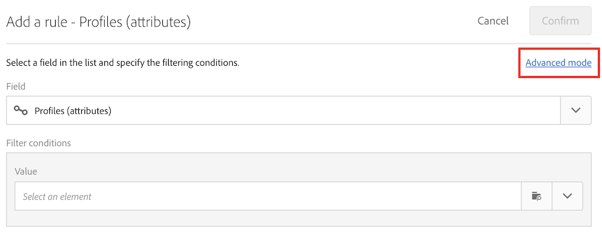
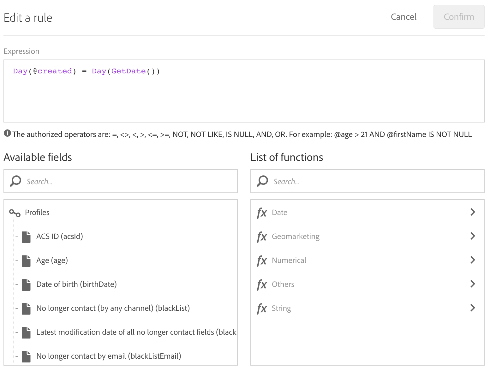

# 프로필이 만들어진 날짜에 게재 만들기 {#creation-date-query}

고객 프로필 작성 기념일에 이메일을 통해 오퍼를 보낼 수 있습니다.

1. **[!UICONTROL Marketing Activities]**&#x200B;에서 **[!UICONTROL Create]**&#x200B;을(를) 클릭하고 **[!UICONTROL Workflow]**&#x200B;을(를) 선택합니다.
1. 워크플로우 유형으로 **[!UICONTROL New Workflow]**&#x200B;을(를) 선택하고 **[!UICONTROL Next]**&#x200B;을(를) 클릭합니다.
1. 워크플로우의 속성을 입력하고 **[!UICONTROL Create]**&#x200B;을(를) 클릭합니다 .

## 예약 활동 만들기 {#creating-a-scheduler-activity}

1. In **[!UICONTROL Activities]** > **[!UICONTROL Execution]**, drag and drop a [Scheduler](../../automating/using/scheduler.md) activity.
1. 활동을 두 번 클릭합니다.
1. 게재 실행을 구성합니다.
1. **[!UICONTROL Execution frequency]**&#x200B;에서 **[!UICONTROL Daily]**&#x200B;을(를) 선택합니다.
1. 워크플로우에 대한 실행 **[!UICONTROL Time]** 을 **[!UICONTROL Repetition frequency]** 선택합니다.
1. 워크플로우에 사용할 **[!UICONTROL Start]** 날짜 **[!UICONTROL Expiration]** 를 선택합니다.
1. 활동을 확인하고 워크플로우를 저장합니다.

>[!NOTE]
>
>To start your workflow at a specific time zone, in the **[!UICONTROL Execution options]** tab, set up the time zone for your scheduler in the **[!UICONTROL Time zone]** field. 기본적으로 선택된 시간대는 워크플로우 속성에 정의된 시간대입니다([워크플로우 구축](../../automating/using/building-a-workflow.md) 참조).


## 쿼리 활동 만들기 {#creating-a-query-activity}

1. To select recipients, drag and drop a [Query](../../automating/using/query.md) activity and double-click it.
1. 값을 **[!UICONTROL Profiles]** 추가하고 **[!UICONTROL no longer contact by email]** 선택합니다 **[!UICONTROL no]**.

### 실행 날짜와 동일한 날짜에 생성된 프로필 검색 {#retriving-profiles-created-on-the-same-day}

1. 에서 **[!UICONTROL Profile]**&#x200B;필드를 드래그하여 **[!UICONTROL Created]** 놓습니다. 을 클릭하고 을 클릭합니다 **[!UICONTROL Advanced Mode]**.
   
1. 노드에서 **[!UICONTROL list of functions]**&#x200B;두 번&#x200B;**[!UICONTROL Day]** 을&#x200B;**[!UICONTROL Date]**&#x200B;클릭합니다.
1. 그런 다음 필드를 인수 **[!UICONTROL Created]** 로 삽입합니다.
1. Select **[!UICONTROL equals to (=)]** as the operator.
1. [값]**[!UICONTROL Day]** 의 **[!UICONTROL Date]** 노드에서 을 선택합니다 **[!UICONTROL List of functions]**.
1. 함수를 인수로&#x200B;**[!UICONTROL GetDate()]**&#x200B;삽입합니다.

생성일이 현재 날과 같은 프로파일을 검색했습니다.

다음과 같이 끝나야 합니다.

```Day(@created) = Day(GetDate())```



**[!UICONTROL Confirm]**&#x200B;을(를) 클릭합니다.

### 실행 월과 동일한 달에 생성된 프로필 검색{#retriving-profiles-created-on-the-same-month}

1. 편집기에서 **[!UICONTROL Query]** 첫 번째 쿼리를 선택하고 복제합니다.
1. 복제를 엽니다.
1. 쿼리에서 다음으로 **[!UICONTROL Day]** **[!UICONTROL Month]** 바꿉니다.
1. **[!UICONTROL Confirm]**&#x200B;을(를) 클릭합니다.


이렇게 해야 합니다.

``` Month(@created) = Month(GetDate()) ```

최종 쿼리는 다음과 같이 표시됩니다.

```Day(@created) = Day(GetDate()) AND Month(@created) = Month(GetDate())```


## 이메일 게재 만들기{#creating-an-email-delivery}

1. 이메일 배달 [활동을 드래그하여](../../automating/using/email-delivery.md) 놓습니다.
1. 활동을 클릭하고 편집하려면 을(를) 선택합니다.
1. **[!UICONTROL Recurring email]**&#x200B;을(를) 선택하고 **[!UICONTROL Next]**&#x200B;을(를) 클릭합니다 .
1. 전자 메일 템플릿을 선택하고 **[!UICONTROL Next]**&#x200B;을(를) 클릭합니다.
1. 전자 메일 속성을 입력하고 **[!UICONTROL Next]**&#x200B;을(를) 클릭합니다.
1. 전자 메일 레이아웃을 만들려면 **[!UICONTROL Email Designer]**&#x200B;을(를) 클릭합니다.
1. 요소를 삽입하거나 기존 템플릿을 선택합니다.
1. 필드 및 링크를 사용하여 이메일을 개인화합니다.
자세한 내용은 [전자 메일 디자인](../../designing/using/designing-from-scratch.md#designing-an-email-content-from-scratch)을 참조하십시오.
1. 레이아웃을 확인하려면&#x200B;**[!UICONTROL Preview]**&#x200B;을(를) 클릭합니다.
1. **[!UICONTROL Save]**&#x200B;을(를) 클릭합니다.

**관련 항목:**

* [이메일 채널](../../channels/using/creating-an-email.md)
