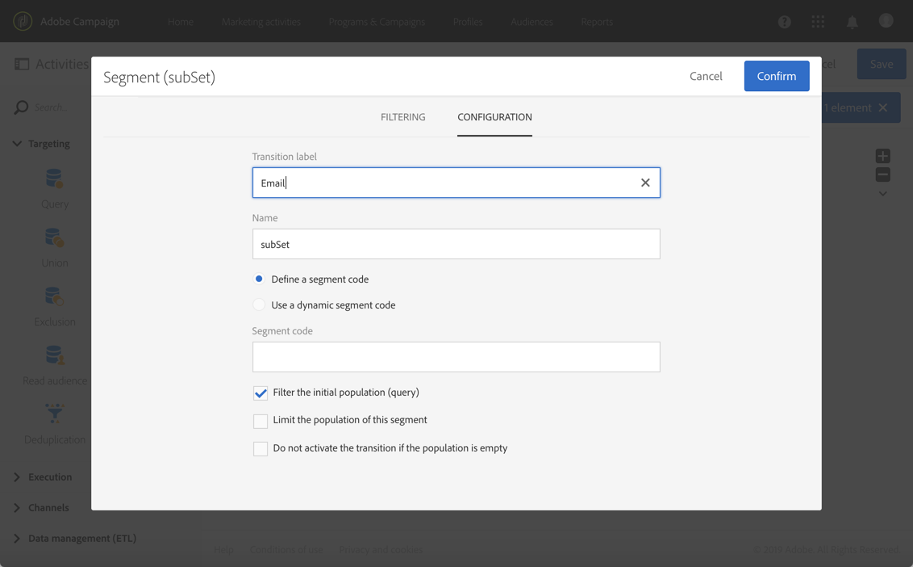

# 채널 간 게재 만들기{#cross-channel-delivery}

이 문서에서는 표준 사용 사례를 통해 다음의 크로스채널 게재 워크플로우 만들기와 같은 Adobe Campaign 기능을 검색할 수 있습니다.

여기에서 목표는 데이터베이스의 수신자로부터 대상자를 선택하여 첫 번째 그룹에는 전자 메일을 보내고 두 번째 그룹에는 SMS 메시지를 보내는 것을 목표로 하여 두 개의 다른 그룹으로 세분화하는 것입니다.

워크플로우와 Adobe Campaign에서 사용할 수 있는 다른 채널에 대한 자세한 내용은 다음 문서를 참조하십시오.

* [워크플로우 살펴보기](../../automating/using/get-started-workflows.md)
* [통신 채널 살펴보기](../../channels/using/get-started-communication-channels.md)

## 워크플로우 만들기 {#creating-workflow}

지정된 그룹에 두 개의 다른 게재를 보내려면 먼저 타겟을 정의해야 합니다.

이 작업을 수행하려면 수신자를 식별하는 쿼리를 만들어야 하므로 워크플로우를 만들어야 합니다.

프로그램 또는 선택한 캠페인에서 새 워크플로우를 만듭니다.

1. **[!UICONTROL Marketing Activities]**&#x200B;에서 **[!UICONTROL Create]**&#x200B;을(를) 클릭하고 **[!UICONTROL Workflow]**&#x200B;을(를) 선택합니다 .
1. 워크플로우 유형으로 **[!UICONTROL New Workflow]**&#x200B;을(를) 선택하고 **[!UICONTROL Next]**&#x200B;을(를) 클릭합니다.
1. 워크플로우의 속성을 입력하고 **[!UICONTROL Create]**&#x200B;을(를) 클릭합니다.

워크플로우를 만드는 자세한 단계는 [워크플로우 작성](../../automating/using/building-a-workflow.md) 섹션에 나와 있습니다.

## 쿼리 활동 만들기 {#creating-query-activity}

워크플로우가 만들어지면 해당 인터페이스에 액세스할 수 있습니다.

워크플로우에 쿼리 활동을 삽입하여 게재를 수신할 프로필을 타겟팅합니다.

1. > **[!UICONTROL Activities]** 에서 **[!UICONTROL Targeting]**&#x200B;쿼리 활동을 끌어다 [놓습니다](../../automating/using/query.md) .
1. 활동을 두 번 클릭합니다.
1. **[!UICONTROL Target]** 탭에서 바로 가기를 탐색하고 [대상자](../../audiences/using/about-audiences.md) 중 하나를 선택합니다.
1. 바로 가기를 편집 영역으로 끌어다 놓습니다. 선택한 바로 가기 유형에 따라 창이 나타납니다.
1. 타겟팅 요소를 구성한 다음 쿼리를 확인합니다.

하나 또는 여러 요소에 대해 쿼리를 만들 수 있습니다.

**[!UICONTROL Count]** 버튼을 사용하여 쿼리를 기준으로 타겟팅된 예상 프로필 수를 확인할 수 있습니다.

## 세분화 활동 만들기 {#creating-segmentation-activity}

쿼리 활동에서 타겟을 식별한 후에는 이메일과 문자 메시지를 받는 대상을 두 개의 다른 모집단으로 세분화하는 조건을 선택해야 합니다. 

You have to use a [Segmentation](../../automating/using/segmentation.md) activity to create one or several segments from a population computed upstream in a query.

**전자 메일** 그룹은 전자 메일 주소가 정의되어 있지만 휴대폰 번호는 없는 수신자를 타겟팅합니다. **SMS** 그룹은 휴대폰 번호가 프로필에 저장된 수신자를 포함합니다.

첫 번째 전환(전자 메일)을 구성하는 방법:

1. **[!UICONTROL Segments]** 탭에는 기본적으로 첫 번째 세그먼트가 있습니다. 속성을 편집하여 해당 세그먼트를 구성합니다.

   

1. 필터링 조건으로 프로필의 **[!UICONTROL Email]**&#x200B;을(를) 선택합니다.

   

1. 화면에 표시되는 새 창에서 **[!UICONTROL Is not empty]** 연산자를 선택합니다.

   

1. 두 번째 필터링 기준과 **[!UICONTROL Mobile]**&#x200B;을(를) 추가하고 **[!UICONTROL Is empty]** 연산자를 선택합니다.

   

   쿼리에서 오는 전자 메일이 있지만 휴대폰 번호는 정의되지 않은 모든 프로필은 이 전환 단계에 있게 됩니다.

1. 워크플로우를 보다 명확하게 하기 위해 전환 레이블을 편집할 수 있습니다. 변경 사항을 확인합니다.

   

첫 번째 전환이 구성됩니다. 두 번째 전환(SMS)을 구성하는 방법:

1. **[!UICONTROL Add an element]** 버튼을 클릭하여 새 전환을 추가합니다.
1. 휴대폰 번호가 제공된 모든 프로필을 검색할 수 있는 조건을 정의합니다. 이렇게 하려면 **[!UICONTROL Mobile]** 필드에 **[!UICONTROL Is not empty]** 논리 연산자로 규칙을 만듭니다.

   

   쿼리에서 오는 휴대폰 번호가 정의된 모든 프로필은 이 전환 단계에 있게 됩니다.

1. 전환 레이블을 편집할 수 있습니다. 변경 사항을 확인합니다.

이제 두 번째 전환도 구성됩니다.

## 게재 만들기 {#creating-deliveries}

As two transitions were already created, you must now add two types of deliveries to the outbound transitions of the Segmentation activity: an [Email delivery](../../automating/using/email-delivery.md) activity and an [SMS delivery](../../automating/using/sms-delivery.md) activity.

Adobe Campaign을 사용하면 워크플로우에 게재를 추가할 수 있습니다. 이렇게 하려면 워크플로우 활동 팔레트의 **[!UICONTROL Channels]** 카테고리에서 게재를 선택합니다.

전자 메일 게재를 만드는 방법:

1. 첫 번째 세그먼트 뒤에 [이메일 배달](../../automating/using/email-delivery.md) 활동을 드래그하여 놓습니다.
1. 활동을 두 번 클릭하여 편집합니다.
1. **[!UICONTROL Simple email]**&#x200B;을(를) 선택합니다.
1. **[!UICONTROL Add an outbound transition with the population]**&#x200B;을(를) 선택하고 **[!UICONTROL Next]**&#x200B;을(를) 클릭합니다 .

   

   아웃바운드 전환을 사용하면 모집단과 추적 로그를 복구할 수 있습니다. 예를 들어, 첫 번째 메일을 클릭하지 않은 사람에게 두 번째 메일을 보내려고 할 때 사용할 수 있습니다.

1. 전자 메일 템플릿을 선택하고 **[!UICONTROL Next]**&#x200B;을(를) 클릭합니다.
1. 전자 메일 속성을 입력하고 **[!UICONTROL Next]**&#x200B;을(를) 클릭합니다.
1. 전자 메일 레이아웃을 만들려면 **[!UICONTROL Use the Email Designer]**&#x200B;을(를) 선택합니다.
1. 콘텐츠를 편집하고 저장합니다.
1. In the **[!UICONTROL Schedule]** section of the message dashboard, unselect the **[!UICONTROL Request confirmation before sending messages]** option.

SMS 게재를 만드는 방법:

1. 다른 세그먼트 뒤에 [SMS 배달](../../automating/using/sms-delivery.md) 활동을 드래그하여 놓습니다.
1. 활동을 두 번 클릭하여 편집합니다.
1. **[!UICONTROL SMS]**&#x200B;을(를) 선택하고 **[!UICONTROL Next]**&#x200B;을(를) 클릭합니다 .
1. SMS 템플릿을 선택하고 **[!UICONTROL Next]**&#x200B;을(를) 클릭합니다 .
1. SMS 속성을 입력하고 **[!UICONTROL Next]**&#x200B;을(를) 클릭합니다 .
1. 콘텐츠를 편집하고 저장합니다.

게재를 만들고 편집하고 나면 워크플로우를 시작할 준비가 되었습니다.

## 워크플로우 실행 {#running-the-workflow}

Once the workflow is started, the population targeted by the **[!UICONTROL Query]** activity will be segmented to receive an Email or SMS delivery.

워크플로우를 실행하려면 작업 모음에서 **[!UICONTROL Start]** 버튼을 클릭합니다.

Adobe Campaign 로고를 통해 **[!UICONTROL Marketing plans]** > **[!UICONTROL Marketing activities]** 고급 메뉴에서 게재에 액세스할 수 있습니다. 게재 버튼을 클릭한 다음 **[!UICONTROL Reports]** 버튼을 클릭하여 게재 요약, 열기 비율 또는 수신자 메시지의 받은 편지함에 따른 전자 메일 렌더링 등의[게재 보고서](../../reporting/using/about-dynamic-reports.md#accessing-dynamic-reports)에 액세스합니다.
