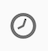

# Retargeting workflow sending a new delivery to non-openers{#retargeting-delivery-to-non-openers}

고객에게 이메일을 보낸 다음 해당 메일을 열지 않은 고객에게 이메일을 보낼 수 있습니다.

1. **[!UICONTROL Marketing Activities]**&#x200B;에서 **[!UICONTROL Create]**&#x200B;을(를) 클릭하고 **[!UICONTROL Workflow]**&#x200B;을(를) 선택합니다.
1. 워크플로우 유형으로 **[!UICONTROL New Workflow]**&#x200B;을(를) 선택하고 **[!UICONTROL Next]**&#x200B;을(를) 클릭합니다.
1. 워크플로우의 속성을 입력하고 **[!UICONTROL Create]**&#x200B;을(를) 클릭합니다 .

## Creating a query activity{#creating-a-query-activity}

1. **[!UICONTROL Activities]** > **[!UICONTROL Targeting]**&#x200B;에서 [쿼리](../../automating/using/query.md) 활동을 끌어다 놓습니다.
1. 활동을 두 번 클릭합니다.
1. In **[!UICONTROL Shortcuts]**, drag and drop **[!UICONTROL Profiles]** and select **[!UICONTROL email]** with the operator **[!UICONTROL is not empty]**.
1. In **[!UICONTROL Shortcuts]**, drag and drop **[!UICONTROL Profiles]** and select **[!UICONTROL no longer contact by email]** with the value **[!UICONTROL no ]**.
1. **[!UICONTROL Confirm]**&#x200B;을(를) 클릭합니다.

## 이메일 게재 만들기{#creating-an-email-delivery}

1. 각 세그먼트 뒤에 [이메일 배달을](../../automating/using/email-delivery.md) 드래그하여 놓습니다.
1. 활동을 클릭하고 편집하려면 을(를) 선택합니다.
1. **[!UICONTROL Simple email]**&#x200B;을(를) 선택하고 **[!UICONTROL Next]**&#x200B;을(를) 클릭합니다 .
1. **[!UICONTROL Add an outbound transition without the population]**&#x200B;을(를) 선택하고 **[!UICONTROL Next]**&#x200B;을(를) 클릭합니다 .
1. 전자 메일 템플릿을 선택하고 **[!UICONTROL Next]**&#x200B;을(를) 클릭합니다.
1. 전자 메일 속성을 입력하고 **[!UICONTROL Next]**&#x200B;을(를) 클릭합니다.
1. 전자 메일 레이아웃을 만들려면 **[!UICONTROL Using the Email Designer]**&#x200B;을(를) 클릭합니다.
1. 요소를 삽입하거나 기존 템플릿을 선택합니다.
1. 각 위치에 맞는 오퍼로 이메일을 개인화합니다.자세한 내용은 이메일 [디자인을 참조하십시오](../../designing/using/designing-from-scratch.md#designing-an-email-content-from-scratch).
1. 레이아웃을 확인하려면&#x200B;**[!UICONTROL Preview]**&#x200B;을(를) 클릭합니다.
1. **[!UICONTROL Save]**&#x200B;을(를) 클릭합니다.

## 쿼리 활동에서 비열기 타깃팅{#targeting-non-openers-in-a-query-activity}

1. In **[!UICONTROL Activities]** > **[!UICONTROL Execution]**, drag and drop a [Wait](../../automating/using/wait.md) activity.
1. 에서 **[!UICONTROL Duration]**&#x200B;을 클릭하고  하루 를 선택합니다.
1. **[!UICONTROL Activities]** > **[!UICONTROL Targeting]**&#x200B;에서 **[!UICONTROL Query activity]**&#x200B;을(를) 끌어다 놓습니다.
1. 활동을 두 번 클릭합니다.
1. 시작 **[!UICONTROL Shortcuts]**&#x200B;으로 드래그하여 놓고 연산자 **[!UICONTROL Tracking Logs]** 를 사용합니다 **[!UICONTROL exists]**.
1. > **[!UICONTROL Shortcuts]**&#x200B;에서 연산자 **[!UICONTROL Delivery]**&#x200B;와 함께 드래그 앤 드롭 **[!UICONTROL delivery]** 을 **[!UICONTROL is equal to]** 하고 배달을 값으로 선택합니다.
1. > **[!UICONTROL Shortcuts]**&#x200B;에서 **[!UICONTROL Delivery]**&#x200B;드래그하여 **[!UICONTROL type]** 놓고 값으로 **[!UICONTROL Open]** 확인합니다.
1. 규칙 사이의 연산자를 로 선택합니다 **[!UICONTROL except]**.
1. **[!UICONTROL Confirm]**&#x200B;을(를) 클릭합니다.

## sms 배달 만들기{#creating-a-sms-delivery}

1. 각 세그먼트 뒤에 sms 배달을 드래그하여 놓습니다.
1. 활동을 클릭하고 편집하려면 을(를) 선택합니다.
1. **[!UICONTROL Simple sms]**&#x200B;을(를) 선택하고 **[!UICONTROL Next]**&#x200B;을(를) 클릭합니다 .
1. Select an sms template and click **[!UICONTROL Next]**.
1. Enter the sms properties and click **[!UICONTROL Next]**.
1. To create the layout of your sms, click on **[!UICONTROL Email Designer]**.
1. 요소를 삽입하거나 기존 템플릿을 선택합니다.
1. 각 위치에 맞는 제안을 통해 문자메시지를 개인화할 수 있습니다.
자세한 내용은 sms [디자인 섹션을](../../channels/using/creating-an-sms-message.md) 참조하십시오.
1. 레이아웃을 확인하려면&#x200B;**[!UICONTROL Preview]**&#x200B;을(를) 클릭합니다.
1. **[!UICONTROL Save]**&#x200B;을(를) 클릭합니다.

**관련 항목:**

* [이메일 채널](../../channels/using/creating-an-email.md)
