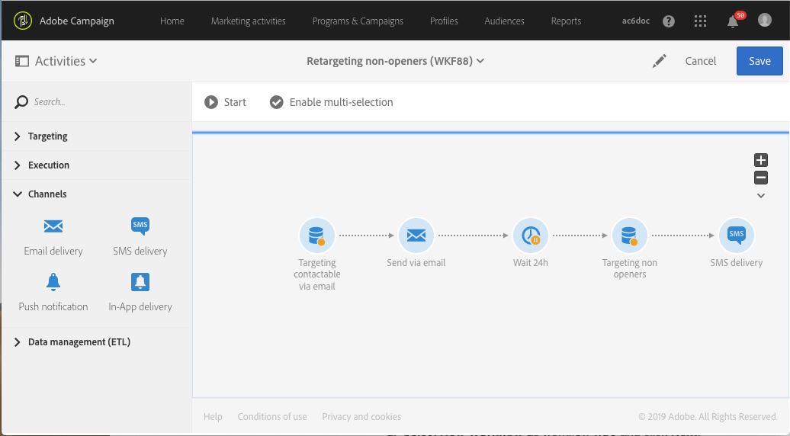

# 열지 않은 사용자에게 새 게재를 보내는 워크플로우 재타겟팅{#retargeting-delivery-to-non-openers}

고객에게 이메일을 보낸 다음 메일을 열지 않은 고객에게 SMS를 보낼 수 있습니다.

1. **[!UICONTROL Marketing Activities]**&#x200B;에서 **[!UICONTROL Create]**&#x200B;을(를) 클릭하고 **[!UICONTROL Workflow]**&#x200B;을(를) 선택합니다.
1. 워크플로우 유형으로 **[!UICONTROL New Workflow]**&#x200B;을(를) 선택하고 **[!UICONTROL Next]**&#x200B;을(를) 클릭합니다.
1. 워크플로우의 속성을 입력하고 **[!UICONTROL Create]**&#x200B;을(를) 클릭합니다 .

## 쿼리 활동 만들기{#creating-a-query-activity}

1. **[!UICONTROL Activities]** > **[!UICONTROL Targeting]**&#x200B;에서 [쿼리](../../automating/using/query.md) 활동을 끌어다 놓습니다.
1. 활동을 두 번 클릭합니다.
1. 위치 **[!UICONTROL Shortcuts]**, 드래그 앤 드롭 **[!UICONTROL Profiles]** 및 선택 **[!UICONTROL email]** 연산자 사용 **[!UICONTROL is not empty]**.
1. 위치 **[!UICONTROL Shortcuts]**, 드래그 앤 드롭 **[!UICONTROL Profiles]** 및 선택 **[!UICONTROL no longer contact by email]** 값 포함 **[!UICONTROL no]**.
1. **[!UICONTROL Confirm]**&#x200B;를 클릭합니다.

## 전자 메일 게재 만들기{#creating-an-email-delivery}

1. 드래그 앤 드롭 [이메일 게재](../../automating/using/email-delivery.md) 각 세그먼트 뒤에.
1. 활동을 클릭하고 편집하려면 을(를) 선택합니다.
1. **[!UICONTROL Simple email]**&#x200B;을(를) 선택하고 **[!UICONTROL Next]**&#x200B;을(를) 클릭합니다 .
1. **[!UICONTROL Add an outbound transition without the population]**&#x200B;을(를) 선택하고 **[!UICONTROL Next]**&#x200B;을(를) 클릭합니다 .
1. 전자 메일 템플릿을 선택하고 **[!UICONTROL Next]**&#x200B;을(를) 클릭합니다.
1. 전자 메일 속성을 입력하고 **[!UICONTROL Next]**&#x200B;을(를) 클릭합니다.
1. 전자 메일 레이아웃을 만들려면 **[!UICONTROL Using the Email Designer]**&#x200B;을(를) 클릭합니다.
1. 요소를 삽입하거나 기존 템플릿을 선택합니다.
1. 각 위치에 맞는 오퍼를 사용하여 전자 메일을 개인화할 수 있습니다. 자세한 내용은 [이메일 디자인](../../designing/using/designing-from-scratch.md#designing-an-email-content-from-scratch).
1. 레이아웃을 확인하려면&#x200B;**[!UICONTROL Preview]**&#x200B;을(를) 클릭합니다.
1. **[!UICONTROL Save]**&#x200B;을(를) 클릭합니다.

## 쿼리 활동에서 열지 않은 사용자 타겟팅{#targeting-non-openers-in-a-query-activity}

1. 위치 **[!UICONTROL Activities]** > **[!UICONTROL Execution]**, 드래그 앤 드롭 [대기](../../automating/using/wait.md) 활동.
1. 위치 **[!UICONTROL Duration]**, 클릭  하루만 선택하세요.
1. **[!UICONTROL Activities]** > **[!UICONTROL Targeting]**&#x200B;에서 **[!UICONTROL Query activity]**&#x200B;을(를) 끌어다 놓습니다.
1. 활동을 두 번 클릭합니다.
1. 위치 **[!UICONTROL Shortcuts]**, 드래그 앤 드롭 **[!UICONTROL Tracking Logs]** 및 연산자 사용 **[!UICONTROL exists]**.
1. 위치 **[!UICONTROL Shortcuts]**> **[!UICONTROL Delivery]**, 드래그 앤 드롭 **[!UICONTROL delivery]** 연산자 사용 **[!UICONTROL is equal to]** 게재를 값으로 선택합니다.
1. 위치 **[!UICONTROL Shortcuts]**> **[!UICONTROL Delivery]**, 드래그 앤 드롭 **[!UICONTROL type]** 및 확인 **[!UICONTROL Open]** 값.
1. 규칙 사이의 연산자를 다음으로 선택 **[!UICONTROL except]**.
1. **[!UICONTROL Confirm]**&#x200B;를 클릭합니다.

## SMS 게재 만들기{#creating-a-sms-delivery}

1. 각 세그먼트 뒤에 SMS 게재를 끌어다 놓습니다.
1. 활동을 클릭하고 편집하려면 을(를) 선택합니다.
1. **[!UICONTROL Simple sms]**&#x200B;을(를) 선택하고 **[!UICONTROL Next]**&#x200B;을(를) 클릭합니다 .
1. SMS 템플릿을 선택하고 **[!UICONTROL Next]**.
1. sms 속성을 입력하고 클릭 **[!UICONTROL Next]**.
1. SMS의 레이아웃을 만들려면 을(를) 클릭합니다. **[!UICONTROL Email Designer]**.
1. 요소를 삽입하거나 기존 템플릿을 선택합니다.
1. 각 위치에 맞는 오퍼를 사용하여 SMS를 개인화할 수 있습니다.
자세한 내용은 [SMS 디자인](../../channels/using/creating-an-sms-message.md) 섹션.
1. 레이아웃을 확인하려면&#x200B;**[!UICONTROL Preview]**&#x200B;을(를) 클릭합니다.
1. **[!UICONTROL Save]**&#x200B;을(를) 클릭합니다.

**관련 항목:**

* [이메일 채널](../../channels/using/creating-an-email.md)
