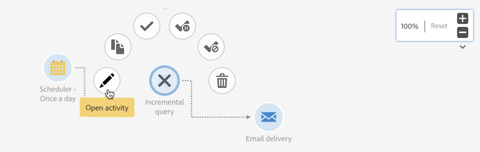

# 워크플로우 인터페이스{#workflow-interface}

워크플로우를 만들어 캠페인 및 프로그램의 전체 프로세스를 관리할 수 있습니다.

워크플로우 편집 화면은 다음 요소로 구성됩니다.

* 다음 [팔레트](#palette): 사용 가능한 활동을 참조합니다.
* 다음 [작업 공간](#workspace): 활동이 구성 및 구성되어 있습니다.
* 다음 [작업 표시줄](#action-bar)- 워크플로우 및/또는 해당 구성 요소와 상호 작용할 수 있는 단추로 구성되어 있습니다.
* 다음 [빠른 작업](#quick-actions)선택한 활동 주위에 표시되는 를 통해 상호 작용할 수 있습니다.

## 팔레트 {#palette}

팔레트는 화면 왼쪽에 있습니다. 사용 가능한 모든 활동은 몇 가지 카테고리로 분류됩니다.

* [타깃팅](../../automating/using/about-targeting-activities.md): 타겟팅, 모집단 데이터 조작 및 필터링 활동과 관련된 활동
* [실행](../../automating/using/about-execution-activities.md): 워크플로우 구성 및 실행과 관련된 활동
* [채널](../../automating/using/about-channel-activities.md): 사용 가능한 다양한 통신 채널을 나타내는 활동
* [ETL(데이터 관리)](../../automating/using/about-data-management-activities.md): 데이터 조작과 관련된 활동

워크플로우의 팔레트에서 활동을 사용하려면 활동을 작업 영역으로 끌어다 놓습니다.

워크플로우를 시작하기 전에 팔레트에서 추가한 각 활동을 구성해야 합니다.

## 작업 영역 {#workspace}

작업 공간은 워크플로우 편집기에서 중앙 영역입니다. 이 영역에서는 활동을 삭제하고, 전환을 사용하여 함께 연결하고, 구성할 수 있습니다.

두 활동을 연결하려면 첫 번째 활동에서 다음 활동이 연결될 때까지 화살표 끝을 다음 활동으로 이동합니다. 활동을 이전 활동에 연결하기 위해 해당 뒤의 화살표 지점 쪽으로 이동할 수도 있습니다. 활동을 이동하면 연결된 상태로 유지됩니다.

데이터를 처리하는 활동 다음에 나오는 전환에는 중간 모집단이 포함됩니다. 확인을 하면 액세스할 수 있습니다 **[!UICONTROL Keep interim results]** 옵션 **[!UICONTROL Execution]** 워크플로우 속성의 섹션.

>[!CAUTION]
>
>이 옵션은 많은 디스크 공간을 소모하며 워크플로우를 빌드하고 적절한 구성과 동작이 되도록 설계되었습니다. 프로덕션 인스턴스에서 선택하지 않은 상태로 둡니다.

활동을 선택하면 활동 주위에 빠른 작업이 표시되어 상호 작용할 수 있습니다. 예를 들어 활동을 구성하려면 활동을 선택한 다음  버튼을 클릭합니다.

특정 함수는 작업 공간에서만 활성화됩니다.

* 주변에 영역을 그려 여러 활동 및 전환을 선택합니다.
* 누르기 **Ctrl** + 왼쪽 클릭으로 여러 활동 및/또는 전환을 선택합니다.
* 누르기 **Enter 키** 을 클릭하여 현재 선택한 활동 또는 전환의 세부 사항을 확인합니다.
* 누르기 **삭제** 을 클릭하여 현재 선택한 활동을 삭제합니다.
* 누르기 **Ctrl + C** 선택한 활동을 복사하려면 다음을 수행하십시오. **Ctrl + V** 붙여넣을 수 있습니다.

## 작업 표시줄 {#action-bar}

작업 공간에서 선택한 요소나 워크플로우의 실행 상태에 따라 작업 표시줄에서 사용할 수 있는 단추가 달라질 수 있습니다.

 **[!UICONTROL Open activity]** 워크플로우의 속성을 편집할 수 있습니다.

 **[!UICONTROL Start]** 워크플로우를 시작합니다.

 **[!UICONTROL Pause]** 워크플로우를 일시 중지합니다.

 **[!UICONTROL Stop]** 워크플로우 실행을 중단합니다. 중지된 곳에서는 다시 시작할 수 없습니다.

 **[!UICONTROL Restart]** 워크플로우를 다시 시작합니다.

 **[!UICONTROL Log and tasks]** 워크플로우의 실행 로그를 엽니다.

 **[!UICONTROL Enable multi-selection]** 다중 선택 모드를 활성화합니다. 워크플로우는 두 개 이상의 활동으로 구성해야 합니다.

 **[!UICONTROL Disable multi-selection]** 다중 선택 모드를 비활성화합니다. 

 **[!UICONTROL Open transition]** 선택한 전환을 엽니다. 

  **[!UICONTROL Normal execution]** 선택 영역이 이전에 비활성화되었거나 일시 중지됨으로 표시된 경우 다시 활성화합니다. 

 **[!UICONTROL Execution suspended]** 선택한 활동에서 워크플로우를 일시 중지합니다. 

 **[!UICONTROL No execution]** 활동을 비활성화합니다. 

 **[!UICONTROL Delete selection]** 선택한 활동을 삭제합니다. 

 **[!UICONTROL Copy selection]** 선택한 활동을 복사합니다.

 **[!UICONTROL Paste]** 복사한 활동을 붙여넣습니다.

## 빠른 작업 {#quick-actions}

활동을 선택하면 활동 주위에 빠른 작업 단추가 표시되므로 활동을 상호 작용할 수 있습니다.

 **[!UICONTROL Open activity]** 선택한 활동을 엽니다.

 **[!UICONTROL Copy selection]** 선택한 활동을 복사합니다.

 **[!UICONTROL Open the activity's advanced options]** 선택한 이메일 또는 SMS 게재 활동의 고급 옵션을 엽니다.

 **[!UICONTROL Normal execution]** 선택 영역이 이전에 비활성화되었거나 일시 중지됨으로 표시된 경우 다시 활성화합니다.

 **[!UICONTROL Execution suspended]** 선택한 활동에서 워크플로우를 일시 중지합니다.

 **[!UICONTROL No execution]** 활동을 비활성화합니다.

 **[!UICONTROL Immediate execution]** 선택 항목을 즉시 처리합니다. 이 버튼은 스케줄러 및 대기 활동.

 **[!UICONTROL Delete selection]** 선택한 활동을 삭제합니다.

## 워크플로우 활동 복제 {#duplicating-workflow-activities}

작업 공간을 사용하면 워크플로우 활동을 동일한 워크플로우에 복사 붙여넣거나 동일한 캠페인 인스턴스의 다른 워크플로우에 붙여넣어 복제할 수 있습니다.

활동이 복제되면 전체 구성이 유지됩니다. 게재 활동(이메일, SMS, 푸시 알림..)에 대해 활동에 첨부된 게재 개체가 복제됩니다.

>[!NOTE]
>
>워크플로우 활동은 인스턴스에서 다른 인스턴스로 복제할 수 없습니다. 기술 워크플로우의 활동은 복제할 수 없습니다.

활동을 복제하려면 아래 단계를 수행하십시오.

1. 활동을 선택한 다음 **[!UICONTROL Copy selection]** 버튼을 클릭합니다.

   를 사용할 수도 있습니다 **Ctrl + C** 키보드 단축키.

   

1. Target 워크플로우 작업 영역에서 마우스 오른쪽 단추를 클릭하고 **[!UICONTROL Paste]** 버튼을 클릭합니다.

   를 사용할 수도 있습니다 **CTRL + V** 키보드 단축키.

   

1. 활동이 복제되고 초기에 구성된 모든 설정이 복제됩니다.

여러 활동을 복사-붙여넣기할 수도 있으므로 전체 워크플로우를 복제할 수 있습니다.

이렇게 하려면 활동 주위에 영역을 그려 활동을 선택합니다. 그런 다음 **[!UICONTROL Copy selection]** 작업 표시줄에서 버튼 누르기 **Ctrl + C**). 그런 다음 원하는 위치에 붙여넣을 수 있습니다.

