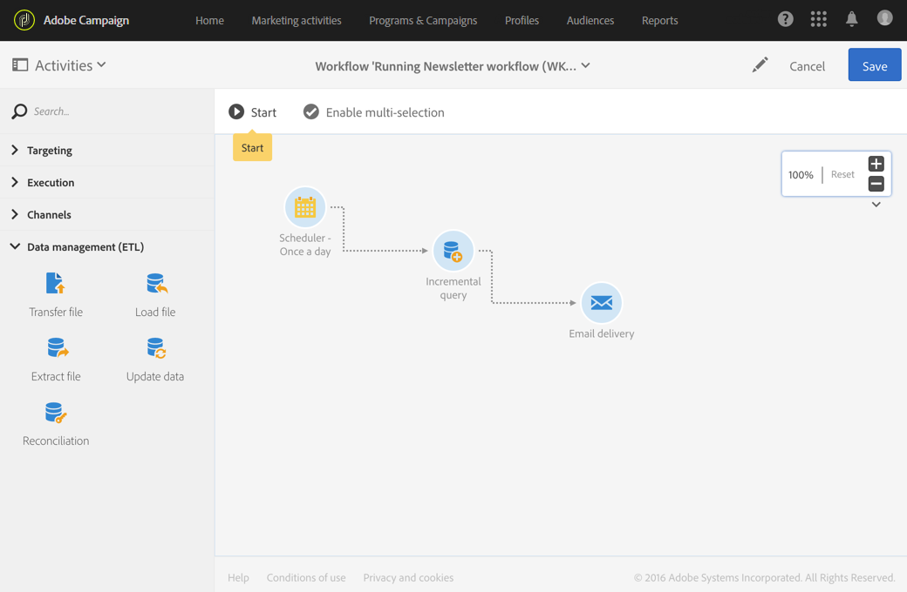

# Workflow operating principles{#workflow-operating-principles}

A workflow is a **sequence of configurable activities**. 각 활동은 프로세스에서 특정 역할을 수행합니다. The result of each activity is forwarded to the following activity by a **transition**, represented by an arrow.

한 활동과 다른 활동과 간에 교환된 데이터의 유형은 다음 활동이 구성되는 방식에 영향을 줄 수 있습니다. 예를 들어 이메일 배달 활동 전에 모집단이 설정된 경우 해당 이메일이 문제의 이메일의 타겟으로 사용될 수 있습니다.

워크플로우를 열어서 워크플로우를 실행하기 전이나 후에 매개 변수를 확인하거나 편집할 수 있습니다.

전환 과정을 열 때 또는 워크플로우 실행 후에 전송된 데이터가 올바른지 확인할 수 있습니다. To access the detail view of the transitions, you have to check the **[!UICONTROL Keep interim results]** option in the **[!UICONTROL Execution]** section of the workflow properties.

