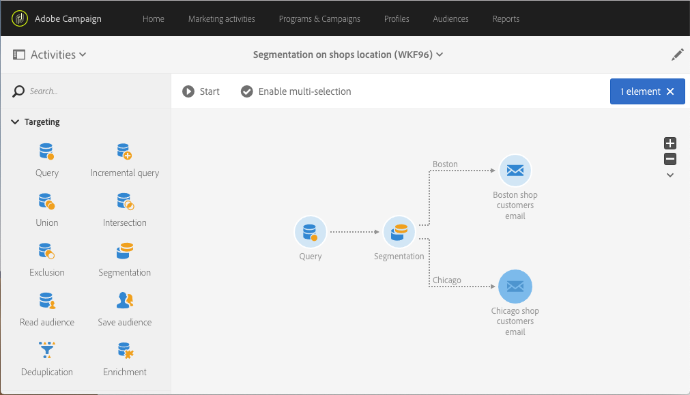

# 위치 세분화 {#segmentation-on-location}

해당 지역의 상점에서 오퍼를 제공하는 고객에게 타깃팅 이메일을 보낼 수 있습니다.

1. 에서 **[!UICONTROL Marketing Activities]**&#x200B;을 클릭하고 **[!UICONTROL Create]** 선택합니다 **[!UICONTROL Workflow]**.
1. 워크플로우 유형 **[!UICONTROL New Workflow]** 으로 선택하고 을 클릭합니다 **[!UICONTROL Next]**.
1. 워크플로우의 속성을 입력하고 를 클릭합니다 **[!UICONTROL Create]**.

## 이메일을 통해 받는 사람 선택{#selecting-recipients-contactable-via-email}

1. > **[!UICONTROL Activities]** 에서 **[!UICONTROL Targeting]**&#x200B;쿼리 [활동을 드래그하여](../../automating/using/query.md) 놓습니다 .
1. 활동을 두 번 클릭합니다.
1. 에서 **[!UICONTROL Shortcuts]**&#x200B;드래그하여 **[!UICONTROL Profiles]** 놓고 연산자가 **[!UICONTROL email]** 있는 필드를 선택합니다 **[!UICONTROL is not empty]**.
1. 에서 **[!UICONTROL Shortcuts]**&#x200B;드래그하여 **[!UICONTROL Profiles]** 놓고 값이 **[!UICONTROL no longer contact by email]** 있는 필드를 선택합니다 **[!UICONTROL no]**.
1. 두 **[!UICONTROL Confirm]** 번 클릭합니다.

## 세그멘테이션 활동 만들기{#creating-a-segmentation-activity}

1. 세그멘테이션 [활동을](../../automating/using/segmentation.md) 드래그하여 놓고 두 번 클릭합니다.
1. 세그먼트를 클릭한 다음 첫 번째 도시에서 사용자를 타깃팅하기 위해 전환 방식을 엽니다. 여기 보스턴.
1. 드래그 앤 드롭 **[!UICONTROL Location]** 을 통해 연산자와 값 **[!UICONTROL City]** 을 선택합니다 **[!UICONTROL equals to]** **[!UICONTROL Boston]**.
참고: 보스턴에 들어온 모든 사람에게 연락하려면 대/소문자 구분 옵션의 선택을 취소하십시오.
1. **[!UICONTROL Confirm]**&#x200B;을 클릭합니다.
1. 에서 **[!UICONTROL List of outbound segments]**&#x200B;을 **[!UICONTROL Add an element]** 클릭하고 을 클릭하여 두 번째 도시  의 사용자를 타깃팅하는 세그먼트를 만듭니다. 여기 시카고
1. 연산자를 사용하여 드래그하여 놓기 **[!UICONTROL Location]** 를 선택하고 값 **[!UICONTROL City]** 을 **[!UICONTROL equals to]** **[!UICONTROL Chicago]** 입력합니다.
1. 시카고에 들어온 모든 사람에게 도달하려면 대/소문자를 구분하지 않고 대/소문자 구분 옵션의 선택을 취소합니다.
1. **[!UICONTROL Confirm]**&#x200B;을 클릭합니다.

## 이메일 배달 만들기{#creating-an-email-delivery}

1. > **[!UICONTROL Activities]** 에서 **[!UICONTROL Channels]**&#x200B;각 세그먼트 뒤에 [이메일 배달](../../automating/using/email-delivery.md) 활동을 드래그하여 놓습니다.
1. 활동을 클릭하고  편집하려면 선택합니다.
1. 을 선택하고 **[!UICONTROL Simple email]** 클릭합니다 **[!UICONTROL Next]**.
1. 이메일 템플릿을 선택하고 을 클릭합니다 **[!UICONTROL Next]**.
1. 이메일 속성을 입력하고 을 클릭합니다 **[!UICONTROL Next]**.
1. 이메일 레이아웃을 만들려면 을 클릭합니다 **[!UICONTROL Email Designer]**.
1. 요소를 삽입하거나 기존 템플릿을 선택합니다.
1. 각 위치에 맞는 제안을 통해 이메일을 개인화할 수 있습니다.

   자세한 내용은 이메일 [디자인을 참조하십시오](../../designing/using/designing-from-scratch.md#designing-an-email-content-from-scratch).

1. 레이아웃 **[!UICONTROL Preview]** 을 확인하려면 을(를) 클릭합니다.
1. **[!UICONTROL Save]**&#x200B;을 클릭합니다.

