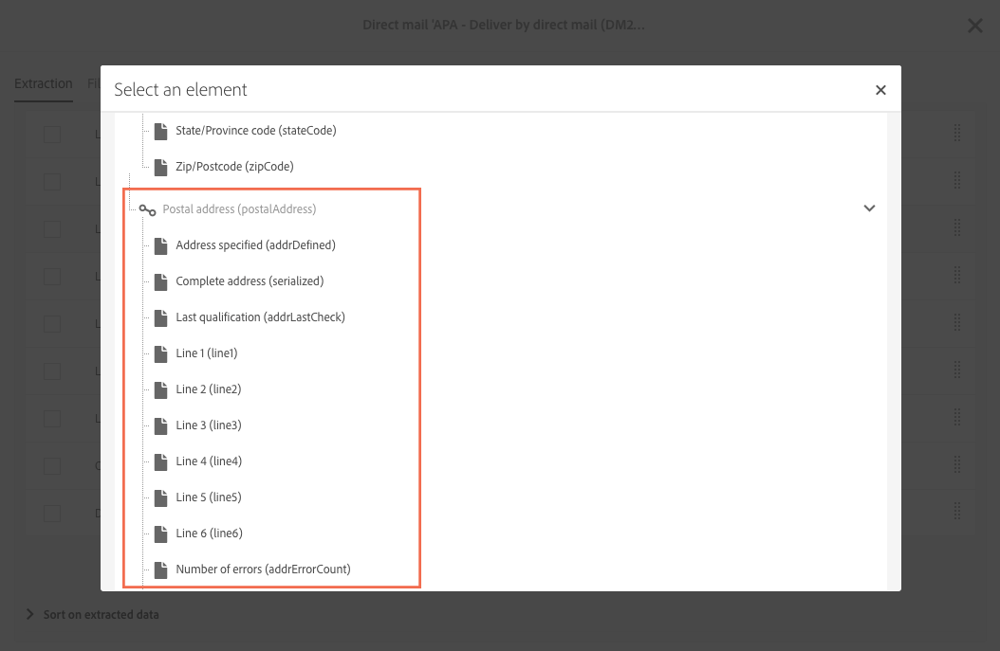

# About direct mail{#about-direct-mail}

DM는 다이렉트 메일 제공업체가 요구하는 파일을 개인화하고 생성할 수 있는 오프라인 채널입니다. 이를 통해 고객 여정 전반에서 온라인 채널과 오프라인 채널을 혼합할 수 있습니다.

>[!NOTE]
>
>이 기능은 선택 사항입니다. 사용권 계약을 확인하십시오. The **[!UICONTROL Export]** role is required to use direct mail. 관리자에게 문의하십시오.

온라인 채널을 통해 메시지 (이메일, SMS, 모바일 앱 전달 등) 를 Adobe Campaign에서 바로 고객에게 보낼 수 있습니다. 오프라인 채널은 서로 다릅니다. 직접 메일 배달을 준비하면 Adobe Campaign에서 모든 타깃팅된 프로필 및 선택한 연락처 정보 (예: 우편 주소) 를 포함하는 파일을 생성합니다. 그런 다음 실제 전송을 담당할 직접 메일 공급자에게 이 파일을 보낼 수 있습니다.

다음 섹션에서는 1 shot direct mail delivery를 만들고 생성하는 방법을 설명합니다. 또한 워크플로우에 다이렉트 메일 활동을 포함시켜 온라인 및 오프라인 채널을 결합한 캠페인을 오케스트레이션할 수 있습니다. For more on this, refer to the [Workflows](../../automating/using/workflow-data-and-processes.md) guide.

Adobe Campaign의 사용자 프로세스는 다음과 같습니다.

1. 배달 만들기
1. 대상 선택
1. 컨텐츠 정의
1. 연락처 날짜 설정
1. 파일 생성

## Recommendations {#recommendations}

### Direct mail providers {#direct-mail-providers}

먼저 다이렉트 메일 제공업체에 연락하여 추천을 수집해야 합니다. 추출 파일에 포함해야 하는 프로파일 정보를 식별하고 커뮤니케이션을 개인화하여 고객에게 전송할 수 있습니다. 예를 들어 이름, 우편 주소, 프로모션 코드 등을 들 수 있습니다. These fields are the ones that you will add in the [Defining the extraction](../../channels/using/defining-the-direct-mail-content.md#defining-the-extraction) tab of the direct mail's content.

Make sure you have checked the **[!UICONTROL Address specified]** box in your profiles' information. 이 옵션이 활성화되면 프로필이 타겟에 추가됩니다. It is not, it will excluded by a typology rule during the preparation phase (see [Creating the direct mail](../../channels/using/creating-the-direct-mail.md)). 프로필 가져오기 중에 이 필드를 업데이트해야 합니다.

### Postal addresses {#postal-addresses}

When you add the fields to include in the extraction file, the postal address fields are available in the **[!UICONTROL Location]** node.

Adobe Campaign는 가장 일반적인 우편 주소 정규화 다음에 미리 정의된 계산된 필드를 제공합니다. The fields are available in the **[!UICONTROL Postal address]** node.

An address can contain up to six lines by default: the first calculated field ( **[!UICONTROL Line 1]** contains the first name and last name, the next lines contain the postal address (road etc.), and the last line contains the ZIP/Postal code and town or city.

