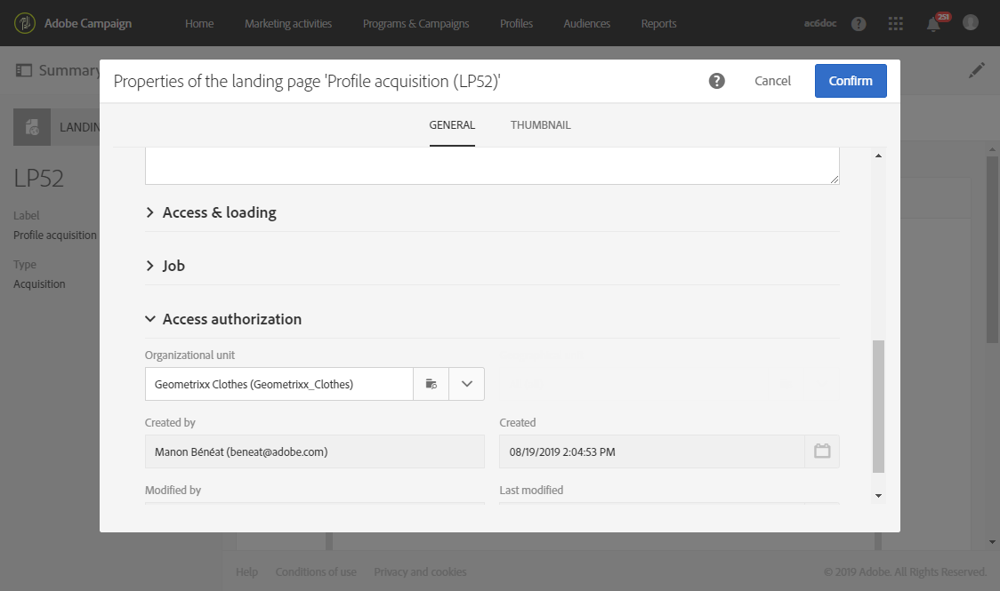
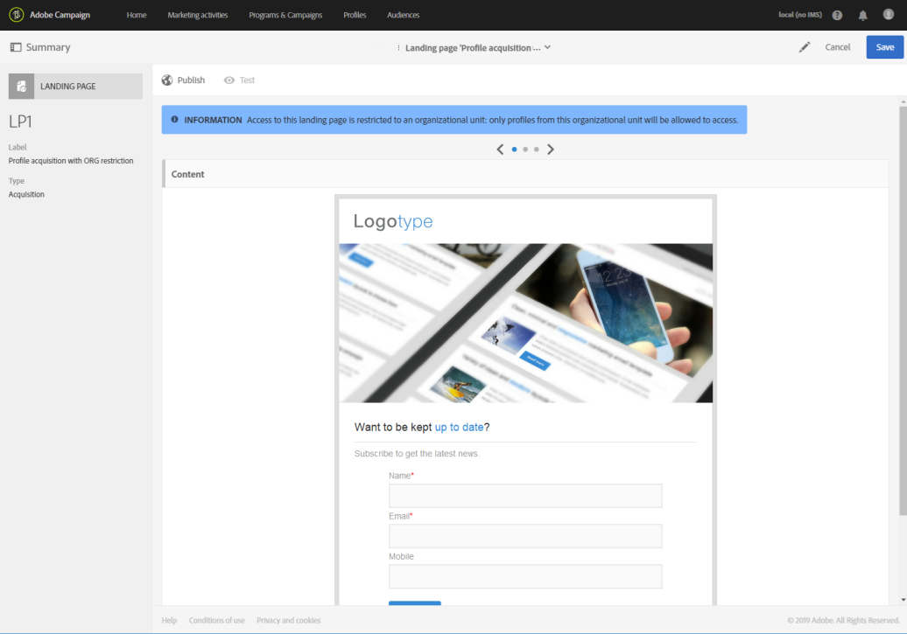

# 랜딩 페이지 구성 {#configuring-landing-page}

## 랜딩 페이지 제출 확인 {#confirm-a-landing-page-submission}

방문자가 랜딩 페이지를 제출하면 트리거되는 작업을 구성할 수 있습니다. 방법은 다음과 같습니다.

1. 랜딩 페이지 대시보드의  아이콘을 통해 액세스되는 랜딩 페이지 속성을 편집하고 **[!UICONTROL Job]** 매개 변수를 표시합니다.

   

1. **[!UICONTROL Specific actions]** 섹션에서 **[!UICONTROL Start sending message]**&#x200B;을(를) 선택하여 자동 메시지 보내기를 결정합니다. 예를 들면 서비스 구독을 확인하는 메시지를 보낼 수 있습니다. 그 다음에는 이메일 게재 템플릿을 선택해야 합니다.

   확인 메시지가 이미 서비스 수준에서 구성된 경우, 이 화면에서 선택해서는 안 됩니다. 확인 메시지를 여러 개 보내게 될 수 있기 때문입니다. [서비스 구성](../../audiences/using/creating-a-service.md)을 참조하십시오.

1. **[!UICONTROL Additional data]**&#x200B;을(를) 만들어 랜딩 페이지가 제출될 때 추가 데이터를 저장할 수 있도록 합니다. 이 데이터는 페이지를 방문한 사람에게 표시되지 않습니다. 상수 값만 고려됩니다.

   

## 랜딩 페이지를 서비스에 연결 {#linking-a-landing-page-to-a-service}

양식을 서비스에 연결하여 프로필이 랜딩 페이지를 확인할 때 특정 서비스를 구독할 수 있도록 만들 수 있습니다.

랜딩 페이지 연결에 대한 매개 변수를 통해 수행된 작업 유형과 랜딩 페이지가 특정 단일 서비스에 연결되어 있는지, 일반적으로 사용되고 있는지 여부를 지정할 수 있습니다.

연결할 서비스를 선택하려면 다음을 수행해야 합니다.

1. 랜딩 페이지 대시보드의  아이콘을 통해 액세스되는 랜딩 페이지 속성을 편집하고 **[!UICONTROL Job]** 매개 변수를 표시합니다.

   

1. **[!UICONTROL Specific actions]** 드롭다운 목록에서 **[!UICONTROL Subscription]**&#x200B;을(를) 선택합니다.

   

1. 랜딩 페이지를 단일 서비스에 연결하려면 **[!UICONTROL Specific service]**&#x200B;을(를) 선택합니다. 랜딩 페이지에서 여러 서비스를 사용하려면 이 옵션을 선택하지 마십시오.

   여러 서비스에 대해 랜딩 페이지를 사용할 수 있도록 하려면 **[!UICONTROL Specified service in the URL]** 옵션을 사용합니다. 따라서 서비스를 구성할 때 랜딩 페이지를 참조해야 합니다.

## 권한 및 미리 로드할 데이터 설정 {#setting-permissions-and-pre-loading-data}

랜딩 페이지에 대한 액세스는 식별된 방문자(예: Campaign에서 보낸 메시지의 링크를 통해 들어온 방문자) 또는 특정 조직 단위로 제한할 수 있습니다.
식별된 방문자의 경우 랜딩 페이지에서 데이터를 미리 로드할 수 있습니다. 방법은 다음과 같습니다.

1. 랜딩 페이지 대시보드의  아이콘을 통해 액세스되는 랜딩 페이지 속성을 편집하고 **[!UICONTROL Access & loading]** 매개 변수를 표시합니다.

   

1. **[!UICONTROL Preload visitor data]**&#x200B;을(를) 선택합니다.

   페이지의 방문자가 데이터베이스의 프로필에 해당하는 경우 데이터가 데이터베이스 데이터와 매핑된 양식 필드에 표시되며, 랜딩 페이지의 개인화 요소가 고려됩니다.

   

다음을 수행할 수도 있습니다.

* **[!UICONTROL Authorize visitor identification via URL parameters]** 옵션을 사용하여 URL 매개 변수로 방문자를 식별합니다. 그 다음에는 로딩 키를 선택하고 필터 매개 변수를 해당 URL의 매개 변수에 매핑해야 합니다.
* **[!UICONTROL Authorize unidentified visitors]** 옵션을 사용하여 모든 방문자에게 랜딩 페이지 액세스를 승인합니다.

랜딩 페이지를 조직 단위에 연결할 수도 있습니다. 이를 통해 여러 랜딩 페이지에 대한 사용자의 액세스를 정의할 수 있습니다. 조직 단위를 할당하려면 다음을 수행합니다.

1. **[!UICONTROL Edit properties]** 아이콘을 통해 랜딩 페이지 속성에 액세스합니다.

   

1. **[!UICONTROL Access authorization]**&#x200B;을(를) 펼칩니다.

1. 드롭다운 메뉴를 클릭하고 조직 단위를 선택합니다. 조직 단위를 만드는 방법에 대한 자세한 내용은 이 [페이지](../../administration/using/organizational-units.md)를 참조하십시오.

   

1. **[!UICONTROL Created by]**, **[!UICONTROL Created]**, **[!UICONTROL Access authorization]** 그리고 **[!UICONTROL Last modified]** 필드는 자동으로 입력됩니다.

1. **[!UICONTROL Confirm]**&#x200B;을(를) 클릭한 뒤 **[!UICONTROL Save]**&#x200B;을(를) 클릭합니다.

이제 선택한 조직 단위 내의 사용자만이 랜딩 페이지에 액세스 및 관리할 수 있습니다.

## Google reCAPTCHA 설정 {#setting-google-recaptcha}

랜딩 페이지에 Google reCAPTCHA V3를 설정하여 봇에 의한 스팸 및 남용을 방지할 수 있습니다. 랜딩 페이지에서 사용하려면 먼저 외부 계정을 만들어야 합니다. 구성 방법에 대한 자세한 내용은 이 [섹션](../../administration/using/external-accounts.md#google-recaptcha-external-account)을 참조하십시오.

Google reCAPTCHA V3 외부 계정을 설정하고 나면 랜딩 페이지에 추가할 수 있습니다.

1. 랜딩 페이지를 게시하기 전에 랜딩 페이지 대시보드의  아이콘을 통해 페이지 속성에 액세스합니다.

   

1. **[!UICONTROL Access & loading]** 메뉴를 펼칩니다.
1. **[!UICONTROL Use reCAPTCHA to protect your site from spam and abuse]** 옵션을 선택합니다.
1. 앞에서 만든 Google reCAPTCHA 외부 계정을 선택합니다.

   

1. **[!UICONTROL Confirm]**&#x200B;을(를) 클릭합니다.

이제 랜딩 페이지 하단에 Google reCAPTCHA를 표시하도록 설정했습니다.

Google reCAPTCHA는 페이지와 사용자의 상호 작용에 따른 점수를 반환합니다. 점수를 확인하려면 [Google Admin Console](https://g.co/recaptcha/admin)에 연결합니다.
