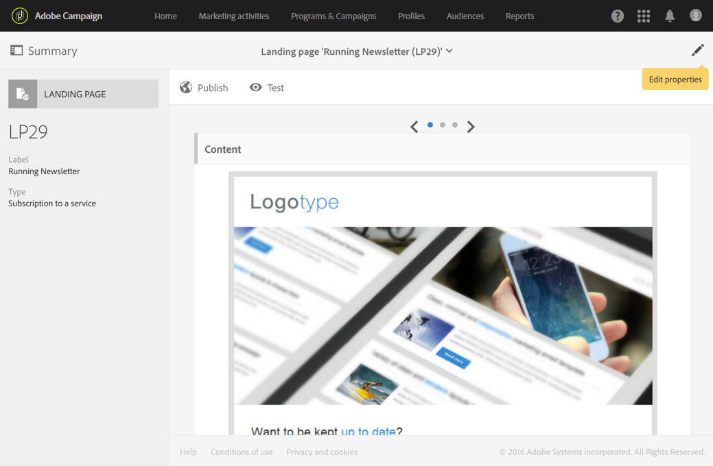

# 랜딩 페이지 구성 {#configuring-landing-page}

## 랜딩 페이지 제출 확인 {#confirm-a-landing-page-submission}

방문자가 랜딩 페이지를 제출하면 트리거된 작업을 구성할 수 있습니다. 이렇게 하려면:

1. 랜딩 페이지 대시보드의  아이콘을 통해 액세스한 랜딩 페이지 속성을 편집하고 **[!UICONTROL Job]** 매개 변수를 표시합니다.

   

1. 이 **[!UICONTROL Specific actions]** 섹션에서 자동 메시지 전송을 **[!UICONTROL Start sending message]** 결정하려면 선택합니다. 예를 들어 서비스에 대한 가입을 확인합니다. 그런 다음 이메일 배달 템플릿을 선택해야 합니다.

   확인 메시지가 이미 서비스 수준에서 구성된 경우 이 화면에서 확인 메시지를 여러 번 보내지 않도록 선택할 수 없습니다. 서비스 [구성을](../../audiences/using/creating-a-service.md)참조하십시오.

1. 랜딩 페이지를 제출할 때 추가 데이터를 저장할 **[!UICONTROL Additional data]** 수 있도록 만듭니다. 이 데이터는 페이지를 방문한 사람에게 표시되지 않습니다. 상수 값만 고려됩니다.

   

## 랜딩 페이지를 서비스에 연결 {#linking-a-landing-page-to-a-service}

랜딩 페이지의 유효성을 검사할 때 특정 서비스에 프로필을 가입할 수 있도록 양식을 서비스에 연결할 수 있습니다.

랜딩 페이지 연결에 대한 매개 변수를 사용하여 수행한 작업 유형과 랜딩 페이지가 특정 단일 서비스에 연결되어 있는지 또는 일반적인지를 지정할 수 있습니다.

연결할 서비스를 선택하려면 다음을 수행해야 합니다.

1. 랜딩 페이지 대시보드의  아이콘을 통해 액세스한 랜딩 페이지 속성을 편집하고 **[!UICONTROL Job]** 매개 변수를 표시합니다.

   

1. 드롭다운 **[!UICONTROL Subscription]** 목록에서 **[!UICONTROL Specific actions]** 선택합니다.

   

1. 랜딩 페이지를 단일 서비스에 **[!UICONTROL Specific service]** 연결하려면 선택합니다. 랜딩 페이지에서 여러 서비스를 사용하려면 이 옵션을 선택하지 마십시오.

   여러 서비스에 랜딩 페이지를 사용할 수 있도록 하려면 이 **[!UICONTROL Specified service in the URL]** 옵션을 사용합니다. 따라서 서비스를 구성할 때 랜딩 페이지를 참조해야 합니다.

## 권한 설정 및 사전 로드 데이터 {#setting-permissions-and-pre-loading-data}

랜딩 페이지에 대한 액세스는 Campaign에서 보낸 메시지의 링크에서 온 식별된 방문자 또는 특정 조직 단위로 제한할 수 있습니다.
식별된 방문자의 경우 랜딩 페이지에서 해당 데이터를 미리 로드할 수 있습니다. 이렇게 하려면:

1. 랜딩 페이지 대시보드의  아이콘을 통해 액세스한 랜딩 페이지 속성을 편집하고 **[!UICONTROL Access & loading]** 매개 변수를 표시합니다.

   

1. 을 **[!UICONTROL Preload visitor data]**&#x200B;선택합니다.

   페이지의 방문자가 데이터베이스의 프로필에 해당하는 경우 해당 데이터는 데이터베이스 데이터와 매핑된 양식의 필드에 표시되고 랜딩 페이지의 개인화 요소가 고려됩니다.

   

다음을 수행할 수도 있습니다.

* 다음 **[!UICONTROL Authorize visitor identification via URL parameters]** 옵션을 사용하여 URL 매개 변수를 사용하여 방문자를 식별합니다.그런 다음 로드 키를 선택하고 필터 매개 변수를 해당 URL의 매개 변수와 매핑해야 합니다.
* 이 **[!UICONTROL Authorize unidentified visitors]** 옵션을 사용하여 랜딩 페이지에 액세스할 방문자를 허용합니다.

랜딩 페이지는 조직 구성 단위에도 연결할 수 있습니다. 이렇게 하면 사용자의 다른 랜딩 페이지에 대한 액세스 권한이 정의됩니다. 조직 단위를 지정하려면

1. 아이콘을 통해 랜딩 페이지 속성에 액세스합니다. **[!UICONTROL Edit properties]**

   

1. Folio를 **[!UICONTROL Access authorization]**&#x200B;펼치십시오.

1. 드롭다운 메뉴를 클릭하고 조직 구성 단위를 선택합니다. 조직 단위를 만드는 방법에 대한 자세한 내용은 이 [페이지를](../../administration/using/organizational-units.md)참조하십시오.

   

1. 이 **[!UICONTROL Created by]**&#x200B;필드, **[!UICONTROL Created]****[!UICONTROL Access authorization]** 및 **[!UICONTROL Last modified]** 필드는 자동으로 완료됩니다.

1. 을 **[!UICONTROL Confirm]** 클릭한 **[!UICONTROL Save]**&#x200B;다음

이제 랜딩 페이지는 선택한 조직 구성 단위 내에서만 액세스 및 관리할 수 있습니다.

## Google reCAPTCHA 설정 {#setting-google-recaptcha}

랜딩 페이지에서 Google reCAPTCHA V3를 설정하여 스팸과 봇에 의한 남용으로부터 보호할 수 있습니다. 랜딩 페이지에서 사용하려면 먼저 외부 계정을 만들어야 합니다. 구성 방법에 대한 자세한 내용은 이 [섹션을](../../administration/using/external-accounts.md#google-recaptcha-external-account)참조하십시오.

Google reCAPTCHA V3 외부 계정이 설정되면 랜딩 페이지에 추가할 수 있습니다.

1. 랜딩 페이지를 게시하기 전에 랜딩 페이지 대시보드의 아이콘을 통해 액세스한 페이지 속성에 액세스합니다. 

   

1. 메뉴를 **[!UICONTROL Access & loading]** 펼쳐라.
1. 옵션을 **[!UICONTROL Use reCAPTCHA to protect your site from spam and abuse]** 선택합니다.
1. 이전에 만든 Google reCAPTCHA 외부 계정을 선택합니다.

   

1. Click **[!UICONTROL Confirm]**.

랜딩 페이지는 이제 페이지 하단에 표시되는 Google reCAPTCHA로 설정됩니다.

그러면 Google reCAPTCHA가 사용자의 페이지 상호 작용을 기반으로 점수를 반환합니다. 점수를 확인하려면 Google 관리 콘솔에 [연결합니다](https://g.co/recaptcha/admin).
