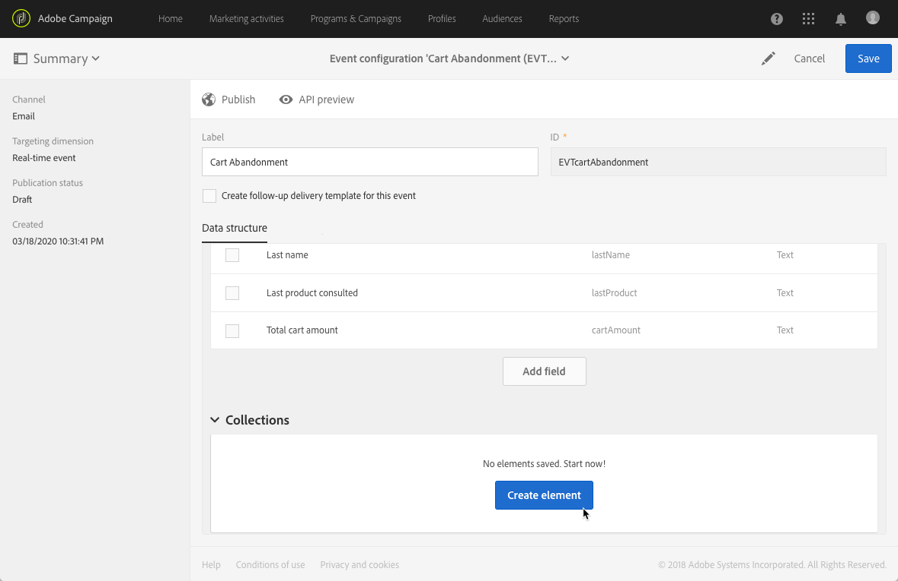
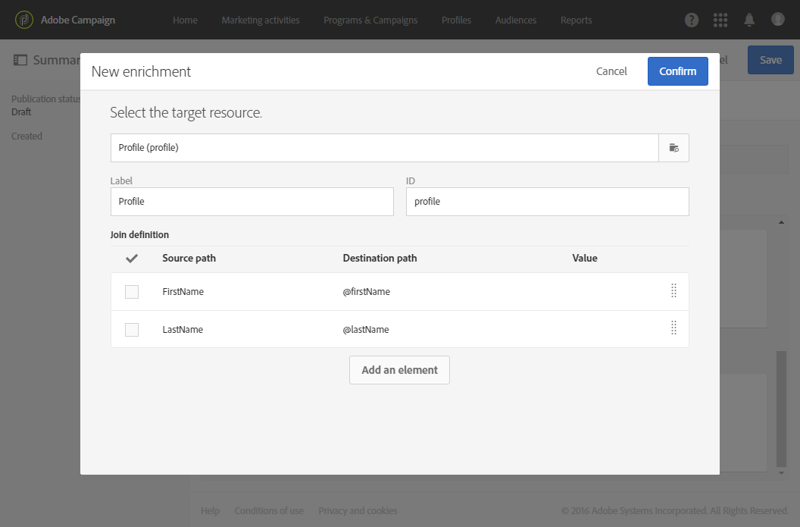

# 트랜잭션 이벤트 구성 {#configuring-transactional-event}

Adobe Campaign으로 트랜잭션 메시지를 보내려면 먼저 이벤트를 만들고 구성하여 이벤트 데이터의 구조를 설명해야 합니다.

>[!IMPORTANT]
>
>[기능 관리자](../../administration/using/users-management.md#functional-administrators) <!--being part of the **[!UICONTROL All]** [organizational unit](../../administration/using/organizational-units.md) -->만 이벤트 구성을 만들고 편집할 수 있는 적절한 권한이 있습니다.

구성은 전송하려는 트랜잭션 메시지](../../channels/using/getting-started-with-transactional-msg.md#transactional-message-types)의 유형과 사용할 채널에 따라 달라집니다. [ 자세한 내용은 [특정 구성](#transactional-event-specific-configurations)을 참조하십시오.

구성이 완료되면 이벤트를 게시해야 합니다. [트랜잭션 이벤트 게시](../../channels/using/publishing-transactional-event.md)를 참조하십시오.

## 이벤트 만들기 {#creating-an-event}

시작하려면 필요에 따라 이벤트를 만듭니다.

1. 왼쪽 상단 모서리에서 **Adobe** 로고를 클릭한 다음 **[!UICONTROL Marketing plans]** > **[!UICONTROL Transactional messages]** > **[!UICONTROL Event configuration]**&#x200B;를 선택합니다.
1. **[!UICONTROL Create]** 버튼을 클릭합니다.
1. 이벤트의 **[!UICONTROL Label]** 및 **[!UICONTROL ID]**&#x200B;을 입력합니다. **[!UICONTROL ID]** 필드는 필수 항목이며 접두사 &quot;EVT&quot;로 시작해야 합니다. 이 접두사를 사용하지 않으면 **[!UICONTROL Create]** 을 클릭하면 자동으로 추가됩니다.

   

   >[!IMPORTANT]
   >
   >ID는 EVT 접두사를 포함하여 64자를 초과할 수 없습니다.

1. 트랜잭션 메시지 **[!UICONTROL Email]**, **[!UICONTROL Mobile (SMS)]** 또는 **[!UICONTROL Push notification]**&#x200B;를 전송하는 데 사용할 채널을 선택하십시오. 각 이벤트에 대해 하나의 채널만 사용할 수 있으며 나중에 변경할 수 없습니다.

1. 원하는 이벤트 구성에 해당하는 타겟팅 차원을 선택하고 **[!UICONTROL Create]** 을 클릭합니다.

   이벤트 기반 트랜잭션 메시지는 이벤트 자체에 포함된 데이터를 타겟팅하는 반면, 프로필 기반 트랜잭션 메시지는 Adobe Campaign 데이터베이스에 포함된 데이터를 타겟팅합니다. 자세한 내용은 [특정 구성](#transactional-event-specific-configurations)을 참조하십시오.

>[!NOTE]
>
>트랜잭션 이벤트 수는 플랫폼에 영향을 줄 수 있습니다. 최적의 성능을 보장하려면 사용하지 않은 이벤트를 삭제해야 합니다. [이벤트 삭제](../../channels/using/publishing-transactional-event.md#deleting-an-event)를 참조하십시오.

## 이벤트 속성 정의 {#defining-the-event-attributes}

**[!UICONTROL Fields]** 섹션에서 이벤트 컨텐츠에 통합할 속성을 정의한 다음 트랜잭션 메시지를 개인화하는 데 사용할 수 있습니다.

필드를 추가 및 수정하는 단계는 [사용자 지정 리소스](../../developing/using/configuring-the-resource-s-data-structure.md#adding-fields-to-a-resource)에 대해 동일합니다.

>[!NOTE]
>
>다국어 트랜잭션 메시지를 만들려면 **[!UICONTROL AC_language]** ID를 사용하여 추가 이벤트 속성을 정의합니다. 이는 이벤트 트랜잭션 메시지에만 적용됩니다. 이벤트가 게시되면 다국어 트랜잭션 메시지의 콘텐츠를 편집하는 단계는 다국어 표준 이메일과 동일합니다. [다국어 이메일 만들기](../../channels/using/creating-a-multilingual-email.md)를 참조하십시오.

## 데이터 컬렉션 정의 {#defining-data-collections}

이벤트 컨텐츠에 여러 속성을 포함하는 각 요소 자체를 요소 컬렉션으로 추가할 수 있습니다.

이 컬렉션은 트랜잭션 이메일에서 [제품 목록](../../designing/using/using-product-listings.md)을(를) 메시지 콘텐츠에 추가하는 데 사용할 수 있습니다. 예를 들어 제품 목록(예: 가격, 참조 번호, 수량 등)은 의 각 제품에서 사용할 수 있습니다.

1. **[!UICONTROL Collections]** 섹션에서 **[!UICONTROL Create element]** 버튼을 클릭합니다.

   

1. 컬렉션에 사용할 레이블과 ID를 추가합니다.
1. 목록의 각 제품에 대한 트랜잭션 메시지에 표시할 모든 필드를 추가합니다.

   이 예에서는 다음 필드를 추가했습니다.

   

1. **[!UICONTROL Enrichment]** 탭에서는 컬렉션의 각 항목을 보강할 수 있습니다. 이렇게 하면 Adobe Campaign 데이터베이스 또는 만든 다른 리소스의 정보로 해당 제품 목록의 요소를 개인화할 수 있습니다.

>[!NOTE]
>
>컬렉션의 요소를 보강하는 단계는 [이벤트 강화](#enriching-the-transactional-message-content) 섹션에 설명된 것과 동일합니다. 이벤트를 강화하면 컬렉션을 보강할 수 없습니다. **[!UICONTROL Collections]** 섹션에서 컬렉션 자체에 데이터 보강 기능을 추가해야 합니다.

이벤트 및 메시지가 게시되면 트랜잭션 메시지에서 이 컬렉션을 사용할 수 있습니다.

다음은 이 예제의 API 미리 보기입니다.

**관련 항목:**

* [이벤트 미리 보기 및 게시](../../channels/using/publishing-transactional-event.md#previewing-and-publishing-the-event)
* [트랜잭션 메시지에서 제품 목록 사용](../../designing/using/using-product-listings.md)
* [트랜잭션 메시지 게시](../../channels/using/publishing-transactional-message.md#publishing-a-transactional-message)

## 이벤트 강화 {#enriching-the-transactional-message-content}

메시지를 개인화하기 위해 Adobe Campaign 데이터베이스의 정보로 트랜잭션 메시지 콘텐츠를 보강할 수 있습니다. 예를 들어 각 수신자의 성 또는 CRM ID에서 주소 또는 생년월일 또는 프로필 테이블에 추가된 다른 사용자 지정 필드와 같은 데이터를 복구하여 수신자에게 전송되는 정보를 개인화할 수 있습니다.

확장 **[!UICONTROL Profile and services Ext API]**&#x200B;의 정보로 트랜잭션 메시지 콘텐츠를 보강할 수 있습니다. 자세한 내용은 [API 확장 을 참조하십시오. 확장 게시](../../developing/using/step-2--publish-the-extension.md)

이 정보는 또한 새로운 리소스에 저장할 수 있습니다. 이 경우 리소스는 **[!UICONTROL Profile]** 또는 **[!UICONTROL Service]** 리소스에 직접 또는 다른 테이블을 통해 연결해야 합니다. 예를 들어 아래 구성에서 **[!UICONTROL Product]** 리소스가 **[!UICONTROL Profile]** 리소스에 연결된 경우 제품 카테고리 또는 ID와 같은 **[!UICONTROL Product]** 리소스의 정보로 트랜잭션 메시지 콘텐츠를 보강할 수 있습니다.

리소스 만들기 및 게시에 대한 자세한 내용은 [이 섹션](../../developing/using/key-steps-to-add-a-resource.md)을 참조하십시오.

1. **[!UICONTROL Enrichment]** 섹션에서 **[!UICONTROL Create element]** 버튼을 클릭합니다.

   

1. 메시지를 연결할 리소스를 선택합니다. 이 경우 **[!UICONTROL Profile]** 리소스를 선택합니다.

   

1. **[!UICONTROL Create element]** 단추를 사용하여 선택한 리소스의 필드를 이전에 이벤트에 추가한 필드 중 하나에 연결합니다( [이벤트 특성 정의](#defining-the-event-attributes) 참조).

   

1. 이 예제에서는 **[!UICONTROL Last name]** 및 **[!UICONTROL First name]** 필드를 **[!UICONTROL Profile]** 리소스의 해당 필드와 조정합니다.

   

   **[!UICONTROL Service]** 리소스를 사용하여 트랜잭션 메시지 콘텐츠를 보강할 수도 있습니다. 서비스에 대한 자세한 내용은 [이 섹션](../../audiences/using/creating-a-service.md)을 참조하십시오.

1. [프로필 기반 이벤트](#profile-based-transactional-messages)를 만들거나 편집하는 경우, **[!UICONTROL Targeting enrichment]** 섹션에서 게재 실행 중에 메시지 타겟으로 사용할 데이터 보강 항목을 선택합니다.

   

   >[!NOTE]
   >
   >프로필 기반 이벤트에 대해 데이터 보강 만들기 및 **[!UICONTROL Profile]** 리소스를 기반으로 타겟팅 보강 선택 은 필수입니다.

이벤트 및 메시지가 게시되면 이 링크를 통해 트랜잭션 메시지의 콘텐츠를 보강할 수 있습니다.

**관련 항목:**

* [이벤트 미리 보기 및 게시](../../channels/using/publishing-transactional-event.md#previewing-and-publishing-the-event)
* [트랜잭션 메시지 개인화](../../channels/using/editing-transactional-message.md#personalizing-a-transactional-message)
* [트랜잭션 메시지 게시](../../channels/using/publishing-transactional-message.md#publishing-a-transactional-message)

## 트랜잭션 이벤트 검색 {#searching-transactional-events}

이미 만든 트랜잭션 이벤트에 액세스하여 검색하려면 아래 단계를 수행하십시오.

1. 왼쪽 상단 모서리에서 **Adobe** 로고를 클릭한 다음 **[!UICONTROL Marketing plans]** > **[!UICONTROL Transactional messages]** > **[!UICONTROL Event configuration]**&#x200B;를 선택합니다.
1. **[!UICONTROL Show search]** 버튼을 클릭합니다.

   

1. **[!UICONTROL Publication status]**&#x200B;에서 필터링할 수 있습니다. 이렇게 하면 게시된 이벤트만 표시할 수 있습니다.
1. **[!UICONTROL Last event received]** 을 사용하여 이벤트를 필터링할 수도 있습니다. 예를 들어 10을 입력하면 10일 전에 마지막으로 받은 이벤트가 있는 이벤트 구성만 표시됩니다. 이렇게 하면 지정된 기간 동안 비활성 상태인 이벤트를 표시할 수 있습니다.

   

   >[!NOTE]
   >
   >기본값은 0입니다. 그러면 모든 이벤트가 표시됩니다.

## 특정 구성 {#transactional-event-specific-configurations}

트랜잭션 이벤트 구성은 전송할 트랜잭션 메시지](../../channels/using/getting-started-with-transactional-msg.md#transactional-message-types)의 유형(이벤트 또는 프로필)과 사용할 채널에 따라 달라질 수 있습니다.[

다음 섹션에서는 원하는 트랜잭션 메시지에 따라 어떤 구성을 설정해야 하는지 자세히 설명합니다. 이벤트를 구성하는 일반적인 단계에 대한 자세한 내용은 [이벤트 만들기](#creating-an-event)를 참조하십시오.

### 이벤트 기반 트랜잭션 메시지 {#event-based-transactional-messages}

이벤트를 타겟팅하는 이벤트 트랜잭션 메시지를 보낼 수 있습니다. 이 유형의 트랜잭션 메시지에 프로필 정보가 포함되어 있지 않습니다. 게재 대상은 이벤트 자체에 포함된 데이터로 정의됩니다.

이벤트 기반 트랜잭션 메시지를 보내려면 먼저 이벤트 자체에 포함된 **데이터를 타겟팅하는 이벤트를 만들고 구성해야 합니다**.

1. 이벤트 구성을 만들 때 **[!UICONTROL Real-time event]** 타겟팅 차원을 선택합니다( [이벤트 만들기](#creating-an-event) 참조).
1. 트랜잭션 메시지를 개인화할 수 있도록 이벤트에 필드를 추가합니다( [이벤트 특성 정의](#defining-the-event-attributes) 참조).
1. 이벤트 기반 트랜잭션 메시지는 보낸 이벤트에 있는 데이터만 사용하여 수신자와 메시지 콘텐츠 개인화를 정의합니다.

   그러나 Adobe Campaign 데이터베이스의 추가 정보를 사용하려는 경우 트랜잭션 메시지 콘텐츠를 보강할 수 있습니다([트랜잭션 메시지 콘텐츠 보강](#enriching-the-transactional-message-content) 참조).

1. 이벤트를 미리 보고 게시합니다( [이벤트 미리 보기 및 게시](../../channels/using/publishing-transactional-event.md#previewing-and-publishing-the-event) 참조).

   이벤트를 미리 볼 때 REST API에는 선택한 채널에 따라 이메일 주소, 휴대폰 또는 푸시 알림 특정 속성을 지정하는 속성이 포함되어 있습니다.

   이벤트가 게시되면 새 이벤트에 연결된 트랜잭션 메시지가 자동으로 만들어집니다. 이벤트가 트랜잭션 메시지 전송을 트리거하려면 방금 만들어진 메시지를 [modify](../../channels/using/editing-transactional-message.md) 및 [publish](../../channels/using/publishing-transactional-message.md)해야 합니다.

1. 이벤트를 웹 사이트에 통합합니다([이벤트 트리거 통합](../../channels/using/getting-started-with-transactional-msg.md#integrate-event-trigger) 참조).

### 프로필 기반 트랜잭션 메시지 {#profile-based-transactional-messages}

고객 프로필을 기반으로 트랜잭션 메시지를 보내면 마케팅 유형화 규칙을 적용하고, 구독 취소 링크를 포함하거나, 글로벌 게재 보고에 메시지를 추가하고, 고객 여정에서 이를 활용할 수 있습니다.

프로필 기반 트랜잭션 메시지를 보내려면 먼저 Adobe Campaign 데이터베이스&#x200B;**에서**&#x200B;데이터를 타겟팅하는 이벤트를 만들고 구성해야 합니다.

1. 이벤트 구성을 만들 때 **[!UICONTROL Profile event]** 타겟팅 차원을 선택합니다( [이벤트 만들기](#creating-an-event) 참조).
1. 트랜잭션 메시지를 개인화할 수 있도록 이벤트에 필드를 추가합니다( [이벤트 특성 정의](#defining-the-event-attributes) 참조). 데이터 보강 작업을 수행하려면 필드를 하나 이상 추가해야 합니다. Adobe Campaign 데이터베이스의 개인화 필드를 사용할 수 있으므로 **이름** 및 **성**&#x200B;과 같은 다른 필드를 만들 필요가 없습니다.
1. 이벤트를 **[!UICONTROL Profile]** 리소스에 연결하는 데이터 보강 만들기( [이벤트 강화](#enriching-the-transactional-message-content) 참조) 및 이 데이터 보강 항목을 **[!UICONTROL Targeting enrichment]** 로 선택합니다.

   >[!IMPORTANT]
   >
   >이 단계는 프로필 기반 이벤트에 필수입니다.

1. 이벤트를 미리 보고 게시합니다( [이벤트 미리 보기 및 게시](../../channels/using/publishing-transactional-event.md#previewing-and-publishing-the-event) 참조).

   이벤트를 미리 볼 때 **[!UICONTROL Profile]** 리소스에서 검색되므로 REST API에 이메일 주소, 휴대폰 또는 푸시 알림 특정 속성을 지정하는 속성이 포함되어 있지 않습니다.

   이벤트가 게시되면 새 이벤트에 연결된 트랜잭션 메시지가 자동으로 만들어집니다. 이벤트가 트랜잭션 메시지 전송을 트리거하려면 방금 만든 메시지를 [modify](../../channels/using/editing-transactional-message.md) 및 [publish](../../channels/using/publishing-transactional-message.md)해야 합니다.

1. 이벤트를 웹 사이트에 통합합니다([이벤트 트리거 통합](../../channels/using/getting-started-with-transactional-msg.md#integrate-event-trigger) 참조).

<!--### Transactional SMS messages {#transactional-sms}

The steps to configure an  event to send an SMS transactional message are the same as for the email channel. The only differences are as follows:

* When creating the corresponding event, you need to select the **[!UICONTROL Mobile (SMS)]** channel.

* When previewing the event corresponding to an event-based transactional SMS, the REST API contains an attribute specifying the mobile phone instead of the email address.

* The specificities to edit the content of an SMS transactional message are the same as for a [standard SMS](../../channels/using/about-sms-and-push-content-design.md).-->

### 트랜잭션 푸시 알림 {#transactional-push-notifications}

두 가지 유형의 트랜잭션 푸시 알림을 보낼 수 있습니다.
* 모바일 애플리케이션에서 알림을 수신하도록 선택한 모든 사용자에 대한 익명의 트랜잭션 푸시 알림. [이벤트 기반 트랜잭션 푸시 알림 구성](../../channels/using/transactional-push-notifications.md#event-based-transactional-push-notifications)을 참조하십시오.
* 모바일 애플리케이션을 구독한 Adobe Campaign 프로필에 대한 트랜잭션 푸시 알림. [프로필 기반 트랜잭션 푸시 알림 구성](../../channels/using/transactional-push-notifications.md#profile-based-transactional-push-notifications)을 참조하십시오.

>[!IMPORTANT]
>
>트랜잭션 푸시 알림을 전송하려면 그에 따라 Adobe Campaign을 구성해야 합니다. [모바일 애플리케이션 구성](../../administration/using/configuring-a-mobile-application.md)을 참조하십시오.

### 후속 메시지 {#follow-up-messages}

특정 트랜잭션 메시지를 받은 고객에게 후속 메시지를 보낼 수 있습니다.

후속 메시지를 보낼 수 있는 이벤트를 구성하는 단계는 [이 섹션](../../channels/using/follow-up-messages.md#configuring-an-event-to-send-a-follow-up-message)에 자세히 설명되어 있습니다.
