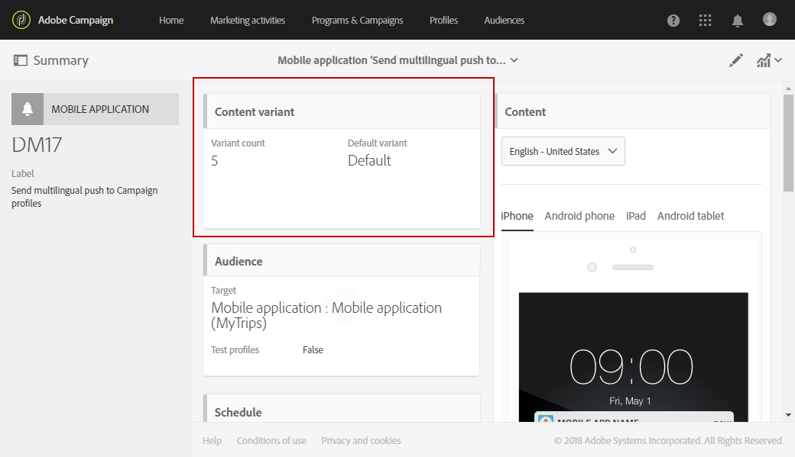

# 다국어 푸시 알림 만들기{#creating-a-multilingual-push-notification}

## 다국어 푸시 알림 기본 정보 {#about-multilingual-push-notification}

사용자의 선호 언어 및 지역을 기반으로 메시지를 전송하여 푸시 알림 콘텐츠를 개인화할 수 있습니다. 콘텐츠 편집기에서 다국어 푸시 알림 콘텐츠 변형을 직접 가져오고 단일 게재에서 다국어 푸시 알림을 전송할 수 있습니다.

이 기능은 푸시 알림에 사용된 게재 템플릿에 따라 수신자의 프로필에 지정된 기본 언어 또는 모바일 앱 구독자에 대한 시스템 언어 기본 설정을 활용합니다. 특정 사용자에 대해 언어 기본 설정이 채워지지 않은 경우 시스템은 다국어 푸시 알림을 만들 때 정의된 기본 변형을 사용합니다. 프로필 및 구독자를 관리하는 방법에 대한 자세한 내용은 이 [안내서](../../audiences/using/get-started-profiles-and-audiences.md)를 참조하세요.

푸시 알림 게재에 다국어 콘텐츠 변형을 사용하려면 다음 단계를 수행합니다.

* [1단계: 다국어 콘텐츠 변형 업로드](#step-1--upload-multilingual-content-variant)
* [2단계: 다국어 콘텐츠 변형을 사용하여 푸시 알림 미리보기 및 완료](#step-2--preview-and-finalize-a-push-notification-using-multilingual-content-variants)
* [3단계: 다국어 푸시 알림 게재 보내기 및 분석](#step-3--send-and-analyze-multilingual-push-notification-delivery)

## 1단계: 다국어 콘텐츠 변형 업로드 {#step-1--upload-multilingual-content-variant}

다국어 푸시 알림을 개인화하기 전에 먼저 다국어 게재 템플릿에서 콘텐츠 변형을 업로드하고 게재를 만들어야 합니다.

>[!NOTE]
>
>각 언어 변형에 대해 변형을 수동으로 만들려면 이 단계를 건너뛸 수도 있습니다.

1. **[!UICONTROL Marketing activities]**&#x200B;에서 **[!UICONTROL Create]** 단추를 클릭한 다음 **[!UICONTROL Push notification]**&#x200B;을(를) 선택합니다.
1. 모바일 애플리케이션을 구독한 Adobe Campaign 프로필을 타겟팅하거나 모바일 애플리케이션에서 알림을 받도록 선택한 모든 사용자에게 푸시 알림을 전송하기 위해 템플릿 **[!UICONTROL Send multilingual push to app subscriber]**&#x200B;을(를) 타겟팅하려면 템플릿 **[!UICONTROL Send multilingual push to Campaign profiles]**&#x200B;을(를) 선택합니다.

   

1. 푸시 알림 속성을 입력하고 **[!UICONTROL Associate a Mobile App to a delivery]** 필드에서 모바일 앱을 선택합니다.

   드롭다운에 SDK V4 및 Adobe Experience Platform SDK 애플리케이션이 모두 표시됩니다.

1. **[!UICONTROL Audiences]** 창에서 쿼리를 끌어서 놓아 대상자를 세밀하게 조정합니다.

   추가된 쿼리는 선택한 템플릿에 따라 다릅니다. **[!UICONTROL Send multilingual push to Campaign profiles]** 템플릿을 선택한 경우 모바일 응용 프로그램의 알려진 수신자를 쿼리할 수 있습니다. **[!UICONTROL Send multilingual push to app subscriber]** 템플릿을 선택한 경우 옵트인한 특정 앱의 모든 구독자를 쿼리할 수 있습니다.
   >[!NOTE]
   >
   >특정 언어로 대상을 타깃팅하는 경우 CSV 파일에 모든 타깃팅된 언어를 나열해야 합니다.

   

1. **[!UICONTROL Manage Content Variants]** 창에서 파일을 끌어서 놓거나 컴퓨터에서 파일을 선택합니다.

   파일은 UTF8로 인코딩해야 하며 **[!UICONTROL Download the sample file]** 옵션을 클릭하여 찾을 수 있는 특정 레이아웃이 있어야 합니다. 로케일 값에도 적절한 구문을 사용해야 합니다. 파일 형식 및 지원되는 로케일에 대한 자세한 내용은 이 [페이지](../../channels/using/generating-csv-multilingual-push.md)를 참조하세요.

   

1. 파일을 업로드하면 언어 변형이 **[!UICONTROL Variants]** 탭에서 자동으로 채워집니다. 타겟팅된 사용자에 대해 기본 언어가 지정되지 않은 경우 기본 콘텐츠 변형이 되는 **[!UICONTROL Default variant]**&#x200B;을(를) 파일에 제공할 수 있습니다.

   

1. **[!UICONTROL Variant selection]** 탭은 게재 템플릿에 따라 고려할 언어 환경 설정을 결정하는 스크립트를 제공합니다. 이는 변경할 필요가 없는 기본 스크립트입니다.
1. 가져온 파일에 없는 변형을 더 추가하려면 **[!UICONTROL Add an element]** 단추를 클릭하고 필요한 수만큼 새 언어 변형을 추가할 수 있습니다.

   파일에서 업로드한 변형 이외의 변형을 추가하면 콘텐츠가 이 언어에 연결되지 않습니다. 게재 대시보드에서 직접 콘텐츠를 편집해야 합니다.

   

1. 구성이 완료되면 **[!UICONTROL Create]**&#x200B;을(를) 클릭합니다. 언제든지 **[!UICONTROL Content variant]** 창으로 돌아와 게재 대시보드에서 일부 내용을 변경할 수 있습니다.

   

이제 다국어 푸시 알림을 개인화할 수 있습니다.

## 2단계: 다국어 콘텐츠 변형을 사용하여 푸시 알림 미리보기 및 완료 {#step-2--preview-and-finalize-a-push-notification-using-multilingual-content-variants}

이제 콘텐츠 변형이 포함된 파일을 업로드한 후 푸시 알림 게재에서 다른 변형을 미리 볼 수 있습니다.

파일에서 업로드한 변형 외에도 더 많은 변형을 만들고 편집할 수도 있습니다.

1. 게재 대시보드의 **[!UICONTROL Content]** 창에서 드롭다운을 사용하면 선택한 언어에 따라 푸시 알림 콘텐츠를 미리 볼 수 있습니다.

   

1. 특정 언어에 대해 콘텐츠 변형이 지정되지 않은 경우 미리 보기 아래의 벨 아이콘을 클릭하여 이 언어 변형에 콘텐츠를 추가합니다.

   **[!UICONTROL Content]** 창을 클릭하면 푸시 알림은 드롭다운에서 선택한 언어의 콘텐츠를 나타냅니다. 이 창에서 변경한 사항은 한 언어에만 영향을 줍니다.

1. 콘텐츠 변형을 클릭하여 개인화 필드 등으로 추가로 맞춤화할 수도 있습니다.

   푸시 알림을 사용자 지정하는 방법에 대한 자세한 내용은 이 [섹션](../../channels/using/customizing-a-push-notification.md)을 참조하세요.

   

1. 언어 변형을 추가하거나 삭제하려면 **[!UICONTROL Content variant]** 창을 클릭하십시오.

   새 언어를 추가하면 추가된 언어에 연결된 푸시 알림에 콘텐츠를 수동으로 추가해야 합니다.

   

다국어 푸시 알림 게재를 보낼 준비가 되었습니다.

## 3단계: 다국어 푸시 알림 게재 보내기 및 분석 {#step-3--send-and-analyze-multilingual-push-notification-delivery}

이제 다국어 콘텐츠 변형 푸시 알림을 사용자에게 보낼 준비가 되었습니다.

1. 보내기 준비를 시작하려면 **[!UICONTROL Prepare]** 단추를 클릭하세요.
1. 경고 없이 준비가 완료되면 **[!UICONTROL Confirm]** 단추를 클릭하여 다국어 푸시를 보낼 수 있습니다.

   

1. 푸시 알림을 성공적으로 보낸 후 **[!UICONTROL Reports]** 아이콘을 클릭한 다음 **[!UICONTROL Dynamic reports]**&#x200B;을(를) 클릭하여 게재 성공 여부를 분석합니다.

   

1. **[!UICONTROL Push notification report]**&#x200B;을(를) 선택합니다.
1. 데이터 필터링을 시작하려면 **[!UICONTROL Variant]** 차원을 패널로 끌어서 놓습니다.

   

이제 다국어 푸시 알림 게재가 수신자에게 미치는 영향을 측정할 수 있습니다.

**관련 항목:**

* [푸시 알림 보고서](../../reporting/using/push-notification-report.md)
* [워크플로우 내에서 푸시 알림 보내기](../../automating/using/push-notification-delivery.md)
