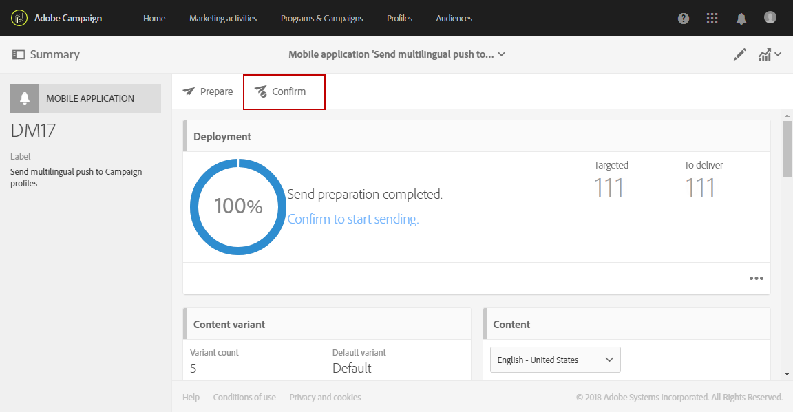

# Creating a multilingual push notification{#creating-a-multilingual-push-notification}

## About multilingual push notification {#about-multilingual-push-notification}

사용자의 선호 언어 및 지역을 기반으로 메시지를 전송하여 푸시 알림 콘텐츠를 개인화할 수 있습니다. 컨텐츠 편집기에서 다국어 푸시 알림 컨텐츠 변형을 바로 가져와 한 번의 클릭으로 다국어 푸시 알림을 전송할 수 있습니다.

이 기능은 푸시 알림에 사용되는 배달 템플릿에 따라 모바일 앱 가입자에 대해 수신자의 프로필이나 시스템 언어 기본 설정에 지정된 기본 언어를 활용합니다. 특정 사용자에 대해 언어 기본 설정이 채워지지 않으면 시스템은 다국어 푸시 알림을 만드는 동안 정의된 기본 변형을 사용합니다. For more information on how to manage your profiles and subscribers, refer to this [guide](../../audiences/using/about-profiles-and-audiences.md).

푸시 알림 전달을 위해 다국어 컨텐츠 변형을 사용하려면 다음 단계를 수행하십시오.

* [1 단계: 다국어 컨텐츠 변형 업로드](../../channels/using/creating-a-multilingual-push-notification.md#step-1--upload-multilingual-content-variant)
* [2 단계: 다국어 컨텐츠 변형을 사용하여 푸시 알림 미리 보기 및 완성](../../channels/using/creating-a-multilingual-push-notification.md#step-2--preview-and-finalize-a-push-notification-using-multilingual-content-variants)
* [3 단계: 다국어 푸시 알림 전달 전송 및 분석](../../channels/using/creating-a-multilingual-push-notification.md#step-3--send-and-analyze-multilingual-push-notification-delivery)

## Step 1: Upload multilingual content variant {#step-1--upload-multilingual-content-variant}

다국어 푸시 알림을 개인화하기 전에 먼저 다국어 전달 템플릿에서 컨텐츠 변형을 업로드하고 전달을 만들어야 합니다.

>[!NOTE]
>
>각 언어 변형에 대해 수동으로 변형을 만들려면 이 단계를 건너뛸 수도 있습니다.

1. In the **[!UICONTROL Marketing activities]**, click the **[!UICONTROL Create]** button then select **[!UICONTROL Push notification]**.
1. Select the template **[!UICONTROL Send multilingual push to Campaign profiles]** if you want to target the Adobe Campaign profiles who have subscribed to your mobile application or the template **[!UICONTROL Send multilingual push to app subscriber]** to send a push notification to all users who have opted in to receive notifications from your mobile application.

   

1. Enter your push notification properties and select your mobile app in the **[!UICONTROL Associate a Mobile App to a delivery]** field.

   드롭다운에는 SDK v 4와 Adobe Experience Platform SDK 애플리케이션이 모두 표시됩니다.

1. **[!UICONTROL Audiences]** Windows 에서는 쿼리를 드래그하여 놓는 방식으로 고객을 세밀하게 조정할 수 있습니다.

   The queries added depend on the chosen template: if you chose the **[!UICONTROL Send multilingual push to Campaign profiles]** template you can query known recipients of your mobile application. **[!UICONTROL Send multilingual push to app subscriber]** 반면에 템플릿을 선택한 경우 선택한 특정 앱의 모든 가입자를 쿼리할 수 있습니다.

   

1. **[!UICONTROL Manage Content Variants]** 창에서 파일을 드래그하여 놓거나 컴퓨터에서 파일을 선택합니다.

   The file has to be UTF8 encoded and must have a specific layout which can be found by clicking the **[!UICONTROL Download the sample file]** option. 로케일 값에 적절한 구문을 사용해야 합니다. For more information regarding the file format and the supported locales, refer to this [technote](http://helpx.adobe.com/campaign/kb/acs-generate-csv-multilingual-push.html).

   

1. After uploading your file, the language variants are automatically populated in the **[!UICONTROL Variants]** tab. Note that you can provide a **[!UICONTROL Default variant]** in the file which will be your default content variant if no preferred language is specified for the targeted user.

   

1. **[!UICONTROL Variant selection]** 탭에서는 배달 템플릿에 따라 고려할 언어 기본 설정을 결정하는 스크립트를 제공합니다. 이 스크립트는 변경하지 않아도 됩니다.
1. If you want to add more variants not present in the imported file, you can do so by clicking the **[!UICONTROL Add an element]** button and add as many new language variants as needed.

   파일에서 업로드된 것 이외의 변형을 추가하여 이 언어와 연결할 수 없습니다. 배달 대시보드에서 직접 컨텐츠를 편집해야 합니다.

   

1. Click **[!UICONTROL Create]** when the configuration is done. **[!UICONTROL Content variant]** 언제든지 창으로 돌아가 배달 대시보드에서 일부 항목을 변경할 수 있습니다.

   

이제 다국어 푸시 알림을 개인화할 수 있습니다.

## Step 2: Preview and finalize a push notification using multilingual content variants {#step-2--preview-and-finalize-a-push-notification-using-multilingual-content-variants}

컨텐츠 변형이 포함된 파일을 업로드한 후 푸시 알림 전달에서 다른 변형을 미리 볼 수 있습니다.

또한 파일에서 업로드된 것 외에도 더 많은 변형을 만들고 편집할 수 있습니다.

1. In the **[!UICONTROL Content]** window from the delivery dashboard, the drop-down allows you to preview your push notification content depending on the chosen language.

   

1. 특정 언어에 대해 컨텐츠 변형이 지정되지 않은 경우 미리 보기 아래의 벨 아이콘을 클릭하여 이 언어 변형에 컨텐츠 추가를 시작합니다.

   **[!UICONTROL Content]** 창을 클릭하면 푸시 알림은 드롭다운에서 선택한 언어로 된 컨텐츠를 나타냅니다. 이 창에서 변경한 내용은 하나의 언어에만 적용됩니다.

1. 컨텐츠 변형을 클릭하여 개인화 필드로 예를 들어, 사용자 지정 필드를 추가할 수도 있습니다.

   For more information on how to customize your push notification, refer to this [section](../../channels/using/customizing-a-push-notification.md).

   

1. Click the **[!UICONTROL Content variant]** window if you want to add or delete language variants.

   새 언어를 추가하면 추가된 언어에 연결된 푸시 알림에 컨텐츠를 수동으로 추가해야 합니다.

   

이제 다국어 푸시 알림 전달을 전송할 수 있습니다.

## Step 3: Send and analyze multilingual push notification delivery {#step-3--send-and-analyze-multilingual-push-notification-delivery}

이제 다국어 컨텐츠 변형 푸시 알림을 사용자에게 전송할 수 있습니다.

1. To start preparing the send, click the **[!UICONTROL Prepare]** button.
1. When the preparation is finished with no warnings, you can click the **[!UICONTROL Confirm]** button to start sending your multilingual push.

   

1. After successfully sending your push notification, click the **[!UICONTROL Reports]** icon then **[!UICONTROL Dynamic reports]** to analyze the success of your delivery.

   

1. **[!UICONTROL Push notification report]** Select.
1. **[!UICONTROL Variant]** 데이터를 패널에 드래그하여 놓아 데이터 필터링을 시작합니다.

   

이제 다국어 푸시 알림 전달 효과를 받는 사람에게 측정할 수 있습니다.

**관련 항목:**

* [푸시 알림 보고서](../../reporting/using/push-notification-report.md)
* [워크플로우 내에서 푸시 알림 전송](../../automating/using/push-notification-delivery.md)

