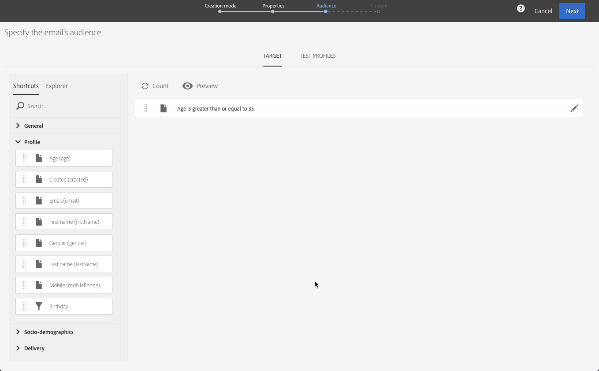

# 이메일 만들기{#creating-an-email}

캠페인 [, Adobe Campaign](../../start/using/marketing-activities.md#creating-a-marketing-activity)홈 페이지 [또는](../../start/using/interface-description.md#home-page)마케팅 활동 목록에서 이메일을 만들 수 있습니다. 워크플로우에서 한 번 전송하고 되풀이되는 이메일을 만들 수도 있습니다.

1. 이메일 마케팅 활동 만들기를 시작한 후 사용할 템플릿을 선택합니다.

   기본적으로 각 마케팅 활동에 대해 여러 템플릿 중에서 선택할 수 있습니다. 이를 통해 필요에 따라 특정 매개 변수를 미리 구성할 수 있고 브랜드는 게재에 할당할 수도 있습니다. 자세한 내용은 템플릿 [관리를](../../start/using/marketing-activity-templates.md)참조하십시오.

   

   >[!NOTE]
   >
   >후속 작업 및 A/B 테스트 템플릿은 기본적으로 숨겨집니다. 표시하려면 왼쪽( **[!UICONTROL Filter]** 측면 패널)의 상자를 선택합니다.

1. 이메일의 일반 속성을 입력합니다. 레이블 필드에 이름을 입력하고 **ID를** 편집할 수 있습니다. 활동 이름과 해당 ID는 인터페이스에 모두 표시되지만 메시지 수신자는 볼 수 없습니다.

   사용자가 캠페인 컨텐츠에서 볼 수 있는 설명을 추가할 수 있습니다.

   

   >[!NOTE]
   >
   >홈 페이지 또는 마케팅 활동 목록에서 상위 캠페인 내에 이메일을 만들 수 있습니다. 이미 만든 캠페인에서 선택합니다.

1. 비즈니스 기준에 따라 메시지 대상을 정의합니다. 프로필 [관리를](../../audiences/using/about-profiles.md)참조하십시오.

   메시지의 유효성을 검사할 테스트 프로필을 정의할 수도 있습니다. 테스트 [프로필](../../audiences/using/managing-test-profiles.md)관리를 참조하십시오.

   

1. 이메일 디자이너를 사용하여 메시지 내용, 보낸 사람 이름 및 제목을 정의하고 [개인화합니다](../../designing/using/designing-content-in-adobe-campaign.md). 자세한 내용은 이메일 [컨텐츠 디자인](../../designing/using/designing-content-in-adobe-campaign.md)정보를 참조하십시오.

   

   사전 정의된 컨텐츠 템플릿을 사용하거나 Dreamweaver 또는 Adobe Experience Manager를 사용하여 메시지를 직접 디자인할 수 있습니다. 디자이너가 아닌 경우 준비된 컨텐츠를 업로드하거나 URL에서 기존 컨텐츠를 가져올 수도 있습니다. 기존 [컨텐츠](../../designing/using/using-existing-content.md)선택을 참조하십시오.

1. 메시지 미리 보기 메시지 [미리 보기를](../../sending/using/previewing-messages.md)참조하십시오.
1. 이메일 만들기를 확인합니다.

   >[!NOTE]
   >
   >이메일을 저장하려면 먼저 컨텐츠를 편집해야 합니다. 이 **[!UICONTROL Cancel]** 지점을 클릭하면 마법사가 완료되지 않고 이메일이 생성되지 않습니다.

   그러면 이메일 대시보드가 표시됩니다. 메시지를 확인하고 전송을 [준비할 수 있습니다](../../sending/using/preparing-the-send.md).

   오른쪽 상단 모서리의 **[!UICONTROL Edit properties]** 단추를 사용하여 이메일의 속성을 편집할 수 있습니다. 예를 들어 배달 준비 시 레이블이 계산되도록 이메일을 구성할 수 있습니다.  사용 가능한 매개 변수가 [이 섹션에](../../administration/using/configuring-email-channel.md#list-of-email-properties)나열됩니다.

   

1. 전송을 예약합니다. 메시지 [예약을](../../sending/using/about-scheduling-messages.md)참조하십시오.

   

1. 메시지를 준비하여 대상을 분석합니다. See [Preparing the send](../../sending/using/confirming-the-send.md).

   

   >[!NOTE]
   >
   >캠페인에서 과다 복제된 프로파일을 자동으로 제외시키는 글로벌 크로스 채널 피로 규칙을 설정할 수 있습니다. 자세한 내용은 피로 [규칙을](../../administration/using/fatigue-rules.md)참조하십시오.

1. 교정본을 보내 메시지를 확인 및 확인하고 받은 편지함 렌더링을 모니터링할 수 있습니다. 증명 [보내기를](../../sending/using/sending-proofs.md)참조하십시오.

   

1. 메시지를 보내고 메시지 대시보드 및 로그를 통해 전달을 확인합니다. 메시지 [전송을](../../sending/using/confirming-the-send.md)참조하십시오.

   

1. 전달 보고서를 통해 메시지의 효과를 측정할 수 있습니다. 보고에 대한 자세한 내용은 [이 섹션을](../../reporting/using/about-dynamic-reports.md)참조하십시오.

**관련 항목**:

* [이메일](https://docs.adobe.com/content/help/en/campaign-learn/campaign-standard-tutorials/getting-started/create-email-from-homepage.html) 비디오 만들기
* [개인화된 이메일](https://helpx.adobe.com/campaign/kb/acs-get-started-with-emails.html) 단계별 가이드 만들기
* [Adobe Campaign 및 Dreamweaver 통합](https://docs.adobe.com/content/help/en/campaign-learn/campaign-standard-tutorials/designing-content/email-designer/dreamweaver-integration.html) 비디오
* [Adobe Experience Manager와 통합](../../integrating/using/integrating-with-experience-manager.md)
