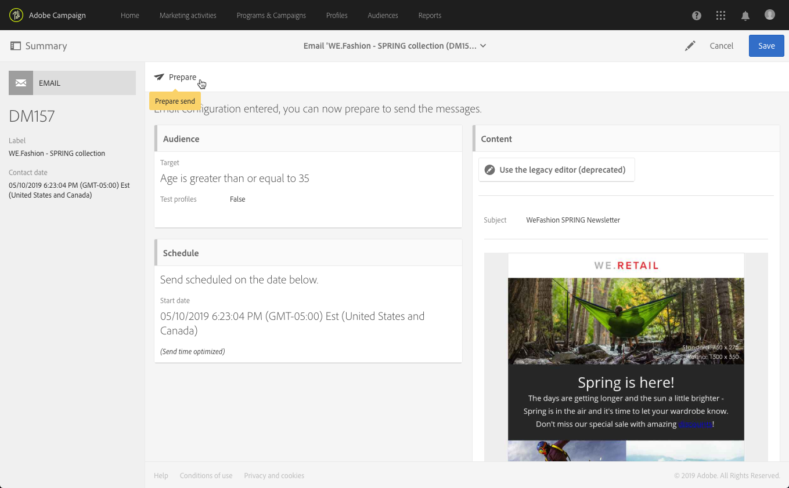

# Creating an email{#creating-an-email}

[Adobe](../../start/using/marketing-activities.md#creating-a-marketing-activity)Campaign [홈 페이지](../../start/using/interface-description.md#home-page)또는 [마케팅 활동 목록에서 이메일을 만들 수 있습니다](../../start/using/marketing-activities.md#about-marketing-activities). 워크플로우에서 단일 전송 및 반복되는 이메일을 만들 수도 있습니다.

1. 이메일 마케팅 활동을 시작했으면 사용할 템플릿을 선택합니다.

   기본적으로 각 마케팅 활동에 대해 여러 템플릿 중에서 선택할 수 있습니다. 따라서 필요에 따라 특정 매개 변수를 미리 구성하고 배송에 브랜드를 할당할 수 있습니다. For more on this, see [Managing templates](../../start/using/about-templates.md).

   

   >[!NOTE]
   >
   >후속 및 A/B 테스트 템플릿은 기본적으로 숨겨져 있습니다. Check the boxes on the left side ( **[!UICONTROL Filter]** lateral panel) if you want to display them.

1. 이메일의 일반 속성을 입력합니다. **레이블** 필드에 이름을 입력하고 ID를 편집할 수 있습니다. 활동 이름과 ID가 모두 인터페이스에 표시되지만 메시지 받는 사람에게는 표시되지 않습니다.

   사용자가 캠페인 컨텐츠에서 볼 수 있는 설명을 추가할 수 있습니다.

   

   >[!NOTE]
   >
   >홈 페이지 또는 마케팅 활동 목록에서 상위 캠페인 내에 이메일을 만들 수 있습니다. 이미 만들어진 캠페인에서 선택합니다.

1. 비즈니스 기준을 기반으로 메시지 대상을 정의합니다. See [Managing profiles](../../audiences/using/about-profiles.md).

   메시지를 확인할 테스트 프로필을 정의할 수도 있습니다. See [Managing test profiles](../../sending/using/managing-test-profiles-and-sending-proofs.md#managing-test-profiles).

   

1. Define and personalize the message content, sender name and subject using the [Email Designer](../../designing/using/about-email-content-design.md#about-the-email-designer). For more on this, see [About email content design](../../designing/using/about-email-content-design.md).

   

   미리 정의된 콘텐츠 템플릿을 사용하거나 Dreamweaver 또는 Adobe Experience Manager를 사용하여 메시지를 직접 디자인할 수 있습니다. 디자이너가 아닌 경우 준비된 컨텐츠를 업로드하거나 URL에서 기존 콘텐트를 가져올 수도 있습니다. See [Selecting an existing content](../../designing/using/selecting-an-existing-content.md).

1. 메시지를 미리 봅니다. See [Previewing messages](../../sending/using/previewing-messages.md).
1. 이메일 만들기를 확인합니다.

   >[!NOTE]
   >
   >이메일을 저장하려면 먼저 컨텐츠를 편집해야 합니다. If you click **[!UICONTROL Cancel]** at this point, you will not complete the wizard and your email will not be created.

   그러면 이메일 대시보드가 표시됩니다. It allows you to check your message and [prepare the send](../../sending/using/preparing-the-send.md).

   The **[!UICONTROL Edit properties]** button in the upper-right corner allows you to edit the properties of the email. 예를 들어 배달 준비 시간에 레이블이 계산되도록 이메일을 구성할 수 있습니다. Available parameters are listed in [this section](../../administration/using/configuring-email-channel.md#list-of-email-properties).

   

1. 전송을 예약합니다. [예약 메시지를 참조하십시오](../../sending/using/about-scheduling-messages.md).

   

1. Target를 분석하도록 메시지를 준비합니다. See [Preparing the send](../../sending/using/confirming-the-send.md).

   

   >[!NOTE]
   >
   >캠페인에서 오버레이된 프로필을 자동으로 제외시키는 글로벌 크로스채널 피로도 규칙을 설정할 수 있습니다. For more on this, see [Fatigue rules](../../administration/using/fatigue-rules.md).

1. 메시지를 확인 및 확인하고 받은 편지함 렌더링을 모니터링할 수 있습니다. See [Sending proof](../../sending/using/managing-test-profiles-and-sending-proofs.md#sending-proofs).

   

1. 메시지를 보내고 메시지 대시보드와 로그를 통해 배달을 확인합니다. See [Sending messages](../../sending/using/confirming-the-send.md).

   

1. 메시지 전달 보고서를 통해 메시지 효과를 측정할 수 있습니다. For more on reporting, see [this section](../../reporting/using/about-dynamic-reports.md).

**관련 항목**:

* [이메일](https://helpx.adobe.com/campaign/kt/acs/using/acs-create-email-from-homepage-feature-video-use.html) 비디오 만들기
* [개인화된 이메일](https://docs.campaign.adobe.com/doc/standard/getting_started/en/ACS_GettingStartedEmail.html) 단계별 가이드 제작
* [Adobe Campaign 및 Dreamweaver 통합](https://helpx.adobe.com/campaign/kt/acs/using/acs-dreamweaver-integration-feature-video-use.html) 비디오
* [Adobe Experience Manager와 통합](../../integrating/using/integrating-with-experience-manager.md)

