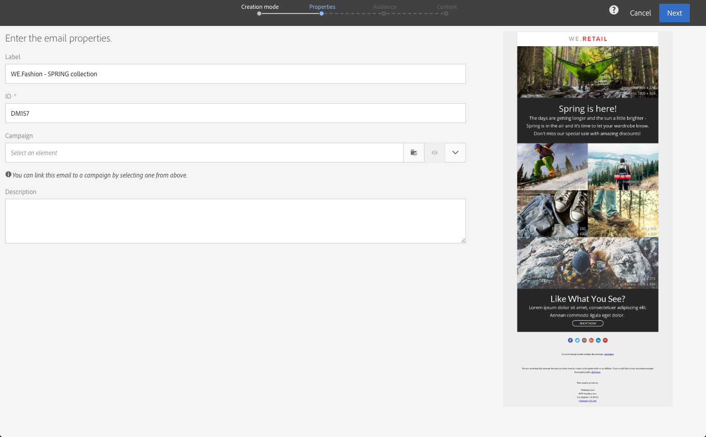

# 이메일 만들기{#creating-an-email}

[캠페인](../../start/using/marketing-activities.md#creating-a-marketing-activity), Adobe Campaign [홈 페이지](../../start/using/interface-description.md#home-page) 또는 [마케팅 활동 목록](../../start/using/marketing-activities.md#about-marketing-activities)에서 이메일을 만들 수 있습니다. 또한 작업 과정에서 한 번 전송하고 반복 이메일을 생성할 수도 있습니다.

 [비디오에서 이 기능 살펴보기](#video)

1. 이메일 마케팅 활동을 만들었으면 사용할 템플릿을 선택합니다.

   기본적으로 각 마케팅 활동에 대해 여러 템플릿 중에서 선택할 수 있습니다. 이를 통해 필요에 따라 특정 매개 변수를 미리 구성할 수 있고 브랜드를 전달에 할당할 수도 있습니다. 자세한 내용은 [템플릿 관리](../../start/using/marketing-activity-templates.md)를 참조하십시오.

   

   >[!NOTE]
   >
   >후속 및 A/B 테스트 템플릿은 기본적으로 숨겨져 있습니다. 표시하려면 왼쪽에 있는 상자( **[!UICONTROL Filter]** 측면 패널)를 선택합니다.

1. 이메일의 일반 속성을 입력합니다. **레이블** 필드에 이름을 입력하고 ID를 편집할 수 있습니다. 활동 이름과 해당 ID는 모두 인터페이스에 표시되지만 메시지 수신자에게는 표시되지 않습니다.

   사용자가 캠페인 콘텐츠에서 볼 수 있는 설명을 추가할 수 있습니다.

   

   >[!NOTE]
   >
   >홈 페이지 또는 마케팅 활동 목록에서 상위 캠페인 내에 이메일을 만들 수 있습니다. 이미 만든 캠페인에서 선택합니다.

1. 비즈니스 기준에 따라 메시지 대상을 정의합니다. [프로필 정보](../../audiences/using/about-profiles.md)를 참조하십시오.

   메시지를 확인할 테스트 프로필을 정의할 수도 있습니다. [테스트 프로필 관리](../../audiences/using/managing-test-profiles.md)를 참조하십시오.

   

1. [이메일 디자이너](../../designing/using/designing-content-in-adobe-campaign.md)를 사용하여 메시지 내용, 보낸 사람 이름 및 제목을 정의하고 개인화합니다. 자세한 내용은 [이메일 컨텐츠 디자인 정보](../../designing/using/designing-content-in-adobe-campaign.md)를 참조하십시오.

   

   사전 정의된 컨텐츠 템플릿을 사용하거나 Dreamweaver 또는 Adobe Experience Manager을 사용하여 메시지를 직접 디자인할 수 있습니다. 디자이너가 아닌 경우 미리 준비한 콘텐트를 업로드하거나 URL에서 기존 콘텐트를 가져올 수도 있습니다. [기존 콘텐츠 선택](../../designing/using/using-existing-content.md)을 참조하십시오.

1. 메시지를 미리 봅니다. [메시지 미리 보기](../../sending/using/previewing-messages.md)를 참조하십시오.
1. 이메일 만들기를 확인합니다.

   >[!NOTE]
   >
   >이메일을 저장하려면 먼저 컨텐츠를 편집해야 합니다. 이 시점에서 **[!UICONTROL Cancel]**&#x200B;을(를) 클릭하면 마법사가 완료되지 않고 이메일이 생성되지 않습니다.

   그러면 이메일 대시보드가 표시됩니다. 메시지를 확인하고 [send](../../sending/using/preparing-the-send.md)를 준비할 수 있습니다.

   오른쪽 위 모서리에 있는 **[!UICONTROL Edit properties]** 단추를 사용하면 이메일의 속성을 편집할 수 있습니다. 예를 들어, 배달 준비 시 레이블이 계산되도록 이메일을 구성할 수 있습니다.  사용 가능한 매개 변수는 [이 섹션](../../administration/using/configuring-email-channel.md#list-of-email-properties)에 나열되어 있습니다.

   

1. 전송을 예약합니다. [메시지 예약](../../sending/using/about-scheduling-messages.md)을 참조하십시오.

   

1. 메시지를 준비하여 대상을 분석합니다. [보내기](../../sending/using/confirming-the-send.md) 준비를 참조하십시오.

   

   >[!NOTE]
   >
   >캠페인에서 과하게 요청된 프로필을 자동으로 제외하는 전역 크로스 채널 피로도 규칙을 설정할 수 있습니다. 자세한 내용은 [피로 규칙](../../sending/using/fatigue-rules.md)을 참조하십시오.

1. 증명을 전송하여 메시지를 확인하고 유효성 검사를 할 수 있으며 받은 편지함 렌더링을 모니터링합니다. [증명 보내기](../../sending/using/sending-proofs.md)를 참조하십시오.

   

1. 메시지를 보내고 메시지 대시보드 및 로그를 통해 전달을 확인합니다. [메시지 보내기](../../sending/using/confirming-the-send.md)를 참조하십시오.

   

1. 전달 보고서를 통해 메시지의 효과를 측정할 수 있습니다. 보고에 대한 자세한 내용은 [이 섹션](../../reporting/using/about-dynamic-reports.md)을 참조하십시오.

**관련 항목**:

* [개인화된 ](https://helpx.adobe.com/kr/campaign/kb/acs-get-started-with-emails.html) 이메일 단계별 가이드 만들기
* [Adobe Campaign 및 Dreamweaver 통합](../../designing/using/using-integrations.md#editing-content-in-dreamweaver)
* [Adobe Experience Manager과 통합](../../integrating/using/integrating-with-experience-manager.md)

## 자습서 비디오 {#video}

이 비디오에서는 이메일을 만드는 방법을 보여 줍니다.

>[!VIDEO](https://video.tv.adobe.com/v/23721?quality=12)

추가 Campaign Standard 방법 비디오는 [여기](https://experienceleague.adobe.com/docs/campaign-standard-learn/tutorials/overview.html?lang=ko)에서 사용할 수 있습니다.
