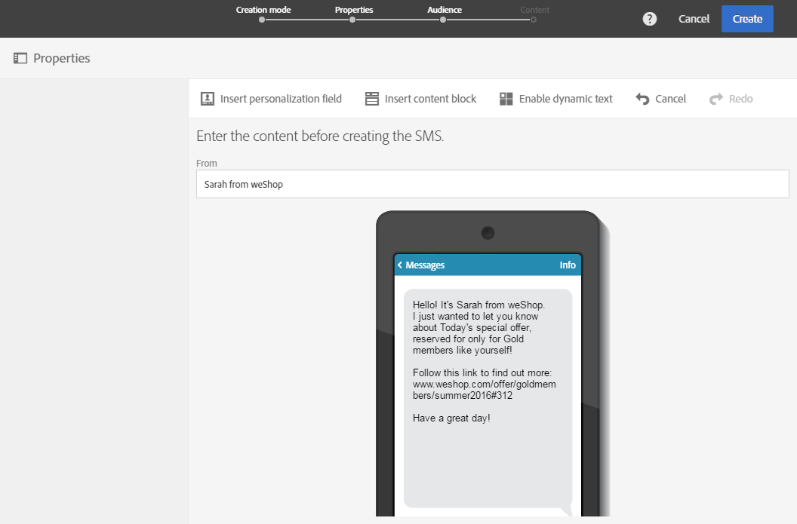

# SMS 메시지 만들기{#creating-an-sms-message}

SMS 게재를 만드는 것은 일반 이메일을 만드는 것과 매우 유사합니다. 다음 단계에서는 이 채널과 관련된 구성을 설명합니다. 기타 옵션에 대한 자세한 내용은 [이메일 만들기](../../channels/using/creating-an-email.md)를 참조하십시오.

고급 SMS 매개 변수는 [SMS 구성](../../administration/using/configuring-sms-channel.md) 섹션에 자세히 설명되어 있습니다.

휴대폰에 SMS 메시지를 만들고 전송하려면 다음이 필요합니다.

* **[!UICONTROL Bulk delivery]**&#x200B;모드로 **[!UICONTROL Mobile (SMS)]** 채널에 구성된&#x200B;**[!UICONTROL Routing]** 외부 계정입니다. 자세한 내용은 [라우팅 섹션](../../administration/using/configuring-sms-channel.md#defining-an-sms-routing)을 참조하십시오.
* 이 외부 계정에 올바르게 연결된 게재 템플릿입니다.

1. SMS 게재 만들기 Adobe Campaign [홈페이지](../../start/using/interface-description.md#home-page)의 [캠페인](../../start/using/marketing-activities.md#creating-a-marketing-activity) 또는 [마케팅 활동 목록](../../start/using/programs-and-campaigns.md#creating-a-campaign)에서수행할 수 있습니다.

   워크플로우에 SMS 활동을 추가할 수도 있습니다. 자세한 내용은 [워크플로우](../../automating/using/sms-delivery.md) 안내서를 참조하십시오.

   메시지를 만들 때 가장 중요한 단계를 안내하는 마법사가 표시됩니다. 마법사를 통해 정의된 내용은 나중에 메시지 대시보드에서 편집할 수 있습니다.

1. 사용할 템플릿을 선택합니다. 기본 제공 SMS 템플릿 또는 사용자의 템플릿 중 하나를 선택할 수 있습니다.

   

   휴대 전화로 게재하려면 게재 템플릿이 SMS 라우팅 외부 계정에 올바르게 연결되어 있어야 합니다.

1. SMS의 일반 속성을 입력합니다.

   

   활동 레이블과 해당 ID 모두 인터페이스에는 표시되지만 메시지 수신자에게는 보이지 않습니다.

1. 타겟팅할 대상자를 지정합니다. 기존 대상자를 선택하거나 규칙을 정의하고 결합하여 모집단을 직접 타겟팅할 수도 있습니다.

   

1. SMS에 콘텐츠를 추가합니다. SMS 만들기가 완료되면 게재 대시보드의 **[!UICONTROL Content]** 섹션을 클릭하여 콘텐츠를 정의할 수도 있습니다. [SMS 컨텐츠 디자인 정보](../../channels/using/about-sms-and-push-content-design.md)를 참조하십시오.

   개인화 필드 또는 조건부 텍스트를 SMS 메시지의 콘텐츠에 삽입한 경우 메시지 길이는 수신자마다 다를 수 있습니다. 실제로, 이러한 요인들은 GSM 인코딩에 의해 고려되지 않는 문자를 도입할 수 있습니다. 개인화가 수행되면 메시지 길이를 평가해야 하는 이유입니다. [SMS 메시지 개인화](../../channels/using/personalizing-sms-messages.md)를 참조하십시오.

   

1. 메시지 만들기를 확인합니다. 그러면 대시보드가 표시됩니다.
1. 전송을 예약합니다. SMS는 메시지 준비 직후에 수동으로나 예약된 날짜에 자동으로 전송될 수 있습니다. [메시지 예약](../../sending/using/about-scheduling-messages.md)을 참조하십시오.
1. 메시지를 준비하여 유효성, 개인화 및 대상을 분석합니다.

   

   >[!NOTE]
   >
   >캠페인에서 과잉 복제된 프로필을 자동으로 제외하는 글로벌 크로스채널 피로 규칙을 설정할 수 있습니다. [피로 규칙](../../sending/using/fatigue-rules.md)을 참조하십시오.

1. 증명을 전송하여 메시지를 확인하고 유효성 검사를 할 수 있으며 받은 편지함 렌더링을 모니터링합니다. [증명 전송](../../sending/using/sending-proofs.md) 섹션을 참조하십시오.
1. 메시지 전송을 확인합니다. 정의된 일정에 따라 전송이 시작됩니다.

   

메시지가 전송됩니다. 메시지 대시보드 및 로그를 통해 게재를 확인할 수 있습니다.

전송이 완료되면 기본 제공 또는 사용자 지정 게재 보고서를 통해 메시지의 영향을 측정할 수 있습니다.

**관련 항목:**

* [SMS 및 푸시 콘텐츠 에디션 기본 정보](../../channels/using/about-sms-and-push-content-design.md)
* [템플릿 관리](../../start/using/marketing-activity-templates.md)
* [SMS 게재 만들기](https://docs.adobe.com/content/help/en/campaign-learn/campaign-standard-tutorials/communication-channels/mobile/sms/sms-delivery.html)비디오
