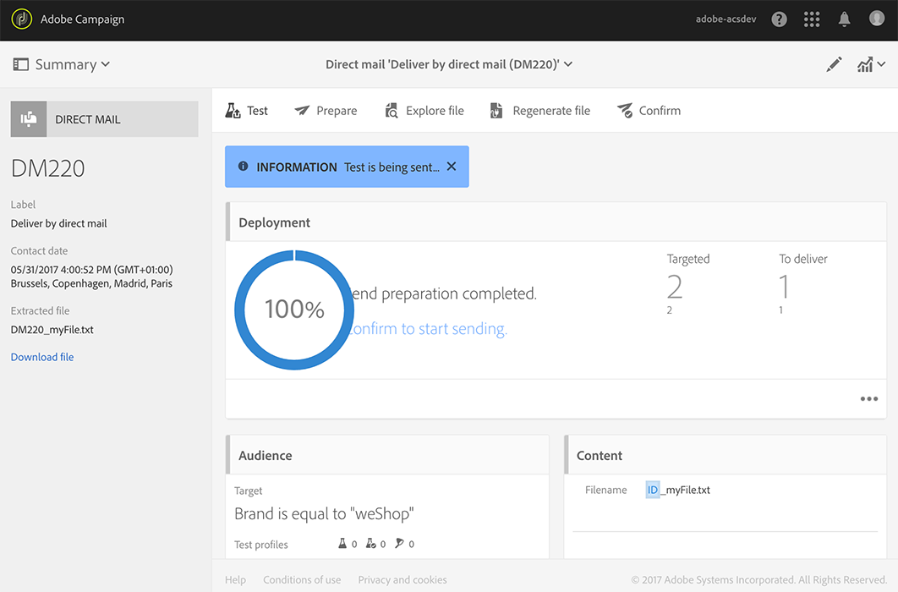

# DM 만들기{#creating-the-direct-mail}

DM 게재를 만드는 것은 일반 이메일을 만드는 것과 매우 유사합니다. 다음 단계에서는 이 채널과 관련된 구성을 설명합니다. 기타 옵션에 대한 자세한 내용은 [이메일 만들기](../../channels/using/creating-an-email.md)를 참조하십시오.

>[!NOTE]
>
>워크플로우에서 DM 활동을 추가할 수도 있습니다. 자세한 내용은 [워크플로우](../../automating/using/direct-mail-delivery.md) 안내서를 참조하십시오.

1. 새 DM 게재를 만듭니다. Adobe Campaign [홈페이지](../../start/using/interface-description.md#home-page), [캠페인](../../start/using/marketing-activities.md#creating-a-marketing-activity) 또는 [마케팅 활동 목록](../../start/using/programs-and-campaigns.md#creating-a-campaign)에서 만들 수 있습니다.

   

1. 기본 제공 **[!UICONTROL Direct mail]** 템플릿 또는 고유한 템플릿 중 하나를 선택합니다. 템플릿에 대한 자세한 내용은 [템플릿 관리](../../start/using/marketing-activity-templates.md) 섹션을 참조하십시오.

   

1. 게재의 일반 속성을 입력합니다.

   

1. 추출 파일뿐만 아니라 테스트 및 트랩 프로필에도 포함할 대상자를 정의합니다. [DM 대상자 정의](../../channels/using/defining-the-direct-mail-audience.md)를 참조하십시오.

   

   >[!NOTE]
   >
   >대상자 정의는 일반 이메일 대상자 정의와 매우 유사합니다. [대상자 만들기](../../audiences/using/creating-audiences.md)를 참조하십시오.

1. 각 프로필, 파일 구조, 머리글 및 바닥글에 포함할 열과 같은 파일의 콘텐츠를 편집합니다. [DM 콘텐츠 정의](../../channels/using/defining-the-direct-mail-content.md)를 참조하십시오.

   

1. 게재 대시보드의 **[!UICONTROL Schedule]** 섹션을 클릭하여 연락 날짜를 정의합니다. DM의 경우 연락 날짜는 필수입니다. 자세한 내용은 [전송 예약](../../sending/using/about-scheduling-messages.md)을 참조하십시오.

   

1. 테스트 프로필을 추가한 경우([테스트 및 트랩 프로필 추가](../../channels/using/defining-the-direct-mail-audience.md#adding-test-and-trap-profiles) 참조) 최종 파일을 준비하기 전에 게재를 테스트할 수 있습니다. 선택한 테스트 프로필만 포함된 샘플 파일을 만들 수 있습니다.

   **[!UICONTROL Test]**&#x200B;을(를) 클릭하여 샘플 파일을 생성합니다. 왼쪽 상단 모서리에서 **[!UICONTROL Summary]**&#x200B;을(를) 클릭하고 **[!UICONTROL Proofs]**&#x200B;을(를) 선택합니다 . 화면 왼쪽에서 증명을 선택하고 **[!UICONTROL Download file]**&#x200B;을(를) 클릭합니다 .

   >[!NOTE]
   >
   >Adobe Campaign에서 파일을 내보내고 다운로드할 수 있도록 하려면 **[!UICONTROL Export]** 역할이 필요합니다. 관리자에게 문의하십시오.

   

1. 게재 콘텐츠, 대상자 및 연락 날짜를 정의했으면 게재 대시보드의 **[!UICONTROL Prepare]** 버튼을 클릭합니다.

   

   유형화 규칙이 적용됩니다. 예를 들어 지정되지 않은 모든 우편 주소는 타겟에서 제외됩니다. 이 때문에 프로필 정보에 있는 **[!UICONTROL Address specified]** 확인란을 선택해야 합니다([권장 사항](../../channels/using/about-direct-mail.md#recommendations) 참조). DM 속성 또는 템플릿 수준에서 **[!UICONTROL Maximum volume of message]**&#x200B;을(를) 정의한 경우 여기에 적용됩니다.

   

   >[!NOTE]
   >
   >캠페인에서 과하게 요청된 프로필을 자동으로 제외하는 전역 크로스 채널 피로도 규칙을 설정할 수 있습니다. [피로도 규칙](../../sending/using/fatigue-rules.md)을 참조하십시오.

1. **[!UICONTROL Explore file]**&#x200B;을(를) 클릭하여 파일의 처음 100개 줄을 미리 보기합니다.

   

   전체 파일은 화면 왼쪽에서 로컬로 다운로드할 수 있습니다. 파일을 다운로드하면 **[!UICONTROL Export audits]** 메뉴에 로그 항목이 생성됩니다. 감사 내보내기에 대한 자세한 내용은 [감사 내보내기](../../administration/using/auditing-export-logs.md) 섹션을 참조하십시오.

   >[!NOTE]
   >
   >Adobe Campaign에서 파일을 내보내고 다운로드할 수 있도록 하려면 **[!UICONTROL Export]** 역할이 필요합니다. 관리자에게 문의하십시오.

   게재 콘텐츠를 변경해야 하는 경우 **[!UICONTROL Regenerate file]** 버튼을 클릭하기만 하면 됩니다. 다시 준비할 필요가 없습니다.

   

1. 최종 파일임을 확인하려면 게재 대시보드에서 **[!UICONTROL Confirm]**&#x200B;을(를) 클릭합니다.

   

이제 추출 파일을 DM 공급자에게 보낼 준비가 되었습니다. 이를 위해 다음과 같은 몇 가지 옵션이 있습니다.

* 파일을 첨부하여 일반 이메일로 전송
* Campaign을 통해 전송: 예를 들어 캠페인 [워크플로우](../../automating/using/direct-mail-delivery.md) 내에서 DM을 수행하고 FTP를 통해 파일을 전송하기 위해 **[!UICONTROL Transfer file]**&#x200B;을(를) 추가합니다. [파일 전송](../../automating/using/transfer-file.md)을 참조하십시오.

공급자가 잘못된 주소 목록을 검색하여 잘못된 주소를 자동으로 차단 목록으로 표시하는 이 정보를 Adobe Campaign으로 보냅니다. [발신자에게 반환](../../channels/using/return-to-sender.md)을 참조하십시오.
