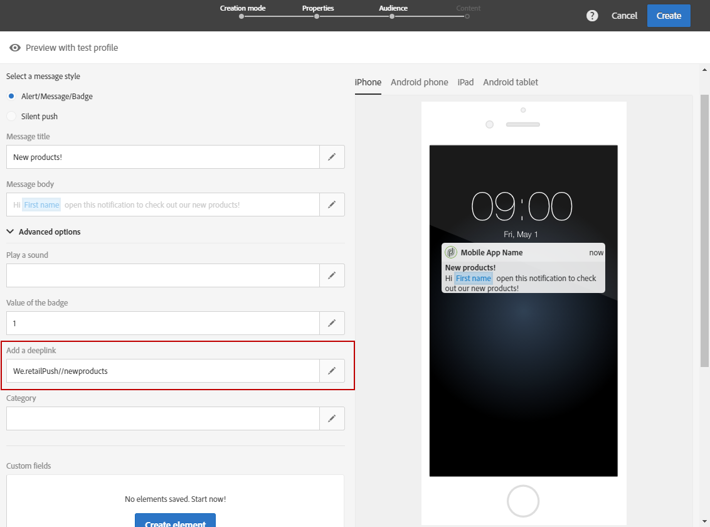
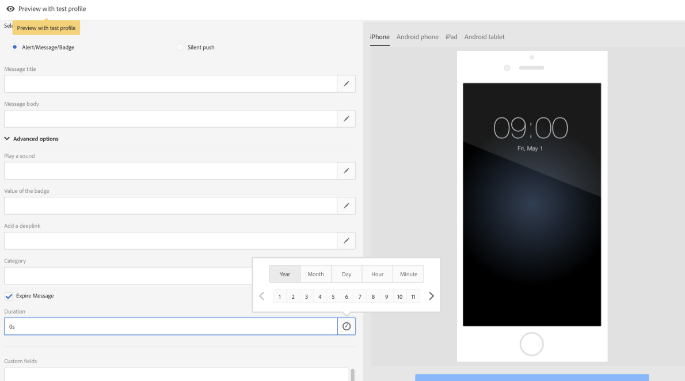
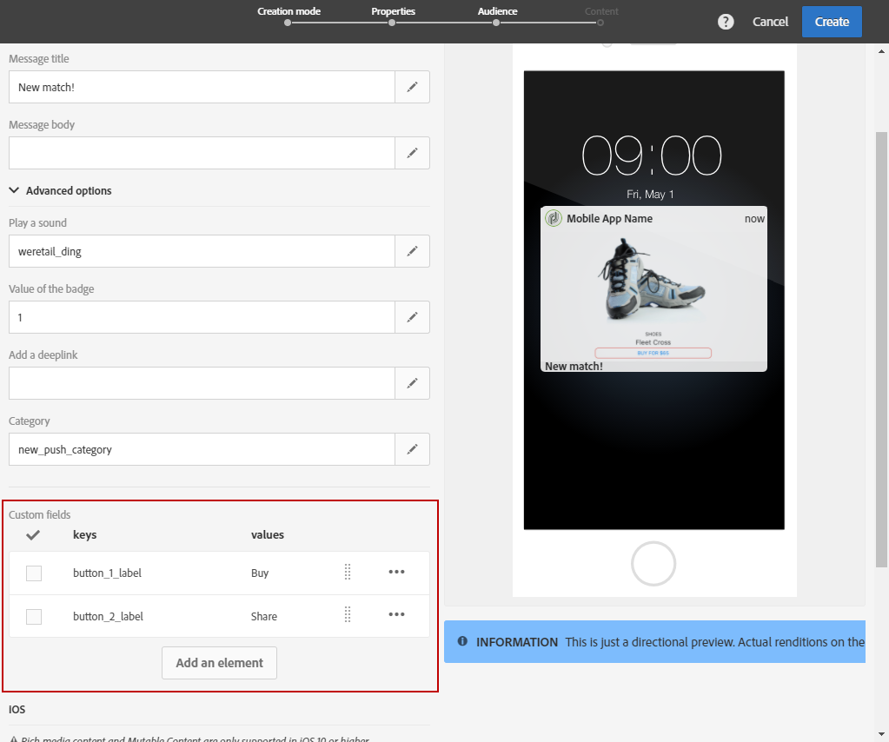

# 푸시 알림 사용자 정의{#customizing-a-push-notification}

푸시 알림을 세밀하게 조정하기 위해 Adobe Campaign에서는 푸시 알림을 디자인하는 동안 고급 옵션 집합에 액세스할 수 있습니다.

전문 사용자로서 Adobe Campaign에서 모바일 애플리케이션을 구성하려면 다음 기술 노트 [Campaign Standard 푸시 알림 페이로드 구조 이해](https://docs.adobe.com/content/help/ko-KR/campaign-standard/using/communication-channels/push-notifications/push-payload.html)를 참조하십시오.

**관련 콘텐츠:**

* [푸시 알림 보고서](../../reporting/using/push-notification-report.md)
* [워크플로우 내에서 푸시 알림 보내기](../../automating/using/push-notification-delivery.md)

## 사운드 재생 {#play-a-sound}

**[!UICONTROL Play a sound]** 기능은 앱이 실행되고 있지 않을 때 애플리케이션에서 푸시 알림을 전송하여 디바이스에서 사운드를 재생하는 기능을 제공합니다.

사운드는 사용자에게 푸시 알림을 알리고 더 많은 가시성을 제공합니다. 모바일 앱에 사운드를 포함시키려면 다음을 수행합니다.

1. 푸시 알림을 열고 **[!UICONTROL Advanced options]** 섹션에 액세스합니다.
1. 알림을 받을 때 모바일 디바이스에서 재생할 사운드 파일의 이름을 확장명 없이 **[!UICONTROL Play a sound]** 필드에 입력합니다.

   지원되는 미디어 포맷에 대한 자세한 내용은 [Apple](https://support.apple.com/kb/PH16864?locale=ko_KR) 및 [Android](https://developer.android.com/guide/topics/media/media-formats) 설명서를 참조하십시오.

   

1. 모바일 애플리케이션 패키지에 파일이 정의된 경우 알림을 전송할 때 사운드 파일이 재생됩니다. 그렇지 않으면 디바이스의 기본 사운드가 재생됩니다.

그런 다음 사용자는 자신의 휴대 전화가 음소거되어 있지 않은 경우에만 푸시 알림과 사운드를 수신하게 됩니다.

## 배지 값 새로 고침 {#refresh-the-badge-value}

배지는 애플리케이션 아이콘에 읽지 않은 새로운 정보의 수를 직접 표시하는 데 사용됩니다. 사용자가 애플리케이션에서 새 콘텐츠를 열거나 읽으면 배지 값이 사라집니다.

디바이스에서 알림을 받으면 관련 앱에 대한 배지 값을 새로 고침하거나 추가할 수 있습니다. 서버 측에서 배지 값을 전송하려면 다음을 수행합니다.

1. 푸시 알림을 열고 **[!UICONTROL Advanced options]** 섹션에 액세스합니다.
1. 배지 값은 정수여야 하며 다음과 같이 다양한 방법으로 업데이트할 수 있습니다.

   * 배지를 새로 고침하려면 **[!UICONTROL Value of the badge]** 필드에 0을 입력합니다. 애플리케이션 아이콘에서 배지가 제거됩니다.
   * 배지 값을 추가하려면 **[!UICONTROL Value of the badge]** 필드에 임의의 숫자를 입력합니다. 이 숫자는 사용자가 푸시 알림을 수신하는 즉시 배지에 자동으로 표시됩니다.
   * 필드가 비어 있거나 정수를 포함하지 않으면 배지 값이 변경되지 않습니다.

   여기에서는 **[!UICONTROL Value of the badge]** 필드에 1을 입력하여 사용자에게 애플리케이션에 새로운 정보가 있음을 알려줍니다.

   

1. 메시지를 보낸 후 사용자는 푸시 알림을 수신하게 되고 애플리케이션에 새 배지 값이 자동으로 표시됩니다.

   

## 딥 링크 추가 {#add-a-deeplink}

딥 링크를 사용하면 웹 브라우저 페이지를 여는 대신 사용자를 애플리케이션 내에 있는 콘텐츠로 직접 불러옵니다.

딥 링크에는 사용자 지정 인앱 경험을 위한 개인화 데이터가 포함될 수 있습니다. 예를 들어 수신자의 이름은 애플리케이션이 이동하는 페이지에 자동으로 입력됩니다.

푸시 알림에 딥 링크를 추가하려면 다음을 수행합니다.

1. 푸시 알림을 열고 **[!UICONTROL Advanced options]** 섹션에 액세스합니다.
1. **[!UICONTROL Add a deeplink]** 필드에 링크를 입력합니다.

   

1. 메시지를 보낸 후 사용자는 푸시 알림을 수신하고 클릭 유도문안 버튼 누르기 또는 클릭 등 알림과 상호 작용하여 앱의 특정 페이지에 액세스합니다.

   

## 작업 정의 {#define-an-action}

모바일 애플리케이션에서 사용할 수 있는 경우 카테고리 ID를 추가한 다음 작업 버튼을 표시할 수 있습니다. 이러한 알림은 사용자가 애플리케이션을 열거나 탐색하지 않고도 알림에 응답하여 다른 작업을 보다 빠르게 수행할 수 있도록 합니다.

사용자의 휴대 전화에 나타나는 대화 상자를 진행하려면 결정이 필요합니다. 사용자가 작업 중 하나를 선택하면 시스템에서 애플리케이션에 관련 작업을 수행할 수 있도록 알려줍니다.

푸시 알림의 카테고리를 추가하려면 다음을 수행합니다.

1. 푸시 알림을 열고 **[!UICONTROL Advanced options]** 섹션에 액세스합니다.
1. 푸시 알림을 받을 때 실행 가능한 버튼을 표시하려면 **[!UICONTROL Category]** 필드에 사전 정의된 카테고리 이름을 입력합니다.

   모바일 애플리케이션 개발자는 애플리케이션에서 카테고리 ID와 버튼의 예상 동작을 정의해야 합니다. 자세한 내용은 [Apple 개발자 설명서](https://developer.apple.com/library/content/documentation/NetworkingInternet/Conceptual/RemoteNotificationsPG/SupportingNotificationsinYourApp.html)(**카테고리 및 실행 가능한 알림 구성** 섹션) 또는 [Android 개발자 설명서](https://developer.android.com/guide/topics/ui/notifiers/notifications.html)를 참조하십시오.

   

1. 푸시 알림을 전송한 후 사용자는 푸시 알림을 수신하고 이전에 구성된 실행 가능한 버튼을 사용하여 작업을 수행해야 합니다.

   

사용자의 작업에 따라 관련 작업을 수행할 수 있도록 애플리케이션에 알림이 표시됩니다.

## 만료 날짜 추가 {#add-expiration-date}

푸시 알림에 만료 날짜를 설정하면 Apple([APNS](https://developer.apple.com/documentation/usernotifications/setting_up_a_remote_notification_server/sending_notification_requests_to_apns)) 또는 Android([FCM](https://firebase.google.com/docs/cloud-messaging/concept-options))에서 더 이상 메시지를 보내지 않을 특정 만료 날짜를 설정할 수 있습니다.

푸시 알림에 만료 날짜를 추가하려면 다음을 수행합니다.

1. Check the **[!UICONTROL Expire message]** option: by selecting the **[!UICONTROL Expire message]** option, the duration is automatically set to 0. 값을 변경하지 않으면 APNS 및 FCM 모두 메시지를 즉시 보내려고 시도합니다. 실패하면 메시지가 다시 전송되지 않습니다.

1. **[!UICONTROL Duration]** 필드에서 푸시 알림의 유효성을 선택합니다.

   

1. 푸시 알림을 전송한 후 휴대 전화가 켜져 있지 않거나 신호가 없어서 사용자가 즉시 알림을 받지 못한 경우, 푸시는 만료 날짜 시간 슬롯 내에 계속 전송됩니다.

만료 날짜 이전에 푸시 알림이 전송되지 않은 경우 푸시 알림이 삭제됩니다.

## 사용자 지정 필드 추가 {#add-custom-fields}

사용자 지정 필드를 사용하면 키 값 쌍의 형태로 페이로드에서 사용자 지정 데이터를 전달할 수 있습니다. 이 옵션을 사용하여 사전 정의된 키를 넘어 애플리케이션에 추가 데이터를 전달할 수 있습니다.

방법은 다음과 같습니다.

1. 푸시 알림을 열고 **[!UICONTROL Advanced options]** 섹션에 액세스합니다.
1. **[!UICONTROL Custom fields]** 카테고리에서 **[!UICONTROL Add an element]** 버튼을 클릭합니다.
1. **[!UICONTROL Keys]**&#x200B;을(를) 입력한 후 각 키와 연결된 **[!UICONTROL Values]**&#x200B;을(를) 입력합니다.

   

1. 사용자 지정 필드의 처리 및 목적은 전적으로 모바일 앱에 달려 있습니다. 아래 푸시 알림에서는 푸시 알림의 버튼 레이블을 표시하기 위해 앱에서 사용자 지정 필드가 사용되었습니다.

   

## 리치 미디어 콘텐츠 추가 {#add-rich-media-content}

리치 미디어 콘텐츠를 사용하면 사용자의 참여도가 향상되어 사용자가 푸시 알림을 더 많이 열어볼 수 있습니다.

알림 자체에서 재생되거나 표시되는 이미지, gif, 오디오 또는 비디오 파일을 포함할 수 있습니다. 앱 사용자는 애플리케이션을 열어서 볼 필요가 없습니다.

푸시 알림에 리치 미디어를 포함시키려면 다음을 수행합니다.

1. 푸시 알림을 열고 **[!UICONTROL Advanced options]** 섹션에 액세스합니다.
1. 각 포맷(iOS 및 Android)의 **[!UICONTROL Rich media content URL]** 필드에 파일의 URL을 입력합니다.

   iOS 10 이상의 경우 이미지, gif, 오디오 및 비디오 파일을 삽입할 수 있습니다. 이전 iOS 버전의 경우, 푸시 알림이 리치 콘텐츠 없이 표시됩니다. iOS 디바이스에서 Adobe Campaign 푸시 알림의 이미지를 표시하는 방법에 대한 자세한 단계는 이 [페이지](https://helpx.adobe.com/kr/campaign/kb/display-image-push.html)를 참조하십시오.

   Android의 경우 이미지만 포함할 수 있습니다.

   

1. 메시지를 보낸 후 사용자는 푸시 알림을 받게 되고 리치 미디어 콘텐츠를 볼 수 있습니다.

   

## iOS의 알림 동작 변경 {#change-the-notification-behavior-for-ios}

iOS 10 이상의 경우 푸시 알림의 **[!UICONTROL Advanced options]** 섹션에서 **[!UICONTROL Mutable content]** 및 **[!UICONTROL Content available]** 두 가지의 추가 옵션을 사용할 수 있습니다.

**[!UICONTROL Mutable content]** 옵션을 선택하고 리치 미디어 콘텐츠 URL을 추가하면 변경 가능한 콘텐츠 플래그가 푸시 페이로드로 전송되고 iOS SDK에서 제공하는 알림 서비스 애플리케이션 확장에 의해 푸시 알림 콘텐츠가 수정됩니다. 자세한 내용은 [Apple 개발자 설명서](https://developer.apple.com/library/content/documentation/NetworkingInternet/Conceptual/RemoteNotificationsPG/ModifyingNotifications.html)를 참조하십시오.

그런 다음 모바일 앱 확장을 활용하여 Adobe Campaign에서 전송된 푸시 알림의 내용 또는 프레젠테이션을 추가로 수정할 수 있습니다. 예를 들어 사용자는 이 옵션을 활용하여 다음을 수행할 수 있습니다.

* 암호화된 포맷으로 전달된 데이터 해독
* 이미지 또는 기타 미디어 파일을 다운로드하고 알림에 첨부 파일로 추가
* 알림 본문 또는 제목 텍스트 변경
* 알림에 스레드 식별자 추가

**[!UICONTROL Content available]**&#x200B;이(가) 선택되면 푸시 알림을 받는 즉시 앱이 깨어날 수 있도록 푸시 페이로드에 사용 가능한 콘텐츠 플래그가 전송되어 앱이 페이로드 데이터에 액세스할 수 있게 됩니다. 이는 앱이 백그라운드에서 실행 중이고 사용자 상호 작용이 필요 없는 경우(예: 푸시 알림을 누르는 경우)에도 적용되지만 앱이 실행되고 있지 않은 경우에는 적용되지 않습니다. 자세한 내용은 [Apple 개발자 설명서](https://developer.apple.com/library/content/documentation/NetworkingInternet/Conceptual/RemoteNotificationsPG/CreatingtheNotificationPayload.html)를 참조하십시오.

## Android의 알림 동작 변경 {#change-the-notification-behavior-for-android}

Android의 경우 **리치 미디어 콘텐츠 URL** 필드에 파일의 URL을 입력할 수 있습니다. iOS 버전과 다르게 Android의 경우 gif가 아닌 이미지, 오디오 또는 비디오 파일만 포함할 수 있습니다.

**[!UICONTROL High priority]** 확인란을 통해 푸시 알림에 대해 높은 우선 순위 또는 일반적인 우선 순위를 설정할 수 있습니다. 메시지 우선 순위에 대한 자세한 내용은 [Google 개발자 설명서](https://firebase.google.com/docs/cloud-messaging/concept-options#setting-the-priority-of-a-message)를 참조하십시오.

