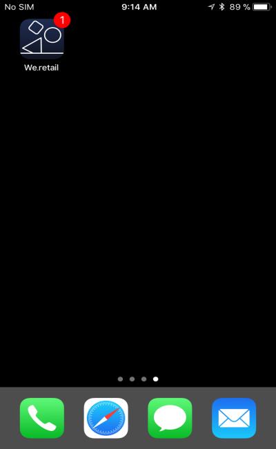

# Customizing a push notification{#customizing-a-push-notification}

푸시 알림을 세부적으로 조정하기 위해 Adobe Campaign를 사용하면 푸시 알림을 디자인하는 동안 고급 옵션 세트를 이용할 수 있습니다.

As an expert user, to configure mobile applications in Adobe Campaign, refer to the following technote [Understanding Campaign Standard Push Notifications Payload Structure](https://helpx.adobe.com/campaign/kb/understanding-campaign-standard-push-notifications-payload-struc.html).

**관련 컨텐츠:**

* [푸시 알림 보고서](../../reporting/using/push-notification-report.md)
* [워크플로우 내에서 푸시 알림 전송](../../automating/using/push-notification-delivery.md)

## Play a sound {#play-a-sound}

The function **[!UICONTROL Play a sound]** gives the application the ability to play sounds on your device with the delivery of a push notification, when the app isn't running.

사운드는 푸시 알림을 사용자에게 알려주므로 가시성이 향상됩니다. 모바일 앱에 사운드를 포함하려면 다음을 수행하십시오.

1. Open the push notification and access the **[!UICONTROL Advanced options]** section.
1. In the **[!UICONTROL Play a sound]** field, enter the filename of the sound file, without the extension, to be played by the mobile device when the notification is received.

   For more information on supported media formats, refer to [Apple](https://support.apple.com/kb/PH16864?locale=en_US) and [Android](https://developer.android.com/guide/topics/media/media-formats.html) documentations.

   

1. 모바일 응용 프로그램의 패키지에서 파일이 정의된 경우 알림을 전달할 때 사운드 파일이 재생됩니다. 그렇지 않으면 장치의 기본 사운드가 재생됩니다.

그러면 사용자가 전화를 걸지 않은 경우에만 푸시 알림 및 사운드를 수신하게 됩니다.

## Refresh the badge value {#refresh-the-badge-value}

배지는 응용 프로그램 아이콘에 새 읽지 않은 정보 수를 직접 표시하는 데 사용됩니다. 사용자가 응용 프로그램에서 새 내용을 열거나 읽는 즉시 배지 값이 사라집니다.

장치에서 알림을 받으면 관련 앱에 대한 배지 값을 새로 고치거나 추가할 수 있습니다. 서버측에서 배지 값을 보내려면:

1. Open the push notification and access the **[!UICONTROL Advanced options]** section.
1. 배지 값은 정수여야 하며 다른 방법으로 업데이트할 수 있습니다.

   * To refresh the badge, enter 0 in the **[!UICONTROL Value of the badge]** field. 응용 프로그램 아이콘에서 배지를 제거합니다.
   * To add a badge value, enter any number in the **[!UICONTROL Value of the badge]** field. 이 번호는 사용자가 푸시 알림을 받자마자 배지에 자동으로 표시됩니다.
   * 필드가 비어 있거나 정수가 없으면 배지 값은 변경되지 않습니다.
   Here, we entered 1 in the **[!UICONTROL Value of the badge]** field to let the users know that they have a new information in their application.

   

1. 메시지를 전송한 후 사용자는 푸시 알림을 받게 되고 응용 프로그램은 자동으로 새 배지 값을 표시합니다.

   

## Add a deeplink {#add-a-deeplink}

Deeplink를 사용하면 사용자가 웹 브라우저 페이지를 여는 대신 응용 프로그램 내에 있는 콘텐츠로 직접 이동할 수 있습니다.

Deeplink는 맞춤형 인앱 경험을 위한 개인화 데이터를 포함할 수 있습니다. 예를 들어, 받는 사람의 첫 번째 이름은 응용 프로그램에서 전달하는 페이지에 자동으로 채워집니다.

푸시 알림에 딥 잉크를 추가하려면:

1. Open the push notification and access the **[!UICONTROL Advanced options]** section.
1. Enter the link in the **[!UICONTROL Add a deeplink]** field.

   

1. 메시지를 전송한 후 사용자는 푸시 알림을 받게 되고, 알림 (예: 클릭 유도 단추 클릭 또는 클릭) 와 상호 작용하여 앱의 특정 페이지에 액세스합니다.

   

## Define an action {#define-an-action}

모바일 애플리케이션에서 사용할 수 있는 경우 카테고리 ID를 추가한 다음 작업 단추를 표시할 수 있습니다. 이러한 알림을 통해 사용자는 응용 프로그램에서 열거나 이동하지 않고도 알림에 대한 응답으로 다른 작업을 더 빠르게 수행할 수 있습니다.

사용자의 전화에 나타나는 대화 상자에는 진행 결정이 필요합니다. 사용자가 작업 중 하나를 선택하면 시스템은 연결된 작업을 수행할 수 있도록 응용 프로그램에 알립니다.

푸시 알림에 카테고리를 추가하려면:

1. Open the push notification and access the **[!UICONTROL Advanced options]** section.
1. Enter a predefined category name in the **[!UICONTROL Category]** field to display actionable buttons when the push notification is received.

   모바일 애플리케이션 개발자는 애플리케이션에서 카테고리 ID와 버튼의 예상 동작을 정의해야 합니다. For more on this, refer to the [Apple Developer documentation](https://developer.apple.com/library/content/documentation/NetworkingInternet/Conceptual/RemoteNotificationsPG/SupportingNotificationsinYourApp.html) (**Configuring Categories and Actionable Notifications** section) or the [Android Developer documentation](https://developer.android.com/guide/topics/ui/notifiers/notifications.html).

   

1. 푸시 알림을 전송한 후에는 사용자가 받게 되며 이전에 구성한 실행 가능한 단추와 함께 조치를 취해야 합니다.

   

사용자의 작업에 따라 애플리케이션에 연결된 작업을 수행할 수 있도록 알림이 표시됩니다.

## Add custom fields {#add-custom-fields}

사용자 정의 필드를 사용하면 페이로드에서 키 값 쌍의 형태로 사용자 지정 데이터를 전달할 수 있습니다. 이 옵션을 사용하여 사전 정의된 키를 넘어 애플리케이션에 추가 데이터를 전달할 수 있습니다.

이렇게 하려면:

1. Open the push notification and access the **[!UICONTROL Advanced options]** section.
1. **[!UICONTROL Custom fields]** 카테고리에서 **[!UICONTROL Add an element]** 단추를 클릭합니다.
1. Enter your **[!UICONTROL Keys]** then the **[!UICONTROL Values]** associated with each key.

   

1. 사용자 정의 필드의 처리 및 목적은 전적으로 모바일 앱입니다. 푸시 알림의 경우 앱에서 사용자 정의 필드를 사용하여 푸시 알림에 대한 단추 레이블을 표시합니다.

   

## Add rich media content {#add-rich-media-content}

리치 미디어 컨텐츠를 사용하면 사용자의 참여도를 높일 수 있으므로 사용자가 푸시 알림을 더 많이 열도록 할 수 있습니다.

알림 자체에서 재생되거나 표시되는 이미지, GIF, 오디오 또는 비디오 파일을 포함할 수 있습니다. 앱 사용자가 응용 프로그램을 열어 볼 필요가 없습니다.

푸시 알림에 리치 미디어를 포함하려면 다음을 수행하십시오.

1. Open the push notification and access the **[!UICONTROL Advanced options]** section.
1. Enter the URL of your file in the **[!UICONTROL Rich media content URL]** field for each format: iOS and Android.

   iOS 10 이상 버전에서는 이미지, GIF, 오디오 및 비디오 파일을 삽입할 수 있습니다. 이전 iOS 버전의 경우 푸시 알림이 리치 컨텐츠 없이 표시됩니다. For detailed steps on how to display an image from an Adobe Campaign push notification on an iOS device, refer to this [page](https://helpx.adobe.com/campaign/kb/display-image-push.html).

   Android의 경우 이미지를 포함할 수만 있습니다.

   

1. 메시지를 전송한 사용자는 푸시 알림을 수신하게 되고 리치 미디어 컨텐츠를 볼 수 있습니다.

   

## Change the notification behavior for iOS {#change-the-notification-behavior-for-ios}

For iOS 10 or higher, two additional options are available in the **[!UICONTROL Advanced options]** section of push notifications: **[!UICONTROL Mutable content]** and **[!UICONTROL Content available]**.

**[!UICONTROL Mutable content]** 이 옵션이 선택되고/또는 리치 미디어 컨텐츠 URL 이 추가되면, mutable-content 플래그가 푸시 페이로드로 전송되며, iOS SDK에 제공된 알림 서비스 애플리케이션 익스텐션에서 푸시 알림 컨텐츠를 수정할 수 있게 됩니다. For more on this, refer to [Apple developer documentation](https://developer.apple.com/library/content/documentation/NetworkingInternet/Conceptual/RemoteNotificationsPG/ModifyingNotifications.html).

그런 다음 모바일 앱 익스텐션을 활용하여 Adobe Campaign에서 전송된 푸시 알림의 컨텐츠나 프레젠테이션을 더 수정할 수 있습니다. 예를 들어 사용자는 다음 옵션을 활용할 수 있습니다.

* 암호화된 형식으로 전달된 데이터 해독
* 이미지 또는 기타 미디어 파일을 다운로드하여 알림에 첨부 파일로 추가
* 알림의 본문 또는 제목 텍스트 변경
* 알림에 스레드 식별자 추가

When **[!UICONTROL Content available]** is checked, the content available flag will be sent in the push payload to ensure that the app is woken up as soon as it receives the push notification, meaning that the app will be able to access the payload data. 앱이 백그라운드에서 실행되고 사용자 상호 작용 (예: 푸시 알림을 탭하는 등) 이 없어도 작동하지만 앱이 실행되지 않으면 적용되지 않습니다. For more on this, refer to the [Apple developer documentation](https://developer.apple.com/library/content/documentation/NetworkingInternet/Conceptual/RemoteNotificationsPG/CreatingtheNotificationPayload.html).

## Change the notification behavior for Android {#change-the-notification-behavior-for-android}

For Android, you can enter the URL of your file in the **Rich media content URL** field. 반면 iOS 버전의 경우 Android 용 이미지에는 GIF, 오디오 또는 비디오 파일이 아닌 이미지만 포함할 수 있습니다.

**[!UICONTROL High priority]** 이 확인란을 선택하면 푸시 알림에 대한 높거나 일반적인 우선 순위를 설정할 수 있습니다. For more information on message priority, refer to the [Google developer documentation](https://firebase.google.com/docs/cloud-messaging/concept-options#setting-the-priority-of-a-message).

