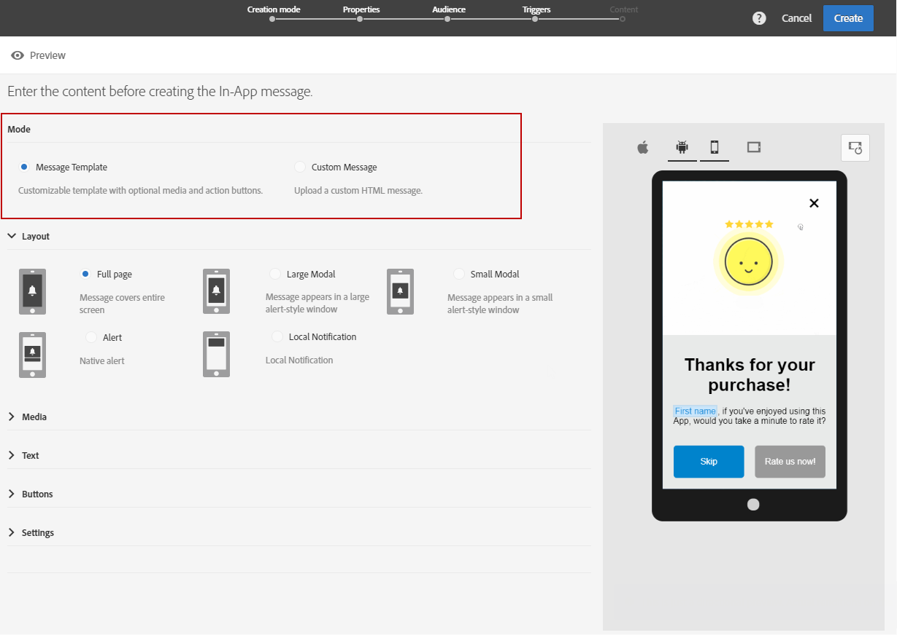
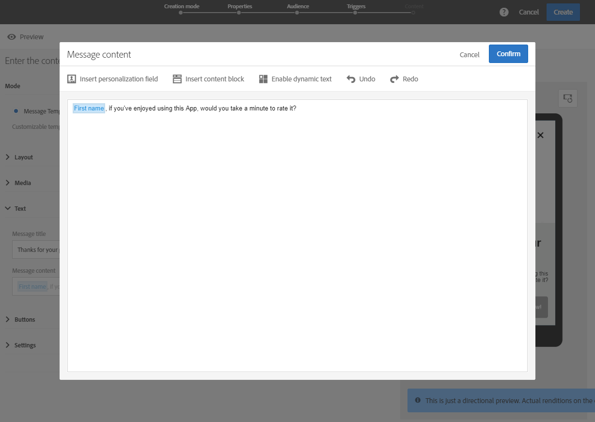
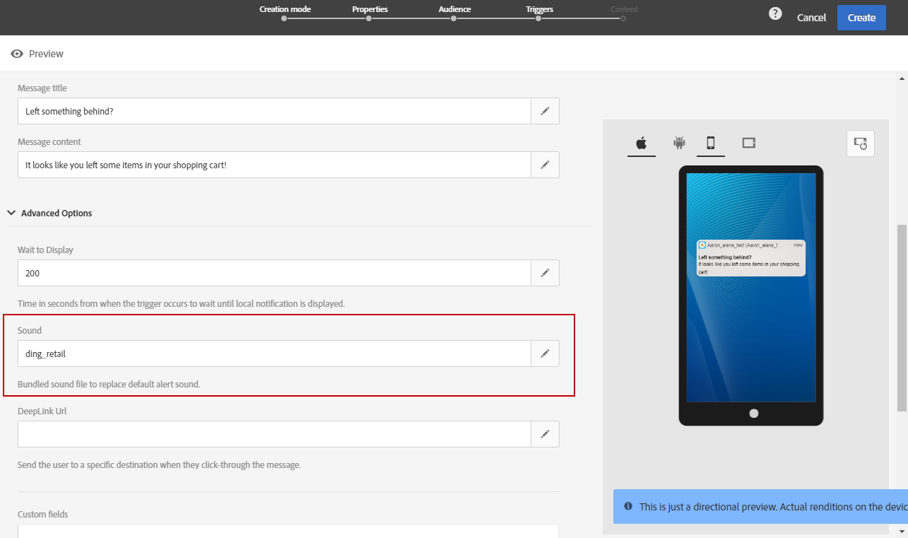

# 인앱 메시지 사용자 지정{#customizing-an-in-app-message}

인앱 메시지를 세밀하게 조정하기 위해 Adobe Campaign을 사용하면 인앱을 디자인하면서 고급 옵션 세트에 액세스할 수 있습니다.

인앱 콘텐츠 편집기를 사용하면 두 가지 인앱 메시지 모드 중에서 선택할 수 있습니다.

* [메시지 템플릿](#customizing-with-a-message-template): 이 템플릿을 사용하면 이미지 또는 비디오 및 작업 단추를 사용하여 인앱(In-App)을 완벽하게 사용자 정의할 수 있습니다.
* [사용자 지정 메시지](#customizing-with-a-custom-html-message): 이 템플릿을 사용하면 사용자 지정 HTML을 가져올 수 있습니다.

>[!NOTE]
>
> 인앱 메시지 렌더링은 Android API 19 이상 버전에서만 지원됩니다.

**관련 항목:**

* [인앱 메시지 보내기](../../channels/using/preparing-and-sending-an-in-app-message.md#sending-your-in-app-message)
* [인앱 보고](../../reporting/using/in-app-report.md)
* [로컬 알림 추적 구현](../../administration/using/local-tracking.md)

## 메시지 템플릿으로 사용자 정의 {#customizing-with-a-message-template}

### 레이아웃 {#layout}

이 **[!UICONTROL Layout]** 드롭다운은 메시징 요구 사항에 따라 선택할 수 있는 4가지 옵션을 제공합니다.

* **[!UICONTROL Full page]**: 이러한 유형의 레이아웃은 대상 장치의 전체 화면을 포함합니다.

   미디어(이미지, 비디오), 텍스트 및 버튼 구성 요소를 지원합니다.

* **[!UICONTROL Large modal]**: 이 레이아웃은 큰 경고 스타일 창에 나타나며 백그라운드에서 응용 프로그램이 계속 표시됩니다.

   미디어(이미지, 비디오), 텍스트 및 버튼 구성 요소를 지원합니다.

* **[!UICONTROL Small modal]**: 이 레이아웃은 작은 경고 유형 창으로 나타나며 백그라운드에서 응용 프로그램이 계속 표시됩니다.

   미디어(이미지, 비디오), 텍스트 및 버튼 구성 요소를 지원합니다.

* **[!UICONTROL Alert]**: 이 유형의 레이아웃은 기본 OS 경고 메시지로 표시됩니다.

   텍스트 및 단추 구성 요소만 지원할 수 있습니다.

* **[!UICONTROL Local notification]**: 이 유형의 레이아웃은 배너 메시지로 표시됩니다.

   사운드, 텍스트 및 대상만 지원할 수 있습니다. 로컬 알림에 대한 자세한 내용은 [로컬 알림 메시지 유형 맞춤화를 참조하십시오](#customizing-a-local-notification-message-type).

휴대폰, 태블릿, 플랫폼(예: Android 또는 iOS, 방향 등 컨텐츠 편집기의 오른쪽 창에서 가로 또는 세로와 같은 다양한 디바이스에서 각 유형의 레이아웃을 미리 볼 수 있습니다.

### 미디어 {#media}

이 **[!UICONTROL Media]** 드롭다운을 사용하면 인앱 메시지에 미디어를 추가하여 최종 사용자에게 매력적인 경험을 만들 수 있습니다.

1. 이미지와 비디오 **[!UICONTROL Media Type]** 중 하나를 선택합니다.
1. 미디어 **[!UICONTROL Image]** 유형의 경우 지원되는 형식을 기준으로 필드에 URL을 **[!UICONTROL Media URL]** 입력합니다.

   필요한 경우 장치가 오프라인 상태인 경우 사용할 수 **[!UICONTROL Bundled image]** 있는 경로를 입력할 수도 있습니다.

   

1. 미디어 **[!UICONTROL Video]** 유형의 경우 필드에 URL을 **[!UICONTROL Media URL]** 입력합니다.

   그런 다음 대상 장치 **[!UICONTROL Video poster]** 에서 비디오를 다운로드하는 동안 또는 사용자가 재생 단추를 누를 때까지 사용할 앱을 입력합니다.

   

### 텍스트 {#text}

필요한 경우 인앱 메시지에 메시지 제목과 콘텐츠를 추가할 수도 있습니다. 인앱 메시지를 보다 개인화하기 위해 컨텐츠에 다양한 개인화 필드, 콘텐츠 블록 및 동적 텍스트를 추가할 수 있습니다.

1. 드롭다운 **[!UICONTROL Text]** 에서 필드에 제목을 **[!UICONTROL Message title]** 추가합니다.

   

1. 필드에 컨텐츠를 **[!UICONTROL Message content]** 추가합니다.
1. 텍스트를 추가로 개인화하려면  아이콘을 클릭하여 개인화 필드를 추가합니다.

   

1. 메시지 내용을 입력하고 필요한 경우 개인화 필드를 추가합니다.

   개인화 필드에 대한 자세한 내용은 이 [섹션을 참조하십시오](../../designing/using/personalization.md#inserting-a-personalization-field).

   

1. 미리 보기 창에서 메시지 내용을 확인합니다.

   

### 버튼 {#buttons}

인앱 메시지에 최대 2개의 단추를 추가할 수 있습니다.

1. 드롭다운 **[!UICONTROL Buttons]** 에서 카테고리에 첫 번째 단추의 텍스트를 **[!UICONTROL Primary]** 입력합니다.

   

1. 두 작업 중 어느 작업 **[!UICONTROL Dismiss]** 을 선택하고 기본 단추에 **[!UICONTROL Redirect]** 할당할지 선택합니다.
1. 필요한 경우 **[!UICONTROL Secondary]** 텍스트를 입력하여 인앱에 두 번째 단추를 추가합니다.
1. 두 번째 단추에 연결된 작업을 선택합니다.
1. 작업을 선택한 경우 **[!UICONTROL Redirect]** 웹 URL을 입력하거나 **[!UICONTROL Destination URL]** 필드에 링크를 입력합니다.

   

1. 작업을 선택한 경우 웹 URL을 입력하거나 **[!UICONTROL Destination URL]** 필드에 **[!UICONTROL Redirect]** 링크를 입력합니다.
1. 미리 보기 창에서 또는 미리 보기 단추를 클릭하여 메시지 내용을 확인합니다.

   인앱 메시지 [미리 보기 페이지를 참조하십시오](#previewing-the-in-app-message) .

   

### 설정 {#settings}

1. 범주에서 **[!UICONTROL Settings]** 빛과 어둡게 사이의 배경색을 선택합니다.
1. 사용자에게 인앱 메시지를 취소할 수 있는 방법을 제공하는 **[!UICONTROL Show close button]** 옵션을 사용하여 닫기 단추를 표시하거나 표시하지 않도록 선택합니다.
1. 단추 맞춤이 이 옵션을 사용하여 가로 또는 세로로 표시되는지 **[!UICONTROL Button alignment]** 선택합니다.
1. 인앱 메시지가 몇 초 후 자동으로 취소되는지 여부를 선택합니다.

   

## 로컬 알림 메시지 유형 사용자 정의 {#customizing-a-local-notification-message-type}

로컬 알림은 특정 시간과 이벤트에 따라 앱에 의해서만 트리거할 수 있습니다. 이들은 인터넷에 접속하지 않고도 앱에서 어떤 일이 일어나고 있다고 사용자에게 알릴 것이다.
로컬 알림을 추적하는 방법을 알아보려면 이 [페이지를 참조하십시오](../../administration/using/local-tracking.md).

로컬 알림을 사용자 정의하려면

1. 페이지에서 **[!UICONTROL Content]** 카테고리 **[!UICONTROL Local notification]** 에서 **[!UICONTROL Layout]** 선택합니다

   

1. 카테고리 아래에 **[!UICONTROL Text]** 와 를 **[!UICONTROL Message title]** 입력합니다 **[!UICONTROL Message content]**.

   

1. 카테고리 아래의 **[!UICONTROL Advanced option]** **[!UICONTROL Wait to display]** 필드에서 이벤트가 트리거되면 로컬 알림이 화면에 표시되는 시간(초)을 선택합니다.
1. 로컬 알림을 받을 때 모바일 장치에서 재생할 사운드 파일의 파일 이름(확장자 포함)을 **[!UICONTROL Sound]** 필드에 입력합니다.

   모바일 응용 프로그램 패키지에 파일이 정의된 경우 알림을 제공할 때 사운드 파일이 재생됩니다. 그렇지 않으면 장치의 기본 사운드가 재생됩니다.

   

1. 사용자가 **[!UICONTROL Deeplink URL]** 필드에서 로컬 알림과 상호 작용할 때 리디렉션할 대상을 지정합니다.
1. 사용자 지정 데이터를 페이로드의 키 값 쌍 형태로 전달하려면 로컬 알림에 사용자 지정 필드를 추가할 수 있습니다. 카테고리에서 **[!UICONTROL Custom fields]** 단추를 **[!UICONTROL Create an element]** 클릭합니다.
1. 각 키 **[!UICONTROL Keys]** 와 **[!UICONTROL Values]** 연관된 을 입력합니다.

   사용자 정의 필드의 처리 및 용도는 모바일 앱에만 전적으로 적용됩니다.

1. Apple **[!UICONTROL Apple options]** 모바일 애플리케이션에서 사용 가능한 경우 카테고리에서 **[!UICONTROL Category]** 필드를 채워 사용자 정의 작업에 대한 카테고리 ID를 추가합니다.

## 사용자 정의 HTML 메시지로 사용자 정의 {#customizing-with-a-custom-html-message}

>[!NOTE]
>
>사용자 지정 HTML 메시지는 콘텐츠 개인화를 지원하지 않습니다.

이 **[!UICONTROL Custom message]** 모드에서는 사전 구성된 HTML 메시지 중 하나를 직접 가져올 수 있습니다.

이렇게 하려면 컴퓨터에서 파일을 드래그하여 놓거나 선택하기만 하면 됩니다.

파일에 샘플 파일 **다운로드 옵션을 클릭하여 찾을 수 있는 특정 레이아웃이** 있어야 합니다.

Adobe Campaign에서 가져오기 작업을 성공적으로 수행하기 위한 사용자 지정 HTML 요구 사항 목록도 찾을 수 있습니다.

HTML을 가져온 후에는 미리 보기 창에서 여러 디바이스에서 미리 볼 수 있습니다.

## 인앱 메시지 미리 보기 {#previewing-the-in-app-message}

인앱 메시지를 보내기 전에 테스트 프로필로 테스트하여 대상 고객이 배달을 받을 때 보게 될 내용을 확인할 수 있습니다.

1. **[!UICONTROL Preview]** 버튼을 클릭합니다. 

   

1. 단추를 **[!UICONTROL Select a test profile]** 클릭하고 테스트 프로필 중 하나를 선택하여 배달 미리 보기를 시작합니다. 테스트 프로필에 대한 자세한 내용은 이 [섹션을 참조하십시오](../../audiences/using/managing-test-profiles.md).
1. Android, iPhone 또는 태블릿과 같은 다양한 디바이스에서 메시지를 확인할 수 있습니다. 개인화 필드가 올바른 데이터를 검색하고 있는지 확인할 수도 있습니다.

   

1. 이제 메시지를 전송하고 전달 보고서를 통해 그 효과를 측정할 수 있습니다. For more on reporting, refer to [this section](../../reporting/using/in-app-report.md).

