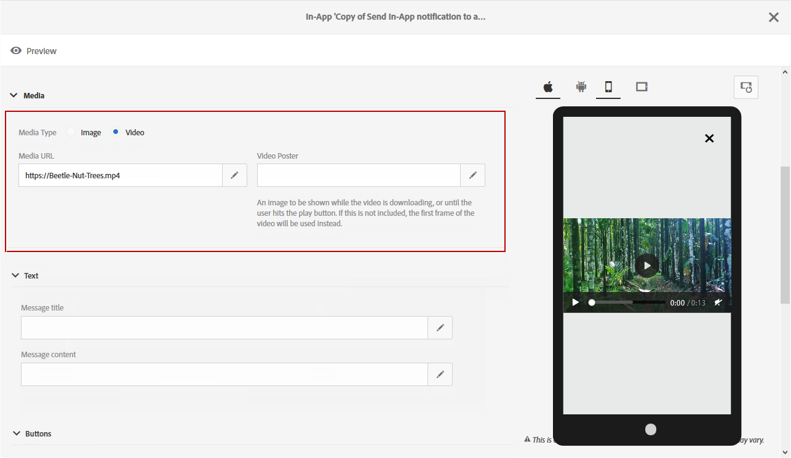

# Customizing an In-App message{#customizing-an-in-app-message}

인앱 메시지를 세부적으로 조정하기 위해 Adobe Campaign를 사용하면 인앱 디자인을 디자인할 때 고급 옵션을 이용할 수 있습니다.

인앱 컨텐츠 편집기를 사용하면 다음 두 가지 앱 내 메시지 모드 중에서 선택할 수 있습니다.

* [메시지 템플릿](../../channels/using/customizing-an-in-app-message.md#customizing-with-a-message-template): 이 템플릿을 사용하면 이미지 또는 비디오 및 작업 단추를 사용하여 인앱 전체를 사용자 정의할 수 있습니다.
* [사용자 지정 메시지](../../channels/using/customizing-an-in-app-message.md#customizing-with-a-custom-html-message): 이 템플릿을 사용하여 사용자 지정 HTML를 가져올 수 있습니다.

**관련 항목:**

* [인앱 메시지 전송](../../channels/using/preparing-and-sending-an-in-app-message.md#sending-your-in-app-message)
* [인앱 보고](../../reporting/using/in-app-report.md)

## Customizing with a message template {#customizing-with-a-message-template}

### Layout {#layout}

The **[!UICONTROL Layout]** drop-down provides you with four different options to choose from depending on your messaging needs:

* **[!UICONTROL Full page]**: 이 유형의 레이아웃은 대상 장치의 전체 화면을 다룹니다.

   미디어 (이미지, 비디오), 텍스트 및 버튼 구성 요소를 지원합니다.

* **[!UICONTROL Large modal]**: 이 레이아웃은 큰 경고 스타일 창에 표시되므로 백그라운드에 계속 표시됩니다.

   미디어 (이미지, 비디오), 텍스트 및 버튼 구성 요소를 지원합니다.

* **[!UICONTROL Small modal]**: 이 레이아웃은 작은 경고 유형 창으로 표시되므로 백그라운드에 애플리케이션이 계속 표시됩니다.

   미디어 (이미지, 비디오), 텍스트 및 버튼 구성 요소를 지원합니다.

* **[!UICONTROL Alert]**: 이 유형의 레이아웃은 기본 OS 경고 메시지로 나타납니다.

   텍스트 및 단추 구성 요소만 지원할 수 있습니다.

* **[!UICONTROL Local notification]**: 이 유형의 레이아웃은 배너 메시지로 나타납니다.

   사운드, 텍스트 및 대상만 지원할 수 있습니다. For more on local notification, refer to [Customizing a local notification message type](../../channels/using/customizing-an-in-app-message.md#customizing-a-local-notification-message-type).

각 유형의 레이아웃은 휴대폰, 태블릿, 플랫폼 등 다양한 디바이스에서 미리 볼 수 있습니다. 예를 들어 Android 또는 iOS와 방향 (예: 콘텐츠 편집기의 오른쪽 창에서 가로 또는 세로) 를 미리 볼 수 있습니다.

### Media {#media}

**[!UICONTROL Media]** 드롭다운을 통해 인앱 메시지에 미디어를 추가하여 최종 사용자에게 매력적인 경험을 제공할 수 있습니다.

1. Select your **[!UICONTROL Media Type]** between image and video.
1. **[!UICONTROL Image]** 미디어 유형의 경우 지원되는 형식을 기반으로 **[!UICONTROL Media URL]** 필드에 URL를 입력합니다.

   If needed, you can also enter the path to a **[!UICONTROL Bundled image]** which can be used if the device is offline.

   

1. **[!UICONTROL Video]** 미디어 유형의 **[!UICONTROL Media URL]** 경우 필드에 URL를 입력합니다.

   Then, enter your **[!UICONTROL Video poster]** to be used while the video is downloading on the audience devices or until users tap the play button.

   

### Text {#text}

필요한 경우 메시지 제목과 콘텐트를 인앱 메시지에 추가할 수도 있습니다. 인앱 메시지를 효과적으로 개인화하기 위해 콘텐츠에 다른 개인화 필드, 콘텐츠 블록 및 동적 텍스트를 추가할 수 있습니다.

1. **[!UICONTROL Text]** 드롭다운에서 **[!UICONTROL Message title]** 필드에 제목을 추가합니다.

   

1. Add your content in the **[!UICONTROL Message content]** field.
1. To further personalize your text, click the  icon to add personalization fields.

   

1. 필요한 경우 메시지 내용을 입력하고 개인화 필드를 추가합니다.

   For more information on personalization field, refer to this [section](../../designing/using/inserting-a-personalization-field.md).

   

1. 미리 보기 창에서 메시지 내용을 확인합니다.

   

### Buttons {#buttons}

인앱 메시지에 최대 2 개의 단추를 추가할 수 있습니다.

1. **[!UICONTROL Buttons]** 드롭다운에서 **[!UICONTROL Primary]** 범주에 있는 첫 번째 단추의 텍스트를 입력합니다.

   

1. Choose which of the two actions **[!UICONTROL Dismiss]** and **[!UICONTROL Redirect]** will be assigned to your primary button.
1. **[!UICONTROL Secondary]** 카테고리에서 텍스트를 입력하여 필요한 경우 인앱 버튼에 두 번째 단추를 추가합니다.
1. 두 번째 단추에 연결된 작업을 선택합니다.
1. **[!UICONTROL Redirect]** 동작을 선택한 경우 **[!UICONTROL Destination URL]** 필드에 웹 URL 또는 딥북을 입력합니다.

   

1. Enter your web URL or deeplink in the **[!UICONTROL Destination URL]** field, if you chose the **[!UICONTROL Redirect]** action,
1. 미리 보기 창에서 메시지 내용을 확인하거나 미리 보기 단추를 클릭합니다.

   Refer to the [Previewing the In-App message](../../channels/using/customizing-an-in-app-message.md#previewing-the-in-app-message) page.

   

### Settings {#settings}

1. **[!UICONTROL Settings]** 카테고리에서 밝은 배경색과 어두운 색상을 선택합니다.
1. Choose to display or not a close button with the **[!UICONTROL Show close button]** option to provide users a way to dismiss the In-App message.
1. Select if your button alignment will be horizontal or vertical with the **[!UICONTROL Button alignment]** option.
1. 몇 초 후에 인앱 메시지를 자동 폐지할지 여부를 선택합니다.

   

## Customizing a local notification message type {#customizing-a-local-notification-message-type}

로컬 알림은 특정 시간 및 이벤트에 따라 트리거할 수 있습니다. 사용자는 인터넷에 접속하지 않고도 앱에서 어떤 일이 발생한다고 사용자에게 알립니다.

로컬 알림을 사용자 정의하려면:

1. **[!UICONTROL Content]** 페이지에서 **[!UICONTROL Local notification]****[!UICONTROL Layout]** 범주를 선택합니다.

   

1. **[!UICONTROL Text]** 카테고리 아래에서 **[!UICONTROL Message title]** AND **[!UICONTROL Message content]**&#x200B;를 입력합니다.

   

1. **[!UICONTROL Advanced option]** 카테고리 아래에서 **[!UICONTROL Wait to display]** 이벤트가 트리거되면 로컬 알림이 화면에 표시되는 기간을 초 단위로 선택합니다.
1. **[!UICONTROL Sound]** 이 필드에 로컬 알림이 수신될 때 모바일 장치에서 재생할 사운드 파일의 파일 이름을 확장하지 않고 입력합니다.

   모바일 응용 프로그램의 패키지에서 파일이 정의된 경우 알림을 전달할 때 사운드 파일이 재생됩니다. 그렇지 않으면 장치의 기본 사운드가 재생됩니다.

   

1. Specify a destination to redirect your users when they interact with your local notification in the **[!UICONTROL Deeplink URL]** field.
1. 사용자 지정 데이터를 키 값 쌍의 형태로 페이로드에서 전달하려면 로컬 알림에 사용자 정의 필드를 추가할 수 있습니다. **[!UICONTROL Custom fields]** 카테고리에서 **[!UICONTROL Create an element]** 단추를 클릭합니다.
1. Enter your **[!UICONTROL Keys]** then the **[!UICONTROL Values]** associated with each key.

   사용자 정의 필드의 처리 및 목적은 전적으로 모바일 앱용입니다.

1. In the **[!UICONTROL Apple options]** category, fill in the **[!UICONTROL Category]** fields to add a category ID for custom actions if available in your Apple mobile application.

## Customizing with a custom HTML message {#customizing-with-a-custom-html-message}

>[!NOTE]
>
>맞춤형 HTML 메시지는 콘텐츠 개인화를 지원하지 않습니다.

**[!UICONTROL Custom message]** 이 모드에서는 미리 구성된 HTML 메시지 중 하나를 직접 가져올 수 있습니다.

이렇게 하려면 컴퓨터에서 파일을 드래그하여 놓기만 하면 됩니다.

Your file must have a specific layout which can be found by clicking the **Download the sample file** option.

Adobe Campaign에서 성공적인 가져오기에 대한 사용자 정의 HTML 요구 사항 목록을 찾을 수도 있습니다.

HTML를 가져오면 미리 보기 창에서 다른 디바이스에서 파일 미리 보기를 찾을 수 있습니다.

## Previewing the In-App message {#previewing-the-in-app-message}

인앱 메시지를 보내기 전에 테스트 프로필로 테스트하여 대상 고객이 배달을 받을 때 보게 될 항목을 확인할 수 있습니다.

1. **[!UICONTROL Preview]** 단추를 클릭합니다.

   

1. **[!UICONTROL Select a test profile]** 단추를 클릭하고 테스트 프로필 중 하나를 선택하여 배달 미리 보기를 시작합니다. For more information on test profiles, refer to this [section](../../sending/using/managing-test-profiles-and-sending-proofs.md).
1. Android, iPhone 폰 또는 태블릿과 같은 다양한 디바이스에서 메시지를 확인합니다. 개인화 필드가 올바른 데이터를 검색하는지 확인할 수도 있습니다.

   

1. 이제 배달 보고서로 메시지를 보내고 효과를 측정할 수 있습니다. For more on reporting, refer to [this section](../../reporting/using/in-app-report.md).

