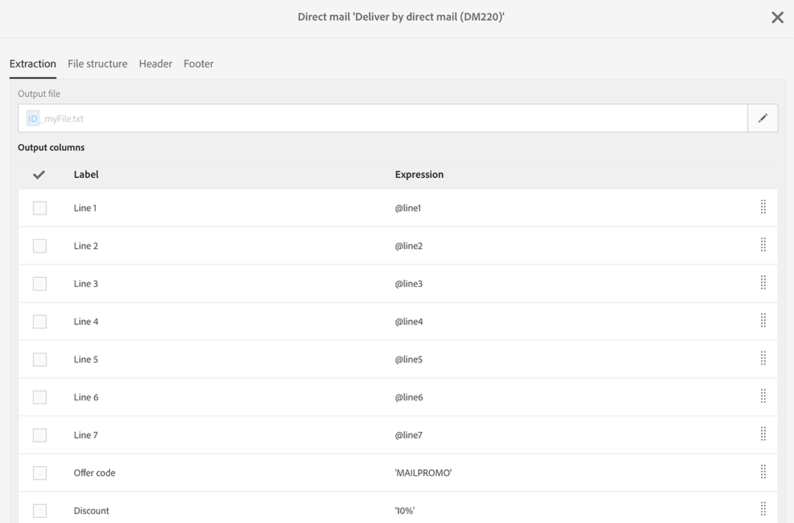
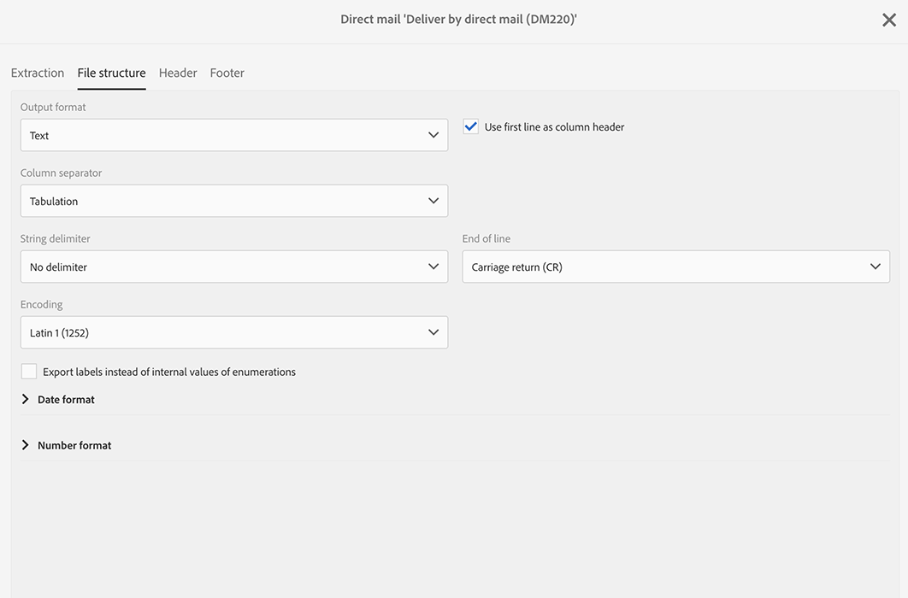

# DM 콘텐츠 정의{#defining-the-direct-mail-content}

만들기 마법사의 마지막 화면이나 게재 대시보드의 **콘텐츠** 섹션에서 콘텐츠를 정의할 수 있습니다.

**[!UICONTROL Content]** 정의 화면은 DM 채널에만 적용됩니다. 이 화면은 **[!UICONTROL Extraction]**, **[!UICONTROL File structure]**, **[!UICONTROL Header]**, **[!UICONTROL Footer]**&#x200B;의 네 개의 탭으로 나뉘어 있습니다.

## 추출 정의 {#defining-the-extraction}

1. 먼저 추출 파일의 이름을 정의합니다. **[!UICONTROL Output file]** 필드 오른쪽의 버튼을 클릭하고 원하는 레이블을 입력합니다. 개인화 필드, 콘텐츠 블록 및 다이내믹 텍스트를 사용할 수 있습니다([콘텐츠 정의](../../designing/using/personalization.md#example-email-personalization) 참조). 예를 들어 게재 ID 또는 추출 날짜로 레이블을 만들 수 있습니다.

   

1. 출력 열을 추가하려면 **[!UICONTROL +]** 또는 **[!UICONTROL Add an element]** 버튼을 클릭합니다. **[!UICONTROL Output columns]**&#x200B;을(를) 통해 출력 파일로 내보낼 프로필 정보(열)를 정의할 수 있습니다.

   >[!CAUTION]
   >
   >우편 주소 정보는 DM 공급자에게 필수이므로 프로필에 포함했는지 확인하십시오. 또한 프로필 정보에 있는 **[!UICONTROL Address specified]** 상자를 선택했는지 확인하십시오. [권장 사항](../../channels/using/about-direct-mail.md#recommendations)을 참조하십시오.

   

1. 필요한 만큼 열을 만듭니다. 표현식과 레이블을 클릭하여 열을 편집할 수 있습니다.

>[!NOTE]
>
>출력 열 정의에 대한 자세한 내용은 [파일 추출](../../automating/using/extract-file.md) 워크플로우 활동 섹션을 참조하십시오.

## 파일 구조 정의 {#defining-the-file-structure}

**파일 구조** 탭에서는 내보낼 파일의 출력, 날짜 및 번호 포맷을 구성할 수 있습니다.

>[!NOTE]
>
>사용 가능한 옵션은 [파일 추출](../../automating/using/extract-file.md) 워크플로우 활동 섹션에 자세히 설명되어 있습니다.

## 머리글 및 바닥글 정의 {#defining-the-header-and-footer}

추출 파일의 시작 또는 끝 부분에 정보를 추가해야 하는 경우가 있습니다. 이렇게 하려면 **[!UICONTROL Content]** 구성 화면의 **[!UICONTROL Header]** 및 **[!UICONTROL Footer]** 탭을 사용합니다.

예를 들어, DM 공급자의 경우 파일 머리글에 발신자 정보를 포함하고 싶을 수 있습니다. 게재 컨텍스트에서 사용 가능한 정보로 바닥글과 머리글을 개인화할 수 있습니다. [콘텐츠 정의](../../designing/using/personalization.md#example-email-personalization)를 참조하십시오.

발신자 주소는 DM 속성의 **[!UICONTROL Send]** 섹션 또는 템플릿 수준에서 정의됩니다.

