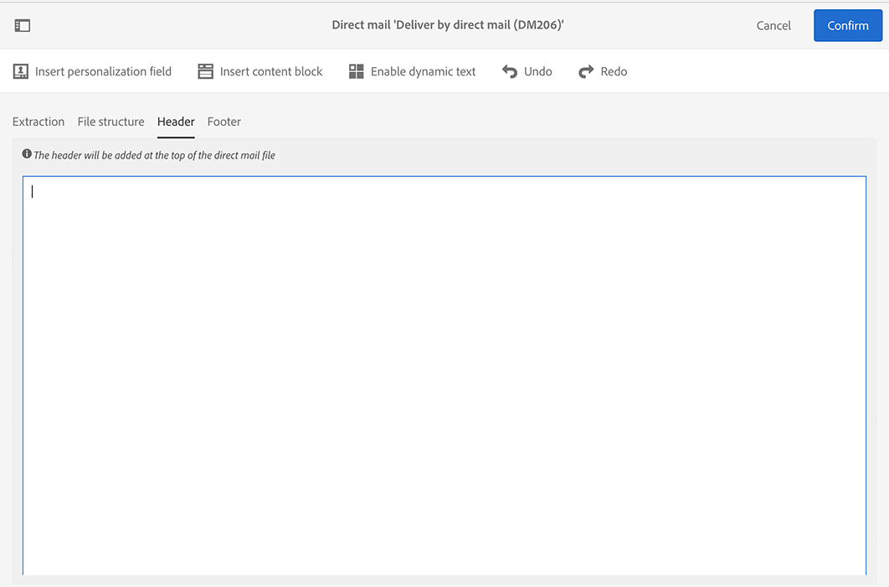

# Defining the direct mail content{#defining-the-direct-mail-content}

You can either define the content in the last screen of the creation wizard or by clicking on the **Content** section of the delivery dashboard.

**[!UICONTROL Content]** 정의 화면은 다이렉트 메일 채널에만 해당됩니다. It is divided into four tabs: **[!UICONTROL Extraction]**, **[!UICONTROL File structure]**, **[!UICONTROL Header]** and **[!UICONTROL Footer]**.

## Defining the extraction {#defining-the-extraction}

1. 추출 파일의 이름을 정의하여 시작합니다. Click on the button to the right of the **[!UICONTROL Output file]** field and enter the desired label. You can use personalization fields, content blocks and dynamic text (see [Defining content](../../designing/using/example--email-personalization.md)). 예를 들어 배달 ID 또는 추출 날짜로 레이블을 완료할 수 있습니다.

   

1. **[!UICONTROL +]** 또는 **[!UICONTROL Add an element]** 단추를 클릭하여 출력 열을 추가합니다. The **[!UICONTROL Output columns]** let you define the profile information (columns) to be exported into the output file.

   >[!CAUTION]
   >
   >다이렉트 메일 제공업체에 반드시 필요한 정보가 프로필에 포함되어야 합니다. Also make sure you have checked the **[!UICONTROL Address specified]** box in your profiles' information. [권장 사항을 참조하십시오](../../channels/using/about-direct-mail.md#recommendations).

   

1. 열을 원하는 만큼 만들 수 있습니다. 해당 표현식 및 레이블을 클릭하여 열을 편집할 수 있습니다.

>[!NOTE]
>
>For more information on output column definition, refer to the [Extract file](../../automating/using/extract-file.md) workflow activity section.

## Defining the file structure {#defining-the-file-structure}

**파일 구조** 탭에서는 내보낼 파일의 출력, 날짜 및 번호 형식을 구성할 수 있습니다.

>[!NOTE]
>
>The available options are detailed in the [Extract file](../../automating/using/extract-file.md) workflow activity sections.

## Defining the header and footer {#defining-the-header-and-footer}

추출 파일의 시작 부분 또는 끝 부분에 정보를 추가해야 하는 경우가 있습니다. For this, use the **[!UICONTROL Header]** and **[!UICONTROL Footer]** tabs of the **[!UICONTROL Content]** configuration screen.

예를 들어 다이렉트 메일 제공자용 파일의 헤더에 보낸 사람 정보를 포함할 수 있습니다. 전달 컨텍스트에서 사용할 수 있는 정보를 사용하여 바닥글 및 헤더를 개인화할 수 있습니다. See [Defining content](../../designing/using/example--email-personalization.md).

The sender address is defined in the **[!UICONTROL Send]** section of the direct mail properties or at the template level.

